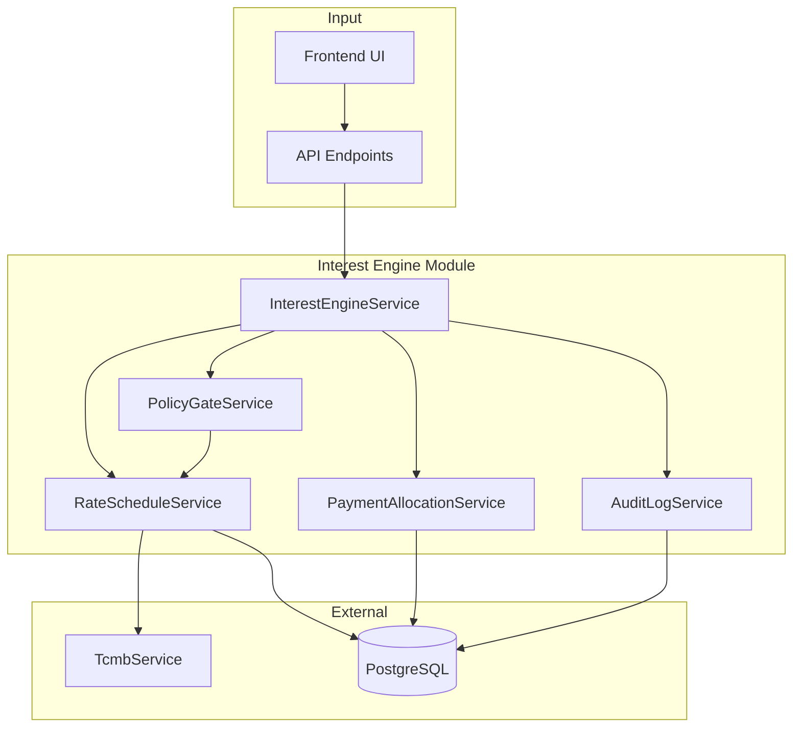
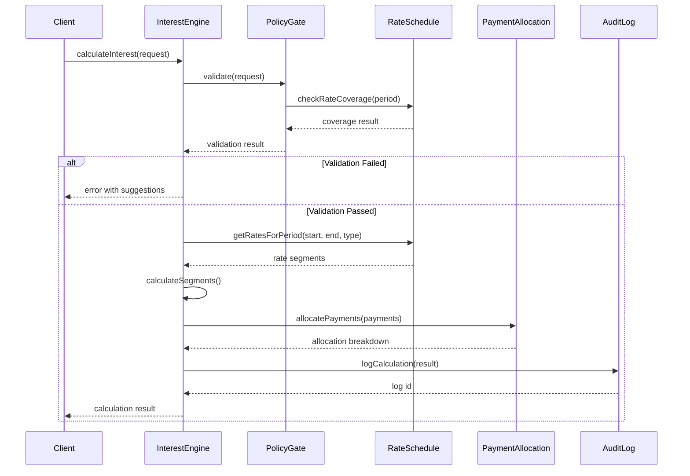

# Design Document: Interest Engine (Faiz Motoru)

## Overview

The Interest Engine is a comprehensive calculation system for Turkish legal enforcement (icra) proceedings that handles interest calculations with full auditability and UYAP compliance. It addresses the four main sources of interest calculation errors:

1. **Wrong interest type** - Mismatched interest type for case category
2. **Rate changes not segmented** - Single rate used across rate change periods
3. **Day count errors** - Incorrect day counting methodology
4. **TBK 100 payment allocation errors** - Incorrect payment distribution order

The engine provides segmented simple interest calculation, TBK 100 compliant payment allocation, policy validation gates, and detailed audit logging.

## Architecture



### Component Interaction Flow



## Components and Interfaces

### 1. InterestEngineService

Main orchestrator for interest calculations.

```typescript
// apps/api/src/modules/interest-engine/interest-engine.service.ts

export interface InterestCalculationRequest {
  caseId: string;
  principalItems: PrincipalItem[];
  payments?: Payment[];
  asOfDate: string; // ISO date
  options?: CalculationOptions;
}

export interface PrincipalItem {
  id: string;
  amount: number;
  currency: Currency;
  startDate: string; // Interest start date
  interestType: InterestType;
  dayCountBasis?: 365 | 360; // Default: 365
  compounding?: boolean; // Default: false
  description?: string;
  // For çek cases
  ibrazTarihi?: string;
  vadeTarihi?: string;
}

export interface CalculationOptions {
  includeKarsilisizCekTazminati?: boolean; // Default: true for çek
  skipPolicyGate?: boolean; // For testing only
}

export interface InterestCalculationResult {
  caseId: string;
  calculatedAt: string;
  asOfDate: string;
  segments: InterestSegment[];
  totalInterest: number;
  totalDue: number;
  paymentAllocations?: PaymentAllocationResult[];
  policyWarnings: PolicyWarning[];
  auditLogId: string;
  legalText: string;
}

export interface InterestSegment {
  principalItemId: string;
  periodStart: string;
  periodEnd: string;
  days: number;
  rate: number;
  rateId: string;
  rateSource: string;
  principal: number;
  segmentInterest: number;
}

@Injectable()
export class InterestEngineService {
  constructor(
    private readonly rateSchedule: RateScheduleService,
    private readonly paymentAllocation: PaymentAllocationService,
    private readonly policyGate: PolicyGateService,
    private readonly auditLog: InterestAuditLogService,
    private readonly prisma: PrismaService,
  ) {}

  async calculateInterest(
    request: InterestCalculationRequest,
    tenantId: string,
  ): Promise<InterestCalculationResult>;

  async recalculateForCase(
    caseId: string,
    asOfDate: string,
    tenantId: string,
  ): Promise<InterestCalculationResult>;

  async getCalculationHistory(
    caseId: string,
    tenantId: string,
  ): Promise<InterestCalculationResult[]>;

  private generateTimeline(
    principalItems: PrincipalItem[],
    payments: Payment[],
    rateChanges: RateEntry[],
    asOfDate: string,
  ): Date[];

  private calculateSegmentInterest(
    principal: number,
    annualRate: number,
    days: number,
    basis: number,
  ): number;

  private generateLegalText(
    interestType: InterestType,
    segments: InterestSegment[],
  ): string;
}
```

### 2. RateScheduleService

Manages interest rate schedules with TCMB integration.

```typescript
// apps/api/src/modules/interest-engine/rate-schedule.service.ts

export enum InterestType {
  LEGAL_3095 = 'LEGAL_3095', // Yasal faiz - 3095 sayılı Kanun
  COMMERCIAL_AVANS_3095_2_2 = 'COMMERCIAL_AVANS_3095_2_2', // Ticari temerrüt/avans
  TTK_1530 = 'TTK_1530', // Geç ödeme faizi - TTK 1530
  CONTRACTUAL = 'CONTRACTUAL', // Sözleşmesel faiz
}

export interface RateEntry {
  id: string;
  interestType: InterestType;
  validFrom: string; // ISO date
  validTo?: string; // ISO date, null = current
  annualRate: number; // Decimal, e.g., 0.3975 for 39.75%
  source: 'TCMB' | 'RESMI_GAZETE' | 'CONTRACT';
  sourceReference?: string; // e.g., "TCMB 20.12.2025"
  versionHash: string;
  createdAt: string;
  createdBy?: string;
}

export interface RateQueryResult {
  rates: RateEntry[];
  hasGaps: boolean;
  gaps?: { from: string; to: string }[];
}

@Injectable()
export class RateScheduleService {
  constructor(
    private readonly prisma: PrismaService,
    private readonly tcmb: TcmbService,
  ) {}

  async getRatesForPeriod(
    interestType: InterestType,
    startDate: string,
    endDate: string,
    tenantId: string,
  ): Promise<RateQueryResult>;

  async getCurrentRate(
    interestType: InterestType,
    tenantId: string,
  ): Promise<RateEntry | null>;

  async addRate(
    entry: Omit<RateEntry, 'id' | 'versionHash' | 'createdAt'>,
    tenantId: string,
    userId: string,
  ): Promise<RateEntry>;

  async syncTcmbRates(tenantId: string): Promise<number>; // Returns count of new rates

  async checkRateCoverage(
    interestType: InterestType,
    startDate: string,
    endDate: string,
    tenantId: string,
  ): Promise<{ covered: boolean; gaps: { from: string; to: string }[] }>;

  async getDefaultInterestType(
    caseType: string,
    isCommercial: boolean,
    instrumentType?: string,
  ): Promise<InterestType>;
}
```

### 3. PaymentAllocationService

Implements TBK 100 payment allocation rules.

```typescript
// apps/api/src/modules/interest-engine/payment-allocation.service.ts

export interface Payment {
  id: string;
  date: string;
  amount: number;
  currency: Currency;
  source?: string; // e.g., "Banka havalesi", "Haciz"
}

export interface AllocationCategory {
  category: 'INTEREST' | 'COSTS' | 'ANCILLARY' | 'PRINCIPAL';
  label: string;
  amountBefore: number;
  amountAllocated: number;
  amountAfter: number;
}

export interface PaymentAllocationResult {
  paymentId: string;
  paymentDate: string;
  paymentAmount: number;
  allocations: AllocationCategory[];
  remainingPayment: number;
  newPrincipal: number;
}

export interface DebtState {
  principal: number;
  accruedInterest: number;
  costs: number; // Harç, tebligat, etc.
  ancillaries: number; // Komisyon, tazminat, etc.
}

@Injectable()
export class PaymentAllocationService {
  /**
   * Allocate payment according to TBK 100 rules:
   * 1. First: accrued interest (işlemiş faiz)
   * 2. Second: costs (masraflar)
   * 3. Third: ancillary claims (fer'iler)
   * 4. Last: principal (anapara)
   */
  allocatePayment(
    payment: Payment,
    debtState: DebtState,
  ): PaymentAllocationResult;

  allocateMultiplePayments(
    payments: Payment[],
    initialDebtState: DebtState,
    interestCalculator: (principal: number, fromDate: string, toDate: string) => number,
  ): PaymentAllocationResult[];

  generateAllocationBreakdown(
    result: PaymentAllocationResult,
  ): string; // Human-readable breakdown
}
```

### 4. PolicyGateService

Validates calculation inputs and flags anomalies.

```typescript
// apps/api/src/modules/interest-engine/policy-gate.service.ts

export interface PolicyWarning {
  code: string;
  severity: 'ERROR' | 'WARNING' | 'INFO';
  message: string;
  suggestion?: string;
  field?: string;
}

export interface PolicyValidationResult {
  valid: boolean;
  warnings: PolicyWarning[];
  canProceed: boolean; // true if only warnings, false if errors
}

@Injectable()
export class PolicyGateService {
  constructor(
    private readonly rateSchedule: RateScheduleService,
  ) {}

  async validate(
    request: InterestCalculationRequest,
    tenantId: string,
  ): Promise<PolicyValidationResult>;

  validateInterestTypeMatch(
    interestType: InterestType,
    caseType: string,
    isCommercial: boolean,
  ): PolicyWarning[];

  async validateRateCoverage(
    interestType: InterestType,
    startDate: string,
    endDate: string,
    tenantId: string,
  ): Promise<PolicyWarning[]>;

  validateDayCount(
    startDate: string,
    endDate: string,
    rateChangeDates: string[],
  ): PolicyWarning[];

  validateSanityCheck(
    principal: number,
    calculatedInterest: number,
    days: number,
    minRate: number,
    maxRate: number,
  ): PolicyWarning[];

  validateCekRules(
    ibrazTarihi: string,
    vadeTarihi: string,
  ): PolicyWarning[];
}
```

### 5. InterestAuditLogService

Manages audit trail for all calculations.

```typescript
// apps/api/src/modules/interest-engine/audit-log.service.ts

export interface InterestAuditLog {
  id: string;
  caseId: string;
  tenantId: string;
  calculatedAt: string;
  asOfDate: string;
  request: InterestCalculationRequest; // JSON
  result: InterestCalculationResult; // JSON
  segments: InterestSegment[]; // Denormalized for querying
  rateVersionHashes: string[]; // For change detection
  createdBy?: string;
}

@Injectable()
export class InterestAuditLogService {
  constructor(private readonly prisma: PrismaService) {}

  async logCalculation(
    caseId: string,
    tenantId: string,
    request: InterestCalculationRequest,
    result: InterestCalculationResult,
    userId?: string,
  ): Promise<string>; // Returns log id

  async getCalculationLog(
    logId: string,
    tenantId: string,
  ): Promise<InterestAuditLog | null>;

  async getLogsForCase(
    caseId: string,
    tenantId: string,
  ): Promise<InterestAuditLog[]>;

  async findAffectedByRateChange(
    interestType: InterestType,
    rateChangeDate: string,
    tenantId: string,
  ): Promise<{ caseId: string; logId: string }[]>;

  async flagForReview(
    logIds: string[],
    reason: string,
    tenantId: string,
  ): Promise<void>;
}
```

## Data Models

### Prisma Schema Additions

```prisma
// Add to apps/api/prisma/schema.prisma

// ============================================================================
// INTEREST ENGINE MODELS
// ============================================================================

enum InterestType {
  LEGAL_3095
  COMMERCIAL_AVANS_3095_2_2
  TTK_1530
  CONTRACTUAL
}

enum RateSource {
  TCMB
  RESMI_GAZETE
  CONTRACT
}

model RateSchedule {
  id            String       @id @default(cuid())
  tenantId      String
  interestType  InterestType
  validFrom     DateTime
  validTo       DateTime?    // null = current rate
  annualRate    Decimal      @db.Decimal(10, 6) // e.g., 0.397500
  source        RateSource
  sourceRef     String?      // "TCMB 20.12.2025", "Resmi Gazete 32123"
  versionHash   String       // SHA256 of rate data for change detection
  createdAt     DateTime     @default(now())
  createdBy     String?
  
  tenant        Office       @relation(fields: [tenantId], references: [id])
  
  @@index([tenantId, interestType, validFrom])
  @@index([tenantId, interestType, validTo])
  @@map("rate_schedule")
}

model InterestCalculationLog {
  id              String       @id @default(cuid())
  tenantId        String
  caseId          String
  calculatedAt    DateTime     @default(now())
  asOfDate        DateTime
  requestJson     Json         // Full request for audit
  resultJson      Json         // Full result for audit
  totalInterest   Decimal      @db.Decimal(18, 2)
  totalDue        Decimal      @db.Decimal(18, 2)
  rateHashes      String[]     // Version hashes of rates used
  flaggedForReview Boolean     @default(false)
  reviewReason    String?
  createdBy       String?
  
  tenant          Office       @relation(fields: [tenantId], references: [id])
  case            Case         @relation(fields: [caseId], references: [id], onDelete: Cascade)
  segments        InterestSegmentLog[]
  
  @@index([tenantId, caseId])
  @@index([tenantId, calculatedAt])
  @@index([tenantId, flaggedForReview])
  @@map("interest_calculation_log")
}

model InterestSegmentLog {
  id                String   @id @default(cuid())
  calculationLogId  String
  principalItemId   String
  periodStart       DateTime
  periodEnd         DateTime
  days              Int
  rate              Decimal  @db.Decimal(10, 6)
  rateId            String
  principal         Decimal  @db.Decimal(18, 2)
  segmentInterest   Decimal  @db.Decimal(18, 2)
  
  calculationLog    InterestCalculationLog @relation(fields: [calculationLogId], references: [id], onDelete: Cascade)
  
  @@index([calculationLogId])
  @@map("interest_segment_log")
}

// Update Due model to support interest accrual flag
model Due {
  // ... existing fields ...
  
  // Interest Engine fields
  interestType      InterestType?
  dayCountBasis     Int           @default(365) // 365 or 360
  accruesInterest   Boolean       @default(false) // For masraflar
  interestStartDate DateTime?     // Override for interest start
  
  // ... existing relations ...
}
```

## Correctness Properties

*A property is a characteristic or behavior that should hold true across all valid executions of a system—essentially, a formal statement about what the system should do. Properties serve as the bridge between human-readable specifications and machine-verifiable correctness guarantees.*

### Property 1: Interest Type Defaults

*For any* case with type "ÇEK" and commercial flag true, the default interest type SHALL be COMMERCIAL_AVANS_3095_2_2.

**Validates: Requirements 1.2, 8.3**

### Property 2: Rate Schedule Completeness

*For any* supported interest type and any date range within system coverage, querying rates SHALL return at least one applicable rate entry, OR return a specific "oran serisi eksik" error with the gap dates.

**Validates: Requirements 2.3, 2.4, 2.5**

### Property 3: Segmented Calculation Correctness

*For any* interest calculation with rate changes in the period, the total interest SHALL equal the sum of segment interests, where each segment uses exactly one rate and the formula `segment_interest = principal * annual_rate * days / basis`.

**Validates: Requirements 3.2, 3.3, 3.4, 3.5**

### Property 4: TBK 100 Allocation Order

*For any* payment allocation, the allocation order SHALL be: (1) accrued interest, (2) costs, (3) ancillaries, (4) principal. Principal SHALL only be reduced when all prior categories are zero.

**Validates: Requirements 4.1, 4.2, 4.3**

### Property 5: Policy Gate Validation

*For any* calculation request, the Policy Gate SHALL detect: (a) interest type mismatch with case type, (b) rate coverage gaps, (c) day count anomalies (negative or zero days), (d) interest outside expected bounds.

**Validates: Requirements 5.1, 5.2, 5.3, 5.4**

### Property 6: Audit Log Round-Trip

*For any* interest calculation, storing and retrieving the audit log SHALL produce an equivalent result with all segments, rate references, and calculation parameters preserved.

**Validates: Requirements 6.1, 6.2, 6.3**

### Property 7: Çek İbraz Tarihi Rule

*For any* çek case, the interest start date SHALL be ibraz_tarihi (not vade_tarihi), and ibraz_tarihi SHALL be >= vade_tarihi.

**Validates: Requirements 8.1, 8.2**

### Property 8: Interest Accrual Control

*For any* cost/fee item (masraf), the accrues_interest flag SHALL default to false, and interest SHALL NOT be calculated on items where accrues_interest is false.

**Validates: Requirements 10.1, 10.2, 10.3**

### Property 9: Legal Text Generation

*For any* interest calculation result, the generated legal text SHALL contain the interest type reference (e.g., "3095/2-2") and indicate rate changes if multiple rates were used.

**Validates: Requirements 7.5**

### Property 10: Payment Creates Segment Boundary

*For any* payment occurring within an interest period, the payment date SHALL create a segment boundary, closing the current segment and starting a new one with the updated principal.

**Validates: Requirements 3.6, 4.4**

## Error Handling

### Error Codes

| Code | Severity | Message | Suggestion |
|------|----------|---------|------------|
| `RATE_GAP` | ERROR | Oran serisi eksik: {from} - {to} | Manuel oran girişi yapın veya TCMB senkronizasyonu çalıştırın |
| `INTEREST_TYPE_MISMATCH` | WARNING | Faiz türü uyumsuz: {expected} bekleniyor | Faiz türünü {expected} olarak değiştirin |
| `NEGATIVE_DAYS` | ERROR | Negatif gün sayısı: {days} | Başlangıç ve bitiş tarihlerini kontrol edin |
| `ZERO_DAYS` | WARNING | Sıfır gün faiz hesabı | Tarihler aynı, faiz hesaplanmayacak |
| `LONG_SEGMENT` | WARNING | Uzun segment ({days} gün) oran değişikliği içerebilir | Oran değişikliklerini kontrol edin |
| `INTEREST_ANOMALY` | WARNING | Hesaplanan faiz beklenen aralık dışında | Hesaplamayı manuel doğrulayın |
| `IBRAZ_BEFORE_VADE` | ERROR | İbraz tarihi vade tarihinden önce olamaz | İbraz tarihini düzeltin |
| `CONTRACTUAL_NO_EVIDENCE` | ERROR | Sözleşmesel faiz için belge gerekli | Sözleşme belgesi ekleyin |

### Error Response Format

```typescript
interface InterestEngineError {
  code: string;
  message: string;
  severity: 'ERROR' | 'WARNING' | 'INFO';
  suggestion?: string;
  details?: {
    field?: string;
    expected?: string;
    actual?: string;
    dates?: { from: string; to: string };
  };
}
```

## Testing Strategy

### Unit Tests

Unit tests will cover:
- Individual service methods
- Edge cases (zero days, single day, leap years)
- Error conditions (missing rates, invalid dates)
- TBK 100 allocation edge cases (partial payments, exact payments)

### Property-Based Tests

Using fast-check library for TypeScript:

1. **Segmented Calculation Property**: Generate random principal amounts, date ranges, and rate schedules. Verify total interest equals sum of segments.

2. **TBK 100 Allocation Property**: Generate random debt states and payments. Verify allocation order is always correct.

3. **Audit Log Round-Trip Property**: Generate random calculation requests. Verify stored and retrieved logs are equivalent.

4. **Day Count Property**: Generate random date pairs. Verify day count is consistent (end - start, start inclusive, end exclusive).

### Integration Tests

- TCMB rate sync with mock API
- Full calculation flow with database
- Policy gate validation chain
- Audit log persistence and retrieval

### Test Configuration

```typescript
// Property tests: minimum 100 iterations
// Tag format: Feature: interest-engine, Property N: {property_text}
```

## API Endpoints

```typescript
// apps/api/src/modules/interest-engine/interest-engine.controller.ts

@Controller('interest-engine')
export class InterestEngineController {
  @Post('calculate')
  async calculate(@Body() request: InterestCalculationRequest): Promise<InterestCalculationResult>;

  @Post('calculate/:caseId')
  async calculateForCase(
    @Param('caseId') caseId: string,
    @Query('asOfDate') asOfDate: string,
  ): Promise<InterestCalculationResult>;

  @Get('history/:caseId')
  async getHistory(@Param('caseId') caseId: string): Promise<InterestCalculationResult[]>;

  @Get('rates')
  async getRates(
    @Query('type') type: InterestType,
    @Query('from') from: string,
    @Query('to') to: string,
  ): Promise<RateEntry[]>;

  @Post('rates')
  async addRate(@Body() entry: CreateRateDto): Promise<RateEntry>;

  @Post('rates/sync-tcmb')
  async syncTcmb(): Promise<{ added: number }>;

  @Get('audit/:logId')
  async getAuditLog(@Param('logId') logId: string): Promise<InterestAuditLog>;
}
```

## UI Components

### FaizDokumuPanel

Displays detailed interest breakdown with segments.

```typescript
// apps/web/src/components/interest/FaizDokumuPanel.tsx

interface FaizDokumuPanelProps {
  caseId: string;
  asOfDate?: string;
  onRecalculate?: () => void;
}

// Features:
// - Segment list with: tarih aralığı, gün, oran, anapara, segment faizi
// - Rate source links (clickable to show official reference)
// - Policy warnings highlighted
// - Total interest display
// - Legal text generation button
```

### RateSourceLink

Displays rate source with link to official reference.

```typescript
// apps/web/src/components/interest/RateSourceLink.tsx

interface RateSourceLinkProps {
  source: 'TCMB' | 'RESMI_GAZETE' | 'CONTRACT';
  sourceRef: string;
  rate: number;
  date: string;
}

// Example: "TCMB avans faizi 20.12.2025 %39,75"
```

## Integration Points

### Existing Services

1. **TcmbService** (`apps/api/src/modules/rule-engine/tcmb.service.ts`)
   - Already handles TCMB XML API for exchange rates
   - Will be extended to fetch avans faizi rates

2. **CaseService** (`apps/api/src/modules/case/case.service.ts`)
   - Will call InterestEngine for hesap özeti calculations
   - Will store calculation results with case

3. **DueService** (to be created)
   - Will manage Due items with interest accrual flags
   - Will integrate with InterestEngine for per-item calculations

### Frontend Integration

1. **ProfessionalClaimItemForm** - Replace `hesaplaFaiz()` with API call to InterestEngine
2. **Case Detail Page** - Add FaizDokumuPanel to hesap özeti section
3. **New Case Page** - Use InterestEngine for real-time calculation preview

## Historical Rate Seed Data

The Interest Engine requires historical interest rate data to perform accurate calculations for past periods. This section defines the seed data and sync mechanisms.

### TCMB Reeskont/Avans Faizi Oranları (2020-2026)

TCMB avans faizi, ticari temerrüt faizi (3095/2-2) hesaplamalarında kullanılır.

| Geçerlilik Başlangıcı | Reeskont (%) | Avans (%) | Kaynak |
|----------------------|--------------|-----------|--------|
| 2020-01-01 | 10.75 | 11.75 | TCMB 2019/52 |
| 2020-05-22 | 8.25 | 9.25 | TCMB 2020/21 |
| 2020-06-13 | 7.25 | 8.25 | TCMB 2020/24 |
| 2020-09-25 | 8.25 | 9.25 | TCMB 2020/38 |
| 2020-11-20 | 13.25 | 14.25 | TCMB 2020/46 |
| 2020-12-25 | 16.25 | 17.25 | TCMB 2020/51 |
| 2021-03-19 | 18.25 | 19.25 | TCMB 2021/11 |
| 2021-09-24 | 17.25 | 18.25 | TCMB 2021/38 |
| 2021-10-22 | 15.25 | 16.25 | TCMB 2021/42 |
| 2021-11-19 | 14.25 | 15.25 | TCMB 2021/46 |
| 2021-12-17 | 13.25 | 14.25 | TCMB 2021/50 |
| 2022-08-19 | 12.25 | 13.25 | TCMB 2022/33 |
| 2022-09-23 | 11.25 | 12.25 | TCMB 2022/38 |
| 2022-10-21 | 9.75 | 10.75 | TCMB 2022/42 |
| 2022-11-25 | 8.50 | 9.50 | TCMB 2022/47 |
| 2023-06-23 | 13.50 | 15.00 | TCMB 2023/25 |
| 2023-07-21 | 16.50 | 17.50 | TCMB 2023/29 |
| 2023-08-25 | 24.50 | 25.50 | TCMB 2023/34 |
| 2023-09-22 | 29.50 | 30.50 | TCMB 2023/38 |
| 2023-10-27 | 34.50 | 35.50 | TCMB 2023/43 |
| 2023-11-24 | 39.50 | 40.50 | TCMB 2023/47 |
| 2023-12-29 | 43.50 | 45.00 | TCMB 2023/52 |
| 2024-01-26 | 44.50 | 46.00 | TCMB 2024/04 |
| 2024-03-22 | 48.50 | 50.00 | TCMB 2024/12 |
| 2024-12-27 | 44.50 | 46.00 | TCMB 2024/52 |
| 2025-01-24 | 43.50 | 45.00 | TCMB 2025/04 |
| 2025-02-21 | 41.50 | 43.00 | TCMB 2025/08 |
| 2025-03-21 | 40.50 | 42.00 | TCMB 2025/12 |
| 2025-04-18 | 39.50 | 41.00 | TCMB 2025/16 |
| 2025-05-23 | 38.50 | 40.00 | TCMB 2025/21 |
| 2025-06-20 | 37.50 | 39.00 | TCMB 2025/25 |
| 2025-07-25 | 36.50 | 38.00 | TCMB 2025/30 |
| 2025-08-22 | 35.50 | 37.00 | TCMB 2025/34 |
| 2025-09-19 | 34.50 | 36.00 | TCMB 2025/38 |
| 2025-10-24 | 33.50 | 35.00 | TCMB 2025/43 |
| 2025-11-21 | 32.50 | 34.00 | TCMB 2025/47 |
| 2025-12-19 | 31.50 | 33.00 | TCMB 2025/51 |

### Yasal Faiz Oranları - 3095 Sayılı Kanun (2003-2026)

Yasal faiz, adi alacaklar için kullanılır. Resmi Gazete ile ilan edilir. UYAP sisteminden alınan resmi oranlar:

| Geçerlilik Başlangıcı | Oran (%) | Kaynak |
|----------------------|----------|--------|
| 2003-07-01 | 50.00 | Resmi Gazete |
| 2004-01-01 | 43.00 | Resmi Gazete |
| 2004-07-01 | 38.00 | Resmi Gazete |
| 2005-05-01 | 12.00 | Resmi Gazete |
| 2006-01-01 | 9.00 | Resmi Gazete |
| 2007-01-01 | 9.00 | Resmi Gazete |
| 2024-06-01 | 24.00 | Resmi Gazete |

**Not:** 2007-2024 arası yasal faiz oranı %9 olarak sabit kalmıştır. 1 Haziran 2024'te %24'e yükseltilmiştir. UYAP kodu: FAIZT00002

### Mevduat Faizi USD - Kamu Bankası (2008-2026)

Döviz (USD) alacakları için uygulanan mevduat faizi oranları. UYAP sisteminden alınan resmi oranlar:

| Geçerlilik Başlangıcı | Oran (%) | Kaynak |
|----------------------|----------|--------|
| 2008-10-20 | 8.00 | TCMB |
| 2008-10-23 | 10.00 | TCMB |
| 2009-02-17 | 8.00 | TCMB |
| 2009-08-20 | 7.50 | TCMB |
| 2010-10-14 | 6.00 | TCMB |
| 2011-06-09 | 6.50 | TCMB |
| 2011-12-22 | 7.00 | TCMB |

**Not:** Bu oranlar "Kamu Bankalarınca 1 Yıla Kadar Vadeli Mevduatlara Fiilen Uygulanan Azami Faiz (USD)" kategorisine aittir. UYAP kodu: FAIZT00027

### Mevduat Faizi USD - Özel Bankalar (2010-2014)

Döviz (USD) alacakları için özel bankalarca uygulanan mevduat faizi oranları. UYAP sisteminden alınan resmi oranlar:

| Geçerlilik Başlangıcı | Oran (%) | Kaynak |
|----------------------|----------|--------|
| 2010-01-18 | 10.00 | TCMB |
| 2011-10-24 | 9.75 | TCMB |
| 2011-12-22 | 10.50 | TCMB |
| 2012-09-17 | 11.20 | TCMB |
| 2013-01-23 | 9.75 | TCMB |
| 2013-09-06 | 9.50 | TCMB |
| 2014-04-01 | 10.00 | TCMB |

**Not:** Bu oranlar "Bankalarca 1 Yıla Kadar Vadeli Mevduatlara Fiilen Uygulanan Azami Faiz (USD)" kategorisine aittir. UYAP kodu: FAIZT00012

### Mevduat Faizi EUR - Özel Bankalar (2010-2014)

Döviz (EUR) alacakları için özel bankalarca uygulanan mevduat faizi oranları. UYAP sisteminden alınan resmi oranlar:

| Geçerlilik Başlangıcı | Oran (%) | Kaynak |
|----------------------|----------|--------|
| 2010-01-05 | 10.00 | TCMB |
| 2010-01-18 | 10.00 | TCMB |
| 2011-10-24 | 10.00 | TCMB |
| 2011-12-22 | 10.50 | TCMB |
| 2012-09-17 | 10.00 | TCMB |
| 2013-09-06 | 9.50 | TCMB |
| 2014-04-01 | 10.00 | TCMB |

**Not:** Bu oranlar "Bankalarca 1 Yıla Kadar Vadeli Mevduatlara Fiilen Uygulanan Azami Faiz (EUR)" kategorisine aittir. UYAP kodu: FAIZT00013

### Fiilen Uygulanan Azami Faiz - USD (2025)

Bankalarca USD mevduatlara fiilen uygulanan azami faiz oranları. UYAP sisteminden alınan güncel oranlar:

| Geçerlilik Başlangıcı | Oran (%) | Kaynak |
|----------------------|----------|--------|
| 2025-05-01 | 4.25 | TCMB |
| 2025-06-01 | 4.80 | TCMB |
| 2025-07-01 | 6.51 | TCMB |
| 2025-08-01 | 3.75 | TCMB |
| 2025-09-01 | 3.50 | TCMB |
| 2025-10-01 | 4.00 | TCMB |
| 2025-11-01 | 4.25 | TCMB |

**Not:** Bu oranlar "Bankalarca 1 Yıla Kadar Vadeli Mevduatlara Fiilen Uygulanan Azami Faiz (USD)" kategorisine aittir. UYAP kodu: FAIZT00012

### Fiilen Uygulanan Azami Faiz - TL (2025)

Bankalarca TL mevduatlara fiilen uygulanan azami faiz oranları. UYAP sisteminden alınan güncel oranlar:

| Geçerlilik Başlangıcı | Oran (%) | Kaynak |
|----------------------|----------|--------|
| 2025-05-01 | 50.50 | TCMB |
| 2025-06-01 | 49.22 | TCMB |
| 2025-07-01 | 47.06 | TCMB |
| 2025-08-01 | 50.00 | TCMB |
| 2025-09-01 | 45.25 | TCMB |
| 2025-10-01 | 45.25 | TCMB |
| 2025-11-01 | 45.25 | TCMB |

**Not:** Bu oranlar "Bankalarca 1 Yıla Kadar Vadeli Mevduatlara Fiilen Uygulanan Azami Faiz (TL)" kategorisine aittir. UYAP kodu: FAIZT00011

### Fiilen Uygulanan Azami Faiz - EUR (2025)

Bankalarca EUR mevduatlara fiilen uygulanan azami faiz oranları. UYAP sisteminden alınan güncel oranlar:

| Geçerlilik Başlangıcı | Oran (%) | Kaynak |
|----------------------|----------|--------|
| 2025-05-01 | 5.50 | TCMB |
| 2025-06-01 | 3.00 | TCMB |
| 2025-07-01 | 4.00 | TCMB |
| 2025-08-01 | 2.75 | TCMB |
| 2025-09-01 | 3.30 | TCMB |
| 2025-10-01 | 3.50 | TCMB |
| 2025-11-01 | 3.00 | TCMB |

**Not:** Bu oranlar "Bankalarca 1 Yıla Kadar Vadeli Mevduatlara Fiilen Uygulanan Azami Faiz (EUR)" kategorisine aittir. UYAP kodu: FAIZT00013

### TTK 1530 Geç Ödeme Faizi (2020-2026)

Mal/hizmet tedarikinde geç ödeme faizi. TCMB reeskont oranı + 8 puan.

| Geçerlilik Başlangıcı | Oran (%) | Hesaplama |
|----------------------|----------|-----------|
| 2020-01-01 | 18.75 | 10.75 + 8 |
| 2020-05-22 | 16.25 | 8.25 + 8 |
| 2020-06-13 | 15.25 | 7.25 + 8 |
| 2020-09-25 | 16.25 | 8.25 + 8 |
| 2020-11-20 | 21.25 | 13.25 + 8 |
| 2020-12-25 | 24.25 | 16.25 + 8 |
| 2021-03-19 | 26.25 | 18.25 + 8 |
| 2021-09-24 | 25.25 | 17.25 + 8 |
| 2021-10-22 | 23.25 | 15.25 + 8 |
| 2021-11-19 | 22.25 | 14.25 + 8 |
| 2021-12-17 | 21.25 | 13.25 + 8 |
| 2022-08-19 | 20.25 | 12.25 + 8 |
| 2022-09-23 | 19.25 | 11.25 + 8 |
| 2022-10-21 | 17.75 | 9.75 + 8 |
| 2022-11-25 | 16.50 | 8.50 + 8 |
| 2023-06-23 | 21.50 | 13.50 + 8 |
| 2023-07-21 | 24.50 | 16.50 + 8 |
| 2023-08-25 | 32.50 | 24.50 + 8 |
| 2023-09-22 | 37.50 | 29.50 + 8 |
| 2023-10-27 | 42.50 | 34.50 + 8 |
| 2023-11-24 | 47.50 | 39.50 + 8 |
| 2023-12-29 | 51.50 | 43.50 + 8 |
| 2024-01-26 | 52.50 | 44.50 + 8 |
| 2024-03-22 | 56.50 | 48.50 + 8 |
| 2024-12-27 | 52.50 | 44.50 + 8 |
| 2025-01-24 | 51.50 | 43.50 + 8 |
| 2025-02-21 | 49.50 | 41.50 + 8 |
| 2025-03-21 | 48.50 | 40.50 + 8 |
| 2025-04-18 | 47.50 | 39.50 + 8 |
| 2025-05-23 | 46.50 | 38.50 + 8 |
| 2025-06-20 | 45.50 | 37.50 + 8 |
| 2025-07-25 | 44.50 | 36.50 + 8 |
| 2025-08-22 | 43.50 | 35.50 + 8 |
| 2025-09-19 | 42.50 | 34.50 + 8 |
| 2025-10-24 | 41.50 | 33.50 + 8 |
| 2025-11-21 | 40.50 | 32.50 + 8 |
| 2025-12-19 | 39.50 | 31.50 + 8 |

### Ticari Faiz Oranları - 3095/2-2 Avans Faizi (2004-2026)

Ticari temerrüt faizi (çek, senet, ticari alacaklar). UYAP sisteminden alınan resmi oranlar:

| Geçerlilik Başlangıcı | Oran (%) | Kaynak |
|----------------------|----------|--------|
| 2004-01-01 | 48.00 | TCMB |
| 2004-07-01 | 42.00 | TCMB |
| 2005-07-01 | 30.00 | TCMB |
| 2006-01-01 | 25.00 | TCMB |
| 2007-01-01 | 29.00 | TCMB |
| 2008-01-01 | 27.00 | TCMB |
| 2009-07-01 | 19.00 | TCMB |
| 2010-01-01 | 16.00 | TCMB |
| 2011-01-01 | 15.00 | TCMB |
| 2012-01-01 | 17.75 | TCMB |
| 2013-01-01 | 13.75 | TCMB |
| 2014-01-01 | 11.75 | TCMB |
| 2015-01-01 | 10.50 | TCMB |
| 2017-01-01 | 9.75 | TCMB |
| 2018-07-01 | 19.50 | TCMB |
| 2020-01-01 | 13.75 | TCMB |
| 2021-01-01 | 16.75 | TCMB |
| 2022-01-01 | 15.75 | TCMB |
| 2023-01-01 | 10.75 | TCMB |
| 2023-07-01 | 16.75 | TCMB |
| 2024-01-01 | 44.25 | TCMB |
| 2024-07-01 | 51.75 | TCMB |
| 2025-01-01 | 49.25 | TCMB |
| 2025-06-30 | 44.25 | TCMB |
| 2026-01-01 | 39.75 | TCMB |

**Not:** Bu oranlar TCMB avans faizi oranlarıdır. Çek ve senet takiplerinde (kambiyo senetleri) bu oran uygulanır. UYAP kodu: FAIZT00007 (Reeskont Avans)

### TCMB API Entegrasyonu

Mevcut `TcmbService` döviz kurları için kullanılıyor. Faiz oranları için ek endpoint:

```
TCMB Faiz Oranları Endpoint:
https://www.tcmb.gov.tr/wps/wcm/connect/TR/TCMB+TR/Main+Menu/Temel+Faaliyetler/Para+Politikasi/Reeskont+ve+Avans+Faiz+Oranlari

XML Format (örnek):
<Tarih_Date Date="20.12.2025">
  <Currency>
    <Isim>Reeskont İskonto</Isim>
    <Oran>31.50</Oran>
  </Currency>
  <Currency>
    <Isim>Avans</Isim>
    <Oran>33.00</Oran>
  </Currency>
</Tarih_Date>
```

### Seed Script Specification

```typescript
// apps/api/src/modules/interest-engine/scripts/seed-rates.ts

interface SeedRateEntry {
  interestType: InterestType;
  validFrom: string; // ISO date
  annualRate: number; // Decimal (0.45 = %45)
  source: 'TCMB' | 'RESMI_GAZETE';
  sourceRef: string;
}

const SEED_DATA: SeedRateEntry[] = [
  // TCMB Avans Faizi (COMMERCIAL_AVANS_3095_2_2)
  { interestType: 'COMMERCIAL_AVANS_3095_2_2', validFrom: '2020-01-01', annualRate: 0.1175, source: 'TCMB', sourceRef: 'TCMB 2019/52' },
  { interestType: 'COMMERCIAL_AVANS_3095_2_2', validFrom: '2020-05-22', annualRate: 0.0925, source: 'TCMB', sourceRef: 'TCMB 2020/21' },
  // ... (tüm tablo verileri)
  
  // Yasal Faiz (LEGAL_3095)
  { interestType: 'LEGAL_3095', validFrom: '2017-01-01', annualRate: 0.09, source: 'RESMI_GAZETE', sourceRef: 'Resmi Gazete 29931' },
  { interestType: 'LEGAL_3095', validFrom: '2019-07-01', annualRate: 0.12, source: 'RESMI_GAZETE', sourceRef: 'Resmi Gazete 30818' },
  { interestType: 'LEGAL_3095', validFrom: '2020-01-01', annualRate: 0.09, source: 'RESMI_GAZETE', sourceRef: 'Resmi Gazete 30994' },
  { interestType: 'LEGAL_3095', validFrom: '2024-01-01', annualRate: 0.24, source: 'RESMI_GAZETE', sourceRef: 'Resmi Gazete 32415' },
  
  // TTK 1530 (reeskont + 8 puan, otomatik hesaplanabilir)
  // ...
];

async function seedRates(prisma: PrismaClient, tenantId: string): Promise<number> {
  let count = 0;
  
  for (const entry of SEED_DATA) {
    const existing = await prisma.rateSchedule.findFirst({
      where: {
        tenantId,
        interestType: entry.interestType,
        validFrom: new Date(entry.validFrom),
      },
    });
    
    if (!existing) {
      await prisma.rateSchedule.create({
        data: {
          tenantId,
          interestType: entry.interestType,
          validFrom: new Date(entry.validFrom),
          annualRate: entry.annualRate,
          source: entry.source,
          sourceRef: entry.sourceRef,
          versionHash: generateVersionHash(entry),
        },
      });
      count++;
    }
  }
  
  return count;
}
```

### Rate Sync Cron Job

```typescript
// apps/api/src/modules/interest-engine/rate-sync.service.ts

import { Injectable, Logger } from '@nestjs/common';
import { Cron, CronExpression } from '@nestjs/schedule';

@Injectable()
export class RateSyncService {
  private readonly logger = new Logger(RateSyncService.name);

  // TCMB EVDS API endpoints
  private readonly EVDS_BASE_URL = 'https://evds2.tcmb.gov.tr/service/evds';
  
  // Faiz oranı serileri
  private readonly RATE_SERIES = {
    // Reeskont/Avans faizi
    REESKONT: 'TP.PY.REESKONT',
    AVANS: 'TP.PY.AVANS',
    
    // Mevduat faizleri - Bankalarca
    MEVDUAT_TL: 'TP.TRY.MT01',      // TL 1 yıla kadar
    MEVDUAT_USD: 'TP.USD.MT01',     // USD 1 yıla kadar
    MEVDUAT_EUR: 'TP.EUR.MT01',     // EUR 1 yıla kadar
    
    // Mevduat faizleri - Kamu Bankaları
    KAMU_MEVDUAT_TL: 'TP.TRY.KMT01',
    KAMU_MEVDUAT_USD: 'TP.USD.KMT01',
    KAMU_MEVDUAT_EUR: 'TP.EUR.KMT01',
  };

  constructor(
    private readonly prisma: PrismaService,
    private readonly rateSchedule: RateScheduleService,
  ) {}

  /**
   * Günlük TCMB faiz oranı senkronizasyonu
   * Her gün 09:30'da çalışır (TCMB duyurularından sonra)
   */
  @Cron('30 9 * * *')
  async syncTcmbRates(): Promise<void> {
    this.logger.log('TCMB faiz oranı senkronizasyonu başlıyor...');
    
    try {
      // 1. Avans faizi (ticari temerrüt için)
      await this.syncAvansRate();
      
      // 2. Mevduat faizleri (TL, USD, EUR)
      await this.syncMevduatRates();
      
      this.logger.log('TCMB faiz oranı senkronizasyonu tamamlandı');
    } catch (error) {
      this.logger.error(`TCMB sync hatası: ${error.message}`);
    }
  }

  /**
   * Aylık mevduat faizi senkronizasyonu
   * Her ayın 2. günü 10:00'da çalışır
   */
  @Cron('0 10 2 * *')
  async syncMonthlyMevduatRates(): Promise<void> {
    this.logger.log('Aylık mevduat faizi senkronizasyonu başlıyor...');
    await this.syncMevduatRates();
  }

  private async syncAvansRate(): Promise<void> {
    const response = await this.fetchEvdsData(this.RATE_SERIES.AVANS);
    if (response?.items?.length > 0) {
      const latest = response.items[0];
      const rate = parseFloat(latest[this.RATE_SERIES.AVANS]) / 100;
      const date = this.parseEvdsDate(latest.Tarih);
      
      await this.rateSchedule.addRateIfNew({
        interestType: 'COMMERCIAL_AVANS_3095_2_2',
        validFrom: date,
        annualRate: rate,
        source: 'TCMB',
        sourceRef: `TCMB EVDS ${latest.Tarih}`,
      });
    }
  }

  private async syncMevduatRates(): Promise<void> {
    // TL Mevduat
    await this.syncSingleMevduatRate(
      this.RATE_SERIES.MEVDUAT_TL,
      'MEVDUAT_TL_BANKALARCA',
      'TRY'
    );
    
    // USD Mevduat
    await this.syncSingleMevduatRate(
      this.RATE_SERIES.MEVDUAT_USD,
      'MEVDUAT_USD_BANKALARCA',
      'USD'
    );
    
    // EUR Mevduat
    await this.syncSingleMevduatRate(
      this.RATE_SERIES.MEVDUAT_EUR,
      'MEVDUAT_EUR_BANKALARCA',
      'EUR'
    );
  }

  private async syncSingleMevduatRate(
    seriesCode: string,
    interestType: string,
    currency: string
  ): Promise<void> {
    const response = await this.fetchEvdsData(seriesCode);
    if (response?.items?.length > 0) {
      const latest = response.items[0];
      const rate = parseFloat(latest[seriesCode]) / 100;
      const date = this.parseEvdsDate(latest.Tarih);
      
      await this.rateSchedule.addRateIfNew({
        interestType,
        validFrom: date,
        annualRate: rate,
        source: 'TCMB',
        sourceRef: `TCMB EVDS ${currency} ${latest.Tarih}`,
      });
    }
  }

  private async fetchEvdsData(seriesCode: string): Promise<any> {
    const apiKey = process.env.TCMB_EVDS_API_KEY;
    if (!apiKey) {
      this.logger.warn('TCMB_EVDS_API_KEY tanımlı değil, sync atlanıyor');
      return null;
    }

    const today = new Date().toLocaleDateString('tr-TR').split('.').reverse().join('-');
    const url = `${this.EVDS_BASE_URL}?series=${seriesCode}&startDate=01-01-2020&endDate=${today}&type=json&key=${apiKey}`;
    
    const response = await fetch(url);
    if (!response.ok) {
      throw new Error(`EVDS API error: ${response.status}`);
    }
    
    return response.json();
  }

  private parseEvdsDate(dateStr: string): Date {
    // Format: "01-01-2024" -> Date
    const [day, month, year] = dateStr.split('-');
    return new Date(`${year}-${month}-${day}`);
  }
}
```

### TCMB EVDS API Kurulumu

TCMB EVDS (Elektronik Veri Dağıtım Sistemi) API kullanımı için:

1. **API Key Alma:**
   - https://evds2.tcmb.gov.tr adresine gidin
   - Üye olun ve API anahtarı alın
   - `.env` dosyasına ekleyin: `TCMB_EVDS_API_KEY=your_api_key`

2. **Desteklenen Seriler:**

| Seri Kodu | Açıklama | Faiz Türü |
|-----------|----------|-----------|
| TP.PY.AVANS | Avans Faizi | COMMERCIAL_AVANS_3095_2_2 |
| TP.PY.REESKONT | Reeskont Faizi | REESKONT_ISKONTO |
| TP.TRY.MT01 | TL Mevduat (Bankalarca) | MEVDUAT_TL_BANKALARCA |
| TP.USD.MT01 | USD Mevduat (Bankalarca) | MEVDUAT_USD_BANKALARCA |
| TP.EUR.MT01 | EUR Mevduat (Bankalarca) | MEVDUAT_EUR_BANKALARCA |
| TP.TRY.KMT01 | TL Mevduat (Kamu) | MEVDUAT_TL_KAMU |
| TP.USD.KMT01 | USD Mevduat (Kamu) | MEVDUAT_USD_KAMU |
| TP.EUR.KMT01 | EUR Mevduat (Kamu) | MEVDUAT_EUR_KAMU |

3. **API Response Format:**
```json
{
  "items": [
    {
      "Tarih": "06-01-2026",
      "TP.PY.AVANS": "33.00",
      "TP.PY.REESKONT": "31.50"
    }
  ]
}
```

4. **Fallback Mekanizması:**
   - EVDS API erişilemezse, TCMB web sitesinden scraping
   - Scraping de başarısız olursa, son bilinen oran kullanılır
   - Admin panelinde uyarı gösterilir

### Manuel Oran Girişi

Yasal faiz (3095) gibi Resmi Gazete ile ilan edilen oranlar için manuel giriş:

```typescript
// POST /api/interest-engine/rates
{
  "interestType": "LEGAL_3095",
  "validFrom": "2024-06-01",
  "annualRate": 0.24,
  "source": "RESMI_GAZETE",
  "sourceRef": "Resmi Gazete 32415"
}
```

### Rate Source URLs

| Kaynak | URL | Format |
|--------|-----|--------|
| TCMB Reeskont/Avans | https://www.tcmb.gov.tr/wps/wcm/connect/TR/TCMB+TR/Main+Menu/Temel+Faaliyetler/Para+Politikasi/Reeskont+ve+Avans+Faiz+Oranlari | HTML/PDF |
| Resmi Gazete | https://www.resmigazete.gov.tr | HTML |
| TCMB EVDS API | https://evds2.tcmb.gov.tr/service/evds/ | JSON |

### TCMB EVDS API Integration (Alternative)

TCMB EVDS (Elektronik Veri Dağıtım Sistemi) API, programatik erişim için kullanılabilir:

```typescript
// EVDS API endpoint
const EVDS_URL = 'https://evds2.tcmb.gov.tr/service/evds/';

// Reeskont/Avans faizi serisi
const SERIES_CODE = 'TP.PY.REESKONT'; // veya TP.PY.AVANS

// API Key gerektirir (TCMB'den alınır)
const API_KEY = process.env.TCMB_EVDS_API_KEY;

interface EvdsResponse {
  items: Array<{
    Tarih: string; // "01-01-2024"
    TP_PY_REESKONT: string; // "44.50"
    TP_PY_AVANS: string; // "46.00"
  }>;
}
```
