# Tasarım Dokümanı: Phase 10.3 - Idempotency Hardening

## Genel Bakış

Bu tasarım, manifest-admin idempotency implementasyonundaki kritik concurrency açıklarını kapatmak için gerekli değişiklikleri tanımlar. Ana odak noktası, TOCTOU (Time-of-Check to Time-of-Use) yarış koşulunun "Insert-first" pattern ile çözülmesi ve resource-level uniqueness garantilerinin sağlanmasıdır.

## Mimari

### Mevcut Durum (Sorunlu)

```
┌─────────────────────────────────────────────────────────────┐
│                    MEVCUT AKIŞ (TOCTOU)                     │
├─────────────────────────────────────────────────────────────┤
│  Request 1 ──► SELECT (yok) ──► ACTION ──► INSERT          │
│  Request 2 ──► SELECT (yok) ──► ACTION ──► INSERT          │
│                    ↑                                        │
│              YARIŞ KOŞULU: İkisi de "yok" görüyor!         │
└─────────────────────────────────────────────────────────────┘
```

### Hedef Durum (Insert-First Pattern)

```
┌─────────────────────────────────────────────────────────────┐
│                 YENİ AKIŞ (ATOMIK GATE)                     │
├─────────────────────────────────────────────────────────────┤
│  Request 1 ──► INSERT (IN_PROGRESS) ──► ACTION ──► UPDATE  │
│  Request 2 ──► INSERT (CONFLICT) ──► READ ──► 409/CACHED   │
│                    ↑                                        │
│              ATOMIK: INSERT tek bir işlem kazanır          │
└─────────────────────────────────────────────────────────────┘
```

### Bileşen Diyagramı

```mermaid
graph TB
    subgraph "HTTP Layer"
        REQ[Request + Idempotency-Key]
        RES[Response]
    end
    
    subgraph "Guard Chain"
        AUTH[AuthGuard]
        BG[BreakGlassGuard]
        IG[IdempotencyGate]
    end
    
    subgraph "Service Layer"
        CTRL[ManifestAdminController]
        SVC[ManifestAdminService]
    end
    
    subgraph "Data Layer"
        ACTIONS[(manifest_admin_actions)]
        RETRY[(manifest_retry_queue)]
        DLQ[(manifest_dlq)]
    end
    
    REQ --> AUTH
    AUTH --> BG
    BG --> IG
    IG --> CTRL
    CTRL --> SVC
    SVC --> ACTIONS
    SVC --> RETRY
    SVC --> DLQ
    CTRL --> RES
    IG -.-> RES
```



### Guard Chain Sıralaması ve Cache Hit Kuralı

**Yeni Request Akışı:**
1. `AuthGuard` → Kimlik doğrulama
2. `BreakGlassGuard` → Break-glass kontrolü (kapalıysa 403)
3. `IdempotencyGate` → Gate acquisition

**Cache Hit Kuralı (KRİTİK):**
- Cache hit durumunda break-glass kapalı olsa bile cached response döner
- Bu, idempotency determinism garantisi için zorunludur
- Aksi halde aynı requestId farklı zamanlarda farklı sonuç döndürebilir

```typescript
// Interceptor'da cache hit kontrolü
if (gateResult.status === 'CACHED') {
  // Break-glass durumuna bakılmaksızın cached response dön
  // Idempotency tutarlılığı > Break-glass politikası
  response.status(gateResult.httpStatus);
  return of(gateResult.body);
}
```

## Bileşenler ve Arayüzler

### 1. manifest_admin_actions Tablosu (Yeni)

```sql
CREATE TABLE manifest_admin_actions (
    id              UUID PRIMARY KEY DEFAULT gen_random_uuid(),
    request_id      VARCHAR(255) NOT NULL,
    action_type     VARCHAR(50) NOT NULL,  -- 'RESOLVE', 'REDRIVE', 'BULK_REDRIVE', 'RETRY'
    resource_id     VARCHAR(255),          -- dlq_id veya bundle_id
    
    -- Status tracking
    status          VARCHAR(20) NOT NULL DEFAULT 'IN_PROGRESS',
    started_at      TIMESTAMPTZ NOT NULL DEFAULT NOW(),
    completed_at    TIMESTAMPTZ,
    
    -- Lease for IN_PROGRESS timeout (crash recovery)
    lease_expires_at TIMESTAMPTZ NOT NULL DEFAULT NOW() + INTERVAL '30 seconds',
    
    -- Result caching
    http_status     INTEGER,
    result_json     JSONB,
    
    -- Actor info
    actor_id        UUID NOT NULL,
    actor_email     VARCHAR(255),
    
    -- TTL (retention policy, NOT uniqueness)
    expires_at      TIMESTAMPTZ NOT NULL DEFAULT NOW() + INTERVAL '7 days',
    
    created_at      TIMESTAMPTZ NOT NULL DEFAULT NOW(),
    
    CONSTRAINT chk_status CHECK (status IN ('IN_PROGRESS', 'COMPLETED', 'FAILED'))
);

-- Idempotency key uniqueness (PLAIN - always enforced)
-- TTL sadece retention için, uniqueness her zaman garanti
CREATE UNIQUE INDEX idx_admin_actions_request_id 
    ON manifest_admin_actions (request_id);

-- Lookup by resource
CREATE INDEX idx_admin_actions_resource 
    ON manifest_admin_actions (resource_id, action_type);

-- TTL cleanup (cron job ile kullanılacak)
CREATE INDEX idx_admin_actions_expires 
    ON manifest_admin_actions (expires_at)
    WHERE expires_at < NOW();

-- Lease expiry lookup (stuck IN_PROGRESS recovery)
CREATE INDEX idx_admin_actions_lease 
    ON manifest_admin_actions (lease_expires_at)
    WHERE status = 'IN_PROGRESS';
```

### TTL Cleanup Job

```sql
-- Cron job ile çalıştırılacak (örn: her saat)
-- TTL dolmuş kayıtları temizler
DELETE FROM manifest_admin_actions 
WHERE expires_at < NOW() - INTERVAL '1 hour'
  AND status IN ('COMPLETED', 'FAILED');
-- NOT: IN_PROGRESS kayıtlar silinmez (lease timeout ile handle edilir)
```

### 2. manifest_retry_queue Partial Unique Index (Güncelleme)

```sql
-- Resource-level uniqueness: Aynı bundle için tek aktif job
CREATE UNIQUE INDEX idx_retry_queue_bundle_active 
    ON manifest_retry_queue (bundle_id) 
    WHERE status IN ('PENDING', 'IN_PROGRESS', 'RETRY_SCHEDULED');
```

### 3. IdempotencyGateService

```typescript
interface IdempotencyGateService {
  /**
   * Atomik gate kontrolü - INSERT-first pattern
   * 
   * Akış:
   * 1. INSERT ... ON CONFLICT DO NOTHING
   * 2. Conflict varsa: mevcut kaydı oku
   *    - COMPLETED/FAILED → CACHED döndür
   *    - IN_PROGRESS + lease_expires_at > NOW() → IN_PROGRESS döndür
   *    - IN_PROGRESS + lease_expires_at <= NOW() → TAKEOVER (re-acquire)
   * 3. Yeni kayıt → PROCEED döndür
   * 
   * @returns GateResult - PROCEED, CACHED, IN_PROGRESS, TAKEOVER
   */
  checkAndAcquire(input: GateInput): Promise<GateResult>;
  
  /**
   * Lease'i uzat (heartbeat - uzun süren işlemler için)
   */
  extendLease(actionId: string, extensionMs?: number): Promise<boolean>;
  
  /**
   * Action tamamlandığında sonucu kaydet
   */
  complete(actionId: string, result: ActionResult): Promise<void>;
  
  /**
   * Action hata ile sonuçlandığında kaydet
   */
  fail(actionId: string, error: ActionError): Promise<void>;
}

interface GateInput {
  requestId: string;
  actionType: ActionType;
  resourceId?: string;
  actorId: string;
  actorEmail?: string;
  leaseMs?: number;  // Varsayılan: 30000 (30 saniye)
}

type GateResult = 
  | { status: 'PROCEED'; actionId: string }
  | { status: 'CACHED'; httpStatus: number; body: unknown }
  | { status: 'IN_PROGRESS'; actionId: string; retryAfter: number }
  | { status: 'TAKEOVER'; actionId: string; previousActorId: string };

interface ActionResult {
  httpStatus: number;
  body: unknown;
}

interface ActionError {
  httpStatus: number;
  body: unknown;
}
```

### Lease Timeout ve Takeover Mekanizması

```sql
-- Gate acquisition with lease timeout check
-- 1. Try INSERT
INSERT INTO manifest_admin_actions (
    request_id, action_type, resource_id, status, 
    lease_expires_at, actor_id, actor_email
)
VALUES ($1, $2, $3, 'IN_PROGRESS', NOW() + $4::interval, $5, $6)
ON CONFLICT (request_id) DO NOTHING
RETURNING id, status, lease_expires_at;

-- 2. If no rows returned (conflict), check existing
SELECT id, status, http_status, result_json, lease_expires_at, actor_id
FROM manifest_admin_actions
WHERE request_id = $1;

-- 3. If IN_PROGRESS and lease expired → TAKEOVER
UPDATE manifest_admin_actions
SET 
    status = 'IN_PROGRESS',
    lease_expires_at = NOW() + $4::interval,
    actor_id = $5,
    actor_email = $6,
    started_at = NOW()
WHERE request_id = $1
  AND status = 'IN_PROGRESS'
  AND lease_expires_at <= NOW()
RETURNING id, actor_id AS previous_actor_id;
```

### Takeover Audit Event

```typescript
interface TakeoverAuditEvent {
  eventType: 'IDEMPOTENCY_TAKEOVER';
  timestamp: string;
  actionId: string;
  requestId: string;
  previousActorId: string;
  newActorId: string;
  reason: 'LEASE_EXPIRED';
}
```

### 4. IdempotencyGate Interceptor

```typescript
@Injectable()
export class IdempotencyGateInterceptor implements NestInterceptor {
  constructor(private readonly gateService: IdempotencyGateService) {}
  
  async intercept(context: ExecutionContext, next: CallHandler): Promise<Observable<any>> {
    const request = context.switchToHttp().getRequest();
    const response = context.switchToHttp().getResponse();
    
    // 1. Extract idempotency key
    const requestId = request.headers['idempotency-key'];
    if (!requestId) {
      throw new BadRequestException({
        code: 'MISSING_IDEMPOTENCY_KEY',
        message: 'Idempotency-Key header is required',
      });
    }
    
    // 2. Extract action metadata
    const actionType = this.extractActionType(context);
    const resourceId = this.extractResourceId(context);
    const { actorId, actorEmail } = this.extractActor(request);
    
    // 3. Check gate
    const gateResult = await this.gateService.checkAndAcquire({
      requestId,
      actionType,
      resourceId,
      actorId,
      actorEmail,
    });
    
    // 4. Handle gate result
    switch (gateResult.status) {
      case 'CACHED':
        response.status(gateResult.httpStatus);
        return of(gateResult.body);
        
      case 'IN_PROGRESS':
        response.setHeader('Retry-After', gateResult.retryAfter);
        throw new ConflictException({
          code: 'IN_PROGRESS',
          requestId,
          actionId: gateResult.actionId,
        });
        
      case 'PROCEED':
        // Store actionId for completion
        request.idempotencyActionId = gateResult.actionId;
        
        // Execute and capture result
        return next.handle().pipe(
          tap({
            next: (result) => {
              const httpStatus = response.statusCode;
              this.gateService.complete(gateResult.actionId, {
                httpStatus,
                body: result,
              });
            },
            error: (error) => {
              const httpStatus = error.status || 500;
              this.gateService.fail(gateResult.actionId, {
                httpStatus,
                body: error.response || { message: error.message },
              });
            },
          }),
        );
    }
  }
}
```

## Veri Modelleri

### ActionType Enum

```typescript
enum ActionType {
  RESOLVE = 'RESOLVE',
  REDRIVE = 'REDRIVE',
  BULK_REDRIVE = 'BULK_REDRIVE',
  RETRY = 'RETRY',
}
```

### ActionStatus Enum

```typescript
enum ActionStatus {
  IN_PROGRESS = 'IN_PROGRESS',
  COMPLETED = 'COMPLETED',
  FAILED = 'FAILED',
}
```

### Error Code Mapping

| DB Constraint | API Error Code | HTTP Status |
|---------------|----------------|-------------|
| idx_admin_actions_request_id conflict | IN_PROGRESS | 409 |
| idx_retry_queue_bundle_active conflict | ALREADY_QUEUED | 409 |
| DLQ status != DLQ_OPEN | NOT_DLQ_OPEN | 409 |
| DLQ entry not found | NOT_FOUND | 404 |
| DLQ already resolved | ALREADY_RESOLVED | 409 |
| DLQ already redriven | ALREADY_REDRIVEN | 409 |


## Atomik State Transition Akışları

### Resolve Akışı

```sql
-- Atomik resolve: Tek UPDATE ile status kontrolü + güncelleme
UPDATE manifest_dlq 
SET 
    status = 'DLQ_RESOLVED', 
    resolution = $2, 
    notes = $3, 
    resolved_by = $4, 
    resolved_at = NOW() 
WHERE id = $1 
  AND status = 'DLQ_OPEN' 
RETURNING id, bundle_id, resolved_by, resolved_at;

-- RETURNING boş ise:
--   1. SELECT ile id kontrolü
--   2. id yoksa → 404 NOT_FOUND
--   3. status != DLQ_OPEN → 409 ALREADY_RESOLVED veya ALREADY_REDRIVEN
```

### Redrive Akışı (Transaction)

```sql
BEGIN;

-- 1. Lock DLQ entry
SELECT id, bundle_id, status 
FROM manifest_dlq 
WHERE id = $1 
FOR UPDATE;

-- 2. Status kontrolü (uygulama katmanında)
-- status != 'DLQ_OPEN' → ROLLBACK + 409

-- 3. Aktif job kontrolü
SELECT id FROM manifest_retry_queue 
WHERE bundle_id = $bundle_id 
  AND status IN ('PENDING', 'IN_PROGRESS', 'RETRY_SCHEDULED')
LIMIT 1;

-- Varsa → ROLLBACK + 409 ALREADY_QUEUED

-- 4. Yeni job oluştur
INSERT INTO manifest_retry_queue (bundle_id, status, source, ...)
VALUES ($bundle_id, 'PENDING', 'admin_redrive', ...)
RETURNING id;

-- 5. DLQ status güncelle
UPDATE manifest_dlq 
SET status = 'DLQ_REDRIVEN', redriven_at = NOW(), redriven_by = $actor
WHERE id = $1;

COMMIT;
```

### Bulk Redrive Akışı (Deterministic + Transactional)

```sql
-- STEP 1: Deterministic selection with stable ordering + locking
-- ORDER BY created_at ASC, id ASC garantili sıralama sağlar
-- FOR UPDATE SKIP LOCKED concurrent worker'ların farklı satırları işlemesini sağlar
BEGIN;

SELECT id, bundle_id 
FROM manifest_dlq 
WHERE status = 'DLQ_OPEN'
  AND created_at < NOW() - INTERVAL '$olderThanHours hours'
ORDER BY created_at ASC, id ASC  -- CRITICAL: Deterministic ordering
LIMIT $maxBatch
FOR UPDATE SKIP LOCKED;

-- STEP 2: Her seçilen entry için aynı transaction içinde:
-- 2a. Aktif job kontrolü
SELECT id FROM manifest_retry_queue 
WHERE bundle_id = $bundle_id 
  AND status IN ('PENDING', 'IN_PROGRESS', 'RETRY_SCHEDULED')
LIMIT 1;

-- 2b. Yoksa job oluştur
INSERT INTO manifest_retry_queue (bundle_id, status, source, ...)
VALUES ($bundle_id, 'PENDING', 'admin_bulk_redrive', ...)
RETURNING id;

-- 2c. DLQ status güncelle
UPDATE manifest_dlq 
SET status = 'DLQ_REDRIVEN', redriven_at = NOW(), redriven_by = $actor
WHERE id = $dlq_id;

COMMIT;

-- STEP 3: Sonuçları topla
-- - selectedCount: Seçilen toplam DLQ entry sayısı
-- - redrivenCount: Başarıyla redrive edilen sayı
-- - failedCount: Hata alan sayı (ALREADY_QUEUED vb.)
-- - failedIds: Hata alan DLQ ID'leri
-- - newJobIds: Oluşturulan job ID'leri
```

### Bulk Selection Determinism Garantisi

```typescript
/**
 * Bulk selection her zaman aynı sırada sonuç döndürür:
 * 1. created_at ASC - En eski kayıtlar önce
 * 2. id ASC - Aynı created_at için UUID sıralaması (tie-breaker)
 * 
 * Bu garanti sayesinde:
 * - Aynı parametrelerle çağrıldığında aynı kayıtlar seçilir
 * - Concurrent worker'lar SKIP LOCKED ile farklı kayıtları işler
 * - Audit log'da hangi kayıtların işlendiği deterministik olarak bilinir
 */
interface BulkSelectionConfig {
  orderBy: 'created_at ASC, id ASC';  // IMMUTABLE
  lockMode: 'FOR UPDATE SKIP LOCKED';
  transactionIsolation: 'READ COMMITTED';
}
```

## Audit Event Yapısı

### Tekil İşlem Audit Event

```typescript
interface AdminActionAuditEvent {
  eventType: 'ADMIN_ACTION';
  timestamp: string;  // ISO 8601
  
  // Action identification
  actionId: string;   // manifest_admin_actions.id
  actionType: ActionType;
  requestId: string;  // Idempotency-Key
  
  // Resource info
  resourceId?: string;
  bundleId?: string;
  dlqId?: string;
  
  // DLQ specific
  dlqErrorCode?: string;
  originalJobId?: string;
  newJobId?: string;  // Redrive sonucu
  
  // Actor
  actorId: string;
  actorEmail?: string;
  
  // Result
  httpStatus: number;
  success: boolean;
  errorCode?: string;
}
```

### Bulk İşlem Audit Event

```typescript
interface BulkAdminActionAuditEvent {
  eventType: 'BULK_ADMIN_ACTION';
  timestamp: string;
  
  actionId: string;
  actionType: 'BULK_REDRIVE';
  requestId: string;
  
  // Filters
  filters: {
    olderThanHours: number;
    maxBatch: number;
  };
  
  // Results
  selectedCount: number;
  redrivenCount: number;
  failedCount: number;
  failedIds: string[];
  newJobIds: string[];
  
  // Actor
  actorId: string;
  actorEmail?: string;
  
  httpStatus: number;
  success: boolean;
}
```

## Doğruluk Özellikleri (Correctness Properties)

*Bir özellik (property), sistemin tüm geçerli çalışmalarında doğru olması gereken bir karakteristik veya davranıştır. Özellikler, insan tarafından okunabilir spesifikasyonlar ile makine tarafından doğrulanabilir doğruluk garantileri arasında köprü görevi görür.*


### Property 1: Atomik INSERT Gate

*For any* requestId ve action type kombinasyonu, INSERT ... ON CONFLICT işlemi atomik olmalı ve ya yeni kayıt (status='IN_PROGRESS') oluşturmalı ya da mevcut kaydı döndürmeli.

**Validates: Requirements 1.1, 1.2, 1.3**

### Property 2: IN_PROGRESS Concurrent Request Handling

*For any* IN_PROGRESS durumundaki action kaydı (lease_expires_at > NOW()), aynı requestId ile gelen ikinci istek 409 Conflict döndürmeli ve response body { code: 'IN_PROGRESS', requestId, actionId } içermeli.

**Validates: Requirements 1.5**

### Property 2b: Lease Timeout Recovery (Takeover)

*For any* IN_PROGRESS durumundaki action kaydı (lease_expires_at <= NOW()), aynı requestId ile gelen istek "takeover" yapabilmeli ve yeni bir PROCEED alabilmeli. Takeover durumunda audit event kaydedilmeli.

**Validates: Requirements 1.5 (crash recovery)**

### Property 3: Action Completion State Persistence

*For any* action (başarılı veya başarısız), tamamlandığında kayıt status='COMPLETED' veya status='FAILED' olarak güncellenmeli ve http_status, result_json, completed_at değerleri kaydedilmeli.

**Validates: Requirements 1.6, 1.7**

### Property 4: Idempotent Cache Replay

*For any* tamamlanmış action kaydı (COMPLETED veya FAILED), aynı requestId ile yapılan sonraki tüm istekler birebir aynı http_status ve response body döndürmeli.

**Validates: Requirements 4.3, 4.4**

### Property 5: Resource-Level Uniqueness

*For any* bundle_id, aynı anda yalnızca bir aktif retry job (status IN ('PENDING', 'IN_PROGRESS', 'RETRY_SCHEDULED')) olabilmeli. İkinci job oluşturma girişimi 409 ALREADY_QUEUED döndürmeli.

**Validates: Requirements 2.2, 2.3**

### Property 6: Atomik State Transition

*For any* resolve veya redrive işlemi, tüm adımlar (status kontrolü, job insert, DLQ güncelleme) tek transaction içinde atomik olarak gerçekleşmeli. Transaction başarısız olursa tüm değişiklikler geri alınmalı.

**Validates: Requirements 3.1, 3.3, 3.4, 3.5, 3.6**

### Property 7: TTL ve Uniqueness Bağımsızlığı

*For any* idempotency kaydı, request_id UNIQUE constraint her zaman korunmalı (TTL'den bağımsız). TTL sadece retention policy için kullanılmalı ve cleanup job ile eski kayıtlar temizlenmeli.

**Validates: Requirements 5.3, 5.4**

### Property 8: Deterministic Bulk Selection

*For any* bulk redrive işlemi, aynı veri seti ve parametreler ile çağrıldığında her zaman aynı sırada (ORDER BY created_at ASC, id ASC) kayıtlar seçilmeli.

**Validates: Requirements 6.3**

### Property 9: Parametre Validasyonu

*For any* maxBatch veya olderThanHours parametresi, tanımlı sınırlar dışında değer verildiğinde (maxBatch: 1-100, olderThanHours: 0-8760) 400 Bad Request döndürülmeli.

**Validates: Requirements 6.4, 6.5, 6.6**

### Property 10: Audit Event Completeness

*For any* admin action, audit event actionId içermeli. DLQ işlemleri dlqErrorCode ve originalJobId, redrive işlemleri newJobId, bulk işlemler filters, selectedCount, redrivenCount, failedIds içermeli.

**Validates: Requirements 7.1, 7.2, 7.3, 7.4**

## Hata Yönetimi

### Error Code Mapping

```typescript
enum IdempotencyErrorCode {
  // Gate errors
  MISSING_IDEMPOTENCY_KEY = 'MISSING_IDEMPOTENCY_KEY',
  IN_PROGRESS = 'IN_PROGRESS',
  
  // Resource errors
  NOT_FOUND = 'NOT_FOUND',
  ALREADY_QUEUED = 'ALREADY_QUEUED',
  ALREADY_RESOLVED = 'ALREADY_RESOLVED',
  ALREADY_REDRIVEN = 'ALREADY_REDRIVEN',
  NOT_DLQ_OPEN = 'NOT_DLQ_OPEN',
  
  // Validation errors
  INVALID_MAX_BATCH = 'INVALID_MAX_BATCH',
  INVALID_OLDER_THAN_HOURS = 'INVALID_OLDER_THAN_HOURS',
}

const ERROR_HTTP_STATUS: Record<IdempotencyErrorCode, number> = {
  MISSING_IDEMPOTENCY_KEY: 400,
  IN_PROGRESS: 409,
  NOT_FOUND: 404,
  ALREADY_QUEUED: 409,
  ALREADY_RESOLVED: 409,
  ALREADY_REDRIVEN: 409,
  NOT_DLQ_OPEN: 409,
  INVALID_MAX_BATCH: 400,
  INVALID_OLDER_THAN_HOURS: 400,
};
```

### Error Response Format

```typescript
interface ErrorResponse {
  code: IdempotencyErrorCode;
  message: string;
  details?: {
    requestId?: string;
    actionId?: string;
    existingJobId?: string;
    currentStatus?: string;
  };
}
```

## Test Stratejisi

### Unit Testler

- IdempotencyGateService.checkAndAcquire() - INSERT atomikliği
- IdempotencyGateService.complete() - Status güncelleme
- IdempotencyGateService.fail() - Hata kaydetme
- Parametre validasyonu (maxBatch, olderThanHours)
- Error code mapping

### Property-Based Testler

Her property için minimum 100 iterasyon ile fast-check kullanılacak:

1. **Atomik INSERT Gate**: Rastgele requestId'ler ile concurrent INSERT testi
2. **IN_PROGRESS Handling**: Concurrent request simülasyonu
3. **Cache Replay**: Rastgele sonuçlar ile round-trip testi
4. **Resource Uniqueness**: Rastgele bundle_id'ler ile concurrent job oluşturma
5. **Atomik State Transition**: Concurrent resolve/redrive testi
6. **Deterministic Selection**: Aynı veri ile tekrarlı bulk selection

### Integration Testler

- Full request flow (Auth → Break-glass → Idempotency → Action)
- Transaction rollback senaryoları
- TTL expiry ve cleanup
- Concurrent request handling (race condition testi)

### Concurrency Test Senaryoları

| Senaryo | Beklenen Davranış |
|---------|-------------------|
| Aynı requestId, concurrent 2 istek | Biri PROCEED, diğeri IN_PROGRESS (409) |
| Aynı bundle_id, farklı requestId, concurrent redrive | Biri başarılı, diğeri ALREADY_QUEUED (409) |
| Resolve + Redrive aynı DLQ entry, concurrent | Biri başarılı, diğeri 409 |
| IN_PROGRESS action, lease expired | Yeni istek TAKEOVER yapabilmeli |
| IN_PROGRESS action, lease active | Yeni istek 409 IN_PROGRESS almalı |
| Bulk redrive, concurrent workers | Her worker farklı kayıtları işlemeli (SKIP LOCKED) |
| Bulk redrive, aynı parametreler | Her zaman aynı sırada kayıtlar seçilmeli |
