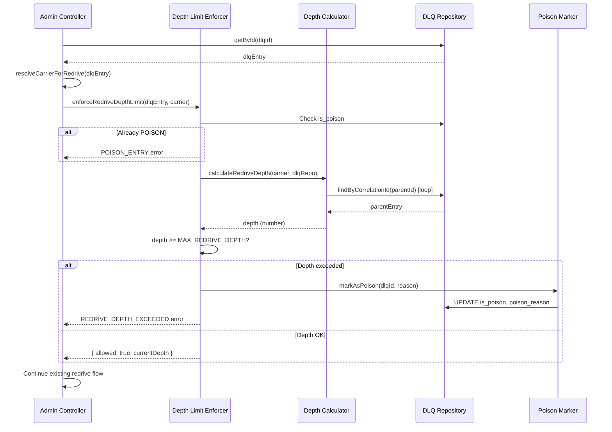
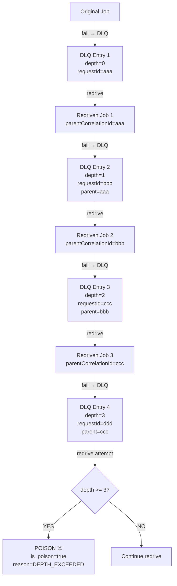

# Design Document — Phase 11.3: Redrive Chain Depth Limit

## Genel Bakış (Overview)

Phase 11.3, DLQ redrive işlemlerinde sonsuz döngüyü engelleyen deterministik bir derinlik sınırı mekanizması ekler. Mevcut `POST /admin/manifest/dlq/{dlqId}/redrive` endpoint'ine depth check entegre edilir. Derinlik hesaplama, DLQ entry'lerindeki `parentCorrelationId` zincirini takip ederek yapılır. Limit aşıldığında entry POISON olarak işaretlenir ve redrive reddedilir.

Tasarım, Phase 11.2'nin sağladığı `carrier_json` storage'ına dayanır ve mevcut write-once contract'ı (NNI-3) ihlal etmez.

## Mimari (Architecture)



### Entegrasyon Noktası

Depth check, mevcut redrive flow'unda carrier clone'dan **önce** çalışır:

```
1. getById(dlqId)           — mevcut
2. resolveCarrierForRedrive  — mevcut (Phase 11.2)
3. ★ enforceRedriveDepthLimit — YENİ (Phase 11.3)
4. cloneCarrierForRedrive    — mevcut
5. enforceCarrierSizeLimit   — mevcut
6. atomicRedrive             — mevcut
```

## Bileşenler ve Arayüzler (Components and Interfaces)

### 1. RedriveDepthCalculator

Derinlik hesaplama fonksiyonu. `parentCorrelationId` zincirini DLQ üzerinden takip eder.

```typescript
// redrive-depth-calculator.ts

import type { IManifestDlqRepository } from '../../manifest-dlq.repository';
import type { IdempotencyContextCarrierV2 } from './carrier-lifecycle.types';

const MAX_CHAIN_TRAVERSAL = 4; // MAX_REDRIVE_DEPTH + 1 (güvenlik sınırı)

export interface DepthCalculationResult {
  readonly depth: number;
  readonly chainBroken: boolean;   // zincir kırıldı mı (null carrier, parse fail)
  readonly cycleDetected: boolean; // döngüsel referans tespit edildi mi
  readonly traversalMs: number;    // hesaplama süresi
}

/**
 * parentCorrelationId zincirini takip ederek redrive derinliğini hesaplar.
 *
 * depth=0: hiç redrive edilmemiş (parentCorrelationId yok)
 * depth=1: bir kez redrive edilmiş
 * depth=N: N kez redrive edilmiş
 *
 * Zincir takibi şu durumlarda durur:
 * - parentCorrelationId yok
 * - DLQ entry bulunamadı
 * - carrierJson NULL veya parse edilemedi
 * - MAX_CHAIN_TRAVERSAL adıma ulaşıldı
 * - Döngüsel referans tespit edildi
 */
export async function calculateRedriveDepth(
  carrier: IdempotencyContextCarrierV2,
  dlqRepo: IManifestDlqRepository,
  maxTraversal: number = MAX_CHAIN_TRAVERSAL,
): Promise<DepthCalculationResult> {
  const startTime = Date.now();
  let depth = 0;
  let currentParentId = carrier.parentCorrelationId;
  let chainBroken = false;
  let cycleDetected = false;
  const visited = new Set<string>();

  while (currentParentId && depth < maxTraversal) {
    // Döngü tespiti
    if (visited.has(currentParentId)) {
      cycleDetected = true;
      break;
    }
    visited.add(currentParentId);

    // DLQ'da parent'ı ara (correlationId = carrier.requestId)
    const parentEntry = await dlqRepo.findByCorrelationId(currentParentId);
    if (!parentEntry?.carrierJson) {
      chainBroken = true;
      break;
    }

    try {
      const parentCarrier = JSON.parse(parentEntry.carrierJson);
      currentParentId = parentCarrier.parentCorrelationId;
      depth++;
    } catch {
      chainBroken = true;
      break;
    }
  }

  return {
    depth,
    chainBroken,
    cycleDetected,
    traversalMs: Date.now() - startTime,
  };
}
```

### 2. DepthLimitEnforcer

Derinlik limiti uygulama ve POISON flag koordinasyonu.

```typescript
// redrive-depth-enforcer.ts

import type { IManifestDlqRepository } from '../../manifest-dlq.repository';
import type { IdempotencyContextCarrierV2 } from './carrier-lifecycle.types';
import type { DlqEntry } from '../../manifest-retry.types';
import { calculateRedriveDepth, DepthCalculationResult } from './redrive-depth-calculator';

export const MAX_REDRIVE_DEPTH = 3;

export interface DepthEnforcementResult {
  readonly allowed: boolean;
  readonly currentDepth: number;
  readonly reason?: 'DEPTH_EXCEEDED' | 'POISON_ENTRY' | 'DEPTH_CHECK_FAILED';
  readonly depthCalculation?: DepthCalculationResult;
}

export class RedriveDepthExceededError extends Error {
  override readonly name = 'RedriveDepthExceededError';
  constructor(
    readonly currentDepth: number,
    readonly maxDepth: number,
    readonly code: 'REDRIVE_DEPTH_EXCEEDED' | 'POISON_ENTRY' = 'REDRIVE_DEPTH_EXCEEDED',
  ) {
    super(`Redrive depth ${currentDepth} exceeds maximum ${maxDepth}`);
  }
}

/**
 * Redrive derinlik limitini uygular.
 *
 * 1. Önce is_poison kontrolü (zaten POISON ise hemen reddet)
 * 2. Derinlik hesapla
 * 3. Limit aşıldıysa → POISON işaretle + reddet
 * 4. Limit OK → izin ver
 *
 * Fail-closed: DB hatası durumunda redrive reddedilir.
 */
export async function enforceRedriveDepthLimit(
  dlqEntry: DlqEntry,
  carrier: IdempotencyContextCarrierV2,
  dlqRepo: IManifestDlqRepository,
  maxDepth: number = MAX_REDRIVE_DEPTH,
): Promise<DepthEnforcementResult> {
  // 1. Zaten POISON mu?
  if (dlqEntry.isPoison) {
    return {
      allowed: false,
      currentDepth: -1,
      reason: 'POISON_ENTRY',
    };
  }

  // 2. Derinlik hesapla
  const depthResult = await calculateRedriveDepth(carrier, dlqRepo, maxDepth + 1);

  // 3. Limit kontrolü
  if (depthResult.depth >= maxDepth) {
    // POISON olarak işaretle
    await dlqRepo.markAsPoison(dlqEntry.id, {
      reason: `REDRIVE_DEPTH_EXCEEDED: depth=${depthResult.depth}, maxDepth=${maxDepth}`,
    });

    return {
      allowed: false,
      currentDepth: depthResult.depth,
      reason: 'DEPTH_EXCEEDED',
      depthCalculation: depthResult,
    };
  }

  // 4. İzin ver
  return {
    allowed: true,
    currentDepth: depthResult.depth,
    depthCalculation: depthResult,
  };
}
```

### 3. PoisonMarker (DLQ Repository Extension)

DLQ repository'ye eklenen yeni metotlar.

```typescript
// IManifestDlqRepository'ye eklenen metotlar

interface MarkAsPoisonInput {
  readonly reason: string;
}

interface IManifestDlqRepository {
  // ... mevcut metotlar ...

  /**
   * DLQ entry'sini POISON olarak işaretle.
   * is_poison ve poison_reason atomik olarak güncellenir.
   */
  markAsPoison(dlqId: string, input: MarkAsPoisonInput): Promise<void>;

  /**
   * correlationId ile DLQ entry bul.
   * Carrier'daki requestId, DLQ'daki carrier_json içindeki requestId ile eşleştirilir.
   * Depth chain traversal için kullanılır.
   */
  findByCorrelationId(correlationId: string): Promise<DlqEntry | null>;
}
```

### 4. findByCorrelationId Implementasyonu

```typescript
// PrismaManifestDlqRepository'ye eklenen metot

/**
 * correlationId ile DLQ entry bul.
 *
 * carrier_json içindeki requestId alanını arar.
 * PostgreSQL JSON operatörü kullanır: carrier_json::jsonb->>'requestId'
 *
 * NOT: Bu sorgu carrier_json NULL olan entry'leri otomatik olarak atlar.
 */
async findByCorrelationId(correlationId: string): Promise<DlqEntry | null> {
  const result = await this.prisma.$queryRawUnsafe<RawDlqEntry[]>(
    `SELECT * FROM manifest_dead_letter_queue
     WHERE carrier_json IS NOT NULL
       AND carrier_json::jsonb->>'requestId' = $1
     LIMIT 1`,
    correlationId,
  );

  if (result.length === 0) return null;
  return this.mapRawToEntry(result[0]);
}
```

### 5. Metrik Tanımları

```typescript
// carrier-lifecycle-metrics.ts'ye eklenen metrikler

import { Counter, Histogram } from 'prom-client';

/** Redrive derinlik dağılımı */
export const redriveDepthHistogram = new Histogram({
  name: 'carrier_redrive_depth_total',
  help: 'Redrive chain depth distribution',
  buckets: [0, 1, 2, 3, 4, 5],
});

/** Redrive reddedilme sayacı (mevcut metriğe yeni label eklenir) */
// redriveRejectedMetric zaten mevcut — reason label'ına yeni değerler:
// - DEPTH_EXCEEDED: derinlik limiti aşıldı
// - POISON_FLAGGED: entry POISON olarak işaretlendi
// - POISON_ENTRY: zaten POISON olan entry için redrive talebi
```

## Veri Modelleri (Data Models)

### Veritabanı Şema Değişikliği

```sql
-- Migration: 20260207_phase11_3_dlq_poison_columns.sql

ALTER TABLE manifest_dead_letter_queue
ADD COLUMN is_poison BOOLEAN NOT NULL DEFAULT false;

ALTER TABLE manifest_dead_letter_queue
ADD COLUMN poison_reason TEXT NULL;

COMMENT ON COLUMN manifest_dead_letter_queue.is_poison IS
  'Phase 11.3: True if entry exceeded redrive depth limit';
COMMENT ON COLUMN manifest_dead_letter_queue.poison_reason IS
  'Phase 11.3: Reason for poison flag (e.g. REDRIVE_DEPTH_EXCEEDED)';

-- Rollback:
-- ALTER TABLE manifest_dead_letter_queue DROP COLUMN poison_reason;
-- ALTER TABLE manifest_dead_letter_queue DROP COLUMN is_poison;
```

### DlqEntry Type Güncellemesi

```typescript
// manifest-retry.types.ts — DlqEntry'ye eklenen alanlar

export interface DlqEntry {
  // ... mevcut alanlar ...

  // Phase 11.3 - Poison tracking
  isPoison: boolean;
  poisonReason: string | null;
}
```

### CreateDlqEntryInput Güncellemesi

```typescript
// manifest-retry.types.ts — CreateDlqEntryInput'a eklenen alanlar

export interface CreateDlqEntryInput {
  // ... mevcut alanlar ...

  // Phase 11.3 - Poison tracking (optional, default false)
  isPoison?: boolean;
  poisonReason?: string | null;
}
```

### Admin Response DTO Güncellemesi

```typescript
// manifest-admin.dto.ts — DlqRedriveResponseDto'ya eklenen alan

export interface DlqRedriveResponseDto {
  // ... mevcut alanlar ...
  currentDepth?: number;
}

// DlqEntryDto'ya eklenen alanlar
export interface DlqEntryDto {
  // ... mevcut alanlar ...
  isPoison: boolean;
  poisonReason: string | null;
}
```

### Redrive Chain Veri Akışı




## Doğruluk Özellikleri (Correctness Properties)

*Bir doğruluk özelliği (property), sistemin tüm geçerli çalışmalarında doğru olması gereken bir davranış veya karakteristiktir — esasen, sistemin ne yapması gerektiğine dair biçimsel bir ifadedir. Özellikler, insan tarafından okunabilir spesifikasyonlar ile makine tarafından doğrulanabilir doğruluk garantileri arasında köprü görevi görür.*

### Property 1: Derinlik hesaplama doğruluğu

*For any* bilinen derinliğe sahip DLQ entry zinciri (depth=N), `calculateRedriveDepth` fonksiyonu N değerini döndürmelidir. Ayrıca, zincir uzunluğu ne olursa olsun, traversal adım sayısı `maxTraversal` parametresini aşmamalıdır.

Edge case'ler (generator tarafından kapsanır):
- `parentCorrelationId` olmayan carrier → depth=0
- Zincirde NULL `carrierJson` → zincir kırılma noktasına kadar olan derinlik
- Zincirde parse edilemeyen `carrierJson` → zincir kırılma noktasına kadar olan derinlik
- Döngüsel `parentCorrelationId` referansı → `cycleDetected=true`, traversal sonlanır

**Validates: Requirements 1.1, 1.2, 1.3, 1.4, 1.5, 7.2**

### Property 2: Derinlik limiti uygulama kararı

*For any* derinlik değeri `d` ve maksimum derinlik `MAX`, `enforceRedriveDepthLimit` fonksiyonu `d >= MAX` ise `allowed=false` ve `reason=DEPTH_EXCEEDED` döndürmeli, `d < MAX` ise `allowed=true` döndürmelidir. Ayrıca, `d >= MAX` durumunda DLQ entry `is_poison=true` olarak işaretlenmiş olmalıdır.

**Validates: Requirements 2.1, 2.2, 2.3**

### Property 3: markAsPoison atomik doğruluğu

*For any* DLQ entry ve geçerli bir reason string'i, `markAsPoison` çağrısından sonra entry'nin `is_poison` alanı `true` olmalı ve `poison_reason` alanı verilen reason string'ini içermelidir.

**Validates: Requirements 3.1, 3.2**

### Property 4: POISON idempotansı

*For any* zaten `is_poison=true` olan DLQ entry, `enforceRedriveDepthLimit` fonksiyonu derinlik hesaplaması yapmadan `allowed=false` ve `reason=POISON_ENTRY` döndürmelidir.

**Validates: Requirements 3.3**

### Property 5: Fail-closed hata yönetimi

*For any* derinlik hesaplama sırasında veritabanı hatası oluştuğunda, `enforceRedriveDepthLimit` fonksiyonu redrive'ı reddetmelidir (allowed=false).

**Validates: Requirements 7.1**

### Property 6: DLQ listeleme POISON filtresi

*For any* DLQ entry koleksiyonu, `is_poison` filtresi aktifken döndürülen tüm entry'lerin `is_poison=true` olması gerekir ve hiçbir `is_poison=false` entry döndürülmemelidir.

**Validates: Requirements 8.2**

## Hata Yönetimi (Error Handling)

### Hata Senaryoları

| Senaryo | Davranış | HTTP Kodu | Hata Kodu |
|---------|----------|-----------|-----------|
| Derinlik limiti aşıldı | POISON işaretle + reddet | 409 Conflict | `REDRIVE_DEPTH_EXCEEDED` |
| Zaten POISON entry | Hemen reddet | 409 Conflict | `POISON_ENTRY` |
| DB hatası (depth hesaplama) | Fail-closed: reddet | 500 Internal | `DEPTH_CHECK_FAILED` |
| Zincir kırık (NULL carrier) | Mevcut derinliği kullan | - | - |
| Döngüsel referans | Mevcut derinliği kullan | - | - |

### Fail-Closed Prensibi

Derinlik hesaplama sırasında herhangi bir beklenmeyen hata oluşursa, sistem **fail-closed** davranır — yani redrive reddedilir. Bu, sonsuz döngü riskini ortadan kaldırır. Operatör, hatayı inceleyip gerekirse manuel müdahale edebilir.

```typescript
try {
  const result = await enforceRedriveDepthLimit(dlqEntry, carrier, dlqRepo);
  if (!result.allowed) {
    // Reject with appropriate error
  }
} catch (error) {
  // Fail-closed: any unexpected error → reject redrive
  logger.error('[REDRIVE_DEPTH_CHECK_FAILED]', { dlqId, error });
  redriveRejectedMetric.inc({ reason: 'DEPTH_CHECK_FAILED' });
  throw new InternalServerErrorException({
    code: 'DEPTH_CHECK_FAILED',
    message: 'Redrive depth check failed unexpectedly',
  });
}
```

### Log Formatı

| Log Event | Level | Stable Prefix |
|-----------|-------|---------------|
| Derinlik limiti aşıldı | WARN | `[REDRIVE_DEPTH_EXCEEDED]` |
| POISON entry redrive talebi | WARN | `[REDRIVE_POISON_ENTRY]` |
| Derinlik hesaplama hatası | ERROR | `[REDRIVE_DEPTH_CHECK_FAILED]` |
| Zincir kırık | DEBUG | `[REDRIVE_CHAIN_BROKEN]` |
| Döngüsel referans | WARN | `[REDRIVE_CHAIN_CYCLE]` |

## Test Stratejisi (Testing Strategy)

### Property-Based Testing

**Kütüphane:** `fast-check` (mevcut projede kullanılan PBT kütüphanesi)

**Konfigürasyon:** Her property test minimum 100 iterasyon çalıştırılmalıdır.

**Property testleri:**

1. **Feature: phase-11-3-redrive-depth-limit, Property 1: Derinlik hesaplama doğruluğu**
   - Generator: Rastgele derinlikte (0-5) DLQ entry zincirleri üret, bazılarında NULL carrierJson, bazılarında bozuk JSON, bazılarında döngüsel referans
   - Assertion: Hesaplanan derinlik, zincirdeki ilk kırılma noktasına kadar olan gerçek derinliğe eşit olmalı; traversal adım sayısı maxTraversal'ı aşmamalı

2. **Feature: phase-11-3-redrive-depth-limit, Property 2: Derinlik limiti uygulama kararı**
   - Generator: Rastgele derinlik değerleri (0-10) ve rastgele MAX_REDRIVE_DEPTH (1-5) üret
   - Assertion: `depth >= MAX` ↔ `allowed=false` ve `depth < MAX` ↔ `allowed=true`

3. **Feature: phase-11-3-redrive-depth-limit, Property 3: markAsPoison atomik doğruluğu**
   - Generator: Rastgele DLQ entry'leri ve rastgele reason string'leri üret
   - Assertion: markAsPoison sonrası `is_poison=true` ve `poison_reason` verilen reason'ı içermeli

4. **Feature: phase-11-3-redrive-depth-limit, Property 4: POISON idempotansı**
   - Generator: `is_poison=true` olan rastgele DLQ entry'leri üret
   - Assertion: `enforceRedriveDepthLimit` hemen `allowed=false, reason=POISON_ENTRY` döndürmeli, depth hesaplama çağrılmamalı

5. **Feature: phase-11-3-redrive-depth-limit, Property 5: Fail-closed hata yönetimi**
   - Generator: DB hatası fırlatan mock repository ile rastgele carrier'lar üret
   - Assertion: Fonksiyon hata fırlatmalı veya `allowed=false` döndürmeli

6. **Feature: phase-11-3-redrive-depth-limit, Property 6: DLQ listeleme POISON filtresi**
   - Generator: Rastgele `is_poison` değerlerine sahip DLQ entry koleksiyonları üret
   - Assertion: Filtre aktifken döndürülen tüm entry'lerde `is_poison=true` olmalı

### Unit Testing

Unit testler aşağıdaki spesifik senaryoları kapsar:

- **Depth Calculator:**
  - Depth=0 (hiç redrive edilmemiş)
  - Depth=1, 2, 3 (bilinen zincirler)
  - Zincir kırık (NULL carrierJson ortada)
  - Döngüsel referans tespiti
  - maxTraversal sınırı

- **Depth Enforcer:**
  - Depth < MAX → allowed
  - Depth = MAX → rejected + POISON
  - Depth > MAX → rejected + POISON
  - Already POISON → immediate reject
  - DB error → fail-closed

- **Admin Controller Integration:**
  - HTTP 409 + REDRIVE_DEPTH_EXCEEDED response body
  - HTTP 409 + POISON_ENTRY response body
  - Başarılı redrive'da currentDepth dahil
  - Audit log kaydı

- **DLQ Repository:**
  - markAsPoison atomik güncelleme
  - findByCorrelationId doğru eşleşme
  - Poison filter ile query

### Test Dosya Yapısı

```
manifest-retry/
  idempotency/carrier-lifecycle/
    __tests__/
      redrive-depth-calculator.spec.ts    — Property 1 + unit tests
      redrive-depth-enforcer.spec.ts      — Property 2, 4, 5 + unit tests
    redrive-depth-calculator.ts
    redrive-depth-enforcer.ts
  __tests__/
    manifest-dlq.repository.spec.ts       — Property 3, 6 + unit tests (mevcut dosyaya ekleme)
    manifest-admin.controller.spec.ts     — Integration tests (mevcut dosyaya ekleme)
```
