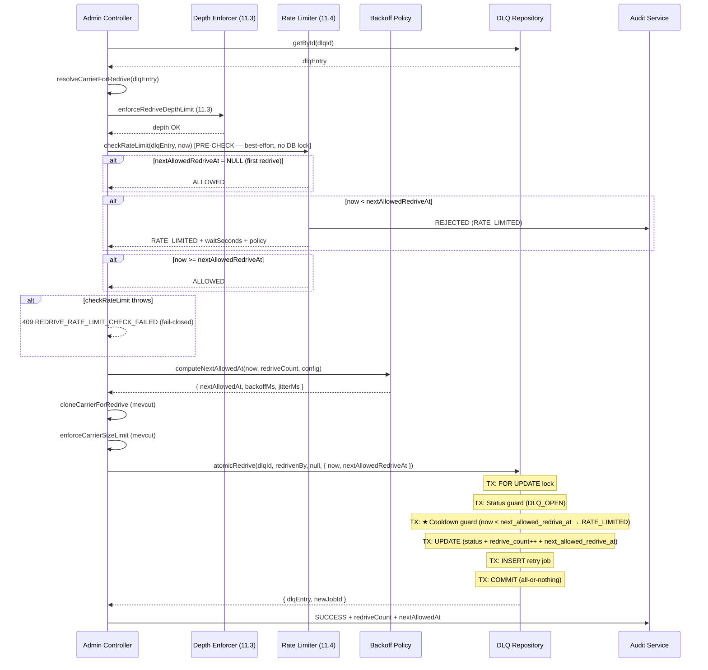

# Design Document — Phase 11.4: Redrive Rate Limiting / Backoff Guardrail

## Genel Bakış (Overview)

Phase 11.4, DLQ redrive işlemlerinde aynı correlation chain için hızlı ardışık talepleri engelleyen bir rate limiting / exponential backoff mekanizması ekler. Mevcut `POST /admin/manifest/dlq/{dlqId}/redrive` endpoint'ine, Phase 11.3 depth check'ten **sonra** ve carrier clone'dan **önce** rate limit gate entegre edilir.

Tasarım, Phase 11.3 pattern'iyle uyumludur: saf policy fonksiyonu + enforcer + repo extension + controller gate. Rate limit state DLQ entry üzerinde tutulur (ayrı tablo yok). Reject path'te DB mutasyonu yapılmaz (INV-11.4.3). Fail-closed: repo/policy hatası → reject.

**Kilitli Kararlar:**
- HTTP reject: 409 (`REDRIVE_RATE_LIMITED`)
- Reject path'te DB mutate yok
- Fail-closed: repo/policy error → reject
- Jitter RNG injectable (test determinism)
- Rate limit key: `rootCorrelationId` varsa root, yoksa `correlationId`

### Terminoloji (LOCKED)

> **"Success" = Enqueue Success, NOT Worker Execution Success**
>
> Bu Phase'deki tüm "success" referansları `atomicRedrive`'ın başarılı dönmesini ifade eder — yani DLQ entry'nin retry queue'ya başarıyla enqueue edilmesini. Worker'ın işi gerçekten tamamlaması ayrı bir domain'de (retry_queue job lifecycle) izlenir ve DLQ entry'ye geri yazılmaz.
>
> | Terim | Tanım |
> |-------|-------|
> | `redrive_count` | Bu DLQ entry için başarılı enqueue sayısı. Worker outcome'u yansıtmaz. |
> | `last_redriven_at` | Son başarılı enqueue zaman damgası. Worker completion time değil. |
> | `recordRedriveSuccess` | **Deprecated (controller path için).** Enqueue sonrası rate limit state güncellemesi. Artık `atomicRedrive` tx'inde yapılır. |
> | `onRedriveEnqueued` | **Deprecated (controller path için).** `atomicRedrive` tx'i rate limit state'i doğrudan günceller. Bu fonksiyon ileride başka call path'ler için korunur. |

### Rate Limit State Kaynağı (Single-Source Note)

> Phase 11.4'te `next_allowed_redrive_at` alanı **tek kaynaktan** yazılır: backoff policy (`computeNextAllowedAt`).
> Ayrı bir "rate limiter window" veya "global throttle" kaynağı yoktur.
> `checkRateLimit` bu tek değeri okur ve enforce eder.
>
> **İleride ikinci bir rate limit kaynağı eklenirse** (örn. tenant-level throttle, error-type adaptive backoff):
> `effectiveNextAllowedAt = max(source1NextAllowed, source2NextAllowed)` pattern'i uygulanmalı
> ve `onRedriveEnqueued` içinde bu `max()` hesabı yapılarak `next_allowed_redrive_at`'a yazılmalıdır.
> Bu sayede reject path'teki no-write garantisi korunur: satırda zaten en muhafazakâr nextAllowed bulunur.

## Mimari (Architecture)



### Entegrasyon Noktası (LOCKED — Task 8.1 Patch ile güncellenmiştir)

Rate limit check, mevcut redrive flow'unda depth check'ten **sonra**, carrier clone'dan **önce** çalışır. Rate limit state persist ise `atomicRedrive` transaction'ı **içinde** yapılır (all-or-nothing):

```
1. getById(dlqId)                    — mevcut
2. resolveCarrierForRedrive          — mevcut (Phase 11.2)
3. enforceRedriveDepthLimit          — mevcut (Phase 11.3)
4. ★ checkRateLimit (PRE-CHECK)      — Phase 11.4 (read-only, best-effort, fail-closed)
5. computeNextAllowedAt              — Phase 11.4 (backoff hesabı, controller'da)
6. cloneCarrierForRedrive            — mevcut
7. enforceCarrierSizeLimit           — mevcut
8. ★ atomicRedrive(rateLimitGate?)   — Phase 11.4 patch: tx içinde cooldown guard + rate limit state update
   ├─ FOR UPDATE lock
   ├─ Status guard (DLQ_OPEN)
   ├─ ★ Cooldown guard (now < next_allowed_redrive_at → RATE_LIMITED)
   ├─ UPDATE (status + redrive_count++ + last_redriven_at + next_allowed_redrive_at)
   ├─ INSERT retry job
   └─ COMMIT (all-or-nothing)
```

**Double-check pattern:** Step 4 (pre-check) optimistik UX gate'tir — DB lock açmadan hızlı 409 döner. Step 8 (tx gate) otoritatif gate'tir — `FOR UPDATE` lock sonrası cooldown guard enforce eder. Pre-check geçse bile tx gate reddedebilir (concurrent race).

> **Gerçek rate-limit enforcement tx içindedir; controller pre-check deterministik değildir ve güvenlik iddiası taşımaz.**

**Kaldırılan:** `onRedriveEnqueued` ayrı persist adımı — artık tx içinde. `recordRedriveSuccess` ayrı çağrı yok — SQL doğrudan tx'te. `RATE_LIMIT_PERSIST_FAILED` senaryosu ortadan kalktı — all-or-nothing.

## Bileşenler ve Arayüzler (Components and Interfaces)

### 1. RedriveBackoffPolicy (Pure Function)

Deterministik backoff hesaplama. Config-driven, RNG injectable.

```typescript
// redrive-backoff-policy.ts

export interface BackoffPolicyConfig {
  /** Base cooldown in milliseconds (default: 30_000 = 30s) */
  readonly baseMs: number;
  /** Exponent cap — k = min(redriveCount, capExponent) */
  readonly capExponent: number;
  /** Maximum backoff in milliseconds (default: 3_600_000 = 1h) */
  readonly maxBackoffMs: number;
  /** Jitter percentage 0.0–1.0 (default: 0.20 = 20%) */
  readonly jitterPct: number;
}

export const DEFAULT_BACKOFF_CONFIG: BackoffPolicyConfig = {
  baseMs: 30_000,       // 30 seconds
  capExponent: 7,       // 2^7 = 128 → 30s * 128 = 3840s ≈ 64min (capped at 1h)
  maxBackoffMs: 3_600_000, // 1 hour
  jitterPct: 0.20,      // 20%
};

export interface BackoffResult {
  /** Absolute timestamp: next allowed redrive time */
  readonly nextAllowedAt: Date;
  /** Computed backoff in ms (before jitter) */
  readonly backoffMs: number;
  /** Computed jitter in ms */
  readonly jitterMs: number;
  /** Effective exponent k = min(redriveCount, capExponent) */
  readonly k: number;
}

/**
 * Compute next allowed redrive time.
 *
 * Formula:
 *   k = min(redriveCount, capExponent)
 *   backoff = min(maxBackoffMs, baseMs * 2^k)
 *   jitter = rng() * jitterPct * backoff
 *   nextAllowedAt = now + backoff + jitter
 *
 * @param now - Current timestamp
 * @param redriveCount - Current redrive count (BEFORE increment)
 * @param config - Backoff configuration
 * @param rng - Random number generator [0, 1) — injectable for testing
 */
export function computeNextAllowedAt(
  now: Date,
  redriveCount: number,
  config: BackoffPolicyConfig = DEFAULT_BACKOFF_CONFIG,
  rng: () => number = Math.random,
): BackoffResult {
  // Input guard: negative redriveCount clamped to 0 (defensive)
  const safeCount = Math.max(0, Math.floor(redriveCount));
  const k = Math.min(safeCount, config.capExponent);
  const rawBackoff = config.baseMs * Math.pow(2, k);
  const backoffMs = Math.min(rawBackoff, config.maxBackoffMs);
  const jitterMs = Math.floor(rng() * config.jitterPct * backoffMs);
  const nextAllowedAt = new Date(now.getTime() + backoffMs + jitterMs);

  return { nextAllowedAt, backoffMs, jitterMs, k };
}
```

### 2. RedriveRateLimiter (Enforcer)

Rate limit check (read-only) ve success persist (mutating) ayrı metotlar.

```typescript
// redrive-rate-limiter.ts

import type { IManifestDlqRepository } from '../../manifest-dlq.repository';
import { computeNextAllowedAt, BackoffPolicyConfig, DEFAULT_BACKOFF_CONFIG } from './redrive-backoff-policy';

export interface RateLimitCheckResult {
  readonly allowed: boolean;
  readonly reason?: 'RATE_LIMITED' | 'RATE_LIMIT_CHECK_FAILED';
  readonly waitSeconds?: number;
  readonly nextAllowedAt?: Date;
  readonly policy?: BackoffPolicyConfig;
  readonly redriveCount?: number;
}

export interface RedriveSuccessResult {
  readonly redriveCount: number;
  readonly nextAllowedRedriveAt: Date;
  readonly lastRedrivenAt: Date;
}

/**
 * Resolve the rate limit key from DLQ entry.
 * Tüm katmanlar bu fonksiyonu kullanır — tek kaynak.
 *
 * LOCKED: Rate limit key = rootCorrelationId ?? correlationId ?? dlqEntry.id
 *
 * Öncelik sırası:
 *   1. rootCorrelationId (carrier_json → rootCorrelationId) — aynı olay ailesini tek kovaya bağlar
 *   2. correlationId (carrier_json → requestId) — root yoksa mevcut correlation
 *   3. dlqEntry.id — carrier_json yoksa veya parse edilemezse fallback
 *
 * Cardinality clamp: key max 256 char; aşarsa SHA-256 hash ile kısaltılır.
 * Hash format: "rl:v1:<sha256hex>" — versioned prefix ile ileride schema değişikliğinde geriye uyum.
 *
 * MUST NOT: Rate limit key hiçbir zaman metrik label'ına yazılmaz (cardinality explosion riski).
 * Metrik label'larında yalnızca reason/bucket gibi sabit enum değerleri kullanılır.
 */
export function resolveRateLimitKey(dlqEntry: DlqEntry): string {
  if (dlqEntry.carrierJson) {
    try {
      const carrier = JSON.parse(dlqEntry.carrierJson);
      const root = carrier.rootCorrelationId;
      const corr = carrier.requestId; // correlationId = requestId in carrier
      const rawKey = root ?? corr ?? dlqEntry.id;
      return clampKey(rawKey);
    } catch {
      // Parse failed → fallback to dlqEntry.id
      return dlqEntry.id;
    }
  }
  return dlqEntry.id;
}

/**
 * Clamp key to max 256 chars. If longer, hash with SHA-256 + versioned prefix.
 * Truncate MUST NOT be used — collision riski.
 */
function clampKey(key: string): string {
  if (key.length <= 256) return key;
  const hash = createHash('sha256').update(key).digest('hex');
  return `rl:v1:${hash}`;
}

/**
 * Check rate limit (read-only decision).
 *
 * PRE-CHECK ONLY — real gate is in atomicRedrive tx.
 * Controller'da DB lock açmadan hızlı 409 + waitSeconds dönmek için kullanılır.
 * Güvenlik iddiası taşımaz; gerçek otorite tx gate'tedir.
 *
 * - nextAllowedRedriveAt NULL → allow (first redrive)
 * - now >= nextAllowedRedriveAt → allow
 * - now < nextAllowedRedriveAt → reject
 * - DB error → reject (fail-closed)
 */
export async function checkRateLimit(
  dlqEntry: DlqEntry,
  now: Date,
  config: BackoffPolicyConfig = DEFAULT_BACKOFF_CONFIG,
): Promise<RateLimitCheckResult> {
  // First redrive: no rate limit state
  if (dlqEntry.nextAllowedRedriveAt == null) {
    return { allowed: true, redriveCount: dlqEntry.redriveCount ?? 0 };
  }

  const nextAllowed = new Date(dlqEntry.nextAllowedRedriveAt);
  if (now.getTime() >= nextAllowed.getTime()) {
    return { allowed: true, redriveCount: dlqEntry.redriveCount ?? 0 };
  }

  // Rate limited
  const waitSeconds = Math.ceil(
    (nextAllowed.getTime() - now.getTime()) / 1000,
  );
  return {
    allowed: false,
    reason: 'RATE_LIMITED',
    waitSeconds,
    nextAllowedAt: nextAllowed,
    policy: config,
    redriveCount: dlqEntry.redriveCount ?? 0,
  };
}

/**
 * Record successful redrive — persist new rate limit state.
 * Called AFTER atomicRedrive succeeds.
 *
 * @deprecated For controller redrive path — use atomicRedrive with rateLimitGate instead.
 * Rate limit state is now updated within the atomicRedrive transaction (all-or-nothing).
 * Retained for potential future call paths that need standalone rate limit updates.
 *
 * CALLER CONTRACT (MUST): Bu fonksiyon yalnızca atomicRedrive başarılı
 * döndükten sonra çağrılabilir. İdempotency/consistency garantisi vermez;
 * o garanti atomicRedrive'ın transactional/locking davranışındadır.
 *
 * Atomically updates: redrive_count++, last_redriven_at, next_allowed_redrive_at.
 */
export async function onRedriveEnqueued(
  dlqId: string,
  now: Date,
  currentRedriveCount: number,
  dlqRepo: IManifestDlqRepository,
  config: BackoffPolicyConfig = DEFAULT_BACKOFF_CONFIG,
  rng: () => number = Math.random,
): Promise<RedriveSuccessResult> {
  const backoff = computeNextAllowedAt(now, currentRedriveCount, config, rng);

  await dlqRepo.recordRedriveSuccess(dlqId, {
    lastRedrivenAt: now,
    nextAllowedRedriveAt: backoff.nextAllowedAt,
  });

  return {
    redriveCount: currentRedriveCount + 1,
    nextAllowedRedriveAt: backoff.nextAllowedAt,
    lastRedrivenAt: now,
  };
}
```

### 3. DLQ Repository Extensions

```typescript
// IManifestDlqRepository'ye eklenen metotlar

interface RecordRedriveSuccessInput {
  readonly lastRedrivenAt: Date;
  readonly nextAllowedRedriveAt: Date;
}

interface IManifestDlqRepository {
  // ... mevcut metotlar (Phase 11.3 dahil) ...

  /**
   * Atomically redrive a DLQ entry back to the retry queue.
   * 
   * Phase 11.4 patch: When rateLimitGate is provided, the transaction also:
   *   - Enforces cooldown guard (now < next_allowed_redrive_at → RATE_LIMITED)
   *   - Updates rate limit state (redrive_count++, last_redriven_at, next_allowed_redrive_at)
   * All-or-nothing: enqueue + rate limit state update in same tx.
   * 
   * @param rateLimitGate - Optional for backward compat. When omitted, original behavior preserved.
   */
  atomicRedrive(
    dlqId: string,
    redrivenBy: string,
    nextAttemptAt?: Date | null,
    rateLimitGate?: { now: Date; nextAllowedRedriveAt: Date },
  ): Promise<{ dlqEntry: DlqEntry; newJobId: string }>;

  /**
   * @deprecated For controller redrive path — use atomicRedrive with rateLimitGate instead.
   * Rate limit state is now updated within the atomicRedrive transaction (all-or-nothing).
   * Retained for potential future call paths that need standalone rate limit updates.
   */
  recordRedriveSuccess(
    dlqId: string,
    input: RecordRedriveSuccessInput,
  ): Promise<void>;
}
```

### 4. recordRedriveSuccess Implementasyonu

> **@deprecated** For controller redrive path — use `atomicRedrive` with `rateLimitGate` instead.
> Rate limit state is now updated within the `atomicRedrive` transaction (all-or-nothing).
> Retained for potential future call paths that need standalone rate limit updates.

> **Caller Contract (MUST):** `recordRedriveSuccess` yalnızca `atomicRedrive` başarılı döndükten sonra çağrılabilir.
> Bu fonksiyon idempotency/consistency garantisi vermez; o garanti `atomicRedrive`'ın transactional/locking davranışındadır.
> İleride ikinci caller çıkarsa status guard eklenmeli (Phase 11.4.x scope).

```typescript
// PrismaManifestDlqRepository'ye eklenen metot
// NOT: $executeRawUnsafe kullanılmaz; parametre binding tagged template ile yapılır.

async recordRedriveSuccess(
  dlqId: string,
  input: RecordRedriveSuccessInput,
): Promise<void> {
  await this.prisma.$executeRaw`
    UPDATE manifest_dead_letter_queue
    SET redrive_count = COALESCE(redrive_count, 0) + 1,
        last_redriven_at = ${input.lastRedrivenAt},
        next_allowed_redrive_at = ${input.nextAllowedRedriveAt},
        rate_limit_reason = NULL
    WHERE id = ${dlqId}::uuid
  `;
}
```

### 5. Metrik Tanımları (Task 7 Contract ile güncellenmiştir)

```typescript
// carrier-lifecycle-metrics.ts'ye eklenen metrikler (Phase 11.4 — Task 7)

/**
 * Rate-limited redrive rejections, split by gate.
 * gate: 'precheck' | 'tx' (LOCKED — 2 değer)
 */
export const redriveRateLimitedMetric = new SimpleCounter(
  'carrier_redrive_rate_limited_total',
  'Redrive attempts rejected by rate limiter, by gate',
  ['gate'],
);

/**
 * Fail-closed counter. Normal operation: 0.
 * Any increment → immediate investigation.
 */
export const redriveRateCheckFailedMetric = new SimpleCounter(
  'carrier_redrive_rate_check_failed_total',
  'Rate limit pre-check fail-closed events',
  [],
);

/**
 * Backoff delay histogram (seconds).
 * Measures: (backoffMs + jitterMs) / 1000
 * Prometheus export: _bucket, _sum, _count
 */
export const redriveBackoffHistogram = new SimpleHistogram(
  'carrier_redrive_backoff_seconds',
  'Distribution of computed backoff delay in seconds',
  [30, 60, 120, 300, 600, 1800, 3600],
);

/**
 * Backoff applications by redrive count bucket.
 * count_bucket: '0' | '1' | '2' | '3-4' | '5-9' | '10+' (LOCKED — 6 değer)
 * Label adı count_bucket — Prometheus histogram le bucket çakışmasını önler.
 */
export const redriveBackoffAppliedMetric = new SimpleCounter(
  'carrier_redrive_backoff_applied_total',
  'Backoff applications by redrive count bucket',
  ['count_bucket'],
);
```

**Emission ↔ HTTP Outcome Matrisi:**

| HTTP Outcome | Metrik Emission |
|---|---|
| 409 `REDRIVE_RATE_LIMITED` (pre-check) | `carrier_redrive_rate_limited_total{gate="precheck"}` + `carrier_redrive_rejected_total{reason="RATE_LIMITED"}` |
| 409 `REDRIVE_RATE_LIMITED` (tx gate) | `carrier_redrive_rate_limited_total{gate="tx"}` + `carrier_redrive_rejected_total{reason="RATE_LIMITED"}` |
| 409 `REDRIVE_RATE_LIMIT_CHECK_FAILED` | `carrier_redrive_rate_check_failed_total` + `carrier_redrive_rejected_total{reason="RATE_LIMIT_CHECK_FAILED"}` |
| 200 `REDRIVEN` (success) | `carrier_redrive_backoff_applied_total{count_bucket}` + `carrier_redrive_backoff_seconds.observe(seconds)` + `carrier_redrive_cloned_total` |

> **Not:** Mevcut `carrier_redrive_rejected_total{reason}` emission'ları korunur (backward compat). Yeni metrikler ek boyut sağlar: `rejected` → "neden?", `rate_limited` → "nerede?" (gate ayrımı).

## Veri Modelleri (Data Models)

### Veritabanı Şema Değişikliği

```sql
-- Migration: YYYYMMDD_phase11_4_dlq_redrive_rate_limit_columns.sql

ALTER TABLE manifest_dead_letter_queue
ADD COLUMN last_redriven_at TIMESTAMPTZ NULL;

ALTER TABLE manifest_dead_letter_queue
ADD COLUMN redrive_count INTEGER NOT NULL DEFAULT 0;

ALTER TABLE manifest_dead_letter_queue
ADD COLUMN next_allowed_redrive_at TIMESTAMPTZ NULL;

ALTER TABLE manifest_dead_letter_queue
ADD COLUMN rate_limit_reason TEXT NULL;

COMMENT ON COLUMN manifest_dead_letter_queue.last_redriven_at IS
  'Phase 11.4: Timestamp of last successful redrive';
COMMENT ON COLUMN manifest_dead_letter_queue.redrive_count IS
  'Phase 11.4: Number of successful redrives for this entry';
COMMENT ON COLUMN manifest_dead_letter_queue.next_allowed_redrive_at IS
  'Phase 11.4: Earliest allowed time for next redrive (backoff enforcement)';
COMMENT ON COLUMN manifest_dead_letter_queue.rate_limit_reason IS
  'Phase 11.4: Last rate limit reason (debugging, optional)';

-- Rollback:
-- ALTER TABLE manifest_dead_letter_queue DROP COLUMN rate_limit_reason;
-- ALTER TABLE manifest_dead_letter_queue DROP COLUMN next_allowed_redrive_at;
-- ALTER TABLE manifest_dead_letter_queue DROP COLUMN redrive_count;
-- ALTER TABLE manifest_dead_letter_queue DROP COLUMN last_redriven_at;
```

### DlqEntry Type Güncellemesi

```typescript
// manifest-retry.types.ts — DlqEntry'ye eklenen alanlar

export interface DlqEntry {
  // ... mevcut alanlar (Phase 11.3 dahil) ...

  // Phase 11.4 - Rate limiting
  lastRedrivenAt: Date | null;
  redriveCount: number;
  nextAllowedRedriveAt: Date | null;
  rateLimitReason: string | null;
}
```

### DTO Güncellemeleri

```typescript
// manifest-admin.dto.ts — DlqEntryDto'ya eklenen alanlar

export class DlqEntryDto {
  // ... mevcut alanlar (Phase 11.3 dahil) ...

  // Phase 11.4 - Rate limiting visibility
  redriveCount!: number;
  lastRedrivenAt?: string | null;
  nextAllowedRedriveAt?: string | null;
  rateLimitReason?: string | null;
}

// DlqRedriveResponseDto'ya eklenen alanlar
export class DlqRedriveResponseDto {
  // ... mevcut alanlar ...

  // Phase 11.4 - Rate limit info on success
  redriveCount?: number;
  nextAllowedRedriveAt?: string;
}
```

### Hata / Yanıt Matrisi (LOCKED — Task 8.1 Patch ile güncellenmiştir)

| Durum | HTTP | reason | Mutasyon | Response Alanları | Gate |
|-------|------|--------|----------|-------------------|------|
| Allowed (now >= nextAllowed) | 200 | `ALLOWED` | tx: enqueue + rate state | `redriveCount`, `nextAllowedRedriveAt` | Tx |
| Rate limited (pre-check) | 409 | `REDRIVE_RATE_LIMITED` | Yok | `nextAllowedAt`, `waitSeconds`, `redriveCount` | Controller |
| Rate limited (tx gate) | 409 | `REDRIVE_RATE_LIMITED` | Yok | `nextAllowedAt`, `waitSeconds` | Tx |
| Poison entry (11.3) | 409 | `POISON_ENTRY` | Yok | (mevcut) | Controller |
| Depth exceeded (11.3) | 409 | `REDRIVE_DEPTH_EXCEEDED` | poison set | (mevcut) | Controller |
| Rate limit check failed | 409 | `REDRIVE_RATE_LIMIT_CHECK_FAILED` | Yok | minimal (non-retriable) | Controller |

> **Not:** `RATE_LIMIT_PERSIST_FAILED` satırı kaldırılmıştır — rate limit state artık `atomicRedrive` tx'inde güncellenir (all-or-nothing). Ayrı persist failure senaryosu yoktur.


## Doğruluk Özellikleri (Correctness Properties)

*Bir doğruluk özelliği (property), sistemin tüm geçerli çalışmalarında doğru olması gereken bir davranış veya karakteristiktir — esasen, sistemin ne yapması gerektiğine dair biçimsel bir ifadedir. Özellikler, insan tarafından okunabilir spesifikasyonlar ile makine tarafından doğrulanabilir doğruluk garantileri arasında köprü görevi görür.*

### Property 1: Backoff Boundedness (INV-11.4.5)

*For any* `redriveCount` (0–100), `BackoffPolicyConfig` ve `rng` değeri [0, 1), `computeNextAllowedAt` fonksiyonunun döndürdüğü `backoffMs` değeri `config.maxBackoffMs` değerini aşmamalı ve `jitterMs` değeri `config.jitterPct × backoffMs` değerini aşmamalıdır. Ayrıca `nextAllowedAt` değeri `now + backoffMs + jitterMs` ile tutarlı olmalıdır.

Edge case'ler (generator tarafından kapsanır):
- `redriveCount = 0` → `backoffMs = baseMs`
- `redriveCount > capExponent` → `k` cap'te sabitlenir
- `rng = 0.0` → `jitterMs = 0`
- `rng = 0.999...` → `jitterMs` hâlâ bound içinde

**Validates: Requirements 3.1, 3.4, 3.5**

### Property 2: No Early Allow (INV-11.4.1)

*For any* DLQ entry ile `nextAllowedRedriveAt` non-null ve herhangi bir `now` timestamp'i, eğer `now < nextAllowedRedriveAt` ise `checkRateLimit` fonksiyonu `allowed=false` döndürmelidir. Hiçbir koşulda cooldown süresi dolmadan redrive'a izin verilmemelidir.

**Validates: Requirements 2.1**

### Property 3: Reject Does Not Mutate Counters (INV-11.4.3)

*For any* rate-limited rejection kararı, `redriveCount`, `lastRedrivenAt` ve `nextAllowedRedriveAt` değerleri karar öncesi ve sonrası aynı kalmalıdır. Reject path'te hiçbir DB yazma işlemi gerçekleşmemelidir.

**Validates: Requirements 5.2**

### Property 4: Success Increments Exactly Once (INV-11.4.4)

*For any* başarılı redrive enqueue sonrası `onRedriveEnqueued` çağrısı, `redriveCount` değerini tam 1 artırmalı, `lastRedrivenAt` değerini `now` olarak ayarlamalı ve `nextAllowedRedriveAt` değerini policy'ye göre hesaplamalıdır.

**Validates: Requirements 5.1**

### Property 5: Fail-Closed (INV-11.4.6)

*For any* repo read/write hatası veya policy hesaplama hatası durumunda, rate limiter `allowed=false` döndürmeli veya hata fırlatmalıdır. Hiçbir hata durumunda redrive'a izin verilmemelidir.

**Validates: Requirements 7.1**

### Property 6: Policy Determinism

*For any* aynı `now`, `redriveCount`, `config` ve `rng` değerleri ile `computeNextAllowedAt` fonksiyonu iki kez çağrıldığında, her iki çağrı aynı `BackoffResult` döndürmelidir.

**Validates: Requirements 3.3**

### Property 7: Monotonic Next Allowed (INV-11.4.2)

*For any* başarılı redrive sonrası hesaplanan `nextAllowedRedriveAt` değeri, `now` değerinden büyük veya eşit olmalıdır. Ayrıca, artan `redriveCount` değerleri için hesaplanan backoff süresi (jitter hariç) monoton artan veya eşit olmalıdır.

**Validates: Requirements 3.1, 5.1**

## Hata Yönetimi (Error Handling)

### Hata Senaryoları

| Senaryo | Davranış | HTTP Kodu | Hata Kodu |
|---------|----------|-----------|-----------|
| Rate limited (pre-check, cooldown aktif) | Reddet, state değiştirme | 409 Conflict | `REDRIVE_RATE_LIMITED` |
| Rate limited (tx gate, concurrent race) | Reddet, state değiştirme | 409 Conflict | `REDRIVE_RATE_LIMITED` |
| Rate limit check failed (pre-check hata) | Fail-closed: reddet (non-retriable) | 409 Conflict | `REDRIVE_RATE_LIMIT_CHECK_FAILED` |
| Derinlik limiti aşıldı (11.3) | POISON işaretle + reddet | 409 Conflict | `REDRIVE_DEPTH_EXCEEDED` |
| Zaten POISON entry (11.3) | Hemen reddet | 409 Conflict | `POISON_ENTRY` |

> **Not:** `RATE_LIMIT_PERSIST_FAILED` senaryosu kaldırılmıştır — rate limit state artık `atomicRedrive` tx'inde güncellenir.

### Fail-Closed Prensibi (Task 8.1 Patch ile güncellenmiştir)

Rate limit kontrolü sırasında herhangi bir beklenmeyen hata oluşursa, sistem **fail-closed** davranır — yani redrive reddedilir. Bu, retry storm riskini ortadan kaldırır.

**Pre-check fail-closed:** 409 (non-retriable) — 500 değil. Gerekçe: fail-closed = güvenlik freni → "retry yapma" sinyali vermeli. 500 retry'ı teşvik eder; 409 deterministik reject verir.

**Tx gate:** `atomicRedrive` transaction'ı içinde `FOR UPDATE` lock sonrası cooldown guard. Pre-check geçse bile tx gate reddedebilir.

```typescript
// Controller integration pattern (Task 8.1 — double-check)

// Step 4: Pre-check (best-effort, fail-closed)
try {
  const rateLimitResult = checkRateLimit(dlqEntry, now);
  if (!rateLimitResult.allowed) {
    // Audit + 409 REDRIVE_RATE_LIMITED (fast reject, no DB lock)
  }
} catch (error) {
  // Fail-closed: any unexpected error → 409 reject (NON-RETRIABLE)
  throw new ConflictException({
    code: 'REDRIVE_RATE_LIMIT_CHECK_FAILED',
    message: 'Rate limit check failed — redrive rejected (fail-closed)',
  });
}

// Step 5: Compute backoff
const backoffResult = computeNextAllowedAt(now, redriveCount, config);

// Step 8: atomicRedrive with tx gate (authoritative)
const result = await dlqRepo.atomicRedrive(dlqId, redrivenBy, null, {
  now,
  nextAllowedRedriveAt: backoffResult.nextAllowedAt,
});
// TX içinde: FOR UPDATE → status guard → cooldown guard → UPDATE + INSERT → COMMIT
// All-or-nothing: enqueue + rate limit state tek tx'te
```

> **Gerçek rate-limit enforcement tx içindedir; controller pre-check deterministik değildir ve güvenlik iddiası taşımaz.**

### Log Formatı

| Log Event | Level | Stable Prefix |
|-----------|-------|---------------|
| Rate limited (pre-check) | WARN | `[REDRIVE_RATE_LIMITED]` |
| Rate limited (tx gate) | WARN | `[REDRIVE_RATE_LIMITED]` |
| Rate limit check failed | ERROR | `[RATE_LIMIT_CHECK_FAILED]` |
| Backoff computed | DEBUG | `[REDRIVE_BACKOFF_COMPUTED]` |
| First redrive (no rate limit) | DEBUG | `[REDRIVE_FIRST_ATTEMPT]` |

## Test Stratejisi (Testing Strategy)

### Property-Based Testing

**Kütüphane:** `fast-check` (mevcut projede kullanılan PBT kütüphanesi)

**Konfigürasyon:** Her property test minimum 100 iterasyon çalıştırılmalıdır.

**Property testleri:**

1. **Feature: phase-11-4-redrive-rate-limiting, Property 1: Backoff Boundedness**
   - Generator: Rastgele `redriveCount` (0–100), rastgele `BackoffPolicyConfig` (base: 1000–120000, cap: 1–10, max: 60000–7200000, jitter: 0–0.5), rastgele `rng` [0, 1)
   - Assertion: `backoffMs <= config.maxBackoffMs` ve `jitterMs <= config.jitterPct * backoffMs` ve `nextAllowedAt = now + backoffMs + jitterMs`

2. **Feature: phase-11-4-redrive-rate-limiting, Property 2: No Early Allow**
   - Generator: Rastgele DLQ entry'leri (non-null `nextAllowedRedriveAt`), rastgele `now` timestamp'leri (`now < nextAllowedRedriveAt`)
   - Assertion: `checkRateLimit` her zaman `allowed=false` döndürmeli

3. **Feature: phase-11-4-redrive-rate-limiting, Property 3: Reject Does Not Mutate**
   - Generator: Rastgele DLQ entry'leri (cooldown aktif), rastgele `now` timestamp'leri
   - Assertion: `checkRateLimit` sonrası entry state değişmemiş olmalı (repo mock ile doğrula: hiçbir write çağrısı yapılmamış)

4. **Feature: phase-11-4-redrive-rate-limiting, Property 4: Success Increments Once**
   - Generator: Rastgele DLQ entry'leri, rastgele `now` ve `redriveCount` değerleri
   - Assertion: `onRedriveEnqueued` sonrası repo'ya yazılan `redriveCount = input + 1`, `lastRedrivenAt = now`, `nextAllowedRedriveAt` policy ile tutarlı

5. **Feature: phase-11-4-redrive-rate-limiting, Property 5: Fail-Closed**
   - Generator: Hata fırlatan mock repo ile rastgele DLQ entry'leri
   - Assertion: `checkRateLimit` veya `onRedriveEnqueued` hata fırlatmalı veya `allowed=false` döndürmeli

6. **Feature: phase-11-4-redrive-rate-limiting, Property 6: Policy Determinism**
   - Generator: Rastgele `now`, `redriveCount`, `config`, sabit `rng` değeri
   - Assertion: İki ardışık çağrı aynı `BackoffResult` döndürmeli

7. **Feature: phase-11-4-redrive-rate-limiting, Property 7: Monotonic Next Allowed**
   - Generator: Artan `redriveCount` dizileri (0, 1, 2, ..., N), sabit `config` ve `rng=0` (jitter'sız)
   - Assertion: Her ardışık `backoffMs` değeri bir öncekine eşit veya büyük olmalı; `nextAllowedAt >= now`

### Unit Testing

Unit testler aşağıdaki spesifik senaryoları kapsar:

- **Backoff Policy:**
  - redriveCount=0 → backoff = baseMs
  - redriveCount=capExponent → backoff capped
  - redriveCount > capExponent → k sabit
  - jitter=0 (rng=0) → exact backoff
  - max_backoff cap aktif

- **Rate Limiter:**
  - First redrive (NULL nextAllowed) → allow
  - now >= nextAllowed → allow
  - now < nextAllowed → reject + waitSeconds doğru
  - DB read error → fail-closed reject

- **Repository:**
  - recordRedriveSuccess atomik güncelleme
  - Yeni kolonlar listing'de görünür
  - Default values (redriveCount=0, nextAllowed=NULL)

- **Admin Controller Integration:**
  - HTTP 409 + REDRIVE_RATE_LIMITED response body (nextAllowedAt, waitSeconds)
  - HTTP 409 + REDRIVE_RATE_LIMIT_CHECK_FAILED (non-retriable, fail-closed)
  - HTTP 409 + REDRIVE_RATE_LIMITED from tx gate (concurrent race)
  - All-or-nothing: tx fail → no enqueue, no state
  - Success response includes redriveCount + nextAllowedRedriveAt
  - Audit log entries for both reject and success
  - Backward compat: rateLimitGate undefined → original behavior

### Test Dosya Yapısı

```
manifest-retry/
  idempotency/carrier-lifecycle/
    __tests__/
      redrive-backoff-policy.property.spec.ts  — Property 1, 6, 7 + unit tests
      redrive-rate-limiter.property.spec.ts    — Property 2, 3, 4, 5 + unit tests
    redrive-backoff-policy.ts
    redrive-rate-limiter.ts
  __tests__/
    redrive-rate-limit-controller.spec.ts      — Controller integration unit tests
    redrive-rate-limit-repo.spec.ts            — Repo unit tests (recordRedriveSuccess)
```
