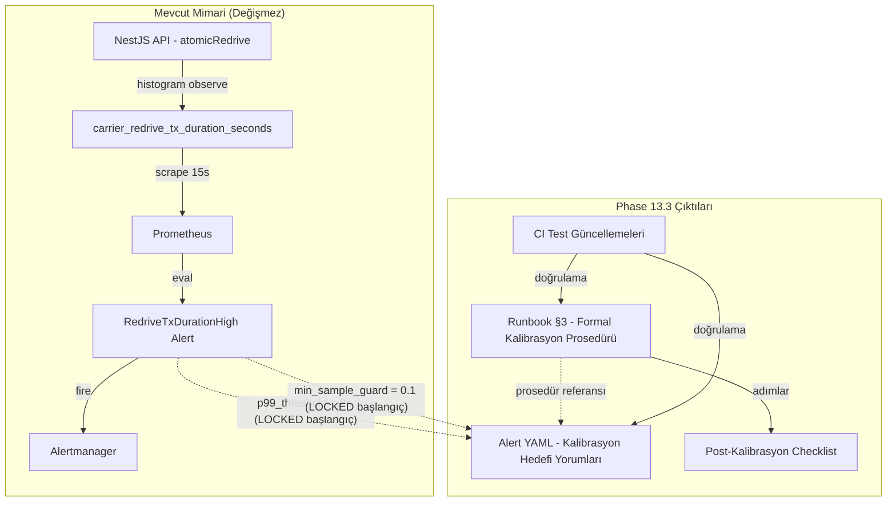
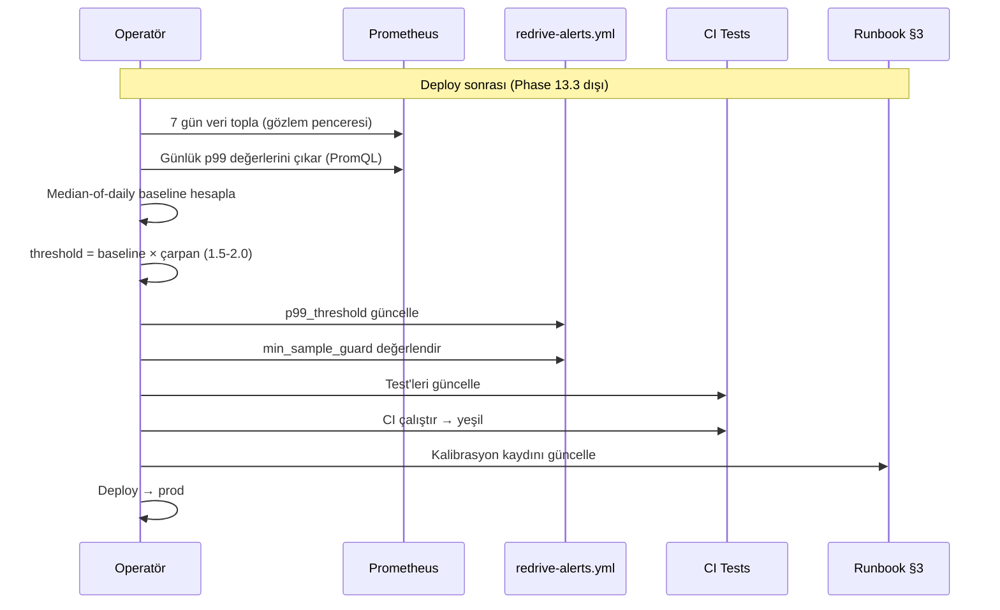

# Tasarım Dokümanı — Phase 13.3: p99 Eşik Kalibrasyonu & Deploy Öncesi Hazırlık

## Genel Bakış

Phase 13.3, `RedriveTxDurationHigh` alert'inin p99 eşik değerini production verisine dayalı olarak kalibre etmek için formal bir prosedür oluşturur. Bu phase tamamen pre-deploy hazırlık niteliğindedir — yeni uygulama kodu yazılmaz, mevcut alert kuralları değiştirilmez. Çıktılar:

1. Runbook §3'te genişletilmiş formal kalibrasyon prosedürü
2. Alert kuralında kalibrasyon hedefi yorumları (YAML comments)
3. Post-kalibrasyon güncelleme checklist'i
4. CI test güncellemeleri

**Değişen dosyalar:**
- `docs/redrive-ops-runbook.md` — §3 genişletme
- `ops/prometheus/redrive-alerts.yml` — yalnızca YAML yorumları ekleme
- `redrive-ops-artifacts.spec.ts` — yeni test'ler ekleme

**Değişmeyen (LOCKED):**
- Alert expr, for, labels, annotations değerleri
- Alertmanager config
- Phase 11.4 / 12 metrik isimleri ve label'ları

## Mimari

Phase 13.3 yeni bir mimari bileşen eklemez. Mevcut observability zincirindeki dokümantasyon ve konfigürasyon katmanını zenginleştirir.



### Kalibrasyon Akışı (Post-Deploy — Phase 13.3 dışı, checklist ile dokümante edilir)



## Bileşenler ve Arayüzler

### Bileşen 1: Runbook §3 Kalibrasyon Prosedürü Genişletmesi

Mevcut §3 "TX Duration İzleme" bölümündeki basit 5 adımlı kalibrasyon prosedürü aşağıdaki alt bölümlerle değiştirilir:

#### Alt Bölüm Yapısı

```
§3 TX Duration İzleme
  └── 4. Deep dive
       └── Kalibrasyon Prosedürü (mevcut — genişletilecek)
            ├── Gözlem Penceresi Tanımı
            ├── Baseline Çıkarma Yöntemi
            │    ├── Günlük p99 PromQL sorgusu
            │    └── Median-of-daily hesaplama
            ├── Eşik Formülü ve Çarpan Seçimi
            │    ├── Formül: threshold = baseline × çarpan
            │    ├── Çarpan aralığı: 1.5–2.0
            │    └── Karar kriterleri tablosu
            ├── Min Sample Guard Ayarlama Rehberi
            ├── Gürültü Bastırma Kuralları
            │    └── İlk 24-48 saat hariç tutma
            ├── Ne Zaman Kalibre Edilmeli / Edilmemeli
            │    ├── Kalibrasyon tetikleyicileri
            │    └── Kalibrasyon yapılmaması gereken durumlar
            └── Post-Kalibrasyon Güncelleme Checklist'i
                 ├── Alert kuralı güncelleme adımları
                 ├── Test güncelleme adımları
                 ├── Runbook revizyon adımları
                 └── Onay/rollback adımları
```

#### Tasarım Kararları

**K1: Çarpan aralığı 1.5–2.0 (mevcut "× 3" yerine)**

Mevcut runbook "baseline × 3" öneriyor. Bu çok geniş bir marj — gerçek sorunları geç yakalama riski taşır. 1.5–2.0 aralığı:
- 1.5×: Düşük trafik, stabil ortam — daha hassas algılama
- 2.0×: Yüksek trafik, değişken ortam — daha fazla tolerans
- Karar kriteri: trafik hacmi, varyans, false positive geçmişi

**K2: Baseline yöntemi — p99 median-of-daily (tek p99 yerine)**

Tek bir 7 günlük p99 değeri outlier'lara duyarlıdır. Median-of-daily:
1. Her gün için ayrı p99 hesapla (7 değer)
2. Bu 7 değerin medyanını al
3. Outlier günler (deploy, incident) medyanı etkilemez

**K3: Gözlem penceresi — 7 gün**

7 gün, hafta içi/hafta sonu trafik pattern farklılıklarını yakalar. Daha kısa pencere (3 gün) hafta sonu pattern'ini kaçırabilir. Daha uzun pencere (14 gün) gereksiz gecikme yaratır.

**K4: Gürültü bastırma — ilk 24-48 saat**

Deploy sonrası cold start, cache warming, JIT compilation etkileri p99'u geçici olarak yükseltir. Bu süre baseline'dan hariç tutulmalıdır. 24 saat minimum, 48 saat güvenli marj.

**K5: Min sample guard tuning**

Mevcut `0.1 req/s` (5 dk'da ~30 gözlem) başlangıç değeridir. Gerçek trafik hacmine göre:
- Çok düşük trafik (< 0.05 req/s): Guard'ı düşür, yoksa alert hiç tetiklenmez
- Yüksek trafik (> 1 req/s): Guard yeterli, değiştirmeye gerek yok

### Bileşen 2: Alert Kuralı Kalibrasyon Yorumları

`RedriveTxDurationHigh` alert'inin mevcut YAML yorumlarına kalibrasyon hedefi bilgisi eklenir. Mevcut yorum bloğu:

```yaml
# Alert 2: RedriveTxDurationHigh
# atomicRedrive tx p99 süresi eşiği aştı — DB contention/lock-wait olabilir
# Başlangıç eşiği 2s (muhafazakâr) — kalibrasyon prosedürüne göre ayarlanmalıdır.
# Min sample guard: 5 dk'da ~30 gözlem minimum (0.1 req/s × 300s)
```

Genişletilmiş yorum bloğu:

```yaml
# Alert 2: RedriveTxDurationHigh
# atomicRedrive tx p99 süresi eşiği aştı — DB contention/lock-wait olabilir
# Başlangıç eşiği 2s (muhafazakâr) — kalibrasyon prosedürüne göre ayarlanmalıdır.
# Min sample guard: 5 dk'da ~30 gözlem minimum (0.1 req/s × 300s)
#
# ── Kalibrasyon Hedefleri ──────────────────────────────────────────
# p99_threshold  = 2    (LOCKED başlangıç — post-deploy kalibrasyonla güncellenir)
# min_sample_guard = 0.1  (LOCKED başlangıç — trafik hacmine göre ayarlanır)
# Kalibrasyon prosedürü: docs/redrive-ops-runbook.md#3-tx-duration-i̇zleme
# ───────────────────────────────────────────────────────────────────
```

**Kısıtlama:** `expr`, `for`, `labels`, `annotations` değerleri DEĞİŞMEZ. Yalnızca YAML yorumları eklenir.

### Bileşen 3: Post-Kalibrasyon Güncelleme Checklist'i

Runbook §3'e eklenen checklist, deploy sonrası kalibrasyon tamamlandığında yapılması gereken tüm adımları kapsar:

| # | Adım | Dosya/Konum | Detay |
|---|------|-------------|-------|
| 1 | Yeni eşik değerini hesapla | — | `threshold = baseline × çarpan` |
| 2 | Alert kuralını güncelle | `ops/prometheus/redrive-alerts.yml` | `> 2` → `> <yeni_eşik>` |
| 3 | Min sample guard'ı değerlendir | `ops/prometheus/redrive-alerts.yml` | `> 0.1` → gerekirse güncelle |
| 4 | YAML yorumlarını güncelle | `ops/prometheus/redrive-alerts.yml` | Kalibrasyon hedefi değerlerini güncelle |
| 5 | Test'leri güncelle | `redrive-ops-artifacts.spec.ts` | Eşik değerine bağlı test varsa güncelle |
| 6 | CI çalıştır | — | `npx jest --testPathPattern="redrive-ops-artifacts" --no-coverage` |
| 7 | Runbook'u güncelle | `docs/redrive-ops-runbook.md` | Kalibrasyon tarihini ve yeni değerleri kaydet |
| 8 | PR oluştur ve review al | — | Değişiklikleri review'a gönder |
| 9 | Deploy | — | CI yeşil → prod deploy |
| 10 | Rollback planı | — | False positive artarsa eski değerlere geri dön |

### Bileşen 4: CI Test Güncellemeleri

Mevcut `redrive-ops-artifacts.spec.ts` dosyasına (76 test) yeni test'ler eklenir. Yeni test'ler kalibrasyon prosedürünün varlığını ve tutarlılığını doğrular.

**Yeni test grupları:**

1. **Kalibrasyon prosedürü varlık testi** — Runbook §3'te formal kalibrasyon prosedürünün tüm alt bölümlerinin mevcut olduğunu doğrular
2. **Alert kalibrasyon yorumu testi** — `RedriveTxDurationHigh` alert'inde kalibrasyon hedefi yorumlarının mevcut olduğunu doğrular
3. **Post-kalibrasyon checklist testi** — Checklist'in tüm gerekli adımları içerdiğini doğrular

**Test'lerin doğrulamadığı şeyler:**
- Eşik değerlerinin kendisi (deploy sonrası değişecek)
- PromQL sorgularının doğruluğu (Prometheus'a bağımlı)

## Veri Modelleri

Bu phase yeni veri modeli tanımlamaz. Mevcut yapılar:

### Kalibrasyon Hedefi Parametreleri

| Parametre | Mevcut Değer | Konum | Açıklama |
|-----------|-------------|-------|----------|
| `p99_threshold` | `2` (saniye) | `redrive-alerts.yml` expr: `> 2` | p99 eşik değeri |
| `min_sample_guard` | `0.1` (req/s) | `redrive-alerts.yml` expr: `> 0.1` | Minimum gözlem hızı |

### Çarpan Karar Matrisi

| Kriter | 1.5× | 1.75× | 2.0× |
|--------|------|-------|------|
| Trafik hacmi | Düşük-orta | Orta | Yüksek |
| p99 varyansı | Düşük (stabil) | Orta | Yüksek (değişken) |
| False positive geçmişi | Yok | Az | Sık |
| Ortam stabilitesi | Stabil | Normal | Değişken |


## Doğruluk Özellikleri (Correctness Properties)

*Bir özellik (property), bir sistemin tüm geçerli yürütmelerinde doğru olması gereken bir davranış veya karakteristiktir — esasen, sistemin ne yapması gerektiğine dair formal bir ifadedir. Özellikler, insan tarafından okunabilir spesifikasyonlar ile makine tarafından doğrulanabilir doğruluk garantileri arasındaki köprüdür.*

### Prework Analizi Özeti

Bu phase ağırlıklı olarak dokümantasyon ve konfigürasyon odaklıdır. Kabul kriterlerinin çoğu belirli içerik varlığını doğrulayan example-based testlerdir. Tek gerçek property, alert kuralı değerlerinin LOCKED kalmasıdır.

Konsolidasyon sonrası 4 test grubu belirlendi:
1. Kalibrasyon prosedürü tamlık kontrolü (example — 1.1-1.6, 2.1-2.3, 3.1-3.4 kapsar)
2. Alert kuralı değerleri LOCKED invariantı (property — 4.3 kapsar)
3. Alert kalibrasyon yorumları varlık kontrolü (example — 4.1, 4.2, 4.4 kapsar)
4. Post-kalibrasyon checklist tamlık kontrolü (example — 5.1-5.4 kapsar)

### Property 1: Alert Kuralı Değerleri LOCKED İnvariantı

*For any* alert rule in `redrive-alerts.yml`, the `expr`, `for`, `labels`, and `annotations` values SHALL remain identical to the known LOCKED values from Phase 13. Phase 13.3 yalnızca YAML yorumları ekler — hiçbir alert kuralının yapısal değeri değişmez.

**Validates: Requirements 4.3**

Bu, 5 alert kuralının tamamı için geçerli bir invarianttır. Bilinen LOCKED değerler test'te sabit olarak tanımlanır ve her alert için karşılaştırma yapılır.

### Property 2: Kalibrasyon Prosedürü Tamlık Kontrolü

*For any* valid runbook §3 content, the calibration procedure section SHALL contain all required sub-sections: observation window definition, baseline extraction method (median-of-daily), threshold formula, multiplier decision criteria (1.5–2.0), noise suppression rules (24-48 saat), calibration triggers, "when not to calibrate" criteria, min sample guard tuning guidance, and PromQL queries.

**Validates: Requirements 1.1, 1.2, 1.3, 1.4, 1.5, 1.6, 2.1, 2.2, 2.3, 3.1, 3.2, 3.3, 3.4**

Not: Bu bir example-based test olarak implemente edilir — runbook sabit bir doküman olduğu için property-based testing uygulanmaz.

### Property 3: Alert Kalibrasyon Yorumları Varlık Kontrolü

*For any* `RedriveTxDurationHigh` alert block in the raw YAML text, calibration target comments SHALL be present indicating: `p99_threshold` and `min_sample_guard` as LOCKED starting values, and a reference to the runbook §3 calibration procedure.

**Validates: Requirements 4.1, 4.2, 4.4**

### Property 4: Post-Kalibrasyon Checklist Tamlık Kontrolü

*For any* valid runbook §3 content, the post-calibration update checklist SHALL contain steps for: alert rule change (with file path), test update (with file path), CI validation, runbook revision, and rollback procedure.

**Validates: Requirements 5.1, 5.2, 5.3, 5.4**

## Hata Yönetimi

Bu phase yeni uygulama kodu içermediğinden runtime hata yönetimi yoktur. Olası hatalar:

| Hata Senaryosu | Etki | Önlem |
|----------------|------|-------|
| YAML yorum ekleme sırasında syntax bozulması | Alert kuralları parse edilemez | CI test'leri YAML parse kontrolü yapar (mevcut test'ler) |
| Runbook markdown formatting hatası | Anchor link'ler kırılır | Mevcut bidirectional link test'leri yakalar |
| Checklist'te eksik adım | Post-kalibrasyon sırasında adım atlanır | Property 4 test'i tamlık kontrolü yapar |
| Eski "× 3" çarpanının kaldırılmaması | Çelişkili bilgi | Test, eski çarpanın kaldırıldığını doğrular |

## Test Stratejisi

### Dual Test Yaklaşımı

- **Unit test'ler**: Belirli içerik varlığı, yapısal kontroller, edge case'ler
- **Property test'ler**: Alert kuralı LOCKED invariantı (tüm 5 alert üzerinde)

Bu phase'de property-based testing sınırlıdır çünkü çıktılar ağırlıklı olarak statik dokümantasyon ve konfigürasyondur. Tek gerçek property, alert kuralı değerlerinin değişmemesidir.

### Test Konfigürasyonu

- **Framework:** Jest (mevcut)
- **Dosya:** `redrive-ops-artifacts.spec.ts` — mevcut dosyaya ekleme
- **Çalıştırma:** `npx jest --testPathPattern="redrive-ops-artifacts" --no-coverage`
- **Konum:** `HUKUK_YAZILIMI/project/apps/api` dizininden çalıştırılır

### Test Grupları

#### Grup 1: Kalibrasyon Prosedürü Tamlık (Unit Test)
- Runbook §3'te formal kalibrasyon prosedürü alt bölümlerinin varlığı
- Gözlem penceresi (7 gün) referansı
- Baseline yöntemi (median-of-daily) referansı
- Çarpan aralığı (1.5–2.0) referansı
- Gürültü bastırma (24-48 saat) referansı
- Kalibrasyon tetikleyicileri ve "ne zaman yapılmamalı" bölümleri
- PromQL sorgu bloklarının varlığı
- Eski "× 3" çarpanının kaldırıldığının doğrulanması
- **Tag:** Feature: phase-13-3-p99-calibration-procedure, Property 2: Kalibrasyon Prosedürü Tamlık

#### Grup 2: Alert Kuralı LOCKED İnvariantı (Property Test)
- 5 alert kuralının expr, for, labels, annotations değerlerinin LOCKED değerlerle eşleşmesi
- Minimum 100 iterasyon (sabit veri üzerinde — her iterasyonda aynı kontrol)
- **Tag:** Feature: phase-13-3-p99-calibration-procedure, Property 1: Alert Kuralı Değerleri LOCKED İnvariantı

Not: Bu test sabit veri üzerinde çalıştığı için property-based testing'in randomizasyon avantajı sınırlıdır. Ancak invariant doğası gereği property olarak ifade edilir ve her alert üzerinde döngüsel olarak doğrulanır.

#### Grup 3: Alert Kalibrasyon Yorumları (Unit Test)
- `RedriveTxDurationHigh` alert bloğunda kalibrasyon hedefi yorumlarının varlığı
- `p99_threshold` ve `min_sample_guard` anahtar kelimelerinin yorum satırlarında bulunması
- LOCKED başlangıç değeri referansı
- Runbook §3 referansı
- **Tag:** Feature: phase-13-3-p99-calibration-procedure, Property 3: Alert Kalibrasyon Yorumları

#### Grup 4: Post-Kalibrasyon Checklist Tamlık (Unit Test)
- Checklist'in runbook §3'te mevcut olması
- Alert kuralı güncelleme adımı ve dosya yolu
- Test güncelleme adımı ve dosya yolu
- CI doğrulama adımı
- Rollback prosedürü
- **Tag:** Feature: phase-13-3-p99-calibration-procedure, Property 4: Post-Kalibrasyon Checklist Tamlık
