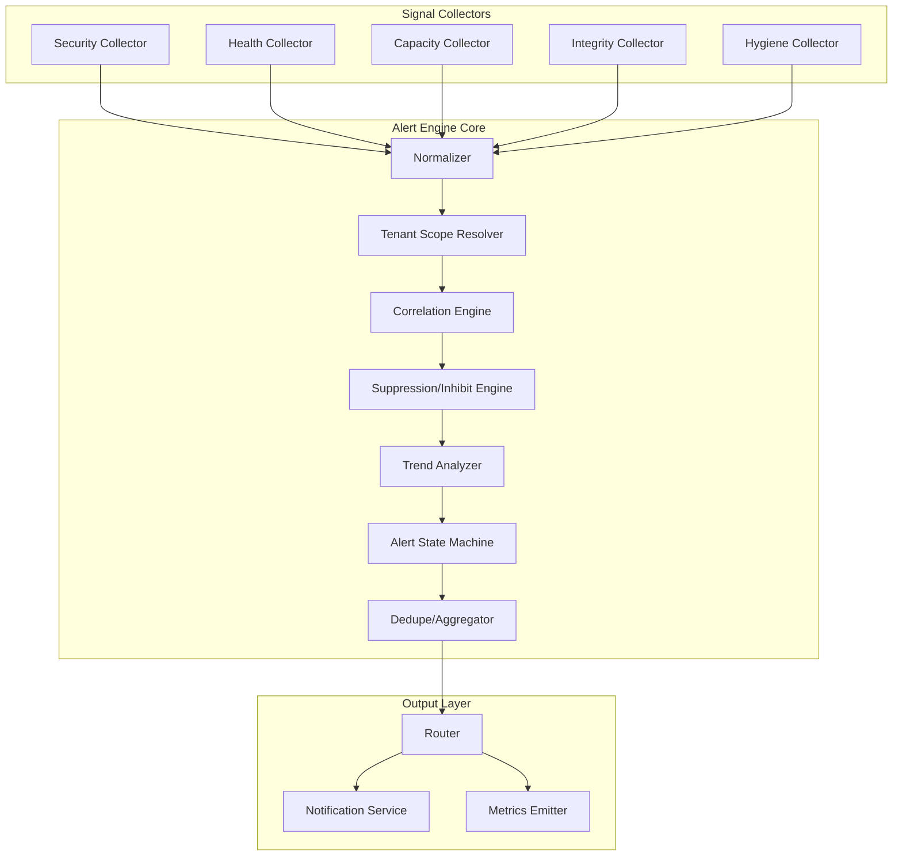
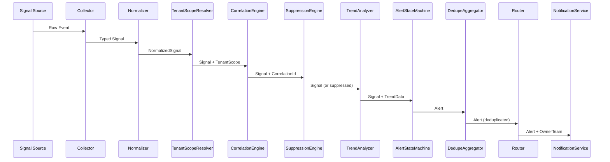

# Tasarım Dokümanı: Production Alerting System

## Genel Bakış

Bu doküman, calc-preview modülü için kapsamlı bir üretim uyarı sistemi tasarımını tanımlar. Sistem, circuit breaker DEGRADED modu, break-glass cross-tenant erişim, JTI anomali tespiti ve manuel reset işlevselliği için akıllı uyarı yönetimi sağlar.

**Temel Prensipler:**
- Alert ≠ log. Loglar çoktur, alertler azdır.
- Her alert bir aksiyon tetiklemeli. Aksiyon yoksa alert yok.
- DEGRADED bir hata değil, kontrollü hasar modudur.

## Mimari

### Sistem Mimarisi Diyagramı



### Veri Akış Diyagramı



## Bileşenler ve Arayüzler

### 1. Signal Collectors

Her collector belirli bir sinyal kaynağından olayları toplar:

```typescript
/**
 * Signal Collector Interface
 * Her collector bu interface'i implement eder
 */
interface ISignalCollector {
  readonly collectorType: SignalCollectorType;
  
  /**
   * Sinyal kaynağını dinlemeye başlar
   */
  start(): Promise<void>;
  
  /**
   * Sinyal kaynağını dinlemeyi durdurur
   */
  stop(): Promise<void>;
  
  /**
   * Sinyal event emitter
   */
  readonly onSignal: EventEmitter<RawSignal>;
}

type SignalCollectorType = 
  | 'security'
  | 'health'
  | 'capacity'
  | 'integrity'
  | 'hygiene';

/**
 * Security Collector
 * JTI anomali, cross-tenant erişim girişimleri
 */
interface SecuritySignal extends RawSignal {
  signalType: 'JTI_ANOMALY' | 'CROSS_TENANT_ATTEMPT' | 'CROSS_TENANT_BLOCKED';
  anomalyType?: 'HIGH_USAGE' | 'MULTI_ACTOR';
  severity: 'HIGH' | 'MEDIUM';
  jti?: string;
  grantId?: string;
  actorCount?: number;
  targetTenantId?: string;
}

/**
 * Health Collector
 * DEGRADED modu, consecutiveFailures, manualResetRequired
 */
interface HealthSignal extends RawSignal {
  signalType: 'DEGRADED_ENTERED' | 'DEGRADED_EXITED' | 'FAILURE_RECORDED' | 'MANUAL_RESET_REQUIRED';
  component: string;
  degradedDurationMs?: number;
  consecutiveFailures?: number;
  manualResetRequired?: boolean;
}

/**
 * Capacity Collector
 * Rate limit, queue depth, CPU/Memory/FD
 */
interface CapacitySignal extends RawSignal {
  signalType: 'RATE_LIMIT_EXHAUSTED' | 'QUEUE_DEPTH_HIGH' | 'RESOURCE_HIGH';
  resourceType?: 'cpu' | 'memory' | 'fd';
  currentValue: number;
  threshold: number;
  tenantId?: string;
  limitKey?: string;
  queueName?: string;
}

/**
 * Integrity Collector
 * Audit trail yazma hataları, status endpoint uyumsuzluğu
 */
interface IntegritySignal extends RawSignal {
  signalType: 'AUDIT_WRITE_FAILURE' | 'STATUS_MISMATCH';
  component: string;
  expectedState?: string;
  actualState?: string;
  errorMessage?: string;
}

/**
 * Hygiene Collector
 * Validasyon hata spike'ları
 */
interface HygieneSignal extends RawSignal {
  signalType: 'VALIDATION_ERROR_SPIKE';
  errorType: string;
  errorCount: number;
  windowMs: number;
  threshold: number;
}
```

### 2. Normalizer

Tüm sinyalleri tek formata çevirir:

```typescript
/**
 * NormalizedSignal - Tüm sinyallerin ortak formatı
 */
interface NormalizedSignal {
  /** Unique signal ID */
  signalId: string;
  
  /** Signal timestamp (ISO 8601) */
  timestamp: string;
  
  /** Source component */
  component: string;
  
  /** Tenant ID (optional - global signals have no tenant) */
  tenantId?: string;
  
  /** Signal type */
  signalType: string;
  
  /** Signal category */
  category: AlertCategory;
  
  /** Dimensions for alertKey generation */
  dimensions: Record<string, string | number>;
  
  /** Raw severity hint from collector */
  rawSeverityHint?: AlertSeverity;
  
  /** Evidence reference (audit trail pointer) */
  evidenceRef?: string;
  
  /** Original raw signal */
  rawSignal: RawSignal;
}

type AlertCategory = 'SECURITY' | 'AVAILABILITY' | 'CAPACITY' | 'INTEGRITY' | 'HYGIENE';
type AlertSeverity = 'P0' | 'P1' | 'P2' | 'P3';
```

### 3. Tenant Scope Resolver

Uyarının etki alanını belirler:

```typescript
/**
 * TenantScopeResolver
 * Gereksinim 10: Tenant Kapsamı Belirleme
 */
interface ITenantScopeResolver {
  /**
   * Sinyal için tenant scope belirler
   */
  resolve(signal: NormalizedSignal): TenantScope;
  
  /**
   * Multi-tenant window'u günceller
   */
  recordSignal(alertType: string, tenantId: string): void;
  
  /**
   * Global tetikleyici mi kontrol eder
   */
  isGlobalTrigger(signal: NormalizedSignal): boolean;
}

type TenantScope = 'single_tenant' | 'multi_tenant' | 'global';

interface TenantScopeConfig {
  /** Multi-tenant için minimum tenant sayısı (varsayılan: 3) */
  multiTenantMinTenants: number;
  
  /** Multi-tenant window süresi (varsayılan: 5 dakika) */
  multiTenantWindowMs: number;
  
  /** Global tetikleyici signal type'ları */
  globalTriggerTypes: string[];
}

const DEFAULT_TENANT_SCOPE_CONFIG: TenantScopeConfig = {
  multiTenantMinTenants: 3,
  multiTenantWindowMs: 5 * 60 * 1000, // 5 dakika
  globalTriggerTypes: [
    'AUDIT_WRITE_FAILURE',
    'CROSS_TENANT_ATTEMPT',
    'CROSS_TENANT_BLOCKED',
    'GLOBAL_DEGRADED',
  ],
};
```

### 4. Correlation Engine

İlişkili uyarıları gruplandırır:

```typescript
/**
 * CorrelationEngine
 * Gereksinim 13: Korelasyon ID Yönetimi
 */
interface ICorrelationEngine {
  /**
   * Sinyal için correlationId üretir
   */
  generateCorrelationId(signal: NormalizedSignal): string;
  
  /**
   * İlişkili incident ID'leri bulur
   */
  findRelatedIncidents(correlationId: string): string[];
  
  /**
   * Correlation kaydı ekler
   */
  recordCorrelation(correlationId: string, incidentId: string): void;
}

/**
 * CorrelationId üretim kuralları (deterministik)
 * 
 * Formül: hash(rootDimension + windowBucket(5m) + componentCluster)
 * 
 * rootDimension örnekleri:
 * - dependency/service/outage id
 * - deploy id
 * - region id
 */
function generateCorrelationId(
  rootDimension: string,
  timestamp: string,
  componentCluster: string,
): string {
  const windowBucket = Math.floor(new Date(timestamp).getTime() / (5 * 60 * 1000));
  const data = `${rootDimension}:${windowBucket}:${componentCluster}`;
  return deterministicHash(data);
}
```

### 5. Suppression/Inhibit Engine

Bastırma ve inhibit kurallarını uygular:

```typescript
/**
 * SuppressionEngine
 * Gereksinim 17: Inhibit/Suppression Kuralları
 */
interface ISuppressionEngine {
  /**
   * Sinyal bastırılmalı mı kontrol eder
   */
  shouldSuppress(signal: NormalizedSignal): SuppressionResult;
  
  /**
   * Maintenance mode durumunu günceller
   */
  setMaintenanceMode(enabled: boolean): void;
  
  /**
   * Parent alert kaydeder (child inhibit için)
   */
  recordParentAlert(alertId: string, alertType: string): void;
  
  /**
   * Parent alert çözümler
   */
  resolveParentAlert(alertId: string): void;
}

interface SuppressionResult {
  /** Bastırılmalı mı */
  suppressed: boolean;
  
  /** Bastırma nedeni */
  reason?: SuppressionReason;
  
  /** Severity clamp uygulandı mı */
  severityClamped?: boolean;
  
  /** Clamp sonrası severity */
  clampedSeverity?: AlertSeverity;
  
  /** Maintenance context */
  maintenanceContext?: boolean;
  
  /** Parent alert ID (inhibit durumunda) */
  suppressedBy?: string;
}

type SuppressionReason = 
  | 'maintenance_clamp'
  | 'parent_inhibit'
  | 'cooldown_active'
  | 'dedupe_window';

/**
 * Suppression Kuralları (Gereksinim 17)
 * 
 * 1. Maintenance clamp:
 *    - maintenanceMode=true VE category ∈ {CAPACITY, AVAILABILITY}
 *    - severity = min(severity, P2)
 *    - maintenanceContext=true
 *    - SUSTURMA YOK, sadece clamp
 * 
 * 2. SECURITY:
 *    - Hiçbir koşulda suppress edilmez
 *    - Sadece dedupe/aggregate uygulanır
 * 
 * 3. Parent-child inhibit:
 *    - GLOBAL_OUTAGE_ACTIVE OPEN ise
 *    - Tenant bazlı CAPACITY/AVAILABILITY alertleri suppress
 *    - suppressionContext.suppressedBy = globalIncidentId
 */
```

### 6. Trend Analyzer

Failure trend ve burn rate hesaplar:

```typescript
/**
 * TrendAnalyzer
 * Gereksinim 18: SLO/Latency Tabanlı Trend Tanımı
 */
interface ITrendAnalyzer {
  /**
   * Failure trend hesaplar
   */
  analyzeFailureTrend(component: string, tenantId?: string): TrendResult;
  
  /**
   * Burn rate hesaplar
   */
  calculateBurnRate(sloName: string, tenantId?: string): BurnRateResult;
  
  /**
   * Sample kaydeder
   */
  recordSample(component: string, tenantId: string | undefined, success: boolean): void;
}

interface TrendResult {
  /** Trend mevcut mu */
  hasTrend: boolean;
  
  /** Failure rate (0-1) */
  failureRate: number;
  
  /** Slope (pozitif = artış, negatif = azalış) */
  slope: number;
  
  /** Sample sayısı */
  sampleCount: number;
  
  /** İstatistiksel olarak anlamlı mı */
  statisticallySignificant: boolean;
  
  /** Window başlangıç zamanı */
  windowStart: string;
  
  /** Window bitiş zamanı */
  windowEnd: string;
}

interface BurnRateResult {
  /** Burn rate (errorRate / allowedErrorRate) */
  burnRate: number;
  
  /** SLO hedefi */
  sloTarget: number;
  
  /** Mevcut değer */
  currentValue: number;
  
  /** Kalan budget (%) */
  remainingBudget: number;
}

interface TrendAnalyzerConfig {
  /** Rolling window süresi (varsayılan: 5 dakika) */
  windowMs: number;
  
  /** Slope eşiği */
  slopeThreshold: number;
  
  /** Minimum sample sayısı (varsayılan: 10) */
  minSampleCount: number;
  
  /** Failure rate eşiği (%) */
  failureRateThreshold: number;
}

const DEFAULT_TREND_CONFIG: TrendAnalyzerConfig = {
  windowMs: 5 * 60 * 1000, // 5 dakika
  slopeThreshold: 0.1,
  minSampleCount: 10,
  failureRateThreshold: 5, // %5
};

/**
 * Trend Hesaplama Algoritması (Deterministik)
 * 
 * 1. Rolling window içindeki sample'ları al
 * 2. failureRate = failures / totalSamples
 * 3. slope = linear regression slope
 *    - Basit yaklaşım: (son 1dk avg - ilk 1dk avg) / window
 * 4. statisticallySignificant = sampleCount >= minSampleCount
 * 5. hasTrend = failureRate > threshold VE slope > slopeThreshold VE statisticallySignificant
 */
```

### 7. Alert State Machine

Alert yaşam döngüsünü yönetir:

```typescript
/**
 * AlertStateMachine
 * Gereksinim 8: Kurtarma Uyarıları
 * Gereksinim 9: Flapping Tespiti
 */
interface IAlertStateMachine {
  /**
   * Yeni alert oluşturur veya mevcut alert'i günceller
   */
  processSignal(signal: NormalizedSignal, context: AlertContext): Alert;
  
  /**
   * Alert'i çözümler
   */
  resolveAlert(alertId: string, resolution: AlertResolution): Alert;
  
  /**
   * Flapping durumunu kontrol eder
   */
  checkFlapping(component: string): FlappingResult;
}

type AlertStatus = 'OPEN' | 'ACKNOWLEDGED' | 'RESOLVED';

interface Alert {
  /** Unique alert ID */
  alertId: string;
  
  /** Alert type */
  alertType: string;
  
  /** Alert category */
  category: AlertCategory;
  
  /** Alert severity */
  severity: AlertSeverity;
  
  /** Owner team */
  ownerTeam: OwnerTeam;
  
  /** Tenant scope */
  tenantScope: TenantScope;
  
  /** Tenant ID (single_tenant ise) */
  tenantId?: string;
  
  /** Alert key (dedupe key) */
  alertKey: string;
  
  /** Correlation ID */
  correlationId: string;
  
  /** Incident ID */
  incidentId: string;
  
  /** Recommendation */
  recommendation: string;
  
  /** Runbook reference */
  runbookRef: string;
  
  /** Created timestamp */
  createdAt: string;
  
  /** Updated timestamp */
  updatedAt: string;
  
  /** Resolved timestamp */
  resolvedAt?: string;
  
  /** Alert status */
  status: AlertStatus;
  
  /** Maintenance context */
  maintenanceContext?: boolean;
  
  /** Suppression context */
  suppressionContext?: {
    suppressedBy: string;
    parentIncidentId: string;
  };
  
  /** Related incident IDs */
  relatedIncidentIds: string[];
}

type OwnerTeam = 'SecOps' | 'Platform/SRE' | 'Data/Platform' | 'Product/Backend';

interface AlertResolution {
  /** Resolution reason */
  reason: ResolutionReason;
  
  /** Root cause hint */
  rootCauseHint?: string;
  
  /** Resolved by (actor ID) */
  resolvedBy?: string;
}

type ResolutionReason = 'auto_recovery' | 'manual_reset' | 'timeout';

/**
 * Flapping Detection
 * Gereksinim 9
 * 
 * flap = HEALTHY→DEGRADED→HEALTHY cycle
 * Window: rolling 60 dakika
 * >= 3 flap/60m → P2 + "kök neden araştırın"
 * >= 5 flap/60m → P1 + RCA trigger
 */
interface FlappingResult {
  /** Flapping tespit edildi mi */
  isFlapping: boolean;
  
  /** Flap sayısı (son 60 dakika) */
  flapCount: number;
  
  /** Önerilen severity */
  suggestedSeverity?: AlertSeverity;
  
  /** RCA tetiklenmeli mi */
  triggerRca: boolean;
  
  /** Öneri */
  recommendation?: string;
}

interface FlappingConfig {
  /** P2 eşiği (varsayılan: 3) */
  flapP2ThresholdPerHour: number;
  
  /** P1 eşiği (varsayılan: 5) */
  flapP1ThresholdPerHour: number;
  
  /** Window süresi (varsayılan: 60 dakika) */
  windowMs: number;
}

const DEFAULT_FLAPPING_CONFIG: FlappingConfig = {
  flapP2ThresholdPerHour: 3,
  flapP1ThresholdPerHour: 5,
  windowMs: 60 * 60 * 1000, // 60 dakika
};
```

### 8. Dedupe/Aggregator

Uyarı deduplikasyonu ve agregasyonu:

```typescript
/**
 * DedupeAggregator
 * Gereksinim 12: Cooldown Süresi Yönetimi
 * Gereksinim 16: Gürültü Önleme Kuralları
 */
interface IDedupeAggregator {
  /**
   * Alert dedupe kontrolü yapar
   */
  shouldDedupe(alert: Alert): DedupeResult;
  
  /**
   * Cooldown kaydı ekler
   */
  recordCooldown(alertKey: string, resolvedAt: string): void;
  
  /**
   * Cooldown aktif mi kontrol eder
   */
  isCooldownActive(alertKey: string): boolean;
}

interface DedupeResult {
  /** Dedupe edilmeli mi */
  deduplicated: boolean;
  
  /** Dedupe nedeni */
  reason?: 'same_alert_window' | 'cooldown_active' | 'flapping_aggregation';
  
  /** Mevcut alert ID (dedupe durumunda) */
  existingAlertId?: string;
}

/**
 * AlertKey Üretim Kuralları (Deterministik)
 * 
 * Formül: hash(alertType + tenantScope + primaryDimension + component)
 * 
 * primaryDimension örnekleri:
 * - rate limit: tenantId + limitKey
 * - queue: queueName
 * - degraded: serviceName
 * - security anomaly: anomalyKind + jtiBucket
 */
function generateAlertKey(
  alertType: string,
  tenantScope: TenantScope,
  primaryDimension: string,
  component: string,
): string {
  const data = `${alertType}:${tenantScope}:${primaryDimension}:${component}`;
  return deterministicHash(data);
}

interface DedupeConfig {
  /** Dedupe window süresi (varsayılan: 15 dakika) */
  dedupeWindowMs: number;
  
  /** Cooldown süresi (varsayılan: 30 dakika) */
  cooldownAfterResolveMs: number;
}

const DEFAULT_DEDUPE_CONFIG: DedupeConfig = {
  dedupeWindowMs: 15 * 60 * 1000, // 15 dakika
  cooldownAfterResolveMs: 30 * 60 * 1000, // 30 dakika
};
```

### 9. Router

Uyarıları doğru ekiplere yönlendirir:

```typescript
/**
 * AlertRouter
 * Gereksinim 11: Uyarı Sahiplik Yönlendirmesi
 */
interface IAlertRouter {
  /**
   * Alert için owner team belirler
   */
  determineOwner(alert: Alert): OwnerTeam;
  
  /**
   * Alert'i yönlendirir
   */
  route(alert: Alert): RoutingResult;
}

interface RoutingResult {
  /** Owner team */
  ownerTeam: OwnerTeam;
  
  /** Escalation policy */
  escalationPolicy: EscalationPolicy;
  
  /** Notification channels */
  channels: NotificationChannel[];
}

type EscalationPolicy = 'pager' | 'ticket' | 'log_only';
type NotificationChannel = 'slack' | 'pagerduty' | 'email' | 'webhook';

/**
 * Routing Kuralları (Gereksinim 11)
 * 
 * Category → OwnerTeam:
 * - SECURITY → SecOps
 * - AVAILABILITY → Platform/SRE
 * - CAPACITY → Platform/SRE
 * - INTEGRITY → Data/Platform
 * - HYGIENE → Product/Backend
 * 
 * Severity → EscalationPolicy:
 * - P0 → pager
 * - P1 → pager
 * - P2 → ticket
 * - P3 → log_only
 */
const CATEGORY_OWNER_MAP: Record<AlertCategory, OwnerTeam> = {
  SECURITY: 'SecOps',
  AVAILABILITY: 'Platform/SRE',
  CAPACITY: 'Platform/SRE',
  INTEGRITY: 'Data/Platform',
  HYGIENE: 'Product/Backend',
};

const SEVERITY_ESCALATION_MAP: Record<AlertSeverity, EscalationPolicy> = {
  P0: 'pager',
  P1: 'pager',
  P2: 'ticket',
  P3: 'log_only',
};
```

### 10. Incident Store

Incident yaşam döngüsünü yönetir (dedupe/correlation için kritik):

```typescript
/**
 * IncidentStore
 * Incident yaşam döngüsü yönetimi
 * 
 * In-memory başlangıç, production'da Redis/DB
 */
interface IIncidentStore {
  /**
   * Yeni incident oluşturur
   */
  create(incident: Incident): Promise<Incident>;
  
  /**
   * Incident'ı ID ile getirir
   */
  get(incidentId: string): Promise<Incident | null>;
  
  /**
   * AlertKey ile aktif incident arar
   */
  findActiveByAlertKey(alertKey: string): Promise<Incident | null>;
  
  /**
   * CorrelationId ile ilişkili incident'ları bulur
   */
  findByCorrelationId(correlationId: string): Promise<Incident[]>;
  
  /**
   * Incident'ı günceller
   */
  update(incidentId: string, updates: Partial<Incident>): Promise<Incident>;
  
  /**
   * Incident'ı çözümler
   */
  resolve(incidentId: string, resolution: IncidentResolution): Promise<Incident>;
  
  /**
   * Aktif global outage incident'ları listeler
   */
  listActiveGlobalOutages(): Promise<Incident[]>;
}

interface Incident {
  incidentId: string;
  alertKey: string;
  correlationId: string;
  alertType: string;
  category: AlertCategory;
  severity: AlertSeverity;
  tenantScope: TenantScope;
  tenantId?: string;
  status: IncidentStatus;
  createdAt: string;
  updatedAt: string;
  resolvedAt?: string;
  resolution?: IncidentResolution;
  alertCount: number; // aggregated alert count
  lastAlertAt: string;
}

type IncidentStatus = 'OPEN' | 'RESOLVED';

interface IncidentResolution {
  reason: ResolutionReason;
  rootCauseHint?: string;
  resolvedBy?: string;
  durationMs: number;
}

/**
 * In-Memory Incident Store (development/testing)
 */
class InMemoryIncidentStore implements IIncidentStore {
  private incidents = new Map<string, Incident>();
  private alertKeyIndex = new Map<string, string>(); // alertKey → incidentId
  private correlationIndex = new Map<string, Set<string>>(); // correlationId → incidentIds
  
  // ... implementation
}

/**
 * Redis Incident Store (production)
 * Keys:
 * - incident:{incidentId} - incident data
 * - incident:alertKey:{alertKey} - active incident lookup
 * - incident:correlation:{correlationId} - related incidents
 * - incident:global:active - active global outages set
 */
```

### 11. Global Outage Detector

Global outage durumunu tespit eder ve parent-child inhibit için sinyal üretir:

```typescript
/**
 * GlobalOutageDetector
 * Global outage tespiti ve yönetimi
 * 
 * Global outage kaynakları:
 * 1. Multi-tenant incident → global yükseltme (N+ tenant, M dakika)
 * 2. Kritik bağımlılık health check failure
 * 3. Manuel global outage declaration
 */
interface IGlobalOutageDetector {
  /**
   * Multi-tenant incident'ı global'e yükseltmeli mi kontrol eder
   */
  shouldEscalateToGlobal(incident: Incident): boolean;
  
  /**
   * Global outage başlatır
   */
  declareGlobalOutage(reason: GlobalOutageReason): GlobalOutage;
  
  /**
   * Global outage çözümler
   */
  resolveGlobalOutage(outageId: string): void;
  
  /**
   * Aktif global outage var mı kontrol eder
   */
  hasActiveGlobalOutage(): boolean;
  
  /**
   * Aktif global outage'ları listeler
   */
  getActiveOutages(): GlobalOutage[];
  
  /**
   * Child alert inhibit edilmeli mi kontrol eder
   */
  shouldInhibitChild(alert: Alert): InhibitResult;
}

interface GlobalOutage {
  outageId: string;
  reason: GlobalOutageReason;
  affectedCategories: AlertCategory[];
  startedAt: string;
  resolvedAt?: string;
  status: 'ACTIVE' | 'RESOLVED';
  sourceIncidentId?: string;
  declaredBy?: string;
}

type GlobalOutageReason = 
  | 'multi_tenant_escalation'
  | 'critical_dependency_down'
  | 'manual_declaration';

interface InhibitResult {
  inhibit: boolean;
  parentOutageId?: string;
  reason?: string;
}

interface GlobalOutageConfig {
  /** Multi-tenant → global için minimum tenant sayısı */
  escalationMinTenants: number; // varsayılan: 5
  
  /** Multi-tenant → global için minimum süre (ms) */
  escalationMinDurationMs: number; // varsayılan: 10 dakika
  
  /** Kritik bağımlılıklar listesi */
  criticalDependencies: string[];
  
  /** Child inhibit için etkilenen kategoriler */
  inhibitCategories: AlertCategory[]; // varsayılan: ['CAPACITY', 'AVAILABILITY']
}

const DEFAULT_GLOBAL_OUTAGE_CONFIG: GlobalOutageConfig = {
  escalationMinTenants: 5,
  escalationMinDurationMs: 10 * 60 * 1000, // 10 dakika
  criticalDependencies: ['audit-store', 'policy-engine', 'rate-limiter'],
  inhibitCategories: ['CAPACITY', 'AVAILABILITY'],
};

/**
 * Global Outage Escalation Kuralları:
 * 
 * 1. Multi-tenant escalation:
 *    - tenantScope=multi_tenant
 *    - affectedTenants >= escalationMinTenants
 *    - duration >= escalationMinDurationMs
 *    → GLOBAL_OUTAGE_ACTIVE
 * 
 * 2. Critical dependency down:
 *    - dependency ∈ criticalDependencies
 *    - health check failed
 *    → GLOBAL_OUTAGE_ACTIVE
 * 
 * 3. Manual declaration:
 *    - Ops tarafından manuel tetikleme
 *    → GLOBAL_OUTAGE_ACTIVE
 */
```

### 12. Clock Interface

Test edilebilirlik için zaman soyutlaması:

```typescript
/**
 * Clock Interface
 * Tüm zaman hesaplamaları bu interface üzerinden yapılır
 * 
 * Test edilebilirlik için kritik:
 * - Rolling window hesaplamaları
 * - Cooldown süreleri
 * - Flap/hour hesaplamaları
 * - Trend window'ları
 */
interface IClock {
  /**
   * Şu anki zaman (ms)
   */
  nowMs(): number;
  
  /**
   * Şu anki zaman (ISO 8601)
   */
  nowIso(): string;
  
  /**
   * Window bucket hesaplar (5 dakikalık bucket'lar için)
   */
  windowBucket(windowMs: number): number;
}

/**
 * System Clock (production)
 */
class SystemClock implements IClock {
  nowMs(): number {
    return Date.now();
  }
  
  nowIso(): string {
    return new Date().toISOString();
  }
  
  windowBucket(windowMs: number): number {
    return Math.floor(this.nowMs() / windowMs);
  }
}

/**
 * Fake Clock (testing)
 * Zaman kontrolü için
 */
class FakeClock implements IClock {
  private currentTime: number;
  
  constructor(initialTime: number = 0) {
    this.currentTime = initialTime;
  }
  
  nowMs(): number {
    return this.currentTime;
  }
  
  nowIso(): string {
    return new Date(this.currentTime).toISOString();
  }
  
  windowBucket(windowMs: number): number {
    return Math.floor(this.currentTime / windowMs);
  }
  
  /**
   * Zamanı ilerletir
   */
  advance(ms: number): void {
    this.currentTime += ms;
  }
  
  /**
   * Zamanı belirli bir değere ayarlar
   */
  setTime(ms: number): void {
    this.currentTime = ms;
  }
}

/**
 * Clock kullanım kuralları:
 * 
 * 1. Tüm bileşenler constructor'da IClock alır
 * 2. Date.now() veya new Date() YASAK (doğrudan kullanım)
 * 3. Test'lerde FakeClock inject edilir
 * 4. Production'da SystemClock inject edilir
 */
```

### 13. Notification Service Contract

Güvenli bildirim teslimi için kontrat:

```typescript
/**
 * Notification Service Contract
 * 
 * Delivery Semantics: AT-LEAST-ONCE
 * - Her bildirim en az bir kez teslim edilir
 * - Duplicate'lar idempotency key ile handle edilir
 * - Receiver tarafında idempotent işlem beklenir
 * 
 * Failure Handling:
 * - Notification failure → metric emit (notification_delivery_failed)
 * - Notification failure → P2 internal alert DEĞİL (cascade önleme)
 * - Dead letter queue → manual review
 */
interface INotificationService {
  /**
   * Bildirim gönderir
   * 
   * @returns NotificationResult
   * @throws NEVER - hatalar result içinde döner
   */
  send(notification: NotificationRequest): Promise<NotificationResult>;
  
  /**
   * Bildirim durumunu sorgular
   */
  getStatus(notificationId: string): Promise<NotificationStatus>;
  
  /**
   * Dead letter queue'yu listeler
   */
  listDeadLetters(): Promise<DeadLetterEntry[]>;
  
  /**
   * Dead letter'ı retry eder
   */
  retryDeadLetter(entryId: string): Promise<NotificationResult>;
}

interface NotificationRequest {
  /** Idempotency key (duplicate prevention) */
  idempotencyKey: string;
  
  /** Alert payload */
  alert: AlertPayload;
  
  /** Target channels */
  channels: NotificationChannel[];
  
  /** Priority (affects retry behavior) */
  priority: 'high' | 'normal' | 'low';
}

interface NotificationResult {
  /** Notification ID */
  notificationId: string;
  
  /** Overall success */
  success: boolean;
  
  /** Per-channel results */
  channelResults: ChannelResult[];
  
  /** Retry scheduled */
  retryScheduled: boolean;
  
  /** Next retry time (if scheduled) */
  nextRetryAt?: string;
}

interface ChannelResult {
  channel: NotificationChannel;
  success: boolean;
  error?: string;
  deliveredAt?: string;
  attemptCount: number;
}

/**
 * Retry Policy
 * 
 * - Max retries: 3
 * - Backoff: exponential (1s, 2s, 4s)
 * - Retry on: network error, 5xx, timeout
 * - No retry on: 4xx (client error)
 * - After max retries: move to dead letter queue
 */
interface RetryPolicy {
  maxRetries: number;           // varsayılan: 3
  initialDelayMs: number;       // varsayılan: 1000
  maxDelayMs: number;           // varsayılan: 30000
  backoffMultiplier: number;    // varsayılan: 2
  retryableErrors: string[];    // ['NETWORK_ERROR', 'TIMEOUT', 'SERVER_ERROR']
}

const DEFAULT_RETRY_POLICY: RetryPolicy = {
  maxRetries: 3,
  initialDelayMs: 1000,
  maxDelayMs: 30000,
  backoffMultiplier: 2,
  retryableErrors: ['NETWORK_ERROR', 'TIMEOUT', 'SERVER_ERROR'],
};

/**
 * Dead Letter Entry
 */
interface DeadLetterEntry {
  entryId: string;
  notification: NotificationRequest;
  failureReason: string;
  failedAt: string;
  attemptCount: number;
  lastAttemptAt: string;
}

/**
 * Notification Failure Handling
 * 
 * 1. Notification failure → metric emit
 *    - notification_delivery_failed{channel, error_type}
 * 
 * 2. Notification failure → P2 alert DEĞİL
 *    - Cascade önleme: alert sistemi kendi kendini alert'lemez
 *    - Sadece metric + dead letter
 * 
 * 3. Dead letter queue → manual review
 *    - Ops dashboard'da görünür
 *    - Manuel retry mümkün
 * 
 * 4. Channel unavailable → fallback
 *    - Primary channel down → secondary channel
 *    - Tüm channel'lar down → console log + metric
 */

/**
 * Idempotency Key Generation
 * 
 * Format: {alertId}:{channel}:{timestamp_bucket}
 * Bucket: 5 dakikalık window
 * 
 * Aynı alert için aynı channel'a 5 dakika içinde
 * tekrar gönderim yapılmaz (receiver tarafında dedupe)
 */
function generateIdempotencyKey(
  alertId: string,
  channel: NotificationChannel,
  timestamp: number,
): string {
  const bucket = Math.floor(timestamp / (5 * 60 * 1000));
  return `${alertId}:${channel}:${bucket}`;
}
```

## Veri Modelleri

### Alert Payload (Canonical)

```typescript
/**
 * Alert Payload
 * Gereksinim 15: Uyarı Payload Standartları
 */
interface AlertPayload {
  /** Unique alert ID */
  alertId: string;
  
  /** Incident ID */
  incidentId: string;
  
  /** Alert type */
  alertType: string;
  
  /** Alert category */
  category: AlertCategory;
  
  /** Alert severity */
  severity: AlertSeverity;
  
  /** Owner team */
  ownerTeam: OwnerTeam;
  
  /** Tenant scope */
  tenantScope: TenantScope;
  
  /** Tenant ID (single_tenant ise) */
  tenantId?: string;
  
  /** Alert key (dedupe key) */
  alertKey: string;
  
  /** Correlation ID */
  correlationId: string;
  
  /** Related incident IDs */
  relatedIncidentIds: string[];
  
  /** Recommendation */
  recommendation: string;
  
  /** Runbook link */
  runbookLink: string;
  
  /** Component */
  component: string;
  
  /** Timestamps */
  createdAt: string;
  updatedAt: string;
  resolvedAt?: string;
  
  /** Duration (ms) - resolved alerts için */
  durationMs?: number;
  
  /** Resolution info - resolved alerts için */
  resolution?: {
    reason: ResolutionReason;
    rootCauseHint?: string;
    resolvedBy?: string;
  };
  
  /** Maintenance context */
  maintenanceContext?: boolean;
  
  /** Suppression context */
  suppressionContext?: {
    suppressedBy: string;
    parentIncidentId: string;
  };
  
  /** Evidence */
  evidence?: {
    source: string;
    metric?: string;
    value: number | string;
    threshold: number | string;
    traceIds?: string[];
  };
}
```

### Configuration

```typescript
/**
 * Alerting System Configuration
 */
interface AlertingConfig {
  /** DEGRADED süre eşikleri (Gereksinim 1) */
  degraded: {
    warnAfterMs: number;      // varsayılan: 15 dakika
    pageAfterMs: number;      // varsayılan: 30 dakika
  };
  
  /** Manuel reset eşikleri (Gereksinim 2) */
  manualReset: {
    failureThreshold: number; // varsayılan: 10
    gracePeriodMs: number;    // varsayılan: 10 dakika
  };
  
  /** Tenant scope (Gereksinim 10) */
  tenantScope: TenantScopeConfig;
  
  /** Flapping (Gereksinim 9) */
  flapping: FlappingConfig;
  
  /** Trend analyzer (Gereksinim 18) */
  trend: TrendAnalyzerConfig;
  
  /** Dedupe/Cooldown (Gereksinim 12, 16) */
  dedupe: DedupeConfig;
  
  /** Capacity eşikleri (Gereksinim 5) */
  capacity: {
    rateLimitSustainedMinutes: number; // varsayılan: 5
    queueDepthHighThreshold: number;
    queueDepthCriticalThreshold: number;
    cpuHighThreshold: number;
    memoryHighThreshold: number;
    fdHighThreshold: number;
    resourceDurationMs: number;
  };
}

const DEFAULT_ALERTING_CONFIG: AlertingConfig = {
  degraded: {
    warnAfterMs: 15 * 60 * 1000,  // 15 dakika
    pageAfterMs: 30 * 60 * 1000,  // 30 dakika
  },
  manualReset: {
    failureThreshold: 10,
    gracePeriodMs: 10 * 60 * 1000, // 10 dakika
  },
  tenantScope: DEFAULT_TENANT_SCOPE_CONFIG,
  flapping: DEFAULT_FLAPPING_CONFIG,
  trend: DEFAULT_TREND_CONFIG,
  dedupe: DEFAULT_DEDUPE_CONFIG,
  capacity: {
    rateLimitSustainedMinutes: 5,
    queueDepthHighThreshold: 1000,
    queueDepthCriticalThreshold: 5000,
    cpuHighThreshold: 80,
    memoryHighThreshold: 85,
    fdHighThreshold: 90,
    resourceDurationMs: 5 * 60 * 1000, // 5 dakika
  },
};
```


## Doğruluk Özellikleri (Correctness Properties)

*Bir özellik (property), sistemin tüm geçerli yürütmelerinde doğru olması gereken bir karakteristik veya davranıştır - esasen sistemin ne yapması gerektiğine dair resmi bir ifadedir. Özellikler, insan tarafından okunabilir spesifikasyonlar ile makine tarafından doğrulanabilir doğruluk garantileri arasında köprü görevi görür.*

### Property 1: DEGRADED Süre → Severity Mapping

*For any* DEGRADED duration value, the Alert_Engine shall produce the correct severity level:
- duration = 0 (entry) → P3/info (DEGRADED_ENTERED)
- 0 < duration < 15min → no alert (log only)
- 15min ≤ duration < 30min → P2 (DEGRADED_PERSISTING)
- duration ≥ 30min → P1 (DEGRADED_PERSISTING)

**Validates: Requirements 1.1, 1.2, 1.3, 1.4**

### Property 2: Manuel Reset Kombinasyon Koşulu

*For any* system state where manualResetRequired=true, the Alert_Engine shall produce P1 alert if and only if at least one of the following conditions is also true:
- consecutiveFailures >= manualResetFailureThreshold
- degradedDuration >= degradedPageAfterMs

*For any* system state where manualResetRequired=true but neither condition is met, no P1 alert shall be produced.

**Validates: Requirements 2.1, 2.2**

### Property 3: SECURITY P0 Üretimi

*For any* security event (JTI anomaly with HIGH/MEDIUM severity OR cross-tenant access attempt including 503 blocked), the Alert_Engine shall produce a P0 severity alert with category=SECURITY.

**Validates: Requirements 3.1, 3.2**

### Property 4: SECURITY No-Suppress/No-Cooldown

*For any* alert with category=SECURITY and severity=P0:
- The alert shall never be suppressed regardless of maintenance mode
- The alert shall never be blocked by cooldown period
- The alert shall only be subject to dedupe/aggregation

**Validates: Requirements 3.5, 12.3, 14.2, 17.2**

### Property 5: Flap Count → Severity Mapping

*For any* component with state transitions in a 60-minute rolling window:
- Each HEALTHY→DEGRADED→HEALTHY cycle counts as one flap
- flapCount < 3 → no flapping alert
- 3 ≤ flapCount < 5 → P2 alert with "investigate root cause" recommendation
- flapCount ≥ 5 → P1 alert with RCA trigger

**Validates: Requirements 9.1, 9.3, 9.4**

### Property 6: Tenant Scope Belirleme

*For any* alert signal:
- If signal affects exactly one tenant → tenantScope=single_tenant
- If same alertType affects 3+ different tenants within 5-minute window → tenantScope=multi_tenant
- If signal is in globalTriggerTypes list → tenantScope=global

**Validates: Requirements 10.1, 10.2, 10.3**

### Property 7: Category → OwnerTeam Routing

*For any* alert, the ownerTeam shall be determined by category:
- SECURITY → SecOps
- AVAILABILITY → Platform/SRE
- CAPACITY → Platform/SRE
- INTEGRITY → Data/Platform
- HYGIENE → Product/Backend

**Validates: Requirements 11.1, 11.2, 11.3, 11.4, 11.5**

### Property 8: Cooldown Bastırma

*For any* alertKey that was resolved within the last cooldownAfterResolveMs (default 30 minutes), subsequent alerts with the same alertKey shall be suppressed (except SECURITY P0 per Property 4).

**Validates: Requirements 12.1, 12.2**

### Property 9: CorrelationId Deterministik Üretim

*For any* two signals with identical (rootDimension, windowBucket, componentCluster) tuples, the Correlation_Engine shall produce identical correlationId values.

*For any* two signals with different tuples, the correlationId values shall be different (collision-free within practical limits).

**Validates: Requirements 13.1, 13.2**

### Property 10: Maintenance Clamp

*For any* alert with category ∈ {CAPACITY, AVAILABILITY} while maintenanceMode=true:
- severity shall be clamped to max P2
- alert shall NOT be suppressed (only clamped)
- maintenanceContext shall be set to true

**Validates: Requirements 14.1, 17.1**

### Property 11: Dedupe Window

*For any* alertKey, the Alert_Engine shall not produce duplicate alerts within dedupeWindowMs (default 15 minutes). The first alert in the window shall be emitted, subsequent identical alerts shall be deduplicated.

**Validates: Requirements 16.1**

### Property 12: Trend Hesaplama

*For any* sample set within a rolling window:
- If sampleCount < minSampleCount (default 10) → no trend alert (statistically insignificant)
- If sampleCount >= minSampleCount:
  - failureRate = failures / totalSamples
  - slope = linear regression slope over window
  - hasTrend = (failureRate > threshold) AND (slope > slopeThreshold)

**Validates: Requirements 18.1, 18.6**

## Hata Yönetimi (Error Handling)

### Signal Collection Hataları

```typescript
/**
 * Collector hata yönetimi
 */
interface CollectorErrorHandler {
  /**
   * Collector bağlantı hatası
   * - Retry with exponential backoff
   * - Max 3 retry
   * - Fallback: emit COLLECTOR_UNAVAILABLE signal
   */
  onConnectionError(collector: SignalCollectorType, error: Error): void;
  
  /**
   * Signal parse hatası
   * - Log error with raw signal
   * - Skip malformed signal
   * - Emit HYGIENE alert if spike detected
   */
  onParseError(collector: SignalCollectorType, rawData: unknown, error: Error): void;
}
```

### State Machine Hataları

```typescript
/**
 * State machine hata yönetimi
 */
interface StateMachineErrorHandler {
  /**
   * Invalid state transition
   * - Log warning
   * - Maintain current state
   * - Emit INTEGRITY alert
   */
  onInvalidTransition(currentState: string, attemptedState: string): void;
  
  /**
   * Storage write failure
   * - Retry with backoff
   * - Fallback: in-memory state
   * - Emit INTEGRITY P1 alert
   */
  onStorageError(operation: string, error: Error): void;
}
```

### Notification Hataları

```typescript
/**
 * Notification hata yönetimi
 */
interface NotificationErrorHandler {
  /**
   * Delivery failure
   * - Retry with exponential backoff (max 3)
   * - Move to dead letter queue after max retries
   * - Emit suppressed_notification_count metric
   */
  onDeliveryFailure(notification: Alert, error: Error): void;
  
  /**
   * Channel unavailable
   * - Fallback to secondary channel
   * - Log channel status
   * - Emit CAPACITY alert if sustained
   */
  onChannelUnavailable(channel: NotificationChannel, error: Error): void;
}
```

### Graceful Degradation

```typescript
/**
 * Graceful degradation kuralları
 * 
 * 1. Correlation Engine down:
 *    - Alerts still emitted without correlationId
 *    - correlationId = "uncorrelated-{timestamp}"
 * 
 * 2. Trend Analyzer down:
 *    - Trend-based alerts disabled
 *    - Threshold-based alerts continue
 * 
 * 3. Notification Service down:
 *    - Alerts logged to console
 *    - Queued for retry when service recovers
 * 
 * 4. Storage down:
 *    - In-memory fallback for state
 *    - Emit INTEGRITY P1 alert
 *    - Reduced dedup accuracy (best effort)
 */
```

## Test Stratejisi

### Dual Testing Yaklaşımı

Bu sistem hem unit testler hem de property-based testler gerektirir:

- **Unit testler**: Belirli örnekler, edge case'ler ve hata koşulları
- **Property testler**: Tüm girdiler için evrensel özellikler

### Property-Based Testing Konfigürasyonu

- **Kütüphane**: fast-check (TypeScript)
- **Minimum iterasyon**: 100 (randomizasyon nedeniyle)
- **Tag formatı**: `Feature: production-alerting-system, Property {number}: {property_text}`

### Test Kategorileri

#### 1. DEGRADED Süre Testleri

```typescript
// Property 1: DEGRADED Süre → Severity Mapping
describe('DEGRADED Duration Severity Mapping', () => {
  // Property test: For all durations, correct severity is produced
  it.prop([fc.integer({ min: 0, max: 120 * 60 * 1000 })])('should map duration to correct severity', (durationMs) => {
    // Feature: production-alerting-system, Property 1: DEGRADED Süre → Severity Mapping
    const severity = alertEngine.calculateDegradedSeverity(durationMs);
    
    if (durationMs === 0) {
      expect(severity).toBe('P3');
    } else if (durationMs < 15 * 60 * 1000) {
      expect(severity).toBeNull(); // log only
    } else if (durationMs < 30 * 60 * 1000) {
      expect(severity).toBe('P2');
    } else {
      expect(severity).toBe('P1');
    }
  });
  
  // Unit test: Edge cases
  it('should handle exactly 15 minutes', () => {
    expect(alertEngine.calculateDegradedSeverity(15 * 60 * 1000)).toBe('P2');
  });
  
  it('should handle exactly 30 minutes', () => {
    expect(alertEngine.calculateDegradedSeverity(30 * 60 * 1000)).toBe('P1');
  });
});
```

#### 2. SECURITY No-Suppress Testleri

```typescript
// Property 4: SECURITY No-Suppress/No-Cooldown
describe('SECURITY No-Suppress', () => {
  // Property test: SECURITY P0 never suppressed
  it.prop([
    fc.boolean(), // maintenanceMode
    fc.boolean(), // cooldownActive
    fc.boolean(), // parentAlertActive
  ])('should never suppress SECURITY P0', (maintenanceMode, cooldownActive, parentAlertActive) => {
    // Feature: production-alerting-system, Property 4: SECURITY No-Suppress/No-Cooldown
    const alert = createSecurityP0Alert();
    const context = { maintenanceMode, cooldownActive, parentAlertActive };
    
    const result = suppressionEngine.shouldSuppress(alert, context);
    
    expect(result.suppressed).toBe(false);
  });
});
```

#### 3. Tenant Scope Testleri

```typescript
// Property 6: Tenant Scope Belirleme
describe('Tenant Scope Resolution', () => {
  // Property test: 3+ tenants in 5min window → multi_tenant
  it.prop([
    fc.array(fc.uuid(), { minLength: 3, maxLength: 10 }),
    fc.integer({ min: 0, max: 5 * 60 * 1000 - 1 }),
  ])('should resolve multi_tenant for 3+ tenants in window', (tenantIds, windowOffset) => {
    // Feature: production-alerting-system, Property 6: Tenant Scope Belirleme
    const uniqueTenants = [...new Set(tenantIds)];
    if (uniqueTenants.length < 3) return; // skip if not enough unique tenants
    
    const baseTime = Date.now();
    uniqueTenants.forEach((tenantId, i) => {
      tenantScopeResolver.recordSignal('TEST_ALERT', tenantId, baseTime + i * 1000);
    });
    
    const scope = tenantScopeResolver.resolve('TEST_ALERT', baseTime + windowOffset);
    expect(scope).toBe('multi_tenant');
  });
});
```

#### 4. CorrelationId Deterministik Testleri

```typescript
// Property 9: CorrelationId Deterministik Üretim
describe('CorrelationId Generation', () => {
  // Property test: Same input → same correlationId
  it.prop([
    fc.string({ minLength: 1 }),
    fc.integer({ min: 0 }),
    fc.string({ minLength: 1 }),
  ])('should produce deterministic correlationId', (rootDimension, windowBucket, componentCluster) => {
    // Feature: production-alerting-system, Property 9: CorrelationId Deterministik Üretim
    const id1 = correlationEngine.generateCorrelationId(rootDimension, windowBucket, componentCluster);
    const id2 = correlationEngine.generateCorrelationId(rootDimension, windowBucket, componentCluster);
    
    expect(id1).toBe(id2);
  });
  
  // Property test: Different input → different correlationId (collision-free)
  it.prop([
    fc.tuple(fc.string({ minLength: 1 }), fc.integer({ min: 0 }), fc.string({ minLength: 1 })),
    fc.tuple(fc.string({ minLength: 1 }), fc.integer({ min: 0 }), fc.string({ minLength: 1 })),
  ])('should produce different correlationId for different inputs', ([r1, w1, c1], [r2, w2, c2]) => {
    // Feature: production-alerting-system, Property 9: CorrelationId Deterministik Üretim
    fc.pre(r1 !== r2 || w1 !== w2 || c1 !== c2); // precondition: inputs differ
    
    const id1 = correlationEngine.generateCorrelationId(r1, w1, c1);
    const id2 = correlationEngine.generateCorrelationId(r2, w2, c2);
    
    expect(id1).not.toBe(id2);
  });
});
```

#### 5. Flapping Detection Testleri

```typescript
// Property 5: Flap Count → Severity Mapping
describe('Flapping Detection', () => {
  // Property test: Flap count → severity mapping
  it.prop([fc.integer({ min: 0, max: 20 })])('should map flap count to correct severity', (flapCount) => {
    // Feature: production-alerting-system, Property 5: Flap Count → Severity Mapping
    const result = flapDetector.evaluateFlapping(flapCount);
    
    if (flapCount < 3) {
      expect(result.isFlapping).toBe(false);
      expect(result.suggestedSeverity).toBeUndefined();
    } else if (flapCount < 5) {
      expect(result.isFlapping).toBe(true);
      expect(result.suggestedSeverity).toBe('P2');
      expect(result.triggerRca).toBe(false);
    } else {
      expect(result.isFlapping).toBe(true);
      expect(result.suggestedSeverity).toBe('P1');
      expect(result.triggerRca).toBe(true);
    }
  });
});
```

#### 6. Trend Analyzer Testleri

```typescript
// Property 12: Trend Hesaplama
describe('Trend Analyzer', () => {
  // Property test: Insufficient samples → no trend
  it.prop([fc.array(fc.boolean(), { minLength: 0, maxLength: 9 })])('should not produce trend with insufficient samples', (samples) => {
    // Feature: production-alerting-system, Property 12: Trend Hesaplama
    const result = trendAnalyzer.analyzeFailureTrend(samples);
    
    expect(result.statisticallySignificant).toBe(false);
    expect(result.hasTrend).toBe(false);
  });
  
  // Property test: Sufficient samples with high failure rate → trend detected
  it.prop([
    fc.array(fc.boolean(), { minLength: 10, maxLength: 100 }),
  ])('should detect trend with sufficient samples and high failure rate', (samples) => {
    // Feature: production-alerting-system, Property 12: Trend Hesaplama
    const failures = samples.filter(s => !s).length;
    const failureRate = failures / samples.length;
    
    const result = trendAnalyzer.analyzeFailureTrend(samples);
    
    expect(result.statisticallySignificant).toBe(true);
    expect(result.failureRate).toBeCloseTo(failureRate, 2);
  });
});
```

### Metrikler

Test coverage hedefleri:
- Unit test coverage: ≥ 80%
- Property test coverage: Tüm 12 property için en az 100 iterasyon
- Integration test coverage: Tüm kritik akışlar

### CI/CD Entegrasyonu

```yaml
# .github/workflows/alerting-tests.yml
alerting-tests:
  runs-on: ubuntu-latest
  steps:
    - name: Run unit tests
      run: npm test -- --testPathPattern="alerting.*\\.spec\\.ts"
    
    - name: Run property tests
      run: npm test -- --testPathPattern="alerting.*\\.property\\.spec\\.ts"
    
    - name: Check coverage
      run: npm test -- --coverage --coverageThreshold='{"global":{"branches":80,"functions":80,"lines":80}}'
```
