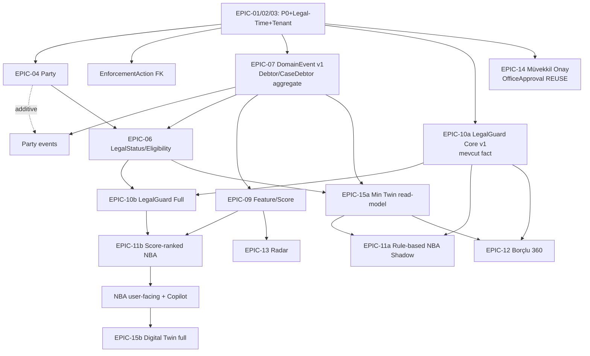
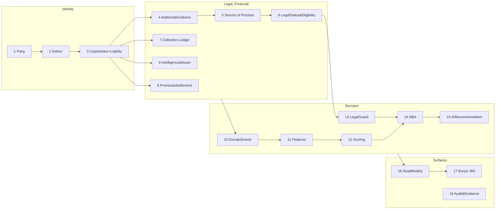
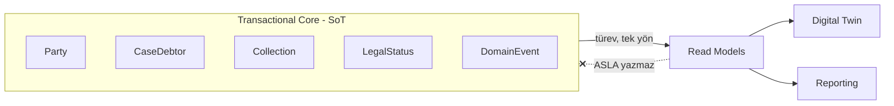
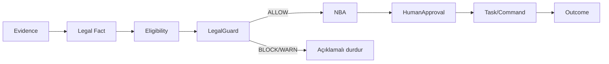
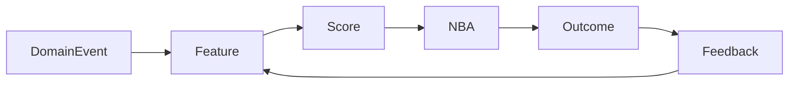
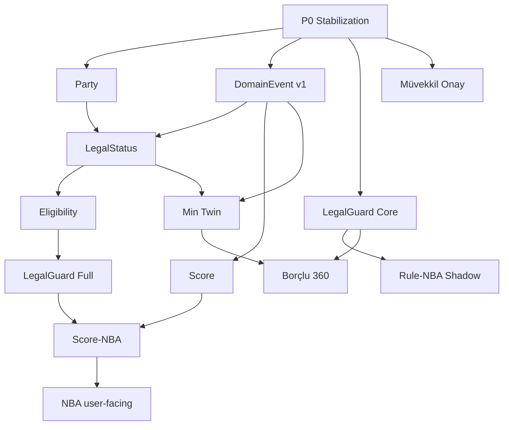
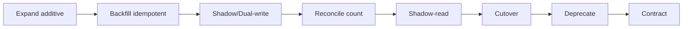
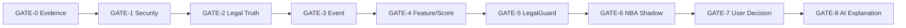
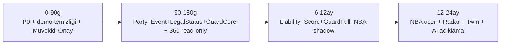

> **REPO INTAKE NOTU (2026-07-12):** Bu belge borçlu hattının **kanıt/gerekçe katmanıdır**; operasyonel belge değildir.
>
> **SUPERSEDED BY (operasyonel olarak):**
> `project/docs/governance/SYSTEM-CONSTITUTION.md` → `project/docs/governance/DEBTOR-GOVERNANCE.md`
>
> İçerik, owner'ın 2026-07-12 GO-IMPLEMENT talimatıyla owner arşivindeki kaynaktan
> ("BORCLUPLATFORMUMASTERSYNTHESIS 2.md") **değiştirilmeden** alınmıştır. Belge içindeki
> "bu belge scratchpad'de, repo'da değil" ibaresi ve branch/HEAD referansları intake öncesi
> tarihsel bağlamdır. Bu belge silinmez ve geriye dönük mutasyona uğratılmaz; governance
> kurallarının gerekçesi bu belgedeki MS/ kimlikleri (DEC/ADR/OD/FND/LG/GATE/...) üzerinden izlenir.
>
> **GÜVENLİK SANİTİZASYONU (public repo — 2026-07-12):** Bu repository PUBLIC'tir. Henüz kapatılmamış
> P0/P1-güvenlik bulguları (FND-01 tenant tek-savunma, FND-02 mock legal-write, FND-03 süre otoritesi,
> FND-04 guard'sız aşama geçişi) için **doğrudan saldırı reçetesi oluşturan ayrıntılar maskelenmiştir**:
> tam satır numaraları, bypass mekanizmasının çalışma detayı ve adım-adım exploit zinciri kaldırılmıştır.
> Mimari, severity, root cause, remediation ve test gereksinimleri korunmuştur; modül/dosya düzeyi
> referanslar kalmıştır. `[SANITIZED — P0 kapanışına dek]` işareti maskelenen yerleri gösterir. Ayrıntılı
> satır kanıtları ilgili P0 kapandıktan sonra ayrı bir governance PR ile geri eklenebilir.

# BORÇLU PLATFORMU — MASTER SYNTHESIS, DECISION ARCHITECTURE & EXECUTION ROADMAP
## (Gap Closure, Traceability & Consistency Pass — v2, self-contained)

> **Kanonik karar belgesi.** Altı GO-ANALYZE çalışmasının tek uzlaştırılmış sentezi + completion pass.
> **Mod:** GO-ANALYZE ONLY · **Kod/dosya/migration/governance değişikliği:** YAPILMADI (bu belge scratchpad'de, repo'da değil)
> **Repo:** branch `claude/debtor-module-audit-wnb2w3` · HEAD `5b51b2e` · working tree temiz
> **Self-containment kuralı:** Bu belgede kullanılan HER iz-kimliği (SRC/FND/DEC/CF/RC/CAP/ADR/OD/EPIC/PR/GATE/RISK/MET/LG/Q/S) bu belge içinde tanımlıdır. Yetim referans yoktur.

---

## KİMLİK SÖZLÜĞÜ (referans anahtarları)

| Önek | Anlam | Önek | Anlam |
|---|---|---|---|
| SRC | Kaynak | GATE | Release/production gate |
| FND | Kanonik bulgu | RISK | Program riski |
| CF | Çelişki | MET | Metrik |
| RC | Root cause | LG | LegalGuard kuralı |
| DEC | Kanonik karar | Q | LegalStatus tasarım sorusu |
| ADR | Mimari karar | S | Ölçek senaryosu |
| CAP | Capability | OD | Owner decision |
| EPIC | Epic | PR | Önerilen PR |

**Ölçek senaryoları (S) — Teknik Readiness'ten kanonik tanım:**
- **S1** ≈ 50k dosya / 25k borçlu / 500k event · **S2** ≈ 500k / 250k / 20M · **S3** ≈ 5M / 2M / 500M · **S4** ≈ 20M party / 100M adres / 1B event.

**LegalStatus tasarım soruları (Q) — Design PR#1'den:**
- **Q1** LegalStatus seviyesi (Party mı Debtor mı) · **Q2** Ölüm→tereke geçişi (otomatik mi insan-onaylı) · **Q3** Mirasçı modeli (PartyRelation(HEIR_OF) mı alt-Party) · **Q4** Şirket birleşme/unvan (PartyEvolution mı yeni kayıt).

---

## A. Executive Summary

**Genel sonuç:** Altı analiz tek gerçeğe yakınsıyor — **sağlam transactional çekirdek + beklenenden olgun event temeli, üstünde sahte/eksik zekâ katmanı ve tek-savunmalı tenant güvenliği.** Platform bugün bir *kayıt sistemi*; hedef *hukuken guard'lı, açıklanabilir bir karar/tahsilat işletim sistemi*.

**Bugünkü seviye (DÜZELTİLDİ — katman-katman, tek "PRODUCTION_CAPABLE" iddiası kaldırıldı):**
```
TRANSACTIONAL CORE      : PARTIALLY PRODUCTION-CAPABLE (P0 leak/mock/süre açık)
PLATFORM FOUNDATION     : NO-GO UNTIL GATE-1 + GATE-2
INTELLIGENCE LAYER      : UNSAFE_PROTOTYPE / ABSENT
```

- **Hedef:** Party → LegalStatus → EnforcementEligibility → LegalGuard → DebtorScore → NBA → Digital Twin + kanıtlı Borçlu 360.
- **Production blocker (DÜZELTİLDİ — 3 doğrulanmış P0):** FND-01 tenant tek-savunma · FND-02 mock legal-write · FND-03 süre otoritesi. (FND-04 guard'sız aşama geçişi = P1; FND-05 demo UI = P2 cleanup, DEAD_CODE olduğu doğrulandı — mount edilmiyor.)
- **En kritik 5 foundation (`FOUNDATION_BLOCKER`):** CAP-01 Party · CAP-08 DomainEvent(EXTEND) · CAP-03 LegalStatus · CAP-06 Eligibility · CAP-07 LegalGuard.
- **En yüksek değerli 5 ürün capability:** Borçlu 360 · LegalGuard UX · Müvekkil Onay Merkezi · NBA (shadow→user) · Portföy Radar.
- **İlk epic:** EPIC-01 · **İlk owner kararı:** OD-01 (aşağıda EXECUTION AUTHORIZATION'a taşındı) · **İlk ADR:** ADR-004.
- **90 gün:** sıfır tenant-leak + sıfır mock-legal-write + kanonik süre + demo temizliği.
- **12 ay:** kanonik DebtorScore + NBA shadow + kanıtlı Borçlu 360.
- **3 yıl:** insan-denetimli, guard'lı, açıklanabilir tahsilat işletim sistemi.

---

## B. Source Register

| SRC | Kaynak | Tarih | Branch/Commit | Kapsam | Otorite | Güncellik |
|---|---|---|---|---|---|---|
| SRC-001 | Güncel repo kodu | 2026-07 | `5b51b2e` | tüm borçlu hattı | **1** | GÜNCEL |
| SRC-002 | schema.prisma + 73 migration | 2026-07 | `5b51b2e` | veri modeli | 2 | GÜNCEL |
| SRC-003 | CI (`ci.yml`) + testler | 2026-07 | `5b51b2e` | test disiplini | 3 | GÜNCEL |
| SRC-004 | Borçlu Master Audit | 2026-07 | `5b51b2e` | bug/risk | 5 | GÜNCEL |
| SRC-005 | Doğrulama/regression turu | 2026-07 | `5b51b2e` | regression | 5 | GÜNCEL |
| SRC-006 | Platform Blueprint | 2026-07 | `5b51b2e` | hedef mimari | 3 | GÜNCEL |
| SRC-007 | Teknik/Production Readiness | 2026-07 | `5b51b2e` | feasibility | 3 | GÜNCEL |
| SRC-008 | Future Product/UX Audit | 2026-07 | `5b51b2e` | ürün/UX | 2 | GÜNCEL |
| SRC-009 | `party-registry-design.md` + review | 2026-06-17 | (design) | Party | 7 | HOLD, geçerli |
| SRC-010 | `debtor-identity-resolution-ir0.md` | 2026-06-17 | (design) | PartyMatch | 7 | HOLD |
| SRC-011 | governance (product-backlog / decision-log) | 2026-07-09 | `5b51b2e` | karar kaydı | 6 | GÜNCEL |
| SRC-012 | `d6-final-architecture.md` + d6 tasarımları | 2026-07-04 | `5b51b2e` | D6 | 6 | GÜNCEL |

**`SOURCE_MISSING`:** "İlk A-Z Audit" verilmedi; Master Audit (SRC-004) bulgularını SRC-001 üzerinden yeniden doğruladı. Chat-üretimi analizler (SRC-004..008) kod kanıtına dayalı; kodla çelişen iddia korunmadı.

---

## C. Canonical Glossary (tam)

| Kavram | Kanonik tanım | Veri seviyesi | Owner context | Karıştırma (≠) |
|---|---|---|---|---|
| Party | Dış taraf kimlik kökü | Party | Party&Identity | ≠ Debtor |
| PartyIdentity | Party'nin doğrulanabilir kimlik numaraları (TCKN/VKN/MERSIS/DETSIS/KEP) | Party | Party&Identity | ≠ Party (kök) |
| PartyMatch | İki kaydın aynı kişi olup olmadığının insan-onaylı eşleştirmesi | Party | Party&Identity | ≠ otomatik merge |
| Debtor | Party'nin borçlu profili | Debtor | Debtor Profile | ≠ CaseDebtor |
| CaseDebtor | Dosyadaki borçlu ilişkisi + rol | CaseDebtor | CaseDebtor | ≠ Debtor |
| LegalRole | Dosyadaki hukuki sıfat | CaseDebtor | CaseDebtor | ≠ Liability |
| Liability | Hangi borçtan ne kadar / hangi rejim | Liability | Liability | ≠ LegalRole |
| DebtorLegalStatus | Ölüm/iflas/konkordato/tasfiye durumu | Party (Debtor türev) | Legal Status | ≠ risk flag |
| AddressEvidence | Adresin kaynağı + kanıtı + güveni (immutable) | Debtor/Party | Address&Evidence | ≠ DebtorAddress kaydı |
| ServiceAttempt | Tek bir tebligat denemesi (kanıt-korumalı) | CaseDebtor | Service of Process | ≠ NotificationQueue |
| NotificationResult | Tebligat denemesinin sonucu | CaseDebtor | Service of Process | ≠ hatırlatma bildirimi |
| LegalServiceDate | Kanonik tebliğ / tebliğ-sayılma tarihi | CaseDebtor | Service of Process | ≠ NotificationQueue.deliveredAt |
| EnforcementEligibility | Bu an hangi aksiyon hukuken mümkün | CaseDebtor | Eligibility | ≠ NBA |
| LegalGuard | Aksiyonu hukuki kurala göre ALLOW/BLOCK/WARN | — | LegalGuard | ≠ AI |
| LegalEvidence | Hukuki delil (immutable/WORM, silinemez) | aggregate | Audit&Evidence | ≠ AuditLog, ≠ DomainEvent |
| DomainEvent | Davranış sinyali, replay kaynağı | aggregate | Events | ≠ AuditLog |
| EventOutbox | DomainEvent'in transactional yayınlama kuyruğu | tenant | Events | ≠ NotificationQueue |
| AuditLog | Kullanıcı işlem izi | Tenant | Audit | ≠ DomainEvent, ≠ LegalEvidence |
| PaymentPromise | Ödeme vaadi + tutma sonucu | CaseDebtor→Party feature | PaymentPromise&Settlement | ≠ Collection |
| SettlementOffer | Sulh teklifi + karar + müvekkil onayı | CaseDebtor | PaymentPromise&Settlement | ≠ Collection |
| BehaviorFeature | Ölçülebilir/açıklanabilir davranış türev-değeri | çok-seviye | Behavior&Features | ≠ RiskSignal |
| FeatureSnapshot | Skor hesabında kullanılan immutable feature seti | çok-seviye | Behavior&Features | ≠ canlı feature |
| RiskSignal | Ham risk sinyali (kaynaklı, tek olay) | çok-seviye | Behavior&Features | ≠ DebtorScore |
| DebtorScore | İstatistiksel olasılık/öncelik (versiyonlu) | Debtor/CaseDebtor | Scoring | ≠ hukuki karar |
| NextBestAction | Guard'dan geçmiş öneri/görev | CaseDebtor | NBA | ≠ Eligibility, ≠ Command |
| HumanApproval | İnsan onay kaydı (OfficeApproval REUSE) | tenant | Approval | ≠ AI onayı |
| ReportingReadModel | Rapor için türev okuma modeli (matview/warehouse) | read-model | Read Models | ≠ transactional core |
| AIContextBuilder | LLM'e giden tenant-safe, PII-min bağlam üreticisi | — | AI | ≠ ham veri erişimi |
| AIRecommendation | LLM açıklama/taslak | — | AI | ≠ Action Command |
| Digital Twin | Read-model birleşimi | read-model | Read Models | ≠ Source of Truth |

**`TERMINOLOGY_CONFLICT` çözümleri:** "risk score"→**DebtorScore** (tek motor); "notification"→tebligat kanonik = **Tebligat/ServiceAttempt**, NotificationQueue = yalnız hatırlatma kuyruğu.

---

## D. Çelişki ve Reconciliation Raporu

| CF | Sınıf | Kaynak A / İddia | Kaynak B / İddia | Kanıt | Kanonik sonuç | Karar |
|---|---|---|---|---|---|---|
| CF-01 | SOURCE_OF_TRUTH | SRC-006/004: event pipeline yok | SRC-007: DomainEventIngest VAR | `domain-event-ingest.service.ts` Collection+Case'e bağlı | DomainEvent `EXTEND` | DEC-08 |
| CF-02 | SOURCE_OF_TRUTH | Kod: süre NotificationQueue'dan | Hukuk: Tebligat.tebligSayilmaDate | `workflow-engine.service.ts` `[SANITIZED — P0 kapanışına dek]` | Tebligat kazanır; `LEGAL_DOMAIN_MISMATCH` | DEC-03 |
| CF-03 | ARCHITECTURE | SRC-006: LegalStatus Party | SRC-009: Party HOLD | design §13 | Debtor-v1→Party Faz1 | DEC-07 |
| CF-04 | PRIORITY | SRC-008: 360 hızlı değer | SRC-007: foundation önce | dependency | Foundation önce; 360 read-only | DEC-13 |
| CF-05 | STALE_EVIDENCE | SRC-009/010 (06-17) | SRC-001 güncel | commit farkı | Party tasarımı geçerli, repo-doğrulanmalı | DEC-14 |
| CF-06 | SCOPE | SRC-006: Liability bağımsız | governance: Accounting ayrı | ALC workstream | Koordineli | DEC-05b |
| CF-07 | ARCHITECTURE (yeni, self-critique) | v1: Party→DomainEvent seri | Kanıt: DomainEventIngest Debtor/Case aggregate'i destekler | SRC-007 | **DomainEvent v1 Party'siz başlar; Party events additive** | DEC-15 |
| CF-08 | ARCHITECTURE (yeni) | v1: NBA→Digital Twin | Twin read-model NBA'ya context sağlar | SRC-006/008 | **Döngüsel: min read-model NBA'dan önce; outcome twin'i zenginleştirir** | DEC-16 |
| CF-09 | ARCHITECTURE (yeni) | v1: LegalGuard LegalStatus'suz kurulamaz | Guard v1 mevcut fact'lerle | SRC-007 | **LegalGuard Core v1 (mevcut fact) + Full (LegalStatus sonrası)** | DEC-17 |
| CF-10 | ARCHITECTURE (yeni) | v1: NBA Score gerektirir | Rule-based NBA Score'suz | SRC-006 | **Rule-based NBA Shadow erken + Score-ranked NBA sonra** | DEC-18 |
| CF-11 | SEVERITY (yeni) | v1: demo UI P0 | Doğrulama: DEAD_CODE (mount yok) | grep: import yok / yalnız barrel | **FND-05 → P2 cleanup** | DEC-05 |

---

## E. Canonical Findings Register

| FND | Başlık | Sev | Conf | RC | Kanıt (SRC-001) | Karar |
|---|---|---|---|---|---|---|
| FND-01 | Tenant tek-savunma (Risk/AI/Notification leak) | **P0** | CONFIRMED | RC-1 | `risk`, `ai`, `notification` modülleri + Prisma savunma katmanı `[SANITIZED — P0 kapanışına dek]` | DEC-01 |
| FND-02 | Mock legal-write kanonik alana | **P0** | CONFIRMED | RC-3 | scheduler / UETS / notification servisleri `[SANITIZED — P0 kapanışına dek]` | DEC-02 |
| FND-03 | Süre otoritesi non-canonical | **P0** | CONFIRMED | RC-2 | `workflow-engine.service.ts` `[SANITIZED — P0 kapanışına dek]` | DEC-03 |
| FND-04 | Guard'sız otomatik aşama geçişi | P1 | CONFIRMED | RC-2 | scheduler / notification servisleri `[SANITIZED — P0 kapanışına dek]` | DEC-04 |
| FND-05 | Demo UI (forecast/risk/payment/comm) — **DEAD_CODE** | P2 | CONFIRMED | RC-3 | `collection-forecast.tsx:30` (yalnız barrel `case/index.ts:43`, mount YOK); `debtor-risk-score`/`payment-history`/`communication-log` import YOK | DEC-05 |
| FND-06 | 3 rakip skor motoru | P1 | CONFIRMED | RC-7 | risk/automation/ai servisleri | DEC-06 |
| FND-07 | Hukuki durum structured değil (+ölümde yanlış routing) | P1 | CONFIRMED | RC-11 | `tebligat.service.ts:619`, `debtor.service.ts:2271` hayalet alan | DEC-07 |
| FND-08 | EnforcementAction tenant/borçlu bağı yok | P1 | CONFIRMED | RC-4 | `schema.prisma:2469` | DEC-08b |
| FND-09 | AuditLog iş-sinyali olarak | P2 | CONFIRMED | RC-6 | `debtor.service.ts:1541` | DEC-09 |
| FND-10 | Davranış sinyali (vaat/sulh) structured yok | P2 | CONFIRMED | RC-9 | model yokluğu | DEC-10 |
| FND-11 | Reporting canlı DB + unbounded | P2 | CONFIRMED | RC-10 | `report.service.ts` take yok | DEC-11 |
| FND-12 | DB-gated test sessiz skip + passWithNoTests | P3 | PARTIAL | RC-14 | `ci.yml:89` | DEC-12 |
| FND-13 | Party/kimlik grafiği yok | P2 | CONFIRMED | RC-12 | SRC-009 HOLD | OD-04 |

**Severity re-verification (FND-05):** `MOUNTED_IN_PRODUCTION? HAYIR · ROUTABLE? HAYIR · FEATURE_FLAGGED? — · DEAD_CODE? EVET.` → P0 değil P2. Ancak "tek import ile canlıya girme" latent riski nedeniyle karantina/silme önerilir (paralel, ucuz).

---

## F. Canonical Decision Register (YENİ — talimatın eksik bulduğu bölüm)

| DEC | Karar | Dayanak FND | Dayanak SRC | ADR | Etkilenen CAP | Etkilenen EPIC | Gate | Owner |
|---|---|---|---|---|---|---|---|---|
| DEC-01 | Risk/AI/Notification'a zorunlu tenant scope + `$extends` 2. savunma | FND-01 | SRC-001 | ADR-004 | CAP-15 | EPIC-01/03 | GATE-1 | Security |
| DEC-02 | Mock legal-write NO-OP/`NOT_INTEGRATED`; NO-MOCK startup gate | FND-02 | SRC-001 | ADR-006 | CAP-05(Service) | EPIC-02 | GATE-1 | Legal+Backend |
| DEC-03 | Süre otoritesi `Tebligat.tebligSayilmaDate`'e rebase | FND-03 | SRC-001+İİK | ADR-005 | CAP-06 | EPIC-02 | GATE-2 | Legal |
| DEC-04 | Otomatik aşama geçişi LegalGuard'a tabi | FND-04 | SRC-001 | ADR-012 | CAP-07 | EPIC-02/10 | GATE-2/5 | Legal |
| DEC-05 | Demo FE karantina (DEAD_CODE) | FND-05 | SRC-001 | — | CAP-12 | EPIC-01(paralel) | GATE-1 | Frontend |
| DEC-05b | Liability Accounting ile koordineli | FND-10 | SRC-011 | ADR-011 | CAP-05 | EPIC-05 | GATE-2 | Accounting |
| DEC-06 | Tek kanonik DebtorScoringService; Case.riskScore RETIRE | FND-06 | SRC-001 | ADR-013 | CAP-10 | EPIC-09 | GATE-4 | Data/AI |
| DEC-07 | DebtorLegalStatus v1 Debtor-seviyesi, Party Faz1'de taşı | FND-07 | SRC-001/009 | ADR-010 | CAP-03 | EPIC-06 | GATE-2 | Legal |
| DEC-08 | DomainEvent = mevcut outbox EXTEND | FND-09 | SRC-007 | ADR-007 | CAP-08 | EPIC-07 | GATE-3 | Architect |
| DEC-08b | EnforcementAction'a tenantId+caseDebtorId additive | FND-08 | SRC-002 | ADR-011 | CAP-06 | EPIC-05 | GATE-2 | Backend |
| DEC-09 | AuditLog/DomainEvent/LegalEvidence 3 katman ayrı | FND-09 | SRC-001 | ADR-009 | CAP-08 | EPIC-07 | GATE-3 | Architect |
| DEC-10 | PaymentPromise/SettlementOffer structured | FND-10 | SRC-001 | — | CAP-09 | EPIC-08 | GATE-3 | Product |
| DEC-11 | Reporting read-model (matview) | FND-11 | SRC-001 | ADR-017 | CAP-14 | EPIC-13/14 | — | Architect |
| DEC-12 | CI required-DB-test skip = fail | FND-12 | SRC-003 | — | — | EPIC-01 | GATE-0 | QA |
| DEC-13 | Foundation önce; 360 read-only sonra | CF-04 | SRC-007 | — | CAP-12 | EPIC-12 | GATE-7 | Product |
| DEC-14 | Party tasarımı repo-doğrulanarak açılır | CF-05 | SRC-009 | ADR-002 | CAP-01 | EPIC-04 | — | Architect |
| DEC-15 | DomainEvent v1 Debtor/CaseDebtor aggregate ile başlar; Party events additive | CF-07 | SRC-007 | ADR-007 | CAP-08 | EPIC-07 | GATE-3 | Architect |
| DEC-16 | Digital Twin min read-model NBA'dan önce; ilişki döngüsel | CF-08 | SRC-006 | ADR-018 | CAP-14 | EPIC-15 | — | Architect |
| DEC-17 | LegalGuard Core v1 (mevcut fact) + Full (LegalStatus sonrası) | CF-09 | SRC-007 | ADR-012 | CAP-07 | EPIC-10 | GATE-5 | Legal |
| DEC-18 | Rule-based NBA Shadow erken + Score-ranked NBA sonra | CF-10 | SRC-006 | ADR-015 | CAP-11 | EPIC-11 | GATE-6 | Data/AI |

---

## G. Root Cause Haritası

| RC | Kök neden | Ürettiği FND | Çözüm katmanı | Öncelik |
|---|---|---|---|---|
| RC-1 | Manuel tenant scoping (Prisma savunması yok) | FND-01 | tenant client + CI gate | P0 |
| RC-2 | Çoklu source-of-truth (süre/stage) | FND-03,04 | kanonik süre rebase | P0 |
| RC-3 | Mock/demo ile kanonik veri karışması | FND-02,05 | NO-MOCK gate + karantina | P0/P2 |
| RC-4 | Case↔Debtor seviye karışması | FND-08 | seviye modeli | P1 |
| RC-6 | AuditLog iş-sinyali | FND-09 | DomainEvent EXTEND | P2 |
| RC-7 | Kanonik score motoru yok | FND-06 | DebtorScoringService | P1 |
| RC-9 | Davranış structured değil | FND-10 | PaymentPromise/Settlement | P2 |
| RC-10 | Read-model yok | FND-11 | matview/read-model | P2 |
| RC-11 | Owner-ertelenmiş hukuki domain | FND-07 | LegalStatus | P1 |
| RC-12 | Party HOLD | FND-13 | Party Faz 0 (owner) | P2 |
| RC-14 | Production/test gate eksik | FND-12 | CI fail-if-skipped | P3 |

---

## H. Nihai Hedef Mimari — Bounded Context Matrisi (tam: sorumluluk/SoT/yazdığı model/event/bağımlılık/karar)

| # | Context | Sorumluluk | Source of truth | Yazdığı modeller | Ürettiği eventler | Bağımlılıklar | Karar |
|---|---|---|---|---|---|---|---|
| 1 | Party & Identity | kimlik kökü + eşleştirme | Party/PartyIdentity | Party, PartyIdentifier, PartyAlias, PartyEvolution, MatchCandidate, MergeLog | PARTY_CREATED, PARTY_IDENTITY_ADDED, PARTY_MERGED | — | EXTEND |
| 2 | Debtor Profile | borçlu profili | Debtor | Debtor | DEBTOR_CREATED, DEBTOR_UPDATED | 1 | EXTEND |
| 3 | CaseDebtor & Liability | dosya rolü + sorumluluk | CaseDebtor/Liability | CaseDebtor, CaseDebtorLegalRole, Liability, LiabilityGroup, LiabilityAllocation | CASE_DEBTOR_ADDED, ROLE_CHANGED | 2,7 | EXTEND+NEW |
| 4 | Address & Evidence | adres + kanıt | AddressEvidence | DebtorAddress, AddressEvidence | ADDRESS_EVIDENCE_ADDED | 2 | EXTEND |
| 5 | Service of Process | tebligat + kanonik tarih | ServiceAttempt/LegalServiceDate | Tebligat, ServiceAttempt, ServiceHistory | SERVICE_RESULT_RECORDED, SERVICE_LEGAL_DATE_CONFIRMED | 3,4 | EXTEND |
| 6 | Legal Status & Eligibility | hukuki durum + uygunluk | DebtorLegalStatus/Eligibility | DebtorLegalStatus, LegalStatusHistory, EnforcementEligibility, EligibilityFact | LEGAL_STATUS_CHANGED | 2,3,5 | NEW+EXTEND |
| 7 | Collection Ledger | tahsilat/mahsup | Collection | Collection, Allocation, Overpayment | COLLECTION_RECORDED | 3 | **REUSE** |
| 8 | Intelligence & Asset | saha istihbaratı + varlık | DebtorIntelligence/AssetSignal | DebtorIntelligence, AssetSignal | ASSET_SIGNAL_FOUND | 2,3 | EXTEND |
| 9 | PaymentPromise & Settlement | vaat + sulh | PaymentPromise/SettlementOffer | PaymentPromise, Outcome, SettlementOffer | PROMISE_KEPT/BROKEN, SETTLEMENT_* | 3,7 | NEW+EXTEND |
| 10 | Domain Events & Outbox | event + yayın | DomainEvent | DomainEvent, EventOutbox | (tüm) | tüm yazan context | EXTEND |
| 11 | Behavior & Features | feature türetme | BehaviorFeature | BehaviorFeature, FeatureSnapshot | — | 10 | NEW |
| 12 | Scoring | skor | DebtorScore | DebtorScore, ScoreFactor, ScoreSnapshot | — | 11 | REPLACE |
| 13 | LegalGuard | hukuki kural | LegalGuardRule | GuardRule, GuardEvaluation | GUARD_BLOCKED_ACTION | 6 | EXTEND |
| 14 | Next Best Action | öneri/görev | NBARecommendation | NBARecommendation, NBAOutcome | NBA_PROPOSED/ACCEPTED/REJECTED | 6,12,13 | REPLACE/NEW |
| 15 | AI Recommendation | açıklama/taslak | (stateless) | AIRecommendationLog | AI_RECOMMENDATION_CREATED | 11,13 | WRAP |
| 16 | Read Models & Reporting | okuma modeli | ReportingReadModel | matview/read tables | — | 10 | EXTEND |
| 17 | Product Surfaces (360) | karar deneyimi | — (read) | — | — | 6,10,12,14 | EXTEND |
| 18 | Audit & Evidence | delil/iz | AuditLog/LegalEvidence | AuditLog, LegalEvidence | — | tüm | EXTEND (ayır) |

**Kanonik kural:** Read Model/Digital Twin ASLA source of truth değil (ADR-018).

---

## I. Kanonik Veri Akışı — Adım Adım Sahiplik Tablosu (tam)

| Adım | Owner context | SoT | Yazma yetkisi | Üretilen event | Guard | Hata davranışı | Tenant sınırı | UI yüzeyi |
|---|---|---|---|---|---|---|---|---|
| Party | 1 | Party | PartyRegistryService | PARTY_CREATED | — | fail-closed | tenant-local | Kimlik kartı |
| Debtor | 2 | Debtor | DebtorIdentityService | DEBTOR_CREATED | — | fail-closed | tenant | Borçlu 360 |
| CaseDebtor | 3 | CaseDebtor | CaseDebtorRelationService | CASE_DEBTOR_ADDED | passive guard | fail-closed | tenant+case | Rol kartı |
| LegalRole+Liability | 3 | Liability | LiabilityService | ROLE_CHANGED | — | fail-closed | tenant+case | Rol/sorumluluk |
| AddressEvidence+ServiceAttempt | 4/5 | ServiceAttempt | ServiceOfProcessService | SERVICE_RESULT_RECORDED | — | fail-closed | tenant+case | Tebligat paneli |
| LegalServiceDate | 5 | LegalServiceDate | ServiceOfProcessService | SERVICE_LEGAL_DATE_CONFIRMED | — | fail-closed | tenant+case | Süre göstergesi |
| DebtorLegalStatus | 6 | LegalStatus | DebtorLegalStatusService | LEGAL_STATUS_CHANGED | insan-onay | fail-closed | tenant | Engel banner |
| EnforcementEligibility | 6 | Eligibility | EnforcementEligibilityService | — | tabi | fail-closed | tenant+case | Engel kartı |
| LegalGuard | 13 | GuardRule | LegalGuardService | GUARD_BLOCKED_ACTION | çekirdek | BLOCK | tenant | Guard rozeti |
| Candidate Actions→NBA | 14 | NBARecommendation | NextBestActionService | NBA_PROPOSED | zorunlu | öneri gizle | tenant+case | NBA paneli |
| HumanApproval | (Approval) | OfficeApproval | OfficeApprovalService | — | — | fail-closed | tenant | Onay merkezi |
| Approved Task/Command | (Task/domain) | Task | ilgili domain servisi | (domain) | tabi | fail-closed | tenant | görev |
| Outcome Event | 10 | DomainEvent | DomainEventService | *_OUTCOME | — | outbox retry | tenant | timeline |
| BehaviorFeature | 11 | BehaviorFeature | BehaviorFeatureService | — | — | stale-flag | tenant | (skor faktörü) |
| DebtorScore | 12 | DebtorScore | DebtorScoringService | — | — | "hesaplanamadı" | tenant | Skor+açıklama |
| Read Model/Digital Twin | 16/17 | (türev) | ReportingReadModelService | — | — | eski-veri etiketi | tenant | Digital Twin |

---

## J. Dependency ve Critical Path (DÜZELTİLMİŞ — CF-07/08/09/10 paralelleştirmeleri işlendi)



**Capability bağımlılık tablosu:**

| Capability | Ön koşullar | Blokladığı | Critical path? |
|---|---|---|---|
| CAP-01 Party | P0 + OD-04 | CAP-02, cross-case | Evet |
| CAP-08 DomainEvent v1 | P0 (Party DEĞİL — DEC-15) | CAP-09/10b/11b/14 | Evet |
| CAP-03 LegalStatus | P0 (Debtor-v1) | CAP-06/07b | Evet |
| CAP-06 Eligibility | CAP-03 | CAP-07/11 | Evet |
| CAP-07a LegalGuard Core | P0 (mevcut fact — DEC-17) | CAP-11a, CAP-12 | Evet |
| CAP-07b LegalGuard Full | CAP-03/06 | CAP-11b | Evet |
| CAP-10 Score | CAP-08 | CAP-11b | Kısmi |
| CAP-11a Rule-NBA Shadow | CAP-07a (Score DEĞİL — DEC-18) | — | Hayır (paralel) |
| CAP-11b Score-NBA | CAP-07b+CAP-10 | NBA user | Evet |
| CAP-13 Müvekkil Onay | P0 (OfficeApproval hazır) | — | Hayır (paralel) |
| CAP-14 Min Twin | CAP-08+CAP-03 (NBA DEĞİL — DEC-16) | Borçlu 360, NBA context | Kısmi |

**Bozulamaz sıra:** P0 → {DomainEvent v1, LegalStatus, LegalGuard Core} → {Eligibility, LegalGuard Full} → Score-NBA. **Paralel:** demo temizliği · EnforcementAction FK · Müvekkil Onay · Party (P0 sonrası, DomainEvent'i beklemez) · min Twin read-model · Rule-NBA Shadow. **Owner kararı olmadan başlayamaz:** Party (OD-04) · Liability (OD-07). **Prototip-only (foundation'sız):** user-facing NBA, Digital Twin full, Score-ranked NBA.

---

## K. Production Stabilization Programı (P0)

| P0 | Durum | RC | En küçük güvenli çözüm | Test gate | Rollback |
|---|---|---|---|---|---|
| Risk/AI/Notification tenant | OPEN | RC-1 | tenantId param + ownership + `$extends` | TENANT_ISOLATION | dar diff revert |
| Mock PTT/UETS/notification | OPEN | RC-3 | NO-OP / `NOT_INTEGRATED` | NO_MOCK_PRODUCTION | flag-off |
| Süre otoritesi | OPEN | RC-2 | Tebligat rebase (shadow→cutover) | LEGAL_CORRECTNESS | shadow-read geri |
| Demo/mock UI (DEAD_CODE) | OPEN | RC-3 | karantina/sil | UI_DECISION_SAFETY | git revert |
| DB-gated skip | PARTIAL | RC-14 | CI required-list + fail-if-skipped | MIGRATION | — |

**P0 kapanmadan üretime alınamaz:** CAP-07..15. **P0'a paralel tasarlanabilir (üretime değil):** CAP-03/06/08.

---

## L. ADR Karar Kartları (tam — 20)

> Her kart: **Karar · Bağlam · Sorun · Seçenekler · Tavsiye · Reddedilen · Hukuki/Security/Migration/Backward-compat/Ops etkisi · Geri dönüş · Karar bağımlılığı · Owner.**

**ADR-001 Party tenant-local mı?** Karar: **tenant-local.** Bağlam: SRC-009 D-3. Sorun: cross-tenant kimlik havuzu KVKK. Seçenekler: (a) tenant-local (b) global. Tavsiye: (a). Reddedilen: (b) — cross-tenant karışma. Hukuki: KVKK uyumlu. Security: izolasyon korunur. Migration: BACKFILL. Backward-compat: additive. Ops: düşük. Geri dönüş: kolay. Bağımlılık: OD-04. Owner: Architect+Legal.

**ADR-002 Party↔Debtor.** Karar: **Party üst kimlik, Debtor profile (Option B).** Bağlam: SRC-009 §2. Sorun: 5 kimlik tablosu bölük. Seçenekler: (a) Debtor=Party (b) Party+profile (c) ayrı context. Tavsiye: (b). Reddedilen: (a) rol karışır, (c) 2. kimlik hattı. Migration: BACKFILL+dual-write. Geri dönüş: orta. Bağımlılık: DEC-14. Owner: Architect.

**ADR-003 PartyMatch/merge.** Karar: **exact auto-link, fuzzy insan-onay, geri-alınabilir merge, pairKey suppress.** Bağlam: SRC-009 §4b, SRC-010. Sorun: NULL-kimlik duplicate. Reddedilen: sessiz otomatik merge (yanlış icra). Hukuki: yüksek — yanlış merge > duplicate. Geri dönüş: undo→SPLIT. Owner: Architect+Legal.

**ADR-004 Tenant 2. savunma.** Karar: **katmanlı — manuel(P0) + request-scoped `$extends` + kritik RLS(12ay).** Bağlam: SRC-001 prisma bare. Sorun: manuel-tek-savunma sızıntı üretir. Seçenekler: manuel/repository/`$extends`/RLS/katmanlı. Tavsiye: katmanlı. Reddedilen: yalnız RLS (erken ops). Security: derinlemesine savunma. Migration: NONE→kademeli. Backward-compat: yüksek. Geri dönüş: kolay. Bağımlılık: OD-02. Owner: Security. **İlk ADR.**

**ADR-005 LegalServiceDate.** Karar: **`Tebligat.tebligSayilmaDate` kanonik; NotificationQueue emekli.** Bağlam: CF-02. Sorun: süre non-canonical → yanlış itiraz/kesinleşme. Reddedilen: NotificationQueue tutmak. Hukuki: `LEGAL_DOMAIN_MISMATCH` kapanır. Migration: ADDITIVE(okuma) shadow→cutover. Geri dönüş: shadow-read geri. Owner: Legal.

**ADR-006 NotificationQueue rolü.** Karar: **yalnız hatırlatma/iletişim; süre rolü RETIRE.** Bağlam: ADR-005. Reddedilen: süre otoritesi. Migration: okuma değişimi. Owner: Legal+Backend.

**ADR-007 DomainEvent modeli.** Karar: **mevcut transactional-outbox EXTEND; PostgreSQL; DomainEvent v1 Debtor/CaseDebtor ile başlar (DEC-15).** Bağlam: SRC-007 DomainEventIngest VAR. Reddedilen: Kafka (S1-S3 gereksiz ops), Party-gated başlangıç. Ops: mevcut. Geri dönüş: additive. Owner: Architect.

**ADR-008 Full event sourcing.** Karar: **REDDEDİLDİ.** Bağlam: outbox yeterli. Reddedilen: full ES (gereksiz karmaşa). Yeniden değerlendirme: outbox yetmezse. Owner: Architect.

**ADR-009 Audit/Event/Evidence ayrımı.** Karar: **3 ayrı katman; AuditLog iş-sinyali RETIRE.** Bağlam: FND-09. Sorun: `getCrossFileDebtorAlerts` AuditLog'dan okur. Hukuki: LegalEvidence WORM ayrı. Owner: Architect+Legal.

**ADR-010 LegalStatus owner.** Karar: **Party seviyesi; v1 dar Debtor, Faz1 taşı (Q1).** Bağlam: CF-03. Reddedilen: yalnız CaseDebtor. Hukuki: ölüm tüm dosyalarda. Migration: ADDITIVE. Owner: Legal.

**ADR-011 Liability aggregate.** Karar: **Case altı LiabilityGroup; Collection→Liability rebase; Accounting koordineli.** Bağlam: FND-08, CF-06. Sorun: düz `liabilityAmount` müteselsil çözemez. Migration: BACKFILL. Hukuki: para sign-off. Geri dönüş: dual-write geri. Owner: Architect+Accounting.

**ADR-012 Eligibility vs LegalGuard.** Karar: **Eligibility fact üretir, LegalGuard kural uygular; LegalGuard Core v1 mevcut fact ile (DEC-17).** Bağlam: CF-09. Reddedilen: guard'ı LegalStatus'a tam bağlamak. Owner: Architect+Legal.

**ADR-013 Kanonik DebtorScore.** Karar: **tek servis; Case.riskScore RETIRE; batch+shadow+versioned.** Bağlam: FND-06. Sorun: 3 rakip motor. Migration: ADDITIVE shadow. Geri dönüş: kolay. Owner: Data/AI.

**ADR-014 Feature Store ilk faz.** Karar: **PostgreSQL feature tabloları (ayrı platform DEĞİL).** Bağlam: SRC-006. Reddedilen: erken feature platformu. Yeniden değerlendirme: S3-S4. Owner: Data/AI.

**ADR-015 NBA otomasyon sınırı.** Karar: **yalnız görev/öneri; NEVER_AUTO finansal/hukuki; Rule-based shadow erken (DEC-18).** Bağlam: SRC-006/008. Reddedilen: NBA→işlem. Owner: Product+Legal.

**ADR-016 AI recommendation sınırı.** Karar: **özet/açıklama/taslak; işlem yapmaz; tenant-safe AIContextBuilder.** Bağlam: FND-01. Reddedilen: AI→komut. Security: PII-min. Owner: Data/AI+Legal.

**ADR-017 Reporting read-model.** Karar: **matview(S2)→warehouse(S4).** Bağlam: FND-11. Reddedilen: canlı DB rapor. Owner: Architect.

**ADR-018 Digital Twin sınırı.** Karar: **read-model, ASLA source of truth; min read-model NBA'dan önce (DEC-16).** Bağlam: CF-08. Owner: Architect.

**ADR-019 Retention/anonymization.** Karar: **D6 policy genellemesi; fail-closed.** Bağlam: SRC-012. Hukuki: KVKK m.4/7. Owner: Privacy.

**ADR-020 Self-service sınırı.** Karar: **hukuki review + frontier; otomatik-sulh REJECT.** Bağlam: SRC-008. Owner: Product+Legal.

---

## M. Owner Decision Register (DÜZELTİLDİ — OD-01 EXECUTION AUTHORIZATION'a taşındı)

### M.0 EXECUTION AUTHORIZATION / PROGRAM GATE (owner tercihi DEĞİL — zorunlu düzeltme)
**EXEC-01 (eski OD-01):** Cross-tenant IDOR + mock legal-write + süre otoritesi düzeltilecek. **Bu owner kararı değildir — güvenlik/hukuki düzeltme zorunludur.** Owner yalnız: (a) uygulama sırası, (b) release yöntemi (shadow→cutover), (c) rollback yaklaşımı üzerinde karar verir. Gecikirse: tüm program bloke + canlı sızıntı/hukuki hata riski.

### M.1 Gerçek Owner Kararları

| OD | Tür | Karar | Tavsiye | Gecikirse bloke | Risk |
|---|---|---|---|---|---|
| OD-02 | teknik | Tenant stratejisi (ADR-004) | katmanlı | EPIC-03 | — |
| OD-03 | hukuki | Süre rebase yöntemi (ADR-005) | Tebligat, shadow→cutover | EPIC-02 | hukuki |
| OD-04 | ürün/mimari | Party Faz 0 aç | koşullar + Av. sign-off ile EVET | CAP-01/13-14 | XL |
| OD-05 | veri | Case.riskScore RETIRE | EVET | EPIC-09 | rapor drift |
| OD-06 | hukuki | LegalStatus seviyesi (Q1) | Debtor-v1→Party | EPIC-06 | çift taşıma |
| OD-07 | veri/finans | Liability + Accounting koordinasyonu | koordineli | EPIC-05 | çift-sayım |
| OD-08 | AI | NBA kapsamı | yalnız görev | EPIC-11 | — |
| OD-09 | AI | AI kapsamı | guard'lı öneri | EPIC-16 | hallucination |
| OD-10 | müvekkil strateji | Müvekkil 360 görünürlük | cross-case gizli | EPIC-14 | KVKK |
| OD-11 | ürün | Self-service / müzakere | hukuki review / frontier | EPIC-17 | KVKK |
| OD-12 | ürün | Demo/mock kaldır (DEAD_CODE) | EVET, hemen | (paralel) | latent |
| OD-13 | operasyon | Q2/Q3/Q4 (tereke/mirasçı/birleşme) | insan-onaylı + PartyEvolution | EPIC-06 | hukuki |

---

## N. Migration ve Data Backfill Programı (tam — eksik geçişler eklendi)

| Migration | Tür | Backfill | Shadow | Reconciliation query | Cutover metric | Failure threshold | Rollback | Hukuk onayı |
|---|---|---|---|---|---|---|---|---|
| EnforcementAction.tenantId/caseDebtorId | ADDITIVE | mevcut satır | — | null-count=0 | — | any-null | kolay | — |
| Debtor→Party | DATA_BACKFILL | TCKN/VKN dedupe, NULL→ayrı | dual-write | count(eski)=count(yeni) | drift<%0.1 | drift>%1 | orta | — |
| PartyIdentity backfill | DATA_BACKFILL | kimlik normalize | — | dup-identity groupBy | — | çelişkili kimlik | orta | — |
| Duplicate debtor envanteri | NONE (rapor) | groupBy tckn/vkn | — | dup listesi | — | — | — | — |
| PartyMatch candidate üretimi | ADDITIVE | pairKey üret | — | candidate-count | — | — | kolay | — |
| CaseDebtor LegalRole hardening | ADDITIVE | rol→LegalRole | dual | rol eşleşme | %100 | mismatch | kolay | — |
| DebtorLegalStatus | ADDITIVE | sinyal→aday (YAZMA yok) | — | insan onay | — | — | kolay | EVET(v1) |
| Liability | DATA_BACKFILL | liabilityAmount→Liability | dual | Σ eşleşme | %100 | çift-sayım | orta | **EVET** |
| EnforcementAction→CaseDebtor bağı | ADDITIVE | mevcut→caseDebtor | — | bağlanma oranı | — | orphan | kolay | — |
| NotificationQueue→Tebligat süre | ADDITIVE(okuma) | — | shadow-read | tarih delta | delta=0 | delta>0 | shadow geri | **EVET** |
| DomainEvent bootstrap | ADDITIVE | `source=BOOTSTRAP` ayrı | — | bootstrap≠organic | — | karışma | — | — |
| Timeline projection | ADDITIVE | event→timeline | — | replay=canlı | %100 | mismatch | rebuild | — |
| PaymentPromise başlangıç | ADDITIVE | boş başla | — | — | — | — | kolay | — |
| SettlementOffer | ADDITIVE | client-settlement bağ | — | — | — | — | kolay | — |
| BehaviorFeature bootstrap | ADDITIVE | event replay | — | feature freshness | — | stale | rebuild | — |
| FeatureSnapshot | ADDITIVE | skor anı | — | immutable | — | — | — | — |
| Case.riskScore→DebtorScore | ADDITIVE | shadow-score | shadow | dağılım kıyas | korelasyon | divergence | kolay | — |
| Reporting read-model | ADDITIVE | matview | shadow | canlı=matview | delta<%1 | delta>%5 | drop-view | — |
| Borçlu 360 read-model | ADDITIVE | türev | — | — | — | — | drop | — |
| Deprecated kolon CONTRACT | DESTRUCTIVE (en son) | çift-okuma kalksın | — | okuyucu=0 | — | okuyucu>0 | migration geri | — |

**Genel ilke:** Backfill restart-edilebilir + idempotent (checkpoint kolonu). Dual-write divergence günlük ölçülür; eşik aşılırsa cutover durur. İlk fazda DESTRUCTIVE yok.

---

## O. Vertical Slice Planı (tam şartname — 10)

**VS-1 DebtorLegalStatus v1** — Scope: DECEASED/BANKRUPTCY/CONCORDAT + VEFAT-şerhi→aday + Eligibility fact. Non-scope: otomatik geçiş, tereke dönüşümü. Domain: DebtorLegalStatus/History/Evidence. DB: ADDITIVE. Backend: DebtorLegalStatusService. Event: LEGAL_STATUS_CHANGED. Read-model: engel-durumu. Frontend: üst-banner. Security: tenant. LegalGuard: LG-03/04/05. Tests: LEGAL_CORRECTNESS+tenant. Flag: `legalStatusV1`. Rollback: flag-off. DoD: ölmüş borçlu "yeni adres araştır" ÖNERMEZ. Metric: hatalı-routing↓.

**VS-2 EnforcementAction→CaseDebtor** — Scope: tenantId+caseDebtorId FK. Non-scope: haciz mantığı. DB: ADDITIVE migration. Backend: EnforcementService write. Event: —. Tests: MIGRATION+tenant. Flag: —. Rollback: migration geri. DoD: her haciz borçluya bağlı. Metric: null-bağ=0.

**VS-3 PaymentPromise v1** — Scope: entity+create/outcome. Domain: PaymentPromise/Installment/Outcome. API: POST/PATCH. Transaction: tek-tx. Event: PROMISE_CREATED/KEPT/BROKEN. Feature: promise_kept_ratio. UI: Ödeme Vaadi kartı. Tenant guard: evet. Passive guard: pasif CaseDebtor engeli. Tests: unit+DB+tenant+event. Flag: `paymentPromiseV1`. Rollback: flag-off. DoD: vaat KEPT/BROKEN feature'a yansır. Metric: kept-ratio hesaplanabilir.

**VS-4 Timeline v1** — Scope: CaseDebtor timeline read-model. Domain: DomainEvent tüketici. DB: read tablo. Backend: TimelineReadModelService. Event: tüketir. Frontend: timeline paneli. Tests: EVENT_REPLAY. Flag: `timelineV1`. Rollback: drop read-model. DoD: replay=canlı. Metric: rebuild determinism.

**VS-5 LegalGuard Core v1** — Scope: LG-01/02 + pasif/tenant/onay/otomasyon-uygunluk (mevcut fact). Non-scope: ölüm/iflas (LegalStatus'a bağlı). Domain: GuardRule/Evaluation. Event: GUARD_BLOCKED_ACTION. Frontend: guard rozeti+neden. Tests: LEGAL_GUARD. Flag: `legalGuardCoreV1`. Rollback: flag-off. DoD: tebligatsız haciz önerisi BLOK. Metric: guard-blok sayısı.

**VS-6 DebtorScore shadow v1** — Scope: tek kanonik skor, Case.riskScore paralel shadow. DB: ADDITIVE. Backend: DebtorScoringService (batch). Feature: FeatureSnapshot. UI: gösterilmez (shadow). Tests: SCORE_DETERMINISM. Flag: `debtorScoreShadow`. Rollback: flag-off. DoD: replay→aynı skor. Metric: eski/yeni korelasyon.

**VS-7 Rule-based NBA Shadow v1** — Scope: deterministik kurallar (tebligat-eksik→adres, itiraz→blok, vaat-bugün→takip); Score DEĞİL. UI: gösterilmez (shadow log). Guard: LegalGuard Core. Event: NBA_PROPOSED(shadow). Tests: NBA_NO_SIDE_EFFECT. Flag: `nbaRuleShadow`. Rollback: flag-off. DoD: sıfır side-effect. Metric: shadow-öneri vs kullanıcı-aksiyon.

**VS-8 Borçlu 360 v1 (read-only)** — Scope: karar özeti + engel kartı + delil timeline. Non-scope: NBA/AI aksiyon, mock. Backend: read-model. Frontend: 360 üst-alan. Guard: görünür. Tests: UI_DECISION_SAFETY. Flag: `borclu360V1`. Rollback: eski drawer. DoD: mock YOK, kanonik veri. Metric: ekran-geçişi↓.

**VS-9 Müvekkil Onay Merkezi v1** — Scope: sulh/ödeme-planı/dosya-kapama onayı (OfficeApproval REUSE). Backend: OfficeApprovalService. UI: onay merkezi. Tests: AUTHORIZATION. Flag: `clientApprovalV1`. Rollback: flag-off. DoD: müvekkil onay verebilir. Metric: onay süresi.

**VS-10 AI Explanation v1** — Scope: tenant-safe AIContextBuilder + kanıt+güven+eksik-bilgi paneli. Non-scope: AI işlem. Backend: AIRecommendationService (WRAP). Security: PII-min, tenant. Tests: AI_CONTEXT_ISOLATION. Flag: `aiExplainV1`. Rollback: flag-off. DoD: cross-tenant sıfır. Metric: kanıtsız-öneri=0.

---

## P. Epic Implementation Cards (tam — özet alanlarla, 17)

Format: **Amaç · Ön koşul · Entity/Event/Service · UI · Migration · KVKK · LegalGuard · Test gate · Flag · Rollout · Rollback · Metric · Owner · Boyut · Öncelik.**

**EPIC-01 Production Security Stabilization** — Amaç: sızıntı/mock kapat. Ön koşul: EXEC-01. Entity: —. Service: Risk/AI/Notification + `$extends`. UI: demo karantina. Migration: NONE. KVKK: kritik. Test gate: TENANT_ISOLATION+NO_MOCK. Flag: per-fix. Rollout: hemen. Rollback: revert. Metric: tenant-violation=0. Owner: Security. Boyut: M. Öncelik: P0.

**EPIC-02 Canonical Legal Time & Notification Rebase** — Amaç: süre kanonik. Ön koşul: EPIC-01. Entity: ServiceAttempt. Service: ServiceOfProcess. UI: süre göstergesi. Migration: ADDITIVE(okuma). KVKK: —. Guard: LG. Test gate: LEGAL_CORRECTNESS+DATA_RECONCILIATION. Flag: `legalTimeRebase`. Rollout: shadow→cutover. Rollback: shadow geri. Metric: süre-delta=0. Owner: Legal. Boyut: M. Öncelik: P0.

**EPIC-03 Tenant Architecture Hardening** — Amaç: katmanlı savunma. Ön koşul: EPIC-01. Service: repository wrapper+RLS pilot. Migration: NONE. Test gate: TENANT_ISOLATION. Flag: `tenantClient`. Rollout: kademeli. Rollback: manuel-filtre geri. Metric: cross-tenant test coverage. Owner: Security. Boyut: M. Öncelik: P1.

**EPIC-04 Party Registry Foundation** — Amaç: kimlik kökü. Ön koşul: EPIC-01 + OD-04. Entity: Party/Identifier/Alias/Evolution. Event: PARTY_*. Migration: BACKFILL+dual-write. KVKK: yüksek. Test gate: MIGRATION+DATA_RECONCILIATION. Flag: `partyDualWrite`. Rollout: strangler. Rollback: dual-write dur. Metric: dedupe drift. Owner: Architect. Boyut: XL. Öncelik: P2.

**EPIC-05 LegalRole & Liability Hardening** — Amaç: sorumluluk modeli. Ön koşul: EPIC-04 + OD-07. Entity: LegalRole/Liability/Group. Migration: BACKFILL. KVKK: —. Test gate: FINANCIAL_INVARIANT. Flag: `liabilityShadow`. Rollout: dual. Rollback: legacy amount. Metric: Σ eşleşme. Owner: Architect+Accounting. Boyut: L. Öncelik: P1.

**EPIC-06 LegalStatus & EnforcementEligibility** — Amaç: hukuki durum+uygunluk. Ön koşul: EPIC-04(v1 Debtor) + OD-06/13. Entity: LegalStatus/Eligibility/Fact. Event: LEGAL_STATUS_CHANGED. Migration: ADDITIVE. Guard: LG-03/04/05. Test gate: LEGAL_CORRECTNESS+LEGAL_GUARD. Flag: `legalStatusV1`. Rollout: v1 dar. Rollback: flag-off. Metric: hatalı-routing↓. Owner: Legal. Boyut: L. Öncelik: P1.

**EPIC-07 DomainEvent/Outbox/Timeline** — Amaç: event temeli EXTEND. Ön koşul: EPIC-01 (Party DEĞİL). Entity: DomainEvent/Outbox. Event: tüm. Migration: ADDITIVE. Test gate: EVENT_IDEMPOTENCY+EVENT_REPLAY+CONCURRENCY. Flag: `domainEventV1`. Rollout: aggregate-aggregate. Rollback: consumer dur. Metric: outbox lag. Owner: Architect. Boyut: L. Öncelik: P1.

**EPIC-08 PaymentPromise & Settlement** — Amaç: davranış sinyali. Ön koşul: EPIC-07. Entity: PaymentPromise/SettlementOffer. Event: PROMISE_*/SETTLEMENT_*. Migration: ADDITIVE. KVKK: iletişim delili. Test gate: EVENT. Flag: `promiseV1`. Rollout: read/write. Rollback: flag-off. Metric: kept-ratio. Owner: Product. Boyut: M. Öncelik: P2.

**EPIC-09 BehaviorFeature & DebtorScore** — Amaç: kanonik skor. Ön koşul: EPIC-07 + OD-05. Entity: BehaviorFeature/Score. Migration: ADDITIVE shadow. Test gate: SCORE_DETERMINISM. Flag: `scoreShadow`. Rollout: shadow. Rollback: flag-off. Metric: korelasyon. Owner: Data/AI. Boyut: L. Öncelik: P2.

**EPIC-10 LegalGuard (a Core / b Full)** — Amaç: hukuki kapı. Ön koşul: 10a=EPIC-01; 10b=EPIC-06. Entity: GuardRule/Evaluation. Event: GUARD_BLOCKED_ACTION. Migration: ADDITIVE. Guard: çekirdek. Test gate: LEGAL_GUARD. Flag: `legalGuardCore`/`Full`. Rollout: core→full. Rollback: flag-off. Metric: guard-blok. Owner: Legal. Boyut: L. Öncelik: P1.

**EPIC-11 NBA Shadow (a Rule / b Score)** — Amaç: öneri motoru. Ön koşul: 11a=EPIC-10a; 11b=EPIC-09+10b. Entity: NBARecommendation/Outcome. Event: NBA_*. Migration: ADDITIVE. Guard: zorunlu. Test gate: NBA_NO_SIDE_EFFECT. Flag: `nbaRuleShadow`/`nbaScore`. Rollout: shadow→user. Rollback: flag-off. Metric: shadow accuracy. Owner: Data/AI. Boyut: L. Öncelik: P2.

**EPIC-12 Borçlu 360 & Evidence UX** — Amaç: karar deneyimi. Ön koşul: EPIC-06/07/10a. Entity: read-model. UI: 360. Migration: NONE. Guard: görünür. Test gate: UI_DECISION_SAFETY. Flag: `borclu360V1`. Rollout: read-only. Rollback: eski drawer. Metric: ekran-geçişi↓. Owner: Product. Boyut: L. Öncelik: P2.

**EPIC-13 Operations Cockpit & Portfolio Radar** — Amaç: karar kuyruğu+radar. Ön koşul: EPIC-09. Entity: read-model. UI: kuyruk/radar. Migration: matview. Test gate: — . Flag: `cockpitV1`. Rollout: read-only. Rollback: drop. Metric: kuyruk SLA. Owner: Product. Boyut: L. Öncelik: P3.

**EPIC-14 Client Approval & Reporting** — Amaç: müvekkil onay+rapor. Ön koşul: EPIC-01 (OfficeApproval hazır). Entity: OfficeApproval REUSE + read-model. Migration: NONE/matview. KVKK: cross-case gizli(OD-10). Test gate: AUTHORIZATION. Flag: `clientApprovalV1`. Rollout: hemen. Rollback: flag-off. Metric: onay süresi. Owner: Product. Boyut: M. Öncelik: P2.

**EPIC-15 Digital Twin (a min read-model / b full)** — Amaç: ikiz. Ön koşul: 15a=EPIC-06/07; 15b=EPIC-11. Entity: read-model. Migration: ADDITIVE. Test gate: —. Flag: `twinV1`. Rollout: read-only. Rollback: drop. Metric: context coverage. Owner: Architect. Boyut: XL. Öncelik: P3.

**EPIC-16 AI Explanation Layer** — Amaç: tenant-safe açıklama. Ön koşul: EPIC-09 + OD-09. Entity: AIContextBuilder. Migration: NONE. Security: PII-min. Test gate: AI_CONTEXT_ISOLATION. Flag: `aiExplainV1`. Rollout: read-only. Rollback: flag-off. Metric: kanıtsız-öneri=0. Owner: Data/AI. Boyut: M. Öncelik: P3.

**EPIC-17 Self-Service/Strategy Simulation Research** — Amaç: frontier. Ön koşul: EPIC-15 + OD-11. Entity: (research). Migration: —. KVKK: yüksek. Test gate: —. Flag: research. Rollout: pilot. Rollback: —. Metric: —. Owner: Product+Legal. Boyut: XL. Öncelik: P4.

---

## Q. İlk 15 PR Kartları (tam)

Format: **Epic · Amaç · Neden şimdi · Kapsam · Kapsam dışı · Muhtemel dosyalar · Migration · Backward-compat · Security · Testler · Flag · Rollback · Bağımlılık · DoD.**

**PR-1 Risk tenant guard** — EPIC-01. Amaç: cross-tenant RiskReport okuma/yazma kapat. Neden şimdi: P0 IDOR. Kapsam: `risk.service.ts`+`risk.controller.ts` tenantId param. Dışı: skor mantığı. Dosyalar: `modules/risk/*`. Migration: NONE. Backward-compat: controller imza (dahili). Security: TENANT. Testler: cross-tenant 404. Flag: —. Rollback: revert. Bağımlılık: —. DoD: başka tenant caseId→404.

**PR-2 AI tenant guard + batch ownership** — EPIC-01. Amaç: AI servis + batch öneri yolunda ownership doğrulaması `[SANITIZED — P0 kapanışına dek]`. Neden: PII sızıntı riski. Kapsam: tenantId + ownership loop. Dışı: prompt tasarımı. Dosyalar: `modules/ai/*`. Testler: cross-tenant + batch mixed-id. Rollback: revert. Bağımlılık: —. DoD: yabancı caseId reddedilir.

**PR-3 Notification tenant scoping** — EPIC-01. Amaç: read/write/pending/expired/stats uçlarını tenant-scoped yap. Neden: yetkisiz cross-tenant durum değişikliği riski `[SANITIZED — P0 kapanışına dek]`. Kapsam: notification controller + service. Testler: cross-tenant write reddi. Rollback: revert. DoD: `/pending` yalnız kendi tenant.

**PR-4 `$extends` tenant client** — EPIC-03. Amaç: 2. savunma. Neden: manuel-tek-savunma. Kapsam: request-scoped tenant client. Dışı: RLS. Dosyalar: `prisma/*`+DI. Migration: NONE. Testler: extension isolation. Flag: `tenantClient`. Rollback: flag-off. Bağımlılık: PR-1/2/3. DoD: servis unutsa da filtre uygulanır.

**PR-5 Mock PTT/UETS NO-OP** — EPIC-02. Amaç: rastgele/deterministik legal-write dur. Neden: sahte tebliğ tarihi. Kapsam: scheduler / UETS servisleri `[SANITIZED — P0 kapanışına dek]` → `NOT_INTEGRATED`. Testler: NO-OP. Flag: `mockGuard`. Rollback: flag. DoD: mock kanonik alana yazmaz.

**PR-6 Notification random-delivery NO-OP** — EPIC-02. Amaç: notification servisindeki simüle teslim üretimini durdur `[SANITIZED — P0 kapanışına dek]`. Kapsam: e-tebligat durum kontrolü + workflow aşama mutasyonu. Testler: NO-OP. Rollback: flag. DoD: simüle DELIVERED yok.

**PR-7 Demo FE karantina** — EPIC-01(paralel). Amaç: DEAD_CODE 4 bileşen. Neden: latent sahte-güven. Kapsam: forecast/risk/payment/comm sil veya `__demo__`. Dosyalar: `components/*` + barrel. Testler: build. Rollback: git revert. Bağımlılık: —. DoD: mount edilebilir demo yok.

**PR-8 NO-MOCK gate + CI SECURITY gate** — EPIC-01. Amaç: startup mock-guard + cross-tenant CI. Kapsam: startup check + `ci.yml` job + required-DB-test list. Testler: gate self-test. Rollback: gate-off. DoD: prod'da mock provider boot durur.

**PR-9 Süre rebase shadow-read** — EPIC-02. Amaç: Tebligat.tebligSayilmaDate shadow. Kapsam: workflow-engine servisinde paralel okuma `[SANITIZED — P0 kapanışına dek]`. Testler: LEGAL_CORRECTNESS + delta ölçüm. Flag: `legalTimeShadow`. Rollback: flag. Bağımlılık: PR-5/6. DoD: delta ölçülüyor.

**PR-10 Süre rebase cutover** — EPIC-02. Amaç: kanonik kaynağa geç. Kapsam: primary kaynak değişimi. Testler: LEGAL_CORRECTNESS. Flag: `legalTimeCutover`. Rollback: shadow geri. Bağımlılık: PR-9 (delta=0). DoD: süre Tebligat'tan.

**PR-11 EnforcementAction FK migration** — EPIC-05. Amaç: tenantId+caseDebtorId. Migration: ADDITIVE. Testler: MIGRATION. Rollback: migration geri. DoD: null-bağ=0.

**PR-12 DebtorLegalStatus şema v1** — EPIC-06. Amaç: LegalStatus/History/Evidence. Migration: ADDITIVE. Testler: MIGRATION+tenant. Flag: `legalStatusV1`. Rollback: flag+migration. Bağımlılık: OD-06. DoD: şema+servis iskeleti.

**PR-13 VEFAT→LegalStatus adapter** — EPIC-06. Amaç: `tebligat.service.ts:619` VEFAT→aday (otomatik YAZMA yok). Testler: LEGAL_CORRECTNESS. Flag: `legalStatusV1`. Rollback: flag. Bağımlılık: PR-12. DoD: ölüm→aday, "yeni adres araştır" değil.

**PR-14 EnforcementEligibility genelleştirme** — EPIC-06. Amaç: `checkPreHacizIntelligence` deseninden fact/action matrisi. Testler: LEGAL_CORRECTNESS. Flag: `eligibilityV1`. Rollback: flag. Bağımlılık: PR-12. DoD: kanonik fact üretir.

**PR-15 DomainEventIngest debtor-aggregate EXTEND** — EPIC-07. Amaç: Debtor/CaseDebtor aggregate event. Neden: Party'yi beklemez (DEC-15). Testler: EVENT_IDEMPOTENCY+CONCURRENCY. Flag: `domainEventV1`. Rollback: consumer dur. Bağımlılık: —. DoD: debtor eventleri transactional yazılır.

---

## R. Release / Rollout Gate Matrisi (tam kolonlu)

| Gate | Giriş kriteri | Çıkış kriteri | Kanıt artefaktı | Başarısızlık davranışı | Blokladığı | Owner |
|---|---|---|---|---|---|---|
| GATE-0 Evidence | P0 branch'te doğrulandı | kaynak+commit kayıtlı, stale ayrık | Source Register | dur | hepsi | Architect |
| GATE-1 Security | EPIC-01 merged | cross-tenant testler yeşil + NO-MOCK + AI tenant-safe | test raporu | rollback | CAP-07+ | Security |
| GATE-2 Legal Truth | EPIC-02/06 merged | tek kanonik süre + Eligibility fact | delta raporu | shadow'a dön | CAP-06/07 | Legal |
| GATE-3 Event | EPIC-07 | transactional + idempotency + audit/event ayrı | replay raporu | consumer dur | CAP-09/10 | Architect |
| GATE-4 Feature/Score | EPIC-09 | lineage + versioned + deterministic replay + shadow | score raporu | flag-off | CAP-11b | Data/AI |
| GATE-5 LegalGuard | EPIC-10 | action matrix + hukuk sign-off + testli | guard katalog | flag-off | CAP-11/12 user | Legal |
| GATE-6 NBA Shadow | EPIC-11 | sıfır side-effect + offline eval | shadow rapor | flag-off | NBA user | Data/AI |
| GATE-7 User Decision | EPIC-12 | açıklanabilir + evidence link + audit | UX audit | read-only'de tut | 360 user | Product |
| GATE-8 AI Explanation | EPIC-16 | tenant-safe + PII-min + injection guard + sıfır işlem | AI audit | flag-off | AI user | Data/AI+Privacy |

---

## S. Test Gate Matrisi (gerçek matris)

| Test ailesi | Ortam | DB? | CI job | Required? | Skip politikası | Failure threshold | Açtığı gate | Owner |
|---|---|---|---|---|---|---|---|---|
| TENANT_ISOLATION | CI | Hayır | test-suite | **EVET** | skip=fail | any-leak | GATE-1 | Security |
| AUTHORIZATION | CI | Hayır | test-suite | EVET | skip=fail | any-fail | GATE-1 | Security |
| NO_MOCK_PRODUCTION | CI | Hayır | guardrails | EVET | skip=fail | mock-write | GATE-1 | QA |
| LEGAL_CORRECTNESS | disposable PG | **Evet** | integration | EVET | **fail-if-skipped** | any-fail | GATE-2 | Legal |
| MIGRATION | disposable PG | Evet | integration | EVET | fail-if-skipped | migration fail | GATE-2 | Backend |
| DATA_RECONCILIATION | disposable PG | Evet | integration | EVET | fail-if-skipped | drift>%1 | GATE-2 | Backend |
| EVENT_IDEMPOTENCY | disposable PG | Evet | integration | EVET | fail-if-skipped | dup-effect | GATE-3 | Backend |
| EVENT_REPLAY | disposable PG | Evet | integration | EVET | fail-if-skipped | mismatch | GATE-3 | Backend |
| CONCURRENCY | disposable PG | Evet | integration | EVET | fail-if-skipped | race | GATE-3 | Backend |
| FINANCIAL_INVARIANT | disposable PG | Evet | integration | EVET | fail-if-skipped | Σ mismatch | GATE-2 | Accounting |
| LEGAL_GUARD | CI+PG | Evet | integration | EVET | fail-if-skipped | bypass | GATE-5 | Legal |
| SCORE_DETERMINISM | CI | Hayır | test-suite | EVET | skip=fail | non-determ | GATE-4 | Data/AI |
| NBA_NO_SIDE_EFFECT | disposable PG | Evet | integration | EVET | fail-if-skipped | any side-effect | GATE-6 | Data/AI |
| AI_CONTEXT_ISOLATION | CI | Hayır | test-suite | EVET | skip=fail | cross-tenant | GATE-8 | Data/AI |
| UI_DECISION_SAFETY | CI | Hayır | web-vitest | EVET | skip=fail | mock-render | GATE-7 | Frontend |
| LOAD | staging | Evet | manuel | S2'de | — | latency SLO | — | SRE |
| BACKUP_RESTORE | staging | Evet | drill | çeyreklik | — | RPO/RTO | — | SRE |

**`CI_FAIL_IF_REQUIRED_DB_TESTS_SKIPPED`:** "Required" = yukarıda EVET olanlar; `--passWithNoTests` bu job'larda YASAK; TEST_DATABASE_URL yoksa DB-gated required job **fail** eder (bugün `ci.yml:89` skip'e izin veriyor — DEC-12 ile kapanır).

---

## T. Program Risk Register (tam — 14 kategori)

| RISK | Kategori | Olasılık | Etki | Trigger | Detection | Önleme | Contingency (aktivasyon) | Etkilenen CAP | Owner | Residual |
|---|---|---|---|---|---|---|---|---|---|---|
| RISK-01 | Hukuki doğruluk | Orta | Kritik | yanlış süre | LEGAL_CORRECTNESS | ADR-005 rebase | shadow'a dön (delta>0) | CAP-06 | Legal | düşük |
| RISK-02 | Tenant/security | Yüksek | Kritik | yeni servis leak | cross-tenant test | ADR-004 katmanlı | flag-off (violation) | CAP-15 | Security | düşük |
| RISK-03 | Veri bütünlüğü | Orta | Yüksek | Party yanlış-merge | reconcile | Faz1 merge YOK | unmerge/SPLIT (dup) | CAP-01 | Architect | orta |
| RISK-04 | Migration | Orta | Yüksek | backfill hata | reconcile query | idempotent restart | rollback (threshold) | CAP-05 | Backend | orta |
| RISK-05 | Finans | Orta | Kritik | Liability çift-sayım | FINANCIAL_INVARIANT | Accounting koordinasyon | dual-write geri (Σ≠) | CAP-05 | Accounting | orta |
| RISK-06 | Event/replay | Düşük | Yüksek | replay side-effect | EVENT_REPLAY | source=BOOTSTRAP ayrım | consumer dur | CAP-08 | Architect | düşük |
| RISK-07 | AI/NBA | Orta | Yüksek | guard bypass | NBA_NO_SIDE_EFFECT | LegalGuard zorunlu | flag-off | CAP-11 | Data/AI | düşük |
| RISK-08 | Product misdirection | Orta | Yüksek | mock canlıya | UI_DECISION_SAFETY | NO-MOCK gate | karantina | CAP-12 | Product | düşük |
| RISK-09 | SRE | Orta | Orta | outbox backlog | lag metric | idempotency+DLQ | replay | CAP-08 | SRE | orta |
| RISK-10 | KVKK | Orta | Yüksek | cross-case ifşa | audit | OD-10 gizli | erişim kapat | CAP-14 | Privacy | orta |
| RISK-11 | Adoption | Orta | Orta | NBA reddi | red-nedeni | açıklanabilirlik | UX iterasyon | CAP-11 | Product | orta |
| RISK-12 | Governance | Yüksek | Orta | ledger≠kod | reconcile | docs disiplin | governance pass | — | PM | orta |
| RISK-13 | Scope creep | Yüksek | Yüksek | foundation atlama | dependency gate | GATE zinciri | shadow'a çek | tüm | PM | orta |
| RISK-14 | Overengineering | Orta | Orta | erken Kafka/graph | ADR review | ADR-007/008 red | basitleştir | CAP-08 | Architect | düşük |

---

## U. Otomasyon ve Human Approval Matrisi

| Aksiyon | Kanonik sınıf | Guard | Onay | Geri alma | Delil |
|---|---|---|---|---|---|
| Adres araştırma görevi | SAFE_AUTO | tenant | — | görev iptali | task |
| MERNİS/sicil/tebligat taslağı | AUTO_PREPARE_ONLY | — | düzenle | — | draft |
| Tebligat sonucu | REQUIRES_HUMAN_APPROVAL | NO-MOCK | evet | audit | ServiceAttempt |
| Süre hesaplama | SAFE_AUTO | — | — | — | LegalServiceDate |
| Kesinleşme değerlendirmesi | REQUIRES_HUMAN_APPROVAL | LegalGuard | evet | — | Eligibility |
| Malvarlığı sorgu önerisi | SAFE_AUTO | eligibility | — | — | AssetSignal |
| Haciz talebi | AUTO_PREPARE_ONLY (taslak) | LG-01/02/03 | evet | — | draft+guard |
| Ödeme vaadi takibi | SAFE_AUTO | — | — | — | PaymentPromise |
| Sulh taslağı | AUTO_PREPARE_ONLY | LG-08 | evet | — | draft |
| İndirim uygulama | **NEVER_AUTO** | — | evet | — | — |
| Tahsilat tahsisi | **NEVER_AUTO** | — | evet | — | — |
| Borçlu iletişimi | REQUIRES_HUMAN_APPROVAL | LG-09 KVKK | evet | — | consent |
| Müvekkil onayı | REQUIRES_HUMAN_APPROVAL | — | evet | — | OfficeApproval |
| Dosya kapama | REQUIRES_HUMAN_APPROVAL | LegalGuard | evet | — | — |
| NBA görev üretme | SAFE_AUTO (shadow sonrası) | guard | — | görev iptali | NBAOutcome |
| AI açıklaması | AUTO_PREPARE_ONLY | AIContextBuilder | düzenle | — | AIRecommendationLog |
| Party merge | REQUIRES_HUMAN_APPROVAL | — | evet | undo/SPLIT | MergeLog |
| LegalStatus transition | REQUIRES_HUMAN_APPROVAL | delil | evet | — | Evidence |
| AI → işlem | **REJECT** | — | — | — | — |

**LegalGuard kural kataloğu (LG — bu belgede tanımlı):** LG-01 tebligatsız haciz BLOK (İİK m.78) · LG-02 itirazda haciz BLOK (m.66) · LG-03 ölümde takip BLOK · LG-04 konkordatoda haciz/satış BLOK (m.294) · LG-05 iflasta ferdi takip BLOK (m.191) · LG-06 mock≠legal fact · LG-07 AI finansal yazamaz · LG-08 NBA sulh indirimi REQUIRE_APPROVAL · LG-09 KVKK izni yoksa iletişim BLOK (m.5) · LG-10 zamanaşımı WARN zorunlu.

---

## V. AI / NBA Nihai Çalışma Modeli

Zorunlu sıra: **canonical data → DomainEvent → Feature → versioned Score → Eligibility → LegalGuard → NBA candidate → human review → approved task → outcome → feedback.** İhlal = `AI_NBA_FOUNDATION_ORDER_VIOLATION`.

| Katman | Deterministic rule | Statistical score | LLM | Human |
|---|---|---|---|---|
| Legal status/eligibility | ✓ | — | — | onay |
| LegalGuard | ✓ | — | — | override(audit) |
| Score | — | ✓ | — | — |
| Rule-based NBA (shadow, erken) | ✓ (guard) | — | — | kabul/red |
| Score-ranked NBA (sonra) | ✓ (guard) | ✓ (EV) | — | kabul/red |
| Açıklama/taslak | — | — | ✓ | düzenle |
| Kanonik state/ledger/tebligat/merge | ✓ | — | **ASLA** | evet |

---

## W. Korunacak Alanlar

| Alan | Neden | İzin | Yasak |
|---|---|---|---|
| Collection ledger | idempotency+FK Restrict | okuma/bağlama | yeniden yazım |
| DomainEventIngest | transactional+advisory-lock | EXTEND aggregate | disiplin bozma |
| Tebligat senkron kapısı | tek yol atomik | fact ekleme | bypass |
| passivation/lifecycle guard | testli | — | zayıflatma |
| tenant-safe Debtor/CaseDebtor | scoped | — | filtre kaldırma |
| audit sanitization | KVKK | — | ham PII |
| D6A-1/2 çekirdek | owner-locked | — | dokunma |

## X. Retire / Deprecate Listesi

| Alan | Neden | Yerine | Geçiş | Silme gate |
|---|---|---|---|---|
| Case.riskScore | non-canonical | DebtorScore | shadow→cutover | GATE-4 sonrası |
| 3 rakip risk motoru | çelişkili | DebtorScoringService | konsolidasyon | GATE-4 |
| NotificationQueue süre rolü | hukuki hata | Tebligat | rebase | GATE-2 |
| mock provider write-path | sahte state | gerçek/NO-OP | NO-OP | GATE-1 |
| demo FE (DEAD_CODE) | latent | kanonik veri | sil/karantina | GATE-1(paralel) |
| AuditLog iş-sinyali | karışma | DomainEvent | okuyucu taşı | GATE-3 |
| addressType/isMernis/notification_*_old | çift-okuma | kanonik | CONTRACT | Party CONTRACT |
| ölü DebtorIssue kodları | emit yok | — | sil | temizlik |

---

## Y. Roadmap

| Dönem | Capability | Foundation | Gate | Başarı ölçütü | Risk |
|---|---|---|---|---|---|
| 0-90g | EPIC-01/02/03 + demo temizliği + EPIC-14(paralel) | P0 | GATE-0/1/2 | tenant-leak=0, mock-write=0, kanonik süre | RISK-02/13 |
| 90-180g | EPIC-04/06/07 + EPIC-10a + 360 read-only | Party/Event/LegalStatus/GuardCore | GATE-3/5 | foundation + read-only 360 + Rule-NBA shadow | RISK-03/04 |
| 6-12ay | EPIC-05/08/09/10b/11 | Liability/Score/GuardFull | GATE-4/6 | kanonik Score + NBA shadow + vaat | RISK-05/07 |
| 12-24ay | EPIC-11b user/12/13/15/16 | NBA/read-model | GATE-7/8 | NBA user-facing + Radar + Twin + AI açıklama | RISK-10/11 |
| 24-36ay | EPIC-17 | outcome-learning | — | adaptif strateji | RISK-14 |
| 3-5yıl | tahsilat işletim sistemi | — | — | guard'lı+açıklanabilir+insan-denetimli | — |

---

## Z. KPI Ölçüm Planı (formül + baseline)

| MET | Metrik | Formül (num/denom) | Source of truth | Baseline | Hedef | Sıklık | Yanlış-yorum riski | Owner |
|---|---|---|---|---|---|---|---|---|
| MET-01 | Tenant violation | violation-sayısı | audit | `BASELINE_REQUIRED` | 0 | sürekli | — | Security |
| MET-02 | Cross-tenant test coverage | kapsanan-endpoint / toplam | CI | `BASELINE_REQUIRED` | %100 | her PR | — | QA |
| MET-03 | Guard-bloklu riskli aksiyon | blok / denenen | GuardEvaluation | `BASELINE_REQUIRED` | — (izle) | haftalık | blok=hata değil | Legal |
| MET-04 | Kanonik fact completeness | dolu-fact / gerekli | Eligibility | `BASELINE_REQUIRED` | ↑ | günlük | — | Data |
| MET-05 | Mock/synthetic contamination | mock-satır / toplam | scan | `BASELINE_REQUIRED` | 0 | sürekli | — | QA |
| MET-06 | Feature freshness | taze-feature / toplam | FeatureSnapshot | `BASELINE_REQUIRED` | ↑ | günlük | — | Data/AI |
| MET-07 | Expected vs actual recovery | actual / expected | Collection+Score | `BASELINE_REQUIRED` | kalibre | aylık | olasılık≠kesinlik | Product |
| MET-08 | Promise kept rate | KEPT / (KEPT+BROKEN) | PaymentPromise | `BASELINE_REQUIRED` | ↑ | aylık | düşük-N | Product |
| MET-09 | Time to first payment | Σ(tebligat→ilk ödeme)/N | event | `BASELINE_REQUIRED` | ↓ | aylık | segment karışması | Product |
| MET-10 | NBA acceptance + red-nedeni | kabul / gösterilen | NBAOutcome | `BASELINE_REQUIRED` | ↑ | haftalık | — | Product |
| MET-11 | Kanıtsız AI öneri | kanıtsız / toplam | AIRecommendationLog | `BASELINE_REQUIRED` | 0 | sürekli | — | Data/AI |

**North Star:** *"Guard'dan geçmiş, delili görünür, en yüksek beklenen-değerli aksiyonun doğru kullanıcıya sunulma oranı — hukuki-incident sıfırken."* (num: guard-geçmiş+delilli+sunulan öneri / denom: üretilen öneri; kısıt: MET-01=0, MET-11=0.)

---

## AA. Governance ve RACI (tam — tüm epic × tüm rol)

Roller: LDO=Legal Domain Owner · PO=Product Owner · ARC=Chief Architect · BE=Backend Lead · FE=Frontend/UX · DAI=Data/AI · SEC=Security · QA · SRE · PRV=Privacy/KVKK · ACC=Collection/Accounting · CLO=Client Ops · PM=Program Manager.

| Epic | A | R | C | I |
|---|---|---|---|---|
| EPIC-01 | SEC | BE | LDO,QA | PO,PM |
| EPIC-02 | LDO | BE | ARC,QA | PO,PM |
| EPIC-03 | SEC | BE | ARC | QA,PM |
| EPIC-04 | ARC | BE | LDO,PRV | PO,PM |
| EPIC-05 | ARC | BE | ACC,LDO | PO,PM |
| EPIC-06 | LDO | BE | ARC,PRV | PO,QA |
| EPIC-07 | ARC | BE | DAI | QA,SRE |
| EPIC-08 | PO | BE | LDO,PRV | DAI |
| EPIC-09 | DAI | BE | LDO | PO,QA |
| EPIC-10 | LDO | BE | ARC,QA | PO |
| EPIC-11 | DAI | BE | LDO,PO | QA |
| EPIC-12 | PO | FE | UX,LDO | QA |
| EPIC-13 | PO | FE | DAI | SRE |
| EPIC-14 | PO | FE | LDO,CLO,PRV | QA |
| EPIC-15 | ARC | BE | DAI,PRV | PO |
| EPIC-16 | DAI | BE | PRV,LDO | PO |
| EPIC-17 | PO | — | LDO,PRV | ARC |

**Karar kapıları:** hukuk sign-off (02/05/06/10) · security sign-off (01/03) · migration sign-off (04/05) · data-quality sign-off (09) · AI governance (11/16) · product rollout (12/13/14).

---

## AB. Uygulama Öncesi Doküman Paketi

| # | Doküman | Owner | Hangi epic'ten önce |
|---|---|---|---|
| 1 | Canonical Glossary | ARC | EPIC-04 |
| 2 | Final Target Architecture | ARC | EPIC-04 |
| 3 | Bounded Context Map | ARC | EPIC-04 |
| 4 | Source of Truth Register | ARC | EPIC-07 |
| 5 | ADR Set (kartlar) | owner'lar | ilgili epic |
| 6 | Data Migration Plan | BE+LDO | EPIC-04/05 |
| 7 | Event Catalogue | BE | EPIC-07 |
| 8 | **LegalGuard Rule Catalogue** | LDO | **EPIC-10 (zorunlu)** |
| 9 | Feature Dictionary | DAI | EPIC-09 |
| 10 | Score Specification | DAI | EPIC-09 |
| 11 | NBA Command Catalogue | PO+LDO | EPIC-11 |
| 12 | Test Gate Matrix | QA | EPIC-01 |
| 13 | Security Threat Model | SEC | EPIC-01 |
| 14 | KVKK Data Inventory | PRV | EPIC-08/14 |
| 15 | Product Capability Map | PO | EPIC-12 |
| 16 | Borçlu 360 PRD | PO | EPIC-12 |
| 17 | Release/Rollback Runbook | SRE | EPIC-01 |
| 18 | Risk Register | PM | EPIC-01 |
| 19 | Epic/PR Backlog | PM | EPIC-01 |
| 20 | KPI Measurement Plan | DAI+PO | EPIC-09 |

---

## AC. Reddedilen Yaklaşımlar

| Yaklaşım | Neden | Yeniden değerlendirme koşulu |
|---|---|---|
| Big-bang rewrite | çekirdek sağlam | asla |
| Cross-tenant global Party | KVKK/karışma | asla |
| İnsan-onaysız fuzzy merge | yanlış icra | asla |
| AI → doğrudan işlem | hukuki risk | asla |
| Mock = production gerçek | sahte state | asla |
| NotificationQueue süre otoritesi | hukuki hata | asla |
| AuditLog = event store | delil/sinyal karışması | asla |
| İlk fazda full event sourcing | gereksiz | outbox yetmezse |
| Kafka/graph zorunlu | hacim yok | S4 eşiği |
| Erken ayrı Feature Store platformu | gereksiz | S3-S4 |
| Kanonik-veri-öncesi ML skoru | çöp-in-çöp-out | canonical data sonrası |
| Shadow'suz user-facing NBA | güvenilmez | GATE-6 sonrası |
| Açıklamasız risk skoru | kör güven | asla |
| Yalnız renkle hukuki durum | erişilebilirlik | asla |
| Hukuki sonuçta kontrolsüz A/B | etik/hukuki | asla |

---

## AD. Zorunlu Diyagramlar (8)

### D1 — Nihai bounded-context mimarisi


### D2 — Source of truth / read-model ayrımı


### D3 — Legal action decision chain


### D4 — Data intelligence chain


### D5 — Capability dependency graph


### D6 — Migration sequence


### D7 — Release gate sequence


### D8 — 90/180/365 günlük program


---

## AE. Implementation Handoff

```
IMPLEMENTATION HANDOFF:

Wave 0 (Stabilizasyon):
  Amaç: tenant-leak=0 + mock-legal-write=0 + kanonik süre + demo temizliği
  Başlatılabilir mi: EVET (EXEC-01 onayı ile)
  Ön koşul: EXEC-01 (P0 aç — karar değil onay)
  İlk epic: EPIC-01
  İlk PR: PR-1
  Test gate: GATE-0 → GATE-1
  Owner: SEC + LDO
  Rollback: dar diff revert / flag-off
  Paralel: PR-7 (demo temizliği), EPIC-14 (Müvekkil Onay)

Wave 1 (Foundation):
  Amaç: Party + DomainEvent v1 + LegalStatus + LegalGuard Core + Eligibility
  Başlatılabilir mi: Wave 0 GATE-1/2 PASS sonrası
  Ön koşul: OD-04 (Party) + OD-06/13 (LegalStatus)
  Test gate: GATE-2/3/5
  Owner: ARC + LDO
  Not: DomainEvent v1 Party'yi BEKLEMEZ (DEC-15); Rule-NBA shadow + min Twin paralel başlayabilir

Wave 2 (Zekâ temeli + ürün):
  Amaç: Liability + Feature/Score + LegalGuard Full + Borçlu 360 read-only
  Ön koşul: Wave 1 + OD-05/07 + GATE-4
  Test gate: GATE-4/6
  Owner: DAI + PO + ACC

Wave 3 (Differentiator):
  Amaç: Score-NBA user-facing + Radar + Digital Twin full + AI explanation
  Ön koşul: GATE-6/7/8 + OD-08/09/10
  Owner: DAI + PO
```

---

## Final Verdict

```
BORÇLU PLATFORMU MASTER SYNTHESIS SONUCU (v2, completion pass):
- Genel verdict: Program uygulanabilir ve tek kanonik izlenebilir sisteme indirgendi.
- Mevcut sistem: transactional core PARTIALLY production-capable; foundation NO-GO until GATE-1/2;
  intelligence UNSAFE/ABSENT.
- Hedef sistem: insan-denetimli, guard'lı, açıklanabilir KARAR/tahsilat işletim sistemi.
- Implementasyona hazır mı: yalnız Wave 0 (+ EPIC-14 ve demo temizliği paralel).
- Production blocker: FND-01/02/03 (FND-04=P1, FND-05=P2 DEAD_CODE).
- Foundation blocker: CAP-01/07/08/06/03.
- En kritik hukuki karar: OD-03 süre rebase (ADR-005).
- En kritik teknik karar: OD-02 tenant stratejisi (ADR-004).
- En kritik veri kararı: OD-07 Liability+Accounting.
- En kritik security kararı: cross-tenant düzeltme (EXEC-01, karar değil zorunlu).
- En kritik ürün kararı: OD-12 demo kaldır + OD-10 müvekkil görünürlük.
- En kritik AI/NBA sınırı: NEVER_AUTO finansal/hukuki + zorunlu foundation sırası.
- Korunacak çekirdek: Collection ledger, DomainEventIngest, tebligat kapısı, passivation, migration disiplini.
- Emekliye ayrılacak: Case.riskScore, mock write-path, demo FE, NotificationQueue süre rolü, AuditLog iş-sinyali.
- İlk owner kararı: EXEC-01 (P0'ı GO-IMPLEMENT'e aç).
- İlk ADR: ADR-004.
- İlk epic: EPIC-01.
- İlk PR: PR-1.
- İlk migration: EnforcementAction.tenantId/caseDebtorId (ADDITIVE).
- İlk shadow capability: DebtorScore (Rule-NBA shadow paralel).
- İlk user-facing capability: Müvekkil Onay Merkezi + Borçlu 360 read-only.
- Asla otomatikleştirilmeyecek: tahsilat tahsisi, sulh uygulama, indirim, kesinleşme, merge, AI→işlem, guard'sız iletişim.
- 90 günlük hedef: Wave 0 + demo temizliği + Müvekkil Onay.
- 180 günlük hedef: Party/Event/LegalStatus/GuardCore + Borçlu 360 read-only.
- 12 aylık hedef: kanonik Score + NBA shadow + PaymentPromise.
- 3 yıllık vizyon: guard'lı, açıklanabilir, insan-denetimli tahsilat işletim sistemi.
```

**İLK 20 PROGRAM AKSİYONU:** (1) EXEC-01: P0'ı GO-IMPLEMENT'e aç · (2) PR-1 Risk tenant guard · (3) PR-2 AI tenant guard+batch · (4) PR-3 Notification IDOR · (5) PR-4 `$extends` client · (6) PR-5 Mock PTT/UETS NO-OP · (7) PR-6 Notification random NO-OP · (8) PR-7 Demo FE karantina (paralel) · (9) PR-8 NO-MOCK+CI SECURITY gate · (10) PR-9/10 süre rebase · (11) PR-11 EnforcementAction FK · (12) PR-12 LegalStatus şema v1 · (13) PR-13 VEFAT→LegalStatus · (14) PR-14 Eligibility genelleştirme · (15) LegalGuard Rule Catalogue (LDO) · (16) PR-15 DomainEvent debtor-aggregate EXTEND · (17) DebtorScore shadow · (18) Party Faz 0 koşul (OD-04) · (19) Müvekkil Onay Merkezi (paralel) · (20) Borçlu 360 v1 read-only.

**TEK CÜMLE VERDICT:**
Altı analiz, tam izlenebilir tek karar sistemine indirgendi — platform, Wave 0 güvenlik/mock/süre yangınları söndürülüp Party+DomainEvent+LegalStatus+LegalGuard-Core foundation'ı doğru sırayla (Rule-NBA shadow, min Twin ve Müvekkil Onay paralel) kurulduktan sonra, sahte-güven yüzeyleri emekliye ayrılmış kanıtlı bir karar deneyimiyle rakiplerinden hukuki-güven ve açıklanabilirlikte ayrışan bir tahsilat işletim sistemine dönüşür; tek başarısızlık yolu foundation'dan önce AI/NBA/ürün açmaktır.

```
ONAY BEKLENİYOR: YES
KOD/DOSYA/MIGRATION DEĞİŞİKLİĞİ: YAPILMADI
```
