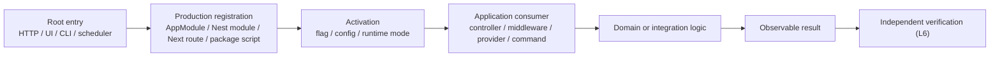

# Runtime Binding Graph — R01

Audit base: `01240549d451b452d89091ffe822ecf5bdaac1ec`

## Kanıt modeli

Tam capability-edge envanteri `runtime-capability-inventory.json` içindeki
`actualEntryPoints`, `registrationSites`, `providers`, `consumers`, `producers`,
`activationConditions` ve `evidenceRefs` alanlarındadır. CSV matrisi aynı graph’ın
karar yüzeyidir. Bu belge bütün 1.512 satırı tekrar etmek yerine composition root’ları,
kanıtlanan zincir desenlerini ve ilk kırılma noktalarını gösterir.



Bir edge yalnız source export veya test import’una dayanıyorsa graph’a production edge
olarak alınmadı. `operable=true` ve `VERIFIED_OPERATIONAL` yalnız SHA-bound dinamik
evidence ile verildi.

## Root ve capability dağılımı

| Entry point tipi | Capability |
|---|---:|
| HTTP | 993 |
| UI | 53 |
| CLI | 48 |
| SCHEDULER | 47 |
| MIGRATION | 1 |
| INTERNAL | 370 |
| QUEUE / EVENT / WEBSOCKET / production GraphQL | 0 |

Queue/event/WebSocket/GraphQL için production decorator, module registration veya
bağımlılık bulunmadı. Queue-benzeri yorum ve helper’lar production consumer
registration sayılmadı.

## Doğrulanmış binding zincirleri

### Nest HTTP root

```text
project/apps/api/src/main.ts
→ AppModule
→ production-reachable feature module
→ module.controllers
→ @Controller + HTTP method decorator
→ Nest HTTP router
```

Bu desen 993 HTTP capability için uygulandı. Controller yalnız kendi module dosyasında
tanımlı fakat module `AppModule` graph’ına ulaşmıyorsa ilk kırılma `module.controllers`
öncesidir.

### Global middleware

```text
AppModule.configure()
→ MiddlewareConsumer.apply(RequestIdMiddleware, HttpMetricsMiddleware)
→ forRoutes('*')
→ request chain
```

`RequestIdMiddleware` ve `HttpMetricsMiddleware` başlangıç taramasında yalnız provider
consumer aramasıyla yanlış biçimde unreachable görünüyordu. Manuel inspection sonrası
scanner `MiddlewareConsumer.apply()` kaydını production root olarak izlemektedir.

### Scheduler

```text
production-reachable module.providers
→ provider instance
→ @Cron / @Interval / @Timeout
→ Nest ScheduleModule
→ scheduled handler
```

47 scheduler capability bulundu. Schedule registration statik L2/L3 kanıtıdır;
handler side effect’i dinamik tetiklenmedikçe L6 değildir.

### CLI ve orchestration

```text
project/package.json script
→ project/scripts/orchestration-v2 public entrypoint
→ delivery manifest
→ shipped probe
→ observable Git/GitHub/repository state
→ SHA-bound sealed evidence
```

`GOV_COORD_V2_RUNNER_AUTHORITY`,
`GOV_COORD_V2_REQUEST_EXECUTOR_PATH`,
`MECHANICAL_GOVERNANCE_GATE` ve
`GOV_COORD_V2_POST_MERGE_DELIVERY_CLOSURE` capability’leri temiz detached worktree’de
L6 PASS aldı. Kanıt:
`evidence/delivery-evidence-01240549d451-sealed.json`.

### UI

```text
Next app/page.tsx
→ build-time route registration
→ repository navigation/action reference
→ browser entry
```

Route dosyası production bundle’a girse bile repository navigation/action consumer’ı
yoksa `ACTIVE_UNREACHABLE` bırakıldı. Private `_` segmenti production route üretmediği
için `INTENTIONALLY_DORMANT` sınıfındadır.

## Manuel doğrulanan kırılma graph’ları

### Manifest admin

```text
ManifestAdminController implementation
→ tests direct-instantiation
→ X production module.controllers registration
```

İlk kırılma production controller registration’dır. Yedi HTTP capability
`CODE_PRESENT_UNBOUND` kaldı. Guard, rate limiter, audit, retry worker ve idempotency
yardımcılarının varlığı controller’ı production’a bağlamaz.

### Break-glass

```text
BreakGlassController / CrossTenantAccessController
→ BreakGlassModule.controllers
→ X AppModule-reachable import
```

`BreakGlassModule` in-memory repository provider’ları içerir ve production import
graph’ında yoktur. On dört HTTP capability ve bağlı internal provider zinciri unbound
kaldı. Bunu otomatik import etmek cross-tenant attack surface ve persistence semantiği
seçimi gerektirdiğinden yapılmadı.

### Ops playbook

```text
PlaybookController / LeaseController / IncidentController
→ PlaybookModule.controllers
→ X DiagnosticsModule imports
```

`DiagnosticsModule`, validator/registry/matcher servislerini doğrudan sağlar; fakat
`PlaybookModule` import etmez. On iki HTTP capability unbound kaldı.

### UI consumer boşlukları

```text
/clients/[clientId]/edit page.tsx
→ X navigation/action reference

/clients/[clientId]/accounting page.tsx
→ X navigation/action reference
```

Dosyalar production route adayıdır; repository içinde kullanıcı aksiyonu bulunmadığı
için iki capability `ACTIVE_UNREACHABLE` sınıfındadır.

## Dinamik kanıt sınırı

Audit-base CI çalışması daha yeni `main` push’u nedeniyle concurrency cancellation ile
sonlandı; `Client Workspace Live Smoke` başlamadan iptal edildi. Başarılı web build,
vitest, architectural guard ve kısmi API suite L6 capability kanıtı olarak yükseltilmedi.
Bu audit base için bağımsız dinamik kanıt yalnız dört sealed orchestration capability’sini
kapsar.
