# Kanonik Sorumluluk Modeli — Tasarım & Uygulama Planı

> Durum: **TASARIM (WP-0).** Kararlar doğrulamaya dayalı; kod ayrı gated PR'larda (WP-1+).
> Tarih: 2026-06-23 · Branch: `docs/case-responsibility-canonical-model` · Baz: `main@797fb3f`
> Karar veren: Ulaş · Doğrulama: kanonik repo okundu (schema + servis + migration + test + design-doc)
> İlke: her iddia `dosya:satır` ile iğnelenir (yanlışlanabilir kalsın; bayatlamayı önle).

---

## 0. Kapsam ve tek cümlelik hüküm

Bu doküman, avukat–personel–dosya–görev ilişkisinde **sorumluluğun** nasıl modellendiğini
mevcut kod karşısında doğrular, kanonik hedef mimariyi çıkarır ve gated uygulama planını verir.

> **Tek hüküm:** Sistem, hukuk bürosundaki asıl ayrımı doğru yakalamış — *işi yapan kişi* ile
> *hukuken sorumlu olan* aynı şey değildir. Üç-seviye ayrım kodda gerçek. Mimari yeniden inşa
> GEREKMİYOR; kalan iş **gerçek-kişi operasyon owner değişimini audit'e bağlamak**, actor (`userId`)
> bilgisini zorunlu kılmak, `Case.createdById` eklemek, temporal sorgu üretmek, terminolojiyi
> kilitlemek ve devir/review/capability katmanlarını tamamlamaktır.

Bu doküman **kod değiştirmez.** İlk kod işi = WP-1a (operasyon owner-change audit).

---

## 1. Mevcut durum (KANITLI)

Aşağıdaki tablo, "Kanonik Sorumluluk Motoru Raporu"nun iddialarının kod karşısında doğrulamasıdır.
İlk rapor repo erişimi olmadan yazıldı; bazı "eksik" iddiaları faktüel yanlış çıktı (zaten kurulu).

| İddia | Hüküm | Kanıt |
|------|-------|-------|
| `CaseLawyer.isResponsible` + **DB partial unique index** | ✅ DOĞRU | `CREATE UNIQUE INDEX … WHERE "isResponsible" = true` — `prisma/migrations/20260619000000_case_lawyer_one_responsible_per_case/migration.sql:26`. Prisma partial index ifade edemez → ham SQL. Şemada düz `@@index([isResponsible])` görünür (`schema.prisma:1941`) → **DB-constraint iddiaları daima migration SQL'den doğrulanır.** |
| Owner = avukat XOR personel | 🟡 KISMİ | CHECK constraint **"both-set yasak"** (en fazla biri dolu), partial-unique değil — `migrations/20260621020000_m2g1_responsible_person_fks/migration.sql:25`. "Tam bir" (exactly-one) **uygulama katmanında** (M2-G3) — `schema.prisma:959-961`. İkisi de null = meşru. |
| Backend `allowNone=true` → owner'sız dosya | ❌ YANLIŞ/ESKİ | `allowNone` var (`responsible-candidates.service.ts:85-105`) ama oluşturulan dosya **tam sahipsiz değil**: `sorumluPersonelId: dto.sorumluPersonelId \|\| userId` → creator owner olur (`case.service.ts:1625`). `allowNone=true` yalnız **yeni gerçek-kişi** owner'ın (responsibleLawyer/Staff) geçişte boş kalmasına izin verir. → **İki paralel owner alanı.** |
| Sahipsiz kuyruk **eksik/karar gerek** | ❌ YANLIŞ | G1 kilitli tasarım: `docs/sahipsiz-dosyalar-design.md` (görünürlük + manuel atama + oto-backfill yasak). |
| Owner/sorumlu değişimi audit'siz ("en büyük açık") | ❌ ÇOK GENİŞ | `CASE_LAWYER` add/remove/promote/demote/batchUpdate **audit'leniyor** (old→new) — `case/__tests__/case-assignment-audit.spec.ts`. |
| Gerçek-kişi **operasyon owner** değişimi audit'siz | ✅ DOĞRU (P0) | `assignResponsiblePerson` → `case.update` yapıp döner, **audit YOK** — `responsible-candidates.service.ts:213-238`. Sınıf AuditService inject **etmiyor**. |
| Task MANUAL/AUTO_SYSTEM kapanış ayrımı | ✅ DOĞRU | `TaskResolutionType {MANUAL, AUTO_SYSTEM}` + `completedByUserId` (sistem=null) — `migrations/20260615070000_task_completion_attribution/migration.sql`, `schema.prisma:1502-1508`. |
| Escalation "yok/tasarım" | 🟡 KISMİ (eski) | **İki motor.** Operasyonel: `@Cron(EVERY_HOUR)` **flag yok = canlı** (`operational-escalation.service.ts:51`). Case-task (LEGAL_WORKFLOW, owner-first): kurulu+testli+cron-wired ama `CASE_TASK_ESCALATION_ENABLED` **default OFF** (`case-task-escalation.service.ts:40`); owner'a gider assignee'ye değil (`:81,218`); append-only `CaseTaskEscalationEvent`; ayar UI'ı var (`settings/office/page.tsx:742`). Eksik = explicit dry-run + go-live (D-G6). |
| `canBeResponsible` avukat eligibility | ✅ DOĞRU | `schema.prisma:1842` (Lawyer). |
| Staff capability matrisi | ✅ EKSİK | `StaffMember` (`schema.prisma:3102`) capability alanı yok; personel yalnız aktif+tenant ile süzülüyor. |
| Task review/sign-off | ✅ EKSİK | `Task` modelinde `reviewedBy`/`approvedBy` yok; approval makinesi başka modellerde (`BotTask.requiresApproval` `schema.prisma:5737`). |
| Terminoloji geniş | ✅ RİSK | UI "Dosya Sorumlusu" = gerçek-kişi owner (Lawyer veya Staff); legacy "Sorumlu Personel" hâlâ raporlarda (`reports/page.tsx:910`); "Hukuki Sorumlu Avukat" (`isResponsible`) ayrı eksen — UI keskin ayırmıyor. |

### 1.1. Audit ÜÇ AYRI KATEGORİDİR (kritik düzeltme — sert yazılır)

> **`CASE_LAWYER` audit'i var diye gerçek-kişi Dosya Operasyon Sorumlusu audit'i TAMAM DENEMEZ.**
> Üç ayrı sorumluluk değişimi = üç ayrı audit kategorisi. Biri var, ikisi belirsiz/eksik.

| # | Değişen şey | Model alanı | Audit durumu | Hüküm |
|---|---|---|---|---|
| K1 | Hukuki sorumlu avukat | `CaseLawyer.isResponsible` (+ rol) | add/remove/promote/demote/batch audit'li (`case-assignment-audit.spec.ts`) | **"audit yok" DENMEZ** — yeniden inşa etme. Eksik: `userId` actor. |
| K2 | Gerçek-kişi operasyon owner | `Case.responsibleLawyerId` / `responsibleStaffId` | `assignResponsiblePerson` audit'siz (`responsible-candidates.service.ts:213-238`) | **P0 BURASI** — WP-1a failing test bunu kesinleştirir. |
| K3 | Legacy operasyon owner | `Case.sorumluPersonelId` | `batchUpdate` özet audit var; tekil PATCH yolu belirsiz | Old/new + actor standardize edilmeli (WP-1c sweep). |

> Doğru genel ifade: *"Genel audit altyapısı var ve K1 audit'leniyor; fakat K2 (gerçek-kişi
> operasyon owner değişimi) audit'siz, K3'te actor eksik. 'Audit yok tezi çöktü' sonucu yalnız
> K1 için doğrudur; K2/K3 için P0 hâlâ geçerli. Bu nedenle WP-1'in adı 'owner audit inşa' değil,
> **Responsibility Audit Hardening**'tir."*

---

## 2. Doğrulanmış ölçek gerçekleri (planı küçülten 6 düzeltme)

| # | İlk plan varsayımı | Kanıtlı düzeltme |
|---|---|---|
| G1 | Yeni `actorUserId` alanı | **Mevcut `AuditLog.userId`** kullan (+`userName`/`userIp`). `AuditLog` zaten `userId`, `oldValues`, `newValues`, `metadata` taşır — `schema.prisma:4152-4182`; `AuditService.log(AuditLogInput)` bunları kabul eder — `audit/audit.service.ts:4-25`. **Yeni tablo/kolon YOK.** |
| G2 | "Responsibility Audit Hardening" tek paket | **Faz olarak ele al, gated sub-PR'lar.** "userId TÜM call-site'larda" büyük sweep → minik `assignResponsiblePerson` audit'iyle aynı PR'a girmez (repo tek-CI/küçük-PR disiplini). Sub-gate'ler: WP-1a→1b→1c→1d (§6). |
| G3 | P0 payload'ında `taskTransferDecision`+`criticalDeadlineSnapshot` | Bunlar **devir (WP-4)** şeması. WP-1a payload = old/new owner + userId + source. Transfer alanları WP-4'te `metadata`'ya. |
| G4 | Temporal sorgu geçmişi cevaplar | **Ufuk uyarısı:** yalnız enstrümantasyon noktasından İLERİ. Öncesi + userId-boş satırlar = "bilinmiyor" (repo'nun "geçmiş=bilinmiyor, ileriye dönük dürüst" felsefesi — `migrations/20260615070000…:3-4`). §5.2 cevap-biçimi tablosu. |
| G5 | "En az bir hukuki sorumlu" invariant'ı yaz | Invariant **zaten var** (lawyer'lı dosyada tam 1 — ASSIGN-4b/`planResponsible`, `case.service.ts:1850-1864`). WP-3 = **avukatsız/staff-owner dosyada sıfır isResponsible** guard'ı; **warn-first → block-later** (G5.1). |
| G6 | Tek choke-point | `assignResponsiblePerson` tek yazım kapısı (bulk-assign oradan geçer — `web/src/lib/bulk-assign-responsible.ts`). Ama **create de ilk owner'ı yazıyor** (`case.service.ts:1497`) → ilk-owner audit'i de eklenir. `batchUpdate` audit'i old-values/userId'siz → sweep'e (WP-1c) not. |

### G5.1 — P0-c (LEGAL_RESPONSIBLE_MISSING guard): warn-first, block-later

Staff operasyon owner'lı aktif hukuki dosyada `CaseLawyer.isResponsible=true` avukat yoksa = hukuki kırmızı bayrak.
İlk günden block legacy/migration dosyalarını kırar → geçiş modu:

| Aşama / dosya | Davranış |
|---|---|
| WP-3 başlangıcı / migration dönemi | **WARN + REPORT** |
| Intake / ön kayıt | WARN |
| Legacy imported dosya | REPORT + remediation |
| Veri temizliği sonrası, yeni aktif dava/takip | **BLOCK** |

---

## 3. Kanonik mimari — 5 katman

> **Ana prensip:** Tek kaynaklı değil, **çok katmanlı** sorumluluk. "Sorumlu kim?" sorusunun
> tek cevabı yoktur; 6 ayrı soru vardır (hukuken kim / operasyonel kim / işi kim / kapatan kim /
> denetleyen kim / geçmişte kim).

```mermaid
flowchart TD
  A["Case / Dosya"] --> B["1. Hukuki Temsil"]
  A --> C["2. Operasyon Sahipliği"]
  A --> D["3. Görev İcra"]
  A --> E["4. Kontrol & Hafıza"]
  A --> F["5. Yetkinlik & Devir & Denetim"]

  B --> B1["Hukuki Sorumlu Avukat<br/>CaseLawyer.isResponsible (partial-unique: en fazla 1)"]
  B --> B2["Diğer Dosya Avukatları<br/>CaseLawyer.role"]
  B --> B3["DB: en fazla 1 responsible · App: aktif hukuki dosyada tam 1 (ASSIGN-4b)"]

  C --> C1["Dosya Operasyon Sorumlusu<br/>Case.responsibleLawyerId XOR responsibleStaffId"]
  C --> C2["Legacy geçiş alanı<br/>Case.sorumluPersonelId (creator fallback)"]
  C --> C3["'canonical owner missing' ≠ 'tam sahipsizlik' — ayrı raporla"]

  D --> D1["Görev Atanan<br/>Task.assigneeId"]
  D --> D2["Görevi Kapatan<br/>Task.completedByUserId"]
  D --> D3["Kapanış Türü<br/>resolutionType: MANUAL / AUTO_SYSTEM"]

  E --> E1["AuditLog<br/>TEK authoritative event stream"]
  E --> E2["CaseTaskEscalationEvent<br/>append-only escalation history"]
  E --> E3["Temporal Query<br/>(read-model; ufuk-uyarılı)"]
  E --> E4["Ayrı OwnerChangeHistory tablosu YOK"]

  F --> F1["Staff Capability Matrix (WP-6)"]
  F --> F2["Task Transfer Decision (WP-4)"]
  F --> F3["İzin / Ayrılma / Vekil (WP-8)"]
  F --> F4["Legal Review / Sign-off (WP-7)"]
  F --> F5["Escalation Dry-run + Go-live (WP-5)"]
```



### Katman → gerçek alan eşlemesi

| Katman | Kanonik soru | MEVCUT (var) | EKLENECEK (yok) |
|---|---|---|---|
| 1 Hukuki temsil | Mesleki sorumlu avukat? | `CaseLawyer.isResponsible` + partial-unique + ASSIGN-4b invariant | Staff-owner'da legal-responsible guard (WP-3) |
| 2 Operasyon | Günlük takip kimde? | `responsibleLawyerId`/`responsibleStaffId` (XOR CHECK) + legacy `sorumluPersonelId` + sahipsiz görünürlük (G1) | owner-change audit (WP-1a); capability; devir; vekil |
| 3 Görev icra | Kim yaptı/kapattı? | `Task.assigneeId` + `completedByUserId` + `resolutionType` | Task review/sign-off (WP-7) |
| 4 Kontrol & hafıza | Geçmişi ispatlayabilir miyiz? | `AuditLog` (old→new, K1) + `CaseTaskEscalationEvent` + escalation motoru (flag-OFF) | K2/K3 audit + `userId` + `Case.createdById` + temporal + escalation dry-run |
| 5 Yetkinlik & devir | Üstlenebilir mi / değişince ne olur? | `canBeResponsible` (avukat) | staff capability; transfer decision; izin/vekil; review |

---

## 4. Invariant listesi (design doc başına çakılır)

**Hukuki temsil**
1. Bir dosyada en fazla bir `CaseLawyer.isResponsible=true` (DB partial-unique).
2. Avukatlı dosyada tam bir sorumlu avukat (ASSIGN-4b runtime invariant — zaten var).
3. Personel operasyon owner olabilir; hukuki sorumluluk avukattan kopamaz.
4. Hukuki sorumlu avukat değişimi `userId`'li audit üretir (K1 + WP-1c).

**Operasyon owner**
1. `responsibleLawyerId` ve `responsibleStaffId` aynı anda dolamaz (DB CHECK).
2. Canonical owner boşsa = **"canonical owner missing"**; legacy owner ile karıştırılmaz, ayrı raporlanır.
3. `assignResponsiblePerson` + create her gerçek değişimde old→new + `userId` audit üretir (K2 / WP-1a).
4. Owner değişiminde açık görev kararı alınır ya da "not decided" risk kaydı düşer (WP-4).

**Görev**
1. `Task.assigneeId` ≠ dosya owner.
2. Görevi kapatan `completedByUserId` ile tutulur.
3. Sistem kapanışı = `AUTO_SYSTEM` + `completedByUserId=null`.
4. Kritik hukuki görev review/sign-off olmadan nihai kapanmaz (WP-7).

**Audit**
1. User-driven audit event'lerde `userId` boş olamaz (WP-1a/WP-1c).
2. Audit tenant-scoped.
3. Sorumluluk değiştiren her command old/new tutar.
4. Temporal sorgu event stream'den (ufuk-uyarılı, §5.2).
5. Ayrı owner-history tablosu **authoritative yapılmaz** — `AuditLog` tek otorite (read-model türetilebilir).

**Escalation**
1. Operasyonel ve legal-workflow escalation ayrı kavramlar.
2. Legal-workflow escalation owner-first (assignee-first değil).
3. Canlıdan önce dry-run.
4. Escalation event append-only.
5. Flag-off motor = hazır altyapı, hukuki güvence değil.

---

## 5. Audit taxonomy ve event tasarımı (mevcut `AuditLog`'a eşlenmiş — yeni kolon yok)

### 5.1. Event tasarımı

Owner-change, mevcut `AuditLog` satırına yazılır. **Yeni tablo/kolon yok** (G1). K1/K2/K3 ayrı `metadata.changeType` ile ayrışır.

```ts
// WP-1a — gerçek-kişi operasyon owner değişimi (K2) + legacy alan (K3) aynı event'te old/new
audit.log({
  tenantId,
  action: 'UPDATE',                         // mevcut konvansiyon (CRUD verb); changeType ayrımı metadata'da
  entityType: 'CASE',
  entityId: caseId,
  userId,                                   // mevcut alan — @CurrentUser("id"); ZORUNLU
  oldValues: { responsibleLawyerId, responsibleStaffId, sorumluPersonelId },
  newValues: { responsibleLawyerId, responsibleStaffId, sorumluPersonelId },
  metadata: { changeType: 'OPERATION_OWNER', source: 'PATCH /cases/:id/responsible-person' },
});
```

- **Action-string kararı (WP-1a):** mevcut audit'ler `'UPDATE'` kullanıyor → konvansiyonu koru (`action:'UPDATE'` + `metadata.changeType`). Temporal sorgu `entityType='CASE'` + `metadata.changeType='OPERATION_OWNER'` ile filtreler. (Semantik `action:'CASE_OPERATION_OWNER_CHANGED'` daha sorgulanabilir ama konvansiyon kırar; tercih: metadata.changeType.)
- `reasonCode`/`reasonNote` → `metadata` (WP-4, devir ekranı ile).
- `taskTransferDecision`/`criticalDeadlineSnapshot` → **WP-4** `metadata` (G3 — WP-1a'ya gömülmez).
- Best-effort: `AuditService.log` zaten try/catch (audit hatası ana yazımı bozmaz — `audit.service.ts:25-`).

### 5.2. Temporal sorgu cevap-biçimi (ufuk-uyarılı, G4)

| Dönem | Cevap |
|---|---|
| Audit enstrümantasyonu (WP-1a) sonrası | "X tarihinde owner şuydu" (kesin) |
| Migration/backfill ile üretilmiş | "Migration'dan inferred" |
| Öncesi, kayıt yok | "Bilinmiyor / kayıt yok" |
| Yalnız current snapshot | "Şu anki durum bu; geçmişe kesin teşmil edilemez" |

> Yanlış kesinlik üretmek hiç kayıt olmamaktan tehlikelidir.

---

## 6. Gated uygulama planı

> WP-1 = **Responsibility Audit Hardening FAZI** (tek PR değil; sıralı sub-PR'lar, her biri tek-CI).

| WP | İş | Tip | Migration | Blast | Bağımlılık |
|---|---|---|---|---|---|
| **WP-0** | Bu design doc | docs | yok | — | — (commit+PR önce) |
| **WP-1a** ✅ MERGED #410 | `assignResponsiblePerson` (PATCH /responsible-person) owner-change audit (K2 old→new + userId + source). **Create ilk-owner audit ERTELENDİ → WP-1d-pre.** | davranış | yok | küçük | WP-0 |
| **WP-1b** | `Case.createdById` (additive FK; create'te doldur; backfill yok) | migration | additive | küçük | — |
| **WP-1c** | `userId` sweep — user-driven audit call-site'larda actor doldur (case create/update/delete, batchUpdate old-values) = AUDIT-USERID-HARDENING | davranış | yok | **büyük** | WP-1a |
| **WP-1d-pre** | **Create initial canonical operation owner audit** — `create` akışında ilk-atama owner audit'i (post-commit; tx-complete test harness'i gerektirir). Temporal için ZORUNLU ön-koşul: yoksa creation-anı owner'ı yalnız current snapshot / legacy alandan INFERRED'dır (kesin tarihsel event değil; §5.2). WP-1a'da fragile full-tx mock'tan kaçınmak için bilinçli ayrıldı. | davranış | yok | orta | WP-1a |
| **WP-1d** | Temporal sorumluluk read-model/rapor (ufuk-uyarılı, §5.2) | davranış | yok | orta | WP-1a, WP-1c, **WP-1d-pre** |
| **WP-2** | Terminoloji kilidi (UI etiketleri; §6.1) | frontend | yok | orta | WP-0 |
| **WP-3** | Staff-owner LEGAL_RESPONSIBLE_MISSING guard (warn-first→block-later, G5.1) | davranış | yok | küçük | WP-1a |
| **WP-4** | Görev devir ekranı + `TASK_TRANSFER_DECISION_RECORDED` audit | davranış | yok | orta | WP-1a |
| **WP-5** | Case-task escalation dry-run → D-G6 go-live | davranış | yok | küçük | — |
| **WP-6** | Staff capability matrix | karma | evet | büyük | WP-4 |
| **WP-7** | Task review/sign-off (kritik hukuki görev) | karma | evet | orta | — |
| **WP-8** | İzin/ayrılma/pasife alma + vekil/backup devri | davranış | belki | orta | WP-4 |
| **WP-9** | Legacy `sorumluPersonelId` cleanup (anlam temizliği önce; §6.2) | karma | evet | büyük | WP-1c, WP-1d |

**İlk iş = WP-1a (✅ TESLİM — #410).** Doğrulanmış tek blind spot (K2), en küçük blast-radius, additive
(migration yok), mevcut `AuditService` + `@CurrentUser("id")` (`case.controller.ts:105` deseni) reuse edildi.

### WP-1a net kapsam (✅ teslim — #410)
1. ✅ Failing test → yeşil: `assignResponsiblePerson` owner değişiminde old→new + actor(`userId`) + tenant audit.
2. ✅ `case.controller.ts` → `@CurrentUser("id") userId` servise geçer.
3. ✅ `ResponsibleCandidatesService` → `AuditService` inject; update ÖNCESİ eski owner oku → update → audit (§5.1).
4. ⏸️ **Create yolu ilk-owner audit'i ERTELENDİ → WP-1d-pre** — post-commit audit `create`'in `STOP`-sentinel
   test deseniyle erişilemiyor; tx-complete harness'i gerektirir. WP-1a'yı fragile full-tx mock ile
   kirletmemek için bilinçli ayrıldı. Temporal dürüstlük: ilk-atama audit'i gelene dek creation-anı owner'ı INFERRED (§5.2).
5. ✅ `responsible-candidates.spec` 21/21 + tüm `case` suite 289 pass + `tsc.prod` 0 hata. Canlı e2e ertelendi.

### 6.1. Terminoloji kilidi (WP-2)

| Eski/karışık | Kanonik |
|---|---|
| Sorumlu Avukat | **Hukuki Sorumlu Avukat** |
| Dosya Sorumlusu | **Dosya Operasyon Sorumlusu** |
| Sorumlu Personel | **Legacy/Eski Sorumlu Personel** |
| Görev Sahibi | **Görev Atanan** |
| Kapatan | **Görevi Kapatan** |
| Sistem kapattı | **Sistem Kapanışı / AUTO_SYSTEM** |
| Onaylayan | **Hukuki Kontrol Eden Avukat** |
| "Sorumlu" (tek başına) | **kullanma** |

### 6.2. Legacy cleanup ön-koşulu (WP-9)

`sorumluPersonelId` silinmeden ÖNCE: hangi raporlar/endpoint'ler yazıyor·canonical owner ile fark raporu·
backfill stratejisi·"legacy-only owner" dosya listesi·semantic mapping. Migration = veri taşıma değil, **anlam temizliği**.

---

## 7. Non-goals (anti-duplikasyon — YENİDEN İNŞA ETME)

- ❌ Ayrı `OwnerChangeHistory` tablosu — `AuditLog` tek otorite (gerekirse read-model türet, rebuild-edilebilir, authoritative değil).
- ❌ Sahipsiz kuyruğu yeniden tasarlama — G1 kilitli (`sahipsiz-dosyalar-design.md`).
- ❌ Escalation motorunu yeniden yazma — kurulu; eksik = dry-run + go-live.
- ❌ `CASE_LAWYER` audit'ini (K1) yeniden yazma — var.
- ❌ Yeni "owner" tablosu/kavramı — mevcut FK alanları yeterli.
- ❌ Otomatik/sessiz görev transferi — devir kararı açık ve audit'li olmalı.
- ❌ Otomatik/tahminle owner backfill — otorite admin'de (manuel).
- ❌ Audit geçmişini uydurma — enstrümantasyon öncesi "bilinmiyor".

---

## 8. Multitenant

`Case`, `Task`, `Lawyer`, `StaffMember`, `AuditLog`, `CaseTaskEscalationEvent` tenant-scoped kalır.
`assignResponsiblePerson` zaten `findFirst({ where: { id, tenantId } })` ile tenant guard'lı
(`responsible-candidates.service.ts:224`). WP-1a audit'i de `tenantId` taşır.

---

## 9. Hukuki/mesleki dayanak

- Avukatlık Kanunu m.34 — özen/doğruluk/onur + TBB Meslek Kuralları.
- TBB Meslek Kuralları — kamu güveni + işe sadakat; "herkes görür kimse sahiplenmez" kabul edilemez.
- ABA Model Rule 1.1 (yetkinlik), 1.3 (makul dikkat/hız) — süre/görev/owner zinciri izlenebilir olmalı.
- ABA Rule 5.1 (denetleyici avukat) / 5.3 (avukat-olmayan yardımcı denetimi) — personel owner olsa da
  hukuki sorumluluk avukatta kalır.
- SRA Effective Supervision (2026 güncel) + Code of Conduct for Firms — etkin denetim fiilen işlemeli;
  yetkisiz kişi iş yapsa da yetkili kişi sorumluluğu korur; kayıt/hesap-verebilirlik.

> Yazılımın asıl değeri görev dağıtmak değil; **denetim, sorumluluk ve kayıt zincirini** kurmaktır.

---

## 10. Sonuç

Mimari doğru ve büyük ölçüde kurulu. "Audit yok tezi çöktü" sonucu **yalnız K1 (CaseLawyer) için** doğrudur;
**K2 (gerçek-kişi operasyon owner) audit'siz, K3'te actor eksik** → P0 hâlâ geçerli. Kalan iş sıfırdan model
değil; **WP-1 Responsibility Audit Hardening fazı** (1a owner-change audit → 1b createdById → 1c userId sweep →
1d temporal), sonra terminoloji (WP-2), staff-owner guard (WP-3), devir (WP-4), escalation dry-run (WP-5),
capability/review/izin (WP-6/7/8) ve legacy cleanup (WP-9). **İlk gate: WP-1a.**
