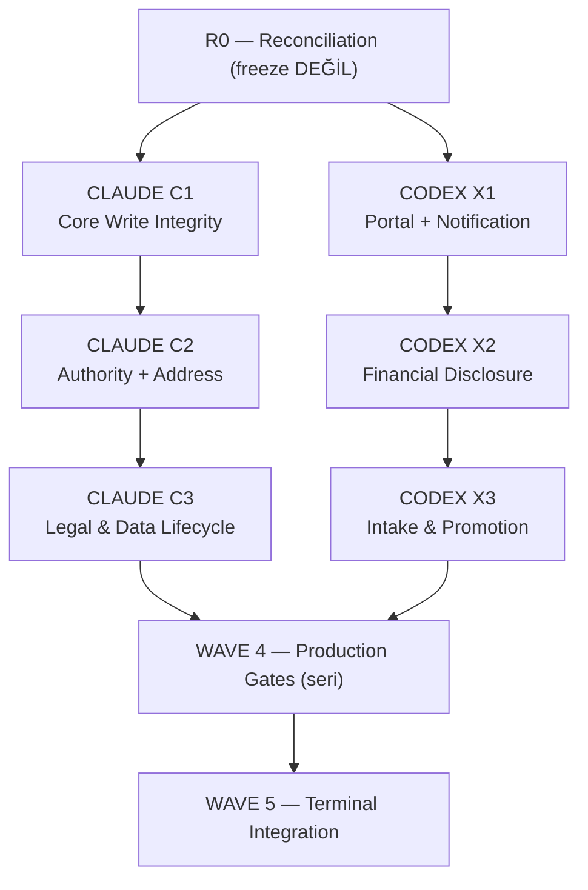

# CLIENT-MODULE-TERMINAL-COMPLETION-PROGRAM-R01 — MASTER EXECUTION PLAN

```text
Belge yolu   : project/docs/governance/CLIENT-MODULE-TERMINAL-COMPLETION-PROGRAM-R01/MASTER-PLAN.md
Durum        : OWNER RATIFIED / CANONICAL
Sürüm        : v1.0
Rol          : CLIENT/Müvekkil modülünün terminal tamamlanması için TEK kontrol ve bağlam kaynağı
Yetki        : IMPLEMENTATION AUTHORITY: NONE (bu belge kod yazmaz, kod yazdırmaz;
               her sayfa kendi owner GO'su ile başlar)
Üst otorite  : SYSTEM-CONSTITUTION.md → CLIENT-GOVERNANCE-CHARTER.md → (bu plan) → sayfalar
Ratifikasyon : OWNER DECISION — RATIFIED / CONTROL-PAGE GO-COMPLETE
               Envelope: OWNER-DECISION-R01.md (bu dizin)
Kanıt tabanı : CLIENT-MODULE-CANONICAL-RECONSTRUCTION-AND-CONCURRENCY-ANALYSIS-R01
               Analiz baseline main : f047e51e
               Materialization baseline (fresh origin/main) : e8e4d467
               Delta (f047e51e..e8e4d467, 11 commit) — CLIENT ürün kodunu değiştiren
               TEK commit: 789cf8f6 (PR #2107, OWN-13 I02-R3). Dokunduğu ürün path'leri:
                 app.module.ts · modules/client/{client.service,client.controller,
                 client-mutation-policy}.ts · modules/seed/** (+ seed-runtime-gate.ts YENİ)
               Diğer 10 commit governance/control-plane/RCV-COL — CLIENT ürün etkisi YOK.
               ŞEMA/MIGRATION DELTASI: YOK (schema.prisma ve prisma/migrations
               DEĞİŞMEDİ — VERIFIED, git diff --name-only).
               SONUÇ: Analizin şema/mimari bulguları bu tepede geçerlidir; SEED ve
               bulk-authorization bulguları (F-SEED-01..04, FIND-C2 backfill kısmı)
               #2107 ile KISMEN/TAMAMEN kapanmıştır → C1-B01 residual doğrulaması
               bunu fresh main'de yeniden kanıtlar (duplicate implementation AÇILMAZ).
PROGRAM LOCK : CLIENT ONLY
```

Bu plan ratifiye edildikten sonra **alt sayfalar kendilerine yeni iş uyduramaz ve sıralamayı
değiştiremez.** Yeni bulgu bu plana disposition için gönderilir (NEW FINDING RULE).

---

## 1. AMAÇ VE İKİ AYRI TERMINAL

Müvekkil modülünü, arkada iş bırakmadan, iki ajan hattı (CLAUDE / CODEX) arasında
çakışmasız ve sırası değiştirilemez biçimde terminal duruma getirmek.

**Üç durum ayrı tanımlanır ve BİRBİRİNİN YERİNE GEÇMEZ:**

```text
CODE_PRESENT
- Kod main'de.

ENGINEERING_COMPLETE
- Kod + test + CI + merge + cleanup + local/controlled runtime verification
- Production migration/flag/backfill UYGULANMIŞ OLMAK ZORUNDA DEĞİL

PRODUCTION_ACTIVE / PRODUCTION_COMPLETE
- İlgili migration/flag/runtime değişikliği GERÇEK hedef ortamda uygulanmış ve doğrulanmış
- Program seviyesinde: ENGINEERING_COMPLETE + WAVE 4 gate'lerinin TAMAMI:
    (a) C1 identity/CAS migration production'da APPLIED + doğrulandı
    (b) Financial Disclosure iki flag ON + canary + runtime doğrulandı
    (c) ARC-07 backfill I05 dry-run → I06 apply → I08 uygulandı ve doğrulandı
- Terminal CLIENT sertifikasyonu gerçek DB üzerinde PASS
```

**KURAL:** `MERGED ≠ ENGINEERING_COMPLETE` · `ENGINEERING_COMPLETE ≠ PRODUCTION_ACTIVE`.
Production migration, flag activation ve backfill uygulanmadan Müvekkil modülü
**PRODUCTION_COMPLETE ilan EDİLEMEZ.**

**SAYFA KAPANIŞ SEMANTİĞİ:** Production borcu olan bir sayfa, engineering bittiğinde
`SUSPENDED_FOR_ACTIVATION` olur — **TERMINAL CLOSED DEĞİL**. Successor sayfa başlayabilir;
activation borcu bu planda açık kalır. WAVE 4 geldiğinde **yeni sahip oluşturulmaz** —
borcu yaratan **aynı sayfa** tekrar açılır ve kendi activation bloğunu yürütür.

---

## 2. PROGRAM COEXISTENCE RULE (owner-ratified sınıflandırma)

```text
ACTIVE PRODUCT MODULE:              CLIENT ONLY
CLIENT IMPLEMENTATION:              ALLOWED — master plan sırasına göre
OTHER MODULE PRODUCT IMPLEMENTATION: NONE / FORBIDDEN
LEGACY GOVERNANCE / ORCHESTRA /
BLOCKER REMEDIATION:                ALLOWED TO CONTINUE TO TERMINAL CLOSURE
```

- Aktif tek ürün/modül geliştirme hattı CLIENT'tır.
- Eski sayfalardan kalan governance, orchestra ve blocker-remediation işleri terminal
  kapanışlarına kadar **devam edebilir**; bunlar başka modül product implementation'ı
  olarak sınıflandırılmaz.
- Bir governance PR yalnız **adı, etiketi, decision-log veya register kullanması**
  nedeniyle CLIENT competing writer SAYILMAZ.
- **Competing writer hükmü için exact write-path veya shared-contract overlap kanıtı
  ZORUNLUDUR.**
- Normal CI beklemesi, governance PR varlığı veya farklı governance kaydı CLIENT
  implementation blocker'ı DEĞİLDİR.
- Governance işi CLIENT master-plan dosyasının exact path'ine dokunuyorsa **yalnız ilgili
  yazım serialize edilir**; bütün CLIENT programı durdurulmaz.

---

## 3. MÜVEKKİL ANAYASASI VE BOUNDED CONTEXT (özet — kanon: CLIENT-GOVERNANCE-CHARTER.md)

- **Amaç (`SYS-GOV-013/015`):** client role/profile, mandate, instruction, client approval,
  client-level visibility sahibi. Tek başına receivable balance / legal allocation
  hesaplayamaz.
- **Owned:** Client profile/relationship · representation/mandate · instructions · approval
  requirements/limits · client-facing visibility · communication preferences · fee/contract
  context · client-facing creditor identity (`CaseClient` üzerinden).
- **NOT owned:** debtor identity (DEBTOR) · receivable authority/debt calc (RECEIVABLE) ·
  collection ledger (COLLECTION) · accounting journal (ACCOUNTING) · personnel/role (OFFICE) ·
  UYAP/document domain-law.
- **Invariants CL-INV-001..008.** Kritik: `Case.clientId` finansal/party authority OLAMAZ;
  creditor identity `CaseClient` ile; client-facing visibility ≠ tenant isolation;
  gerçek external approval ≠ staff proxy.
- **Mandate ayrımı:** canonical mandate evidence = `ClientPowerOfAttorney`. Flat
  `Client.canCollect/canWaive/canSettle/canRelease` = **legacy capability indicator**,
  legal mandate evidence DEĞİL. `MANDATE SCOPE ≠ EXECUTION AUTHORITY`.
- **Tekrarlanan üst-uyarılar:** `AUTHENTICATION ≠ AUTHORIZATION` · `TENANT ISOLATION ≠
  MUTATION AUTHORIZATION` · `ROUTE-LEVEL GATE ≠ SERVICE-WIDE GATE` · `INTERNAL CALL ≠
  TRUSTED CALL` · `CREATE YETKİSİ ≠ LIFECYCLE YETKİSİ` · `ADMIN ≠ ELEVATED` ·
  `CODE BOUND ≠ FLAG ON` · `MERGED ≠ RUNTIME ACTIVE`.

---

## 4. DOĞRULANMIŞ ALTI FAZ (reconstruction R01 çıktısı)

| Faz | Kapsam | Repo | Semantic | Runtime |
|---|---|---|---|---|
| P0 | Kanonik Analiz | CANONICAL-PRESENT | CLOSED | n/a |
| P1 | Blueprint Canonicalization | CANONICAL-PRESENT | CLOSED | n/a |
| P-CORE | Çekirdek ürün (identity/intake/approval/statement/intel/notification) | CANONICAL-PRESENT | CLOSED (feature) | NOT_PROVEN |
| P2 | Portal & müvekkil-yüzü güvenliği (U01/U02/U03) | CANONICAL-PRESENT | PARTIAL (Track B NOT AUTHORIZED) | UNKNOWN |
| P-FD | Financial Disclosure | CANONICAL-PRESENT | CLOSED (kod) | **DORMANT** (iki flag OFF) |
| P-ARC07 | ClientAddress lifecycle | CANONICAL-PRESENT | ENGINEERING COMPLETE | **PRODUCTION-WAIT** |

Cross-cutting (faz DEĞİL): OWN-13 (WORK_PACKAGE, PARTIAL) · OWN-11/VER-02 (CLOSED) ·
OWN-14 (GOVERNANCE, D03 DEFERRED) · Spring Cleaning (CLOSED) ·
TM3/payout/accounting (COLLECTION/ACCOUNTING **dependency**, CLIENT işi DEĞİL).

---

## 5. LANE SAHİPLİK MATRİSİ VE DEĞİŞTİRİLEMEZ SIRA



```text
CLAUDE: R0 → C1 → C2 → C3 → (WAVE 4) → INTEGRATION
CODEX:  R0 → X1 → X2 → X3 → (WAVE 4) → INTEGRATION
```

Her lane **kendi içinde seridir**. İki lane arasında yalnız §8 concurrency matrisinin
açıkça izin verdiği işler paralel yürür.

**YAPISAL KARAR — Address Lifecycle CLAUDE lane'indedir (Codex'te DEĞİL).**
Gerekçe (kanıt): `client-address.service.ts`, `client-address-lifecycle.ts`,
`client-address-resolver.ts` **`modules/client/` altındadır** ve adres mutasyon yetkisi
OWN-13 I02-R2 (#2096) ile **`client-mutation-policy.ts`'i OWN-13 ile PAYLAŞIR**.
Adresi Codex'e vermek garantili same-file + shared-contract çakışması üretirdi.

---

## 6. MIGRATION OWNERSHIP (program-boyu rol — tek sayfa DEĞİL)

```text
MIGRATION OWNER:            CLAUDE LANE
ACTIVE MIGRATION WRITER:    Aynı anda YALNIZ BİR Claude görevi
CODEX:                      Migration YAZAMAZ; ihtiyacı master plana bildirir
C1 KAPANDIKTAN SONRA:       C3 gerekçeli migration üretebilir — yine Claude tarafından
                            ve SERİ yürütülür
```

`project/apps/api/prisma/` standing grant'ta **PROHIBITED** → her migration ayrıca
**owner grant genişletmesi** ister. İki migration asla paralel yazılmaz.

---

## 7. ALLOWED / FORBIDDEN PATH MATRİSİ

Mevcut `STANDING-GRANT-CLIENT-LIVE-R01.json` (canonical):
- **allowedPathRoots:** `client/`, `client-statement/`, `client-notification/`,
  `client-financial-disclosure/`, `client-settlement/`
- **prohibitedPathRoots:** `coordination-v2/schemas/`, `coordination-v2/activation/`,
  `orchestration-v2/`, **`prisma/`**, `.github/`, **`client-intake-public/`**,
  **`client-intake-link/`**
- **allowedTaskClasses:** TEST_ONLY_CHARACTERIZATION, BOUNDED_CODE_FIX

| Sayfa | Allowed (yazım) | Forbidden | Grant durumu |
|---|---|---|---|
| C1 | `modules/client/`, `modules/seed/`, `app.module.ts`, `prisma/` (migration) | diğer lane path'leri, `portal/`, `client-intake-*/` | **EXPANSION REQUIRED** (seed, app.module, prisma) |
| C2 | `modules/client/` (core + address), `client-mutation-policy.ts` | `seed/`, `prisma/`, `portal/`, `client-intake-*/`, `client-financial-disclosure/` | grant içi (adres+core) |
| C3 | `modules/client/`, POA ilişkili client kodu, (gerekirse `prisma/`) | diğer lane path'leri | migration gerekirse **EXPANSION REQUIRED** |
| X1 | `client-notification/`, `modules/portal/` | `modules/client/`, `seed/`, `prisma/`, `client-intake-*/` | **EXPANSION REQUIRED** (`portal/`) |
| X2 | `client-financial-disclosure/`, `client-settlement/` **yalnız `*financial-disclosure-command*`** | `modules/client/`, `prisma/`, COLLECTION payout/journal dosyaları | grant içi (pinlenmiş) |
| X3 | `client-intake-public/`, `client-intake-link/`, `client-intake-review/`, `client-intake-promotion/` | `modules/client/`, `client-mutation-policy.ts`, `prisma/` | **EXPANSION REQUIRED** (prohibited roots) |

---

## 8. ORTAK SÖZLEŞMELER — TEK WRITER KURALI

| Shared contract | Kural | Tek writer |
|---|---|---|
| `prisma/schema.prisma` + `prisma/migrations/` | Tek aktif migration writer, seri | **CLAUDE LANE** (§6) |
| `client-mutation-policy.ts` + eligibility semantiği | Tek-writer; diğer lane **read-only**; yeni primitive gerekirse Claude üretir, Codex tüketir | **CLAUDE C2** |
| `office-approval.isApproverEligible` | Read-only shared. **DİKKAT:** eligibility 3 farklı yerde farklı (office MANAGER-hariç; disclosure MANAGER-dahil; payout MANAGER-dahil). "Birleştirme" refactor'ü YASAK — sessizce bir yolu genişletir | **CLAUDE C2** (karar), diğerleri rebase |
| `app.module.ts` (composition root) | Değişiklikler tek noktadan serialize | **CLAUDE** |
| `Client` Prisma tablosuna yazım | Yalnız `client/` + `seed/` (ikisi de Claude) | **CLAUDE** |
| `ClientService.create` / bulk predicate | Codex tüketir, yazmaz | **CLAUDE** |

---

## 9. HER ALT GÖREV İÇİN ZORUNLU ÖN KANIT

**"Farklı dizin" tek başına PARALLEL_SAFE hükmü için YETERSİZDİR.** Her alt görev
başlamadan önce üçü de üretilir:

```text
EXACT WRITE MANIFEST:      Değiştirilecek dosyaların kesin listesi
SHARED CONTRACT MANIFEST:  Okunacak/değiştirilecek ortak sözleşmeler
MERGE ORDER:               Diğer lane'in hangi SHA / contract çıktısından sonra başlanacağı
```

Bu kontrol **yeni iş icat etmek için değil**, master plandaki paralellik varsayımını
doğrulamak içindir. Manifest çakışırsa iş **serialize edilir**, iptal edilmez.

---

## 9-B. BLOCKER DISCIPLINE (program geneli — her sayfa için bağlayıcı)

```text
Hiçbir sayfa:
- Governance/orchestra/control-plane onarımı BAŞLATMAZ.
- Yeni SA/EG/grant/binding ÜRETMEZ.
- gh-guard -Repair ÇALIŞTIRMAZ.
- Branch protection/ruleset DEĞİŞTİRMEZ.
- Admin/bypass KULLANMAZ.
- Başka PR'ın CI veya merge sorununu SAHİPLENMEZ.
- decision-log/register biçim eksikliğini product blocker SAYMAZ.
- Normal CI beklemesini BLOCKED SAYMAZ.
- Başka lane'in ayrık çalışmasını competing writer SAYMAZ.
- Exact path kanıtı olmadan competing writer İLAN ETMEZ.

STATUS SINIFLARI:
WAITING_FOR_CI · WAITING_FOR_PREDECESSOR · WAITING_FOR_OTHER_SESSION ·
WAITING_FOR_CONTROL_PLANE · ACTIVATION_PENDING_WAVE_4 · BLOCKED_EXACT

BLOCKED_EXACT yalnız DÖRDÜ BİRDEN sağlanırsa:
1. Mevcut exact bloğun acceptance'ı teknik olarak ilerleyemiyorsa,
2. Engel granted scope içinde çözülemiyorsa,
3. Engel repository/current-main kanıtıyla doğrulanmışsa,
4. Devam etmek veri kaybı veya yetki ihlali yaratacaksa.

CONTROL-PLANE KAYNAKLI MERGE SORUNU:
Product kapsamını genişletme · control-plane onarımı yapma · tek kısa dependency
handoff ver · bloğu WAITING_FOR_CONTROL_PLANE bırak · SIRAYI ATLAMA.
```

## 9-C. CI MANIFEST RULE

`ci-manifests/pure/client-portal.txt` **tek fiziksel dosyadır** ve hem client hem portal
speclerini taşır → C1 (CLAUDE) ile X1 (CODEX) arasında **gerçek ortak writer yüzeyi**
(OBSERVED).

```text
- Her sayfa yalnız KENDİ testlerini bağlayan exact satırları yazar.
- Kimse diğer lane'in manifest satırlarına DOKUNMAZ.
- Aynı manifest gerekiyorsa TEK MANIFEST WRITER atanır ve işler SERIALIZE edilir.
  WAVE 1 MANIFEST WRITER = CLAUDE C1. X1'in manifest ihtiyacı, C1'in açık blok PR'ı
  merge olduktan SONRA append-only olarak eklenir (X1 rebase eder).
- `__tests__/*` wildcard EXACT WRITE MANIFEST DEĞİLDİR; her blok başlamadan gerçek
  dosya adları listelenir.
```

## 9-D. CONDITIONAL PRODUCTION AUTHORIZATION (WAVE 4)

Production gate'i olan her sayfa (C1, C3-koşullu, X2, C2-ARC07) WAVE 4'te **aynı sayfa
tarafından** yürütülür; yeni sahip oluşturulmaz. Koşullu yetki (C1 için GRANTED):

```text
EXECUTE ONLY IF (hepsi): fresh backup/restore yolu doğrulandı · duplicate inventory
çıkarıldı · veri ön-temizliği deterministik ve audit edilebilir · migration
staging/temiz DB/existing DB üzerinde PASS · rollback veya forward-repair planı mevcut ·
required CI PASS · ilgili write freeze uygulanmış · dry-run kabul kriterleri içinde ·
veri kaybı veya çözümsüz duplicate YOK

IF ALL PASS: ayrı owner GO istemeden apply → verify → evidence → close.
IF ANY FAIL: production mutation YAPMA; BLOCKED_EXACT kanıtını getir.
```

## 10. R0 — RECONCILIATION (FREEZE DEĞİL)

R0 çalışan governance işlerini **durdurmaz**. Görevi:

1. Açık PR'ları sınıflandır: `CLIENT_PRODUCT` / `LEGACY_GOVERNANCE` / `CONTROL_PLANE` /
   `OTHER_MODULE_PRODUCT`.
2. Yalnız **exact dosya çakışması** varsa merge sırası koy.
3. Normal governance çalışmasını CLIENT blocker'ı **sayma**.
4. #2107'yi mevcut CLIENT teslimatı olarak plana **dahil et**; duplicate implementation
   başlatma.

### R0 tespiti — #2107 (exact diff ile sınıflandırıldı)

```text
PR #2107  claude/client-own-13-i02-r3-bulk-backfill-i01
SINIF:    CLIENT_PRODUCT / OWN-13 I02-R3
DURUM:    MERGED — mergedAt 2026-08-02T14:24:01Z
          merge SHA 789cf8f622a71aad9e4b4f642e9525811f65dfbd
          git merge-base --is-ancestor 789cf8f6 origin/main = ANCESTOR_OK (VERIFIED)
HÜKÜM:    CANONICAL_EARLY_DELIVERABLE (kapsam beklenenden GENİŞ)
```

**Koşullu disposition kuralı (gelecekte benzer durumlar için bağlayıcı):**

```text
IF MERGED:          Fresh main'den residual doğrula ve REUSE ET.
IF CLOSED UNMERGED: CANONICAL_EARLY_DELIVERABLE SAYMA. Branch/WIP'i salt-okunur incele.
                    Kayıpsız disposition sonrası kalan işi ilgili sayfanın scope'unda
                    tamamla.
IF OPEN:            Sahip session'a DOKUNMA. WAITING_FOR_PREDECESSOR kullan.
                    Duplicate implementation BAŞLATMA.
```

#2107 için geçerli dal: **MERGED** → C1-B01 residual doğrulama + reuse.

Exact diff kanıtı (17 dosya, +881/−52) şunları kapatıyor:

| Reconstruction bulgusu | #2107'de karşılığı |
|---|---|
| F-SEED-01 anonim `public-institutions` | `@UseGuards(JwtAuthGuard)` eklendi + regresyon testi |
| F-SEED-02 env gate yok | YENİ `seed-runtime-gate.ts` — production **koşulsuz kapalı** (D01), test ortamı açık, diğerleri explicit flag (D02) |
| F-SEED-03 seed `ClientService`'i baypas ediyor | `seedClients` artık `ClientService.create` (raw `prisma.client.create` YOK) + actor threading |
| F-SEED-04 `fix-clients` audit/rol yok | tenant-scoped `updateMany`+count (D09) + checksum guard + authz |
| FIND-C2 (kısmen) `backfill-contact-followup` elle `role==='ADMIN'` | merkezi `assertCanRunElevatedClientBulkOperation` (D04/D06) + audit |

**SONUÇ:** C1'in seed kapsamının **büyük kısmı** ve C2-R3 bu PR ile teslim edilmiştir.
**DUPLICATE R3 VEYA DUPLICATE SEED İŞİ AÇILMAZ.** C1/C2 kapsamı §11'de buna göre
yeniden dengelenmiştir.

### R0 tespiti — diğer açık PR'lar

```text
PR #2110  codex/merge-flow-transition-generic-create-repair-r01
SINIF:    LEGACY_GOVERNANCE / CONTROL_PLANE
HÜKÜM:    CLIENT ürünüyle exact path veya contract kesişimi YOK → devam eder,
          CLIENT program blocker'ı SAYILMAZ.
```

### R0 çıkış kriterleri

- [ ] #2107 terminal duruma ulaştı (merge veya sahip session tarafından kapatıldı)
- [ ] #2107 sonrası **fresh main** alındı ve C1/C2 kapsamı bu tepeye göre re-derive edildi
- [ ] Açık PR sınıflandırma tablosu güncel
- [ ] Master plan owner tarafından ratifiye edildi
- [ ] Grant genişletme kararları alındı (§13)

---

## 11. SAYFA TANIMLARI (giriş/çıkış kriterleriyle)

### CLAUDE-CLIENT-C1 — Core Write Integrity
**Amaç:** Client kimlik satırına giden her yazımın tek guarded/audited/race-safe sınırdan
geçmesi. **Program migration writer'ı burada başlar.**

**Yapı: TEK SAYFA, 6 SIRALI ENGINEERING BLOK + 1 ERTELENMİŞ ACTIVATION BLOĞU.**
Sıra mutasyonu FORBIDDEN. Her blok ayrı branch/worktree/PR olabilir; sayfa tüm programı
sonuna kadar yönetir. **Blok başına owner onayı İSTENMEZ** (tek seferlik GO-COMPLETE).

```text
C1-B01  #2107 residual doğrulama (reuse — duplicate açma)
C1-B02  FIND-C1 partial-update displayName/name veri kaybı (HIGH)
C1-B03  Bulk atomiklik ve failure davranışı (F-SEED-05/06) — model KANITLA seçilir
C1-B04  Duplicate identity ve dedup doğruluğu (FIND-C5 + yarış profili)
C1-B05  FIND-C3/C4 DESIGN GATE + migration paketi   → ACTIVATION_PENDING
C1-B06  Test ve regresyon sertifikasyonu            → ENGINEERING_COMPLETE
C1-PROD-ACTIVATION (WAVE 4, AYNI SAYFA)             → PRODUCTION_ACTIVE
```

**ÇÖZÜM DAYATMASI YASAK.** B03 için `$transaction`, B05 için partial unique index veya
version/CAS kolonu **peşinen zorunlu çözüm DEĞİLDİR**; ikisi de sayfadaki outcome/design
gate ile **kanıta dayanarak** seçilir (mevcut duplicate profili, null/empty normalization,
PostgreSQL unique davranışı, FK ilişkileri, API backward compatibility, lost-update
senaryoları, tüm write path'lerin version taşıyabilmesi). C3 ve C4 aynı migration'a
**yalnız atomik birlikte deploy zorunluluğu kanıtlanırsa** alınır; aksi hâlde aynı
migration owner altında **seri** paketlenir. Detay: `CLAUDE-CLIENT-C1.md` §7.

**Entry:** R0 kapalı · master plan ratifiye · grant expansion (seed/app.module/prisma).
**Engineering exit (B06):** Client tablosuna giden her yazım fail-closed yetkili +
audited + checksum'lı; atomiklik/dedup davranışı kanıtlanmış; migration yazıldı ve CI'da
doğrulandı. → Sayfa **SUSPENDED_FOR_ACTIVATION** (TERMINAL CLOSED DEĞİL); **C2 başlar**.
**Terminal exit:** WAVE 4'te **aynı sayfa** C1-PROD-ACTIVATION'ı koşullu yetkiyle yürütür.

---

### CLAUDE-CLIENT-C2 — Mutation Authority Completion + Address Lifecycle
**Amaç:** OWN-13 residuallerini kapatmak ve adres yaşam döngüsünü aynı yetki sözleşmesi
altında tamamlamak. **`client-mutation-policy.ts`'in tek writer'ı.**

**Yapı: TEK SAYFA, 8 SIRALI ENGINEERING BLOK + 1 ERTELENMİŞ ACTIVATION BLOĞU.**
Bloklar, ratifiye edilmiş sıralı alt görevlerin (v1.0, madde 1–8) **birebir karşılığıdır**;
yeni iş eklenmemiş, sıra değiştirilmemiştir. Blok başına owner onayı İSTENMEZ.

```text
C2-B01  R3 reconcile-only (#2107 EARLY-CANONICAL — duplicate açma)
C2-B02  R4 workspace-command authorization (FIND-C2)     [owner rol politikası ön koşulu]
C2-B03  R5 intake-link mutation authority                → CROSS-LANE: X3 UNBLOCKED
C2-B04  R6 POA upload authority
C2-B05  R7 OWN-10/12/15 (ratifiye/deferred exact sınıflandırma)
C2-B06  Notification/workspace authority primitive       → CROSS-LANE: X1 CN-1 UNBLOCKED
        [B02 ile AYNI owner rol politikası ön koşulu]
C2-B07  Address lifecycle — ARC-07 mühendislik (isCurrent inert defekti kapanır)
C2-B08  Fail-closed sertifikasyonu (core + adres)        → ENGINEERING_COMPLETE
C2-PROD-ACTIVATION (WAVE 4, AYNI SAYFA)                  → PRODUCTION_ACTIVE
        ARC-07 I05 dry-run → I06 apply → I08 legacy-flat reduction
```

**ÇÖZÜM DAYATMASI YASAK.** B02'de gate'in yeri (servis sınırı / ortak command-authority
helper / mevcut policy sınıflandırmasının genişletilmesi) ve B07'de `isCurrent`'ın nasıl
etkinleştirileceği **peşinen belirlenmemiştir**; her ikisi de sayfadaki outcome gate ile
kanıta dayanarak seçilir. Detay: `CLAUDE-CLIENT-C2.md` §7.

**ÖN KOŞUL (bilinen owner kararı):** B02 ve B06 **aynı** ratifiye edilmemiş karara bağlıdır
— §13/11 "iletişim/workspace gönderim rol politikası". Karar alınmadan B02 implementation'a
başlamaz; blok `WAITING_FOR_OWNER_DECISION` ile bekler ve **sıra atlanmaz**.

**Entry (AMENDED 2026-08-02):** Global C1 ENGINEERING_COMPLETE şartı **KALDIRILDI** —
C2, C1 devam ederken açılır. Yerine **§12-A blok-seviyesi pre-flight ZORUNLUDUR**.
C2-B01 (read-only residual reconciliation) **hemen başlayabilir**.
Ayrıca: eligibility sözleşmesi dondurulmuş · §13/11 kararı B02/B06 için alınmış olmalı.
**Engineering exit (B08):** Her `client/` mutasyonu (core + adres) fail-closed yetkili +
audited; OWN-13 residualleri kapalı veya açıkça owner-deferred; **B03 + B06 primitive'leri
canonical ve DONDURULMUŞ** (X3 ve X1 serbest); ARC-07 mühendisliği tamam.
→ Sayfa **SUSPENDED_FOR_ACTIVATION** (TERMINAL CLOSED DEĞİL); **C3 başlar**.
**Terminal exit:** WAVE 4'te **aynı sayfa** C2-PROD-ACTIVATION'ı yürütür — ancak koşullu
production yetkisi C2 için **HENÜZ VERİLMEDİ** (owner ratifikasyonu C1-PROD-ACTIVATION
içindi) → **OWNER DECISION REQUIRED**.

---

### CLAUDE-CLIENT-C3 — Legal & Data Lifecycle Controls
**Amaç:** Hukuki yükümlülükleri **fail-closed teknik kontrole** dönüştürmek.
Hukuk iddiası ile teknik kontrol AYRI tutulur.

Sıralı alt görevler:
1. KVKK **işleme dayanağı** modeli (md.5) — hangi faaliyet hangi bende dayanıyor.
2. **Aydınlatma** + ilgili kişi başvuru akışı (md.10/11/13).
3. **Saklama / arşivleme / silme + legal hold** (POL-E-R1; POL-E 8 koşulu).
4. Notlarda **özel nitelikli veri** yönetimi (md.6/3, md.6/4 Kurul önlemleri).
5. **Vekâletname ↔ capability ayrımı**: `canCollect/canSettle/canWaive/canRelease`
   zincirini geçerli ve kapsam-uyumlu `ClientPowerOfAttorney`'e bağlama.
6. **UYAP aktarım gate'i** (md.8) — temsil + veri aktarım koşulu, fail-closed.
7. **Audit bütünlüğü** tekleştirme.
8. Gerekiyorsa **Claude-owned serial migration** (§6 kuralıyla; C1 kapandıktan sonra).

**Entry:** C2 canonical kapalı · **owner legal ratifikasyonları alınmış** (§13).
**Exit:** Hukuki kontroller audited fail-closed teknik gate olarak çalışıyor;
ratifiye edilmemiş hiçbir hukuk kuralı koda gömülmemiş.

---

### CODEX-CLIENT-X1 — Portal, Notification & Client-Facing Security
Sıralı alt görevler:
1. **CN-2** DTO validation (send/template gövdeleri inline type → decorated class;
   `@MaxLength`/`@ArrayMaxSize`/`@IsEnum`) + **CN-3** error sanitization. *(Wave 1'de
   yapılabilir — bağımsız, mekanik.)*
2. **CN-1 CHARACTERIZATION ONLY** — mevcut davranışın tespiti ve testi.
   **AUTHORIZATION IMPLEMENTATION WAVE 1'DE YASAK.**
3. P2 U01/U02 durum doğrulaması · U03 field-visibility · object-scope/BOLA · portal
   projection · token/session güvenliği · workspace URL erişilebilirlik.
4. U03 Track B (**owner authorization gerekir**).
5. **CN-1 WIRING** — yalnız Claude C2'nin notification/workspace authority primitive'i
   **canonical ve donmuş** olduktan sonra; Codex kendi rol politikasını **ÜRETMEZ**.

**Entry:** R0 kapalı · grant expansion (`portal/`).
**Exit:** portal/notification yüzeyi validated + sanitized + (primitive geldikten sonra)
authorized; `client/`, `seed/`, `prisma/`'ya **hiç dokunulmadı**.

---

### CODEX-CLIENT-X2 — Financial Disclosure
Sıralı alt görevler:
1. P-FD kod + migration durumunun **fresh doğrulanması**.
2. `#1629` migration **live-apply kanıtı** (şu an UNKNOWN).
3. Write flag → publication flag + provider allowlist.
4. Approval / publication yollarının route-erişilebilirliği (şu an DORMANT).
5. Fail-closed davranış doğrulaması.
6. Canary → runtime/production doğrulaması **(WAVE 4 gate)**.
7. Financial Disclosure sertifikasyonu.

**Kapsam pini:** yalnız `client-financial-disclosure/` + `client-settlement/` içindeki
**exact `*financial-disclosure-command*` dosyaları**. COLLECTION payout/journal/accounting
dosyalarına **özellik eklemez**; mevcut CLIENT bağımlılığını yalnız **tüketir**.

**Entry:** X1 canonical kapalı · şema/contract freeze doğrulandı.
**Exit:** ENGINEERING tarafı kapalı; flag activation + canary WAVE 4'te.

---

### CODEX-CLIENT-X3 — Intake & Promotion Integrity
Sıralı alt görevler:
1. Intake pipeline bütünlüğü (public → review → promotion).
2. **CIP-1** rate-limit/XFF sertleştirme · **CIP-2** bearer-token notu.
3. **CR-1** review ≠ promote ayrımı (owner policy kararı gerekir).
4. **C2-R5 authorization primitive'ini TÜKETİR** (üretmez).
5. Intake testleri.

**Kısıt:** `modules/client/`, `client-mutation-policy.ts`, `prisma/`'ya **DOKUNMAZ**.
**Entry:** X2 canonical kapalı · **C2-R5 primitive'i canonical** · grant expansion
(`client-intake-public/`, `client-intake-link/` PROHIBITED).
**Exit:** intake yüzeyi authorized + rate-limited + test edilmiş.

---

## 12. CONCURRENCY MATRİSİ VE WAVE HARİTASI

### 12-A. INTRA-LANE CONCURRENCY — C1 ∥ C2 (OWNER AMENDMENT, 2026-08-02)

```text
GLOBAL C1→C2 PREDECESSOR:   REMOVED
BLOCK-LEVEL PREDECESSOR:    MANDATORY
C2 PAGE START:              C1 devam ederken açılabilir
C2-B01:                     Hemen başlayabilir (read-only residual reconciliation)
C1'İN TAMAMININ BİTMESİ:    BEKLENMEZ
C2 SIRASI:                  DEĞİŞTİRİLMEZ
```

**Her C2 bloğundan önce (istisnasız):**

```text
1. Aktif C1 bloğunun EXACT WRITE MANIFEST'i alınır (repository-truth: C1 blok çıktısı +
   açık PR `--json files` + branch `git diff --name-only`; konuşma iddiası kanıt DEĞİL).
2. C2 bloğunun EXACT WRITE MANIFEST'i yazılır.
3. SHARED-CONTRACT MANIFEST karşılaştırılır (dosya adı yetmez: aynı sözleşmeyi yazan
   iki iş de çakışmadır).
4. Çakışma YOK → C2 bloğu yürür.
   Çakışma VAR → YALNIZ o C2 bloğu WAITING_FOR_OTHER_SESSION; sıra ATLANMAZ,
   sonraki bloğa GEÇİLMEZ, C1'e DOKUNULMAZ.
5. Blok çıktısına eklenir:
   PRE-FLIGHT: C1 aktif blok=<ID/PR> · çakışma=<YOK|VAR:liste> · karar=<YÜRÜDÜ|BEKLEDİ>
```

**Aynı protokol simetriktir:** C1 de kendi bloğuna başlamadan C2'nin aktif manifest'ini
kontrol eder; çakışma varsa yalnız o C1 bloğu bekler.

**LANE DOSYA SAHİPLİĞİ (bağlayıcı):**

| Sahip | Dosya/dizin | Diğer lane |
|---|---|---|
| **C1** | `client.service.ts` · `seed/` · `prisma/` · `app.module.ts` | C2 YAZAMAZ |
| **C2** | `client-mutation-policy.ts` · aktif address/authority dosyaları | C1 YAZAMAZ |
| Dinamik | Karşı lane'in aktif blok dosyaları | o blok süresince yazılamaz |

**Bilinen kısıt (kayıt):** C2-B02'nin (R4) hedef servis gövdeleri `client.service.ts`
içindedir ve bu dosya C2'ye kapalıdır. Sayfanın outcome gate'i gate'in yerini serbest
bıraktığı için (controller · ortak command-authority helper · policy sınıflandırması)
bu otomatik blocker DEĞİLDİR; `client.service.ts` gerektiren çözüm seçilemez, başka
çözüm de kanıtla mümkün değilse blok `WAITING_FOR_OTHER_SESSION` olur ve bu plana
disposition için bildirilir.

### 12-A-2. DOĞRULANMIŞ ÇAPRAZ-LANE BAĞLARI (adversarial verification, 2026-08-02)

"Dosyalar ayrık" **yetmez** — aşağıdaki üç bağ dosya-manifest karşılaştırmasının
GÖREMEYECEĞİ türdendir ve pre-flight'ın **shared-contract** adımında aranır.

**XL-1 · C1 → X1 · DERLEME + DI BAĞIMLILIĞI — EN KRİTİK (VERIFIED)**

```text
client.service.ts:6     import { NotificationDispatcherService, type DispatchResult }
                          from '../client-notification/notification-dispatcher.service'
client.service.ts:320   constructor-injected provider
client.service.ts:2562 · :2574 · :2611   DispatchResult['status'] yapısal bağımlılık
client.module.ts:12 · :16                ClientNotificationModule module-level DI
```

Yani **C1'in ana dosyası, X1'in sahip olduğu dosyaya derleme ve DI seviyesinde bağımlıdır.**
X1 `DispatchResult`'ın alan setini değiştirir, `DispatchStatus`'ı daraltır veya
dispatcher'ın provider kimliğini değiştirirse: C1'in `client.service.ts`'i
`tsc --noEmit`'te kırılır ve ClientModule boot'ta DI hatası verir.

**TEHLİKE KATSAYISI:** Bu kırılmayı jest **yakalayamaz** (`diagnostics: false`); yalnız
`ci.yml` Type check adımı yakalar ve o adım **required OLMAYAN** "Test Suite" job'ının
içindedir → kırık kod main'e **inebilir**.

**KURAL:** X1, `notification-dispatcher.service.ts`'in **public shape'ini**
(`DispatchResult` alanları · `DispatchStatus` değerleri · `NotificationDispatcherService`
constructor/provider kimliği) **DEĞİŞTİREMEZ**. Genişletme (yeni opsiyonel alan) serbest;
daraltma/yeniden adlandırma/kaldırma **owner kararı + C1 ile koordineli tek değişiklik**
gerektirir. X1 bu shape'e dokunacaksa blok `WAITING_FOR_OTHER_SESSION` olur.

**XL-2 · X1 → C1 · TİP BAĞIMLILIĞI (VERIFIED, zayıf)**

```text
portal.service.ts:11   import type { AuditActor } from '../client/client.service'   (:21)
portal.service.ts:10   import { buildClientFieldDiff, PORTAL_ACCESS_FIELDS }
                         from '../client/client-audit.util'
```

`AuditActor` C1-owned ve **aktif olarak değişiyor** (#2058 `role?` ekledi, #2073 dokundu).
C1 bu arayüzü daraltırsa X1'in `portal.service.ts`'i Type check'te kırılır.
**KURAL:** C1 `AuditActor`'ı ve `client-audit.util` export'larını **daraltamaz**;
genişletme serbest.

**XL-3 · C2 → C1 · TEST-SEVİYESİ İMZA BAĞI (VERIFIED)**

`client/__tests__/client-address-mutation-authorization-r2.spec.ts:402-403` C1'in
`create`/`update` imzasını regex ile assert eder, **aynı jest process'inde** koşar.
C1 imzayı değiştirirse C2-lane spec'i kırılır.

**DECOUPLED olduğu doğrulananlar (rahatlık için kayıt):** `client-notification/` → C1/C2
yönünde **sıfır** import · portal/ ve client-notification/ modülleri `ClientModule` import
**etmiyor** · her iki tree'nin **testleri** C1/C2 dosyalarını mock/import **etmiyor** ·
`app.module.ts`'te PortalModule (:200) ve ClientNotificationModule (:195) **zaten kayıtlı**
(X1'in dokunması beklenmez) · `prisma/` yalnız C1 · barrel/index dosyası **yok**.

### 12-A-3. PAYLAŞILAN YAZIM YÜZEYLERİ — ÖLÇÜLMÜŞ ÇAKIŞMA OLASILIĞI

| Yüzey | Kimler | Olasılık | Not |
|---|---|---|---|
| `ci-manifests/pure/client-portal.txt` | **C1 ↔ C2** | **HIGH** | İkisi de **aynı insertion anchor**'a ekliyor (client bölgesinin sonu ~satır 148-157). Son 6 append monoton ilerledi: 89→98→106→130→143→148 |
| `ci-manifests/pure/client-portal.txt` | C1/C2 ↔ **X1** | LOW | X1 EOF'taki portal bloğuna (151-160) ekler; arada ≥10 değişmeyen satır var |
| `MASTER-PLAN.md` §17 STATUS bloğu | **C1 ↔ C2 ↔ X1** | **HIGH** | Üç lane de aynı fence'e statü satırı yazıyor (satır ~628-646) |
| `client-mutation-policy.ts` | C2 yazar, C1 tüketir (`client.service.ts:18`) | MED-HIGH | Metinsel değil, **derleme/semantik** |
| `AuditActor` + `client-audit.util.ts` | C1/C2 yazar, X1 tüketir | MED | Derleme/semantik (XL-2) |
| `app.module.ts` · `prisma/` · `client.module.ts` | C1 | LOW/NONE | Tek yazar |

**KURAL (manifest):** `client-portal.txt` için **program boyu tek manifest writer** = **C1**.
C2 ve X1 kendi spec satırlarını **kendi PR'larında append-only** ekler; C1 ile aynı anchor'a
düşen bir append çıkarsa **sonra gelen rebase eder** (bu bir blocker DEĞİLDİR).

**KURAL (status fence):** Her lane `MASTER-PLAN.md` §17'ye **yalnız kendi satırlarını**
yazar; başka lane'in satırını düzenlemez. Çakışma çıkarsa sonra gelen rebase eder.

### 12-B. WAVE HARİTASI

| Wave | CLAUDE | CODEX | Paralellik gerekçesi (exact) |
|---|---|---|---|
| **R0** | Reconciliation | Reconciliation | Yazım yok; sınıflandırma |
| **WAVE 1** | C1 (`client/`, `seed/`, migration yazımı) | X1 — **yalnız bağımsız işler; CN-1 wiring YOK** | Write manifest ayrık: `client/`+`seed/` vs `client-notification/`+`portal/`. Tek migration writer C1 |
| **WAVE 2** | C2 (`client/` core+address) | X2 (`client-financial-disclosure/`, FD-command) | Ayrık dizin **+** contract/schema freeze doğrulandı (§9 manifest zorunlu) |
| **WAVE 3** | C3 (legal, `client/`+POA) | X3 (`client-intake-*/`) | Ayrık dizin **+** C2-R5 primitive'i canonical **+** ortak `client/` writer kalmadı |
| **WAVE 4** | Production gates — **SERİ** | Production gates — **SERİ** | `identity migration → FD activation → ARC-07 backfill` sırası değiştirilemez |
| **WAVE 5** | Terminal Integration (**tek owner**) | — | Fresh main, gerçek DB, cleanup |

**Wave numarası takvim DEĞİLDİR.** Önceki wave canonical kapanmadan sonraki wave
implementation başlatmaz.

Sınıflar: `PARALLEL_IMPLEMENTATION_SAFE` · `ANALYSIS_ONLY_PARALLEL` · `SERIAL_DEPENDENCY` ·
`SHARED_WRITER_CONFLICT` · `UNKNOWN / NEEDS_PATH_PROOF`.

**Kapasite sınırı:** en fazla 2 eşzamanlı implementation writer · tek migration writer ·
tek auth/tenant contract writer · tek governance writer · tek integration owner.

---

## 13. OWNER KARARLARI (sayfa başlamadan alınması gerekenler)

**Grant genişletmeleri (canlı iş için ŞART):**
1. C1 → `modules/seed/`, `app.module.ts`, `prisma/`
2. C3 → `prisma/` (migration gerekirse)
3. X1 → `modules/portal/`
4. X3 → `client-intake-public/`, `client-intake-link/` (şu an PROHIBITED)

**Hukuki ratifikasyonlar (C3 başlamadan):**
5. KVKK işleme dayanağı (md.5) · 6. Aydınlatma/rıza (md.10/11) · 7. Özel nitelikli veri
(md.6/4) · 8. Saklama süreleri + legal hold (POL-E-R1) · 9. Vekâletname↔capability binding ·
10. UYAP aktarım yetkisi (md.8)

**Ürün/politika kararları:**
11. İletişim/workspace gönderim rol politikası (CN-1 / FIND-C2 primitive'i — C2'de)
12. Review ≠ promote ayrımı (CR-1)
13. U03 Track B authorization
14. OWN-14 D03 (pasif müvekkile yeni dosya)

**Production gate'leri (WAVE 4):**
15. identity-unique migration apply · 16. FD flag-on + canary · 17. ARC-07 backfill apply

**Koşullu production yetkisi — sayfa bazlı durum (self-authorization YASAK):**

| Activation bloğu | Koşullu yetki | Durum |
|---|---|---|
| `C1-PROD-ACTIVATION` (identity/CAS migration) | §9-D kapılarıyla | **GRANTED** (owner ratifikasyonu) |
| `C2-PROD-ACTIVATION` (ARC-07 I05→I06→I08 backfill) | §9-D + ARC-07 D04/D07 | **NOT YET GRANTED — OWNER DECISION REQUIRED** |
| `C3-PROD-ACTIVATION` (varsa, hukuki şema) | §9-D | NOT YET GRANTED |
| `X2` FD flag-on + canary | §9-D | NOT YET GRANTED |

Hiçbir sayfa kendine production yetkisi ÜRETEMEZ (`noSelfAuthorizationChange`).

---

## 14. TERMINAL CLIENT SERTİFİKASYONU (WAVE 5)

Fresh main + **gerçek DB** üzerinde: müvekkil oluşturma/güncelleme · kimlik/iletişim/adres ·
yetkili/yetkisiz update · tenant izolasyonu · duplicate/race · seed ve bulk güvenliği ·
notification yetkisi · portal görünürlüğü · Financial Disclosure · adres yaşam döngüsü ·
vekâlet/temsil ayrımı · audit ve rollback.

Ayrıca: açık PR/branch/worktree temizliği · superseded kayıtların kapatılması ·
register senkronizasyonu.

**UYARI:** Mevcut testlerin çoğu **mock'lu unit**; `*.db-gated.integration.spec.ts` ve
`client-workspace.live.spec.ts` **env-gated SKIP**. Sertifikasyon gerçek çalıştırma ister —
"CI yeşil" tek başına PASS kanıtı DEĞİLDİR.

---

## 15. BAŞKA MODÜLE GEÇİŞ KOŞULLARI

CLIENT modülü **PRODUCTION_COMPLETE** ilan edilmeden başka modülün ürün implementation'ı
açılmaz. Geçiş için: WAVE 5 sertifikasyonu PASS · açık CLIENT product PR/branch/worktree
YOK · owner geçiş kararı kayıtlı.

---

## 16. DEFINITION OF DONE (blok ve sayfa seviyesi)

**Blok seviyesi (bloklara bölünmüş sayfalarda):**

```text
Acceptance kriterleri karşılandı
+ testler yazıldı ve ilgili suite PASS
+ CI required checks yeşil
+ mergeability CLEAN
→ AYNI GÖREV İÇİNDE: squash-merge → main sync → KENDİ branch/worktree cleanup
→ ZORUNLU BLOK ÇIKTISI yayımlanır (COMPLETED BLOCK / BLOCK RESULT / MERGED PR+SHA /
  BLOCKS TOTAL-COMPLETED-REMAINING / ACTIVATION DEBT / NEXT ELIGIBLE)
→ fresh main ile SIRADAKİ BLOĞA OTOMATİK GEÇİŞ (owner onayı istenmez)
```

**Sayfa seviyesi:**

```text
Tüm engineering blokları tamamlandı
→ ENGINEERING_COMPLETE
→ Activation borcu varsa: SUSPENDED_FOR_ACTIVATION (TERMINAL CLOSED DEĞİL) + successor başlar
→ WAVE 4'te AYNI sayfa kendi activation bloğunu yürütür → TERMINAL CLOSED / PRODUCTION_ACTIVE
+ superseded kayıtların kapatılması + register güncellemesi
```

**Sayfa, kendi PR'ı dışındaki hiçbir PR'ı merge etmez, başka worktree'ye dokunmaz,
kendi scope'u dışında yeni iş başlatmaz, merge sonrası fresh main almadan successor'a
geçmez.**

---

## 17. STATUS

```text
MASTER PLAN:              OWNER RATIFIED / CANONICAL — v1.0
DOCUMENT SET:             7/7 CANONICAL (MASTER-PLAN + C1-C3 + X1-X3)
RATIFICATION ENVELOPE:    OWNER-DECISION-R01.md (bu dizin)
MATERIALIZATION BASELINE: origin/main e8e4d467
PRODUCT IMPLEMENTATION:   IN PROGRESS — CLAUDE-CLIENT-C1 (WAVE 1)
C1 STATUS:                IN PROGRESS — C1-B03 RUNTIME_VERIFIED (2026-08-02)
                          (owner'ın açtığı ayrı C1 sayfası yürütüyor)
C1 BLOCKS:                6 ENGINEERING + 1 WAVE-4 ACTIVATION · COMPLETED: 3 (B01–B03)
                          (#2107 = inherited evidence, tamamlanmış C1 bloğu DEĞİL.
                           C1-B01 = bu evidence'ın fresh main a92a5a44 üzerinde residual
                           doğrulaması: 5/5 kalem koddan kanıtlandı, ürün diff'i SIFIR,
                           47/47 ilgili test PASS — duplicate implementation AÇILMADI)
PROGRAM LOCK:             CLIENT ONLY
ENGINEERING_COMPLETE:     NOT REACHED
PRODUCTION_COMPLETE:      NOT REACHED
```
