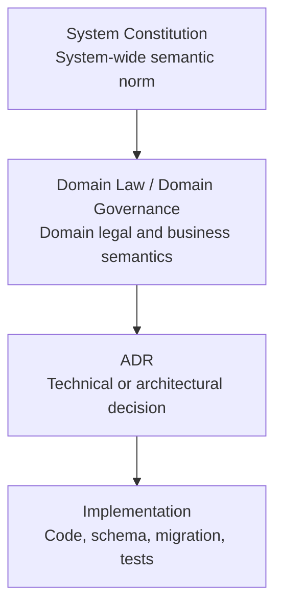

# CANONICAL SYSTEM GOVERNANCE

```text
Belge kimliği           : SYS-CONST-001
Canonical path          : project/docs/governance/SYSTEM-CONSTITUTION.md
Version                 : 1.9
Owner status            : RATIFIED — BINDING
Repository status       : CANONICAL UPON APPROVED MERGE TO MAIN
Canonical effective date: Approved merge date
Supersedes              : PR #1139 ile eklenen tarihsel short-form Constitution içeriği
Semantic scope          : System-wide domain/business governance
Execution authority     : Ayrı eksen; AGENTS.md ve geçerli repository/tool policies
```

Bu belge mevcut dosya yolunu koruyarak PR #1139 ile eklenen kısa governance çatısını
Canonical System Governance v1.0 içinde reconcile eder; v1.1 allocation-authority
amendment'ını, v1.2 balance-exposure contract ratifikasyonunu, v1.3 cross-domain
legal-application boundary kararını, v1.4 ClaimItem formation-admission sözleşmesini,
v1.5 TPA-02 target persistence architecture kararını, v1.6 TPA-03 two-file hybrid
schema-foundation kontratını, v1.7 TPA-04 target-native dormant single-writer kontratını
  v1.8 TPA-04A receipt-bound canonical snapshot/bucket identity kontratını ve
  v1.9 TPA-04B required-evidence schema-amendment kontratını ve PR #1470 / `9dabe8db`
  implementation evidence'ını
aynı canonical path'te taşır.
PR #1139 ve PR #1140 tarihsel
olarak geçerli kayıtlardır; içerikleri veya o tarihlerdeki owner kararları geriye dönük
olarak yanlışlanmaz. Bu sürüm, daha sonraki owner ratifikasyonunun bağlayıcı semantik
sonucudur ve repository etkisini yalnız approved merge ile kazanır.

## RELATED DOCUMENTS

- Okuma sırası: [GOVERNANCE-INDEX.md](./GOVERNANCE-INDEX.md)
- Ratifiye Debtor Domain Law: [DEBTOR-GOVERNANCE.md](./DEBTOR-GOVERNANCE.md)
- Ratifiye Receivable Domain Governance: [RECEIVABLE-GOVERNANCE.md](./RECEIVABLE-GOVERNANCE.md)
- Ratifiye CLIENT Governance Charter (bounded; full Domain Law değil): [CLIENT-GOVERNANCE-CHARTER.md](./CLIENT-GOVERNANCE-CHARTER.md)
- Karar geçmişi: [decision-log.md](./decision-log.md)
- ADR indeksi: [architecture-index.md](./architecture-index.md)
- Master Register: [product-backlog.md](./product-backlog.md),
  [master-triage-register.md](./master-triage-register.md),
  [active-roadmap.md](./active-roadmap.md)
- Finansal authority: [dbind-financial-authority-decisions.md](./dbind-financial-authority-decisions.md)
- Collection/disposition sınırı: [tm3-collection-disposition-boundary.md](../finance/tm3-collection-disposition-boundary.md)
- AccountingJournal yönü: [ADR-010](../adr/ADR-010-ACCOUNTING-JOURNAL-SOT-NORTH-STAR.md)
- Fee/Harç/Snapshot/Journal: [ADR-013](../adr/ADR-013-FEE-HARC-SNAPSHOT-JOURNAL.md)
- Canonical legal calculation: [ADR-014](../adr/ADR-014-CCB-001-CANONICAL-LEGAL-CALCULATION-CORE.md)
- Repository execution baseline: [AGENTS.md](../../../AGENTS.md)
---
## 1. Belgenin Niteliği

### `SYS-GOV-001 — Normatif Amaç`
Bu belge sistemin domain/business semantiğini, source-of-truth sınırlarını,
değiştirilemez invariant'larını, governance hiyerarşisini ve canonicalization
kurallarını tanımlayan sistem çapında üst normdur.

### `SYS-GOV-002 — Compliance Sertifikası Değildir`
Bu belge mevcut runtime'ın bütün kurallara uyduğunu iddia etmez. Ratifikasyon,
sistemin hangi normlara göre gelişeceğini; compliance ise runtime'ın bu normları
hangi kanıtla uyguladığını gösterir.

### `SYS-GOV-003 — Implementation Yetkisi Vermez`
Ratifikasyon, belge merge'i veya target modelin tanımlanması; kod, schema, migration,
cutover, feature activation, release veya production write yetkisi üretmez. Bu işlemler
ayrı task authorization ve ilgili owner/cutover gate'lerini gerektirir.

### `SYS-GOV-004 — Mevzuatın Yerine Geçmez`
Yürürlükteki mevzuat ve bağlayıcı resmî kararlar bu belgeden üstündür. Hukuki yorum
belirsizse veya güncelliği doğrulanmamışsa sistem fail-closed davranır; yetkili hukukçu
sign-off'u olmadan production authority oluşturulamaz.

### `SYS-GOV-005 — Repository Gerçeği Yeniden Doğrulanır`
Sohbet geçmişi niyet ve karar taşır. Mevcut gerçek; repository, git, governance,
PR/CI, ortam ve komut kanıtından görev başında yeniden doğrulanır.

### `SYS-GOV-006 — Tarihsel Kayıt Korunur`
Yeni karar eski kararı içerik bakımından supersede edebilir; fakat eski kararın o
tarihteki anlamı rewrite edilmez. Düzeltme ve supersession append-only kayıtla yapılır.
---
## 2. İki Authority Ekseni

### 2.1 Semantic authority



### `SYS-AUTH-001 — Constitution Sistem Çapında Üst Semantik Normdur`
Constitution bütün domainleri bağlayan authority, source-of-truth, güvenlik,
finansal anlam, AI, evidence, migration ve governance kurallarını tanımlar.

### `SYS-AUTH-002 — Domain Law Constitution'ı Ayrıntılandırır`
Domain Law belirli bir domainin hukuki ve iş semantiğini tanımlar. Constitution'ı
genişletebilir; değiştiremez, zayıflatamaz veya sessizce override edemez.

### `SYS-AUTH-003 — ADR Teknik Tercihi Kaydeder`
ADR alternatifler arasındaki teknik/mimari seçimi ve gerekçeyi kaydeder. ADR owner
kararının, Constitution'ın veya Domain Law'ın yerine geçmez.

### `SYS-AUTH-004 — Implementation Norm Üretmez`
Kodun mevcut davranışı AS-IS kanıtıdır; hukuken veya finansal olarak doğru olduğunun
tek başına kanıtı değildir. Implementation yeni owner, hukuk veya finans politikası
üretemez.

### 2.2 Execution and safety authority

```text
AGENTS.md
Repository policies
Task authorization
Environment and tool restrictions
Managed security policies
```

### `SYS-AUTH-005 — AGENTS.md Execution Otoritesidir`
`AGENTS.md`; görev modu, mutation, worktree, tool, validation, commit/push/PR/merge,
cleanup ve repository safety konularında bağlayıcıdır.

### `SYS-AUTH-006 — Authority Eksenleri Birbirini Üretmez`
Semantic authority execution izni vermez. Execution izni domain semantiğini
değiştirmez. Her işlem iki eksene aynı anda uymalıdır. Çelişki iki ekseni birlikte
etkiliyorsa işlem durur ve owner/governance kararı alınır.
---
## 3. Rule Placement

| İçerik türü | Canonical belge |
|---|---|
| Tüm sistemi ve domainleri bağlayan değişmez norm | Constitution |
| Belirli domainin hukuki veya iş semantiği | Domain Law / Domain Governance |
| Teknik veya mimari alternatifler arasındaki karar | ADR |
| Kodlama, API, test, deployment veya operasyon standardı | Implementation Standard |
| İş sırası, capability gate ve owner kapısı | Roadmap / Master Register |

### `SYS-GOV-007 — Tek Canonical Yerleşim`
Aynı norm bağımsız ve çelişkili biçimde birden fazla katmanda tanımlanamaz. Alt belge
üst normu referanslar; gerekli domain ayrıntısını ekler, üst normu yeniden üretmez.

### `SYS-GOV-008 — Roadmap Authority Değildir`
Roadmap/foundation sırası work sequencing bilgisidir. Tek başına canonical authority,
runtime izni, owner approval veya implementation authorization oluşturmaz.

### `SYS-GOV-009 — Yanlış Yerleşim Governance Drift'tir`
Bir norm yanlış katmandaysa sessizce kopyalanmaz. Canonical hedef belirlenir, eski
referans korunur ve mapping/supersession governance kaydıyla yapılır.

### `SYS-GOV-010 — Alt Belge Eksikliği Capability Statüsüdür`
Domain Law, contract veya standard eksikliği Constitution ratifikasyonunu otomatik
engellemez. İlgili capability `DOCUMENTED_ONLY`, `NOT_IMPLEMENTED`, `SHADOW_ONLY`
veya `PRODUCTION_NO_GO` olarak sınıflandırılır.
---
## 4. Rule Namespace

Sistem seviyesi kural kimlikleri yalnız `SYS-*` namespace'i kullanır:

```text
SYS-GOV-*   Governance and placement
SYS-AUTH-*  Authority axes
SYS-SOT-*   Source of truth
SYS-ID-*    Identity
SYS-LEGAL-* Legal truth and action
SYS-FIN-*   Financial semantics
SYS-DEC-*   Decision authority
SYS-AI-*    AI and automation
SYS-EVID-*  Evidence, event and audit
SYS-MIG-*   Migration and cutover
SYS-COMP-*  Compliance and release evidence
SYS-CAN-*   Canonicalization and closure
```

### `SYS-GOV-011 — Kimlikler Benzersizdir`
Aynı `SYS-*` kimliği iki farklı norm için kullanılamaz. Kimlik yeniden kullanımı veya
sessiz anlam değişikliği yasaktır.

### `SYS-GOV-012 — Domain Namespace'leri Korunur`
`DEBTOR-GOVERNANCE.md` içindeki `INV-*` ve `MS/*` kimlikleri domain/evidence-local
kimliklerdir; `SYS-*` kimliği değildir ve bu sürümle silinmez. Repository-canonical
short-form Constitution sistem rule ID'si taşımadığından legacy SYS mapping gerekmez.
---
## 5. Sistem Topolojisi ve Domain Ownership

### `SYS-GOV-013 — Beş Primary Legal-Operation Domain`
Sistemin beş primary legal-operation domain'i şunlardır:

1. `OFFICE`
2. `CLIENT`
3. `DEBTOR`
4. `RECEIVABLE`
5. `COLLECTION`

Bu ifade yalnız beş bounded context veya teknik modül bulunduğu anlamına gelmez.

### `SYS-GOV-014 — OFFICE Sınırı`
OFFICE actor, user/staff role, authorization, organizational responsibility ve
office-level approval policy sahibidir. Task instance, legal truth, liability,
receivable calculation veya creditor disposition sahibi değildir.

### `SYS-GOV-015 — CLIENT Sınırı`
CLIENT client role/profile, mandate, instruction, client approval ve client-level
visibility sahibidir. Tek başına receivable balance veya legal allocation hesaplayamaz.

### `SYS-GOV-016 — DEBTOR Sınırı`
DEBTOR debtor role/profile, CaseDebtor relation, legal role, address/service evidence,
legal status ve eligibility girdilerinin domain sahibidir. Tek başına receivable amount
veya creditor disposition üretemez.

### `SYS-GOV-017 — RECEIVABLE Sınırı`
RECEIVABLE claim item, legal basis/version, principal/interest/cost buckets,
deterministic calculation ve legal-allocation debt buckets sahibidir. Cash receipt,
payout veya journal posting sahibi değildir. `ClaimItem` legal receivable source,
provenance ve calculation input'tur; receipt'in doğrudan payment/legal-application
target'ı değildir. Target legal-application grain'i canonical Receivable snapshot'tan
üretilen `LegalCalculationBucket`tır.

### `SYS-GOV-018 — COLLECTION Sınırı`
COLLECTION receipt, cash provenance, idempotency, reversal/refund başlangıcı ve legal
allocation sonucu ile bağlantının sahibidir. Creditor entitlement veya accounting
classification'ı tek başına belirleyemez.

### `SYS-GOV-019 — Shared ve Supporting Contexts`
Tenant/Security, Party Registry, DomainEvent/Outbox, Audit/LegalEvidence, Document
Storage, Read Models ve AI Context shared kernel olabilir. Case Context, Workflow/Task,
Reporting, Provider Integration, Migration/Reconciliation supporting context'tir.

### `SYS-GOV-020 — Accounting Konumu Açık Owner Kararıdır`
Accounting'in supporting financial context veya ayrı business domain olması açık owner
kararı bekler. Bu Constitution seçeneklerden birini verilmiş saymaz. ADR-010 yönü korunur;
AccountingJournal cutover olmadan current authority olmaz.
---
## 6. Authority Yaşam Döngüsü

```text
CURRENT         Repository/runtime'da fiilen uygulanan ve izin verilmiş authority
TARGET          Ratifiye/tasarlanmış; implementation veya cutover tamamlanmamış model
NOT_IMPLEMENTED Runtime authority veya canonical write path bulunmayan yapı
DEPRECATED      Mevcut; migration veya kaldırma sürecindeki yapı
SUPERSEDED      Daha yeni canonical normla içerik bakımından değiştirilmiş yapı
SHADOW_ONLY     Sonuç üretir; production decision/write authority değildir
PRODUCTION_NO_GO Production primary veya write kullanımı yasaktır
```

### `SYS-SOT-001 — Current ve Target Ayrıdır`
Target model current reality olarak yazılamaz. Belge veya schema varlığı runtime
implementation ve write authority kanıtı değildir.

### `SYS-SOT-002 — Projection Authority Değildir`
Projection, snapshot, cache, report, export, frontend, compatibility adapter ve read
model source of truth veya canonical write authority olamaz.

### `SYS-SOT-003 — Tek Canonical Authority`
Aynı hukuki veya finansal fact için aynı anda birden fazla production primary authority
bulunamaz. Geçişteki ikincil yol açıkça shadow/compatibility olarak etiketlenir.

### `SYS-SOT-004 — Write ve Read Authority Ayrıdır`
Canonical write owner ile canonical/derived reader ayrı tanımlanır. Read authority,
write yetkisi üretmez.

### `SYS-SOT-005 — Conflict Fail-Closed'dur`
Canonical ve derived sonuç çatışırsa projection kazanmaz; işlem fail-closed olur,
conflict evidence kaydedilir ve ilgili cutover/reconciliation gate açılmaz.

### `SYS-SOT-006 — Cutover Açık Gate Gerektirir`
Target ancak migration/reconciliation, gerekli legal/financial/security sign-off,
backward compatibility, test, observation ve owner cutover kararı tamamlanınca current
authority olabilir.

### `SYS-SOT-007 — Fixture Production Evidence Değildir`
Test fixture, synthetic scenario veya shadow parity production empirical evidence
değildir; production readiness iddiası için kullanılamaz.

### `SYS-SOT-008 — Source-of-Truth Register Kanıt Taşır`
Her authority kaydı authoritative source, writer, reader, derived-view sınırı, conflict
rule, prohibited authority, current status, cutover gate ve evidence taşır.
---
## 7. Identity Source of Truth

| Fact | Authoritative Source | Write Authority | Read Authority / Derived Views | Conflict / Prohibited Authority | Status / Cutover Gate / Evidence |
|---|---|---|---|---|---|
| User/staff identity | Current `User`/`Office`/staff records ve trusted identity context | OFFICE-owned identity/authorization services | Authorized UI, audit ve task views | Header/query/display identity authority olamaz | `CURRENT`; auth/tenant tests ve repository evidence |
| External party identity | Target Party Registry | Target Party Registry service | Party card/search projections | Client/Debtor role veya import row global identity olamaz | `TARGET / NOT_IMPLEMENTED`; SB-001 `HOLD`, owner+identity migration gate |
| Client identity/role | Current `Client`; target Party-linked Client role/profile | CLIENT owner | Client/case views | `Case.clientId` global Party veya financial authority olamaz | `TRANSITIONAL CURRENT`; Party cutover/reconciliation |
| Debtor identity/role | Current `Debtor`; target Party-linked Debtor role/profile | DEBTOR owner | Debtor 360/read models | Debtor role Party identity root olamaz | `TRANSITIONAL CURRENT`; Party cutover/reconciliation |
| Case-specific debtor role | Current `CaseDebtor` relation | DEBTOR/CaseDebtor domain owner | Case relation views | Global Debtor kaydı case legal role yerine geçemez | `CURRENT PARTIAL`; target role/evidence contract |
| External-source identity | Provider/import evidence | Validated adapter; canonical owner confirmation | Intake/match candidate views | Unverified import, fuzzy score veya display identity authority olamaz | `CURRENT INPUT / NON_CANONICAL`; provenance+human review gate |

### `SYS-ID-001 — Identity Root ile Domain Rolü Ayrıdır`
Party, Client, Debtor, CaseClient ve CaseDebtor aynı kavram değildir. Domain rolü global
identity root yerine geçmez.

### `SYS-ID-002 — Duplicate Detection Legal Equivalence Değildir`
Benzerlik veya fuzzy score insan onayı olmadan Party merge üretemez. Merge reversible,
evidence-backed ve tenant-local olmalıdır.

### `SYS-ID-003 — Cross-Tenant Party Merge Yasaktır`
Tenantlar arası global Party graph veya otomatik merge oluşturulamaz.

### `SYS-ID-004 — Import Doğrulanmadan Canonical Değildir`
Provider/import sonucu provenance ve gerekli doğrulama olmadan canonical identity veya
verified address oluşturamaz.

### `SYS-ID-005 — Display Identity Write Authority Değildir`
UI, report, export, search index veya cache identity fact'i değiştiremez.
---
## 8. Legal Source of Truth

| Fact | Authoritative Source | Write Authority | Read Authority / Derived Views | Conflict / Prohibited Authority | Status / Cutover Gate / Evidence |
|---|---|---|---|---|---|
| Legal event/evidence | Verified legal source + immutable evidence record | Legal-domain owner/adapters | Timeline/case projections | User note, operational log veya AI output legal event olamaz | `CURRENT PARTIAL`; evidence lineage/retention gate |
| Service attempt/result | Current Tebligat-related records; target single Service-of-Process context | DEBTOR Service-of-Process owner | Timeline/status views | Queue state veya generic update terminal legal result olamaz | `TARGET / CURRENT PARTIAL`; state-machine+legal sign-off |
| LegalServiceDate | Target versioned LegalServiceDate | Target Service-of-Process owner | Deadline/status projections | `NotificationQueue.deliveredAt`, reminder veya workflow stage authority olamaz | `NOT_IMPLEMENTED / PRODUCTION_NO_GO`; legal rule matrix+cutover |
| LegalDeadline | Target versioned LegalDeadlineSnapshot | Target legal-time service | Reminder/calendar projections | Operational reminder veya UI calculation legal deadline olamaz | `NOT_IMPLEMENTED / PRODUCTION_NO_GO`; LegalServiceDate cutover |
| DebtorLegalStatus | Target evidence-backed state machine | DEBTOR legal-status owner | Legal-status card | Displayed/manual flag, workflow stage veya AI inference authority olamaz | `NOT_IMPLEMENTED`; taxonomy+evidence+legal sign-off |
| EnforcementEligibility | Target versioned eligibility result | Eligibility owner | Guard/action views | NBA, score veya workflow stage eligibility olamaz | `NOT_IMPLEMENTED / PRODUCTION_NO_GO`; LegalStatus/time foundation |
| LegalGuard | Target mandatory legal-action gateway | LegalGuard owner; approved rule catalogue | Guard outcome/audit view | Controller flag, AI veya manual bypass authority olamaz | `NOT_IMPLEMENTED / PRODUCTION_NO_GO`; legal sign-off+coverage tests |
| Court/UYAP import | Verified source evidence, not raw projection | Validated external adapter + domain confirmation | UYAP/read projections | Raw import/projection tek başına canonical truth olamaz | `CURRENT INPUT / PARTIAL`; provenance and reconciliation |

### `SYS-LEGAL-001 — Legal Truth Operational Truth'ten Ayrıdır`
Queue, reminder, task, workflow stage, cache ve displayed status operational truth'tür;
legal event, effective date veya eligibility yerine geçemez.

### `SYS-LEGAL-002 — User Input Tek Başına External Truth Değildir`
User-entered legal data provenance, authority ve gerekli evidence olmadan external legal
fact oluşturmaz.

### `SYS-LEGAL-003 — Legal Time Versiyonludur`
Hukuki tarih/süre kaynak evidence, rule/version, timezone/calendar policy, calculation
time ve supersession relation taşır.

### `SYS-LEGAL-004 — NotificationQueue Legal Authority Değildir`
`NotificationQueue.deliveredAt` operational delivery verisidir; LegalServiceDate veya
LegalDeadline olarak kullanılamaz.

### `SYS-LEGAL-005 — Competing Legal-Time Authority NO-GO'dur`
Birden fazla competing legal-time yolu varsa reconciliation/cutover tamamlanmadan hiçbir
yol production primary ilan edilemez.

### `SYS-LEGAL-006 — LegalRole ve Liability Ayrıdır`
Bir kişinin dosyadaki legal role'u her claim item bakımından aynı liability'yi doğurmaz.
Liability legal basis, scope, amount/regime, evidence ve version taşır.

### `SYS-LEGAL-007 — Legal Action Zinciri Zorunludur`
```text
Evidence → legal facts/time → LegalStatus → Eligibility
→ LegalGuard → required HumanApproval → domain command
→ audit/evidence/outbox
```

Gerekli parça yoksa capability `PRODUCTION_NO_GO` olur.

### `SYS-LEGAL-008 — State Transition Domain-Owned'dur`
Generic update, direct ORM mutation, frontend veya workflow stage legal transition'ı
ikame edemez.

### `SYS-LEGAL-009 — Settlement Semantiği Ayrıdır`
`LegalSettlement / Sulh`, borç veya uyuşmazlığın hukuki agreement semantiğidir.
`ClientSettlement / Creditor Disposition`, tahsil edilen değerin müvekkil yönlendirmesiyle
yönetimidir. Tek model iki authority alanını birleştiremez.

### `SYS-LEGAL-010 — Settlement Authority Taşınmaz`
Hukuki sulh payout yetkisi oluşturmaz. Client disposition kararı debtor'ın hukuki
yükümlülüğünü tek başına değiştirmez. `SettlementOffer` bağlamı açıkça sınıflandırılır.
---
## 9. Financial Source of Truth

| Fact | Authoritative Source | Write Authority | Read Authority / Derived Views | Conflict / Prohibited Authority | Status / Cutover Gate / Evidence |
|---|---|---|---|---|---|
| Creditor authority | `CaseClient` / creditor set | CLIENT/creditor relation owner | Creditor/disposition views | `Case.clientId` financial authority olamaz | `CURRENT`; DBIND evidence; değişiklik açık supersession ister |
| Collection Receipt | Current `Collection` receipt path | COLLECTION owner | Receipt/timeline/report views | Bank mock, event veya projection receipt yazamaz | `CURRENT PARTIAL`; idempotency+provider+tenant gates |
| Legal Allocation / TBK 100 | Target: independent `LegalApplicationBatch` aggregate + immutable `LegalApplication` bucket-effect facts; current AS-IS/legacy: `LedgerEntry`/ClaimItem-keyed `LedgerAllocation` | RECEIVABLE bucket/snapshot semantics + TBK100 policy; COLLECTION receipt lifecycle/idempotency/outer transaction orchestration; RCV-COL boundary single writer `LegalApplicationWriter`, yalnız canonical Collection transaction client ile | Non-authoritative `ApplicationAttribution`; canonical-output-derived transitional `CollectionAllocation`; frozen legacy `ClaimItem.collectedAmount`; balance projections | ClaimItem, historical `LedgerAllocation`, projection, attribution, cache, disposition veya journal target legal-application authority olamaz; bağımsız endpoint/nested transaction, dual writer/dual authority yasaktır | `TPA-03A FOUNDATION + TPA-04B REQUIRED-EVIDENCE SCHEMA AMENDMENT CLOSED / CANONICAL; TARGET SHADOW_ONLY`; ACT-28, REC-AUTH-011/012 OPEN; plan/writer/replay/cutover/retirement unauthorized |
| Canonical receivable balance | Current legacy production views; target ADR-014 canonical core | Current owner until cutover; target calculation owner after gate | Shadow/compatibility/display DTO | Shadow adapter, frontend/report alternate calculation authority olamaz | `TARGET / SHADOW_ONLY`; ADR-014 owner-gated cutover |
| Creditor Disposition | Current `CollectionDisposition` + lines | Approval-gated CLIENT/COLLECTION disposition owner | Client statement/disposition views | Receipt veya `clientId` entitlement/disposition authority olamaz | `CURRENT PARTIAL`; DBIND/TM3+reversal reconciliation |
| Payout / Offset | Current payout/offset command paths | Authorized money-out/offset owner | Statement/payment views | Disposition draft veya journal line para çıkışı değildir | `CURRENT PARTIAL`; approval+idempotency+reversal gates |
| Accounting Journal Posting | Current additive/journal paths do not supersede legal ledger; target ADR-010 | Accounting owner after explicit cutover | Trial balance/financial statements | Journal legal rule, receipt veya payout authority olamaz | `TARGET / SHADOW-DIRECTION`; shadow→prove→sign-off→owner cutover |
| Fee/harç/snapshot | Receipt-bound legal-application snapshot subtype: `CanonicalReceivableApplicationSnapshotV1`; broader Fee/Harç/Journal snapshot family remains ADR-013 owner review | RECEIVABLE owns the narrow subtype semantics; RCV-COL boundary persists its envelope inside `LegalApplicationBatch`; broader ADR-013 owner remains unassigned | Legal-application plan/writer input; projection/readiness views remain non-authoritative | Presentation snapshot, Fee/Harç snapshot, Journal snapshot, non-official DTO veya candidate producer receipt-bound subtype authority olamaz | `NARROW SUBTYPE RATIFIED / RUNTIME NOT_IMPLEMENTED / SHADOW_ONLY`; broader ADR-013 OPEN |

### `SYS-FIN-001 — Beş Finansal Kavram Ayrıdır`
```text
1. Collection Receipt
2. Legal Allocation / TBK 100 Application
3. Creditor Disposition
4. Payout / Offset
5. Accounting Journal Posting
```

Bu kavramlar eş anlamlı değildir ve tek `Collection`, `Allocation` veya `Posting`
terimi altında birleştirilemez.

### `SYS-FIN-002 — Receipt Para Girişidir`
Collection Receipt paranın sisteme girmesini ve dosyaya bağlanmasını ifade eder;
legal allocation, disposition, payout veya journal approval'ını ima etmez.

### `SYS-FIN-003 — Legal Allocation Hukuki Uygulamadır`
Legal Allocation tahsilatın canonical receivable buckets'a TBK 100 ve geçerli hukuki
kurallarla uygulanmasıdır; creditor disposition değildir.

### `SYS-FIN-011 — Legal Application Grain ve Attribution Ayrıdır`
Target legal application, canonical Receivable snapshot'tan üretilen
`LegalCalculationBucket`lara uygulanır. Canonical sıra
`MASRAF → FERİ → FAİZ → ANA PARA`dır. Aynı kategori içindeki currency, legal basis,
effective date, interest rule veya priority bağlamı farklıysa ayrı calculation
sub-bucket korunur.

`LegalApplication` receipt'in legal bucket üzerindeki hukuki etkisidir.
`ApplicationAttribution` bu etkinin `ClaimItem` ve source lineage açıklamasıdır; target
ve attribution aynı fact değildir. ClaimItem-keyed `LedgerAllocation` mevcut AS-IS
persistence kanıtıdır, target legal authority ratifikasyonu değildir.

Takip tarihine kadar işlemiş ve tutarı belirli faiz `ACCRUED_INTEREST` sabit hukuki
borç bucket'ıdır. Takipten sonra işleyecek faiz `InterestPolicy` / calculation rule'dur;
sabit tutarlı ClaimItem veya application target'ı olarak modellenemez. Faize faiz yalnız
açık hukuki dayanakla uygulanabilir.

### `SYS-FIN-012 — Legal Balance Exposure Context-Bound ve Fail-Closed'dur`
`LegalCalculationBucket` kimliği iki düzeylidir: stable `bucketContextKey` hukuki
category/subcategory, currency, legal basis, effective date/period, interest rule ve
priority bağlamını; snapshot-specific `bucketInstanceId` ise tenant/case, canonical
Receivable snapshot, as-of date ve calculation-rule version bağlamını sabitler. ClaimItem
kimliği bu iki anahtarın yerine legal-application target'ı olamaz.

Her currency ve canonical category için gross, legally applied ve remaining exposure
minor-unit/exact-cent hassasiyetinde ayrı tutulur. MASRAF, FERİ, FAİZ ve ANA PARA
bileşenleri total içinde gizlenemez; held/unapplied receipt legal exposure değildir.
Missing, stale veya doğrulanamayan context `0` üretemez; typed `null` ve fail-closed
availability sonucu üretir.

`LegalApplication` stable bucket context'i, application-time snapshot'ı, rule version'ı
ve effective time'ı referanslayan hukuki effect fact'idir. `ApplicationAttribution`
source-lineage açıklamasıdır; non-authoritative'dir ve payment/application authority
olamaz. Attribution eksikliği bucket-level application'ı kendiliğinden hükümsüz kılmaz;
ancak zorunlu trace/provenance tamamlanmadan public projection primary-eligible olamaz.

Public projection yalnız per-currency/category-level aggregate sunar. Sub-bucket ve source
trace restricted diagnostic yüzeyinde kalır. Authority vocabulary
`SHADOW_ONLY | CANONICAL | LEGACY_COMPATIBILITY`dir; current Balance Engine projection
değeri yalnız `SHADOW_ONLY`dır. `CANONICAL` promotion, consumer switch ve cutover ayrı
owner gate'i olmadan kullanılamaz.

### `SYS-FIN-013 — Legal Application Tek-Yazıcı Cross-Domain Boundary'dir`

Receivable, canonical `LegalCalculationBucket` semantiğinin ve TBK100 legal-application
politikasının sahibidir. Collection, receipt lifecycle'ının ve bu politikanın yetkili
transaction içinde deterministic execution orchestration'ının sahibidir. Bu ayrım,
Collection'a hukuki policy veya bucket authority; Receivable'a receipt lifecycle authority
vermez.

Target `LegalApplication` persistence tek bir logical writer ve tek bir canonical authority
taşır. İki domainin aynı hukuki etkiyi bağımsız yazması, dual-write'ı kalıcı authority gibi
kullanması veya legacy projection/cache'i fallback authority'ye yükseltmesi yasaktır.
`ClaimItem` application target, payment-state veya allocation authority değildir.
`ClaimItem.collectedAmount` için yeni reader veya writer açılamaz. `CollectionAllocation`
yalnız canonical application sonucundan türetilen geçici compatibility projection olabilir.

XD-001 fiziksel model seçmezdi. Sonraki owner-ratified `TPA-02` kararı bu açık alanı
`SYS-FIN-013A` ile kapatır; schema, migration, runtime writer, replay/evidence, consumer
cutover veya legacy retirement yetkisi üretmez.

### `SYS-FIN-013A — LegalApplicationBatch Target Persistence Aggregate'idir`

Target physical model bağımsız `LegalApplicationBatch` aggregate'idir:

```text
LegalApplicationBatch
  ├─ immutable LegalApplication[]
  └─ non-authoritative ApplicationAttribution[]
```

Receivable bucket/context/snapshot semantiği ile TBK100 allocation policy'sinin; Collection
receipt lifecycle, idempotency ve outer transaction orchestration'ın sahibidir. Aggregate
persistence'ın tek logical writer'ı `LegalApplicationWriter`dır. Yalnız canonical Collection
transaction'ı içinde, mevcut transaction client ile çağrılır; bağımsız endpoint, ayrı veya
nested transaction açılamaz.

`LegalApplication` immutable bucket-effect fact'idir. `ApplicationAttribution` yalnız
ClaimItem/source lineage ve provenance fact'idir; balance, payment-state veya application
authority değildir. Bir `APPLY` batch'i tam olarak bir Collection receipt'ine karşılık gelir
ve şu exact-cent conservation'ı sağlar:

```text
receiptAmountMinor
=
Σ appliedAmountMinor
+ heldRemainderMinor
```

Replay authority `tenantId + idempotencyKey + commandHash`tır. Aynı key ve aynı hash mevcut
batch'i döndürür; yeni write, audit veya event üretmez. Aynı key ve farklı hash fail-closed
conflict'tir. Full reversal, özgün batch'e bağlı append-only `REVERSAL` batch'iyle yapılır.
Mevcut batch/application `UPDATE` veya `DELETE` edilemez; partial reversal ayrı owner gate'idir.
Tenant-safe composite FK ve `ON DELETE RESTRICT` zorunludur. Historical tahmin, silent
backfill, dual allocator ve dual authority yasaktır.

Legacy disposition:

- `ClaimItem.collectedAmount`: `FROZEN LEGACY CACHE / RETIREMENT REQUIRED`; yeni reader/writer yok.
- `CollectionAllocation`: bağımsız authority yasak; yalnız canonical-output-derived transitional
  projection olabilir.
- `LedgerAllocation`: historical legacy record; target-era application authority olamaz.

ACT-28 ve REC-AUTH-011/012; deterministic bucket identity, representative replay/evidence,
consumer cutover ve legacy retirement tamamlanana kadar `OPEN` kalır. PR #407
`HOLD / CONFLICTING / DO NOT MERGE`dir. TPA-03 schema-foundation analizi ayrı owner
`GO-ANALYZE` ister; implementation authority `NONE`dır.

### `SYS-FIN-013B — TPA-03 Two-File Hybrid Schema Foundation Kontratı`

Owner, TPA-03 için Option B'yi ratifiye etmiştir. Additive physical foundation şu üç modeli
ve iki enum'u taşır:

```text
LegalApplicationBatch
  ├─ immutable LegalApplication[]
  └─ non-authoritative ApplicationAttribution[]

LegalApplicationBatchType:
  APPLY | REVERSAL

LegalApplicationComponentType:
  COST | ANCILLARY | ACCRUED_INTEREST | PRINCIPAL
```

Foundation implementation kapsamı yalnız `project/apps/api/prisma/schema.prisma` ile tek
additive `migration.sql` dosyasıdır. Foundation writer-free ve no-backfill'dir; runtime,
consumer, legacy reader/writer veya historical data davranışı değiştiremez. Tenant-safe
composite FK, `ON DELETE RESTRICT` ve `LegalApplicationBatch`/`LegalApplication` için
`UPDATE`/`DELETE` immutability protection zorunludur.

`receiptAmountMinor`, `appliedAmountMinor` ve `heldRemainderMinor` positive minor-unit
magnitude taşır; yön `LegalApplicationBatchType` ile belirlenir. `APPLY` için
`receiptAmountMinor` canonical Collection receipt magnitude'ıdır; `REVERSAL` için linked
original receipt magnitude'ıdır. Canonical conservation:

```text
receiptAmountMinor
=
SUM(appliedAmountMinor)
+ heldRemainderMinor
```

Foundation, bu aggregate-level conservation'ın DB/writer enforcement'ını sonraki writer-stage
kontratına bırakır; canonical exact-cent invariant'ını zayıflatmaz. Replay unique sınırı
`(tenantId, idempotencyKey)`dir. Aynı key + aynı `commandHash` existing batch'i yeni write
olmadan döndürür; aynı key + farklı hash fail-closed conflict'tir. Full reversal linked,
append-only `REVERSAL` batch'idir; self-reversal ve double reversal yasaktır. Partial reversal
yetkili değildir.

`bucketContextKey` ve `bucketInstanceId` required, opaque ve nonblank'tir; generation algoritması
writer-stage owner kararına bırakılır. `ApplicationAttribution` authority değildir; ClaimItem
ilişkisi yalnız optional lineage olabilir ve attributed amount optional'dır.

`codex/rcv-ws04-p03-syn-01` TPA-03A schema foundation için non-blocking, writer/evidence/cutover
için blocking'dir. PR #407 `HOLD / CONFLICTING / DO NOT MERGE / DO NOT REBASE` kalır.
ACT-28 ve REC-AUTH-011/012 `OPEN`dır. TPA-03A schema foundation yalnız ayrı owner
`GO-IMPLEMENT` ile başlayabilir; bu kayıt schema, migration veya implementation yetkisi üretmez.

#### TPA-03A Schema Foundation Implementation Evidence — 2026-07-20

TPA-03A, implementation PR #1449 ve squash
`63f0b0ea2cbef3f5d106ae3dfd8be6b770b5229f` ile exact two-file kapsamda
`CLOSED / CANONICAL EVIDENCE` durumundadır. Değişiklik yalnız
`project/apps/api/prisma/schema.prisma` ile
`project/apps/api/prisma/migrations/20260720174245_legal_application_batch_foundation/migration.sql`
dosyalarını kapsar. `LegalApplicationBatch`, immutable `LegalApplication` ve
non-authoritative `ApplicationAttribution` additive olarak kurulmuş; tenant-safe composite FK,
`ON DELETE RESTRICT`, replay/reversal, nonblank bucket identity, positive minor-unit ve
UPDATE/DELETE immutability kontrolleri uygulanmıştır.

Foundation writer-free ve no-backfill'dir; runtime, test, consumer, legacy reader/writer veya
historical data davranışı değiştirilmemiştir. Exact-cent conservation canonical kalır fakat
aggregate-level enforcement ayrı owner-gated `LegalApplicationWriter` contract aşamasına
deferred'dır. ACT-28 ve REC-AUTH-011/012 `OPEN`; PR #407 `HOLD / UNTOUCHED`;
`codex/rcv-ws04-p03-syn-01` writer/evidence/cutover için `BLOCKING` kalır. Bu compliance
güncellemesi writer, replay/evidence, consumer cutover, retirement veya yeni runtime authority
üretmez.

### `SYS-FIN-013C — TPA-04 Target-Native Dormant Single-Writer Kontratı`

Owner, Option C — Target-Native Plan-Then-Persist / Dormant-First Single Writer kararını
ratifiye etmiştir. `LegalApplicationWriter` tek target persistence writer'dır ve yalnız official
canonical Receivable snapshot ile Receivable-owned target-native `LegalApplicationPlan`
tüketir. TBK100 policy hesaplamaz; ClaimItem, `ClaimItem.collectedAmount`,
`LedgerAllocation` veya `CollectionAllocation` üzerinden hedef plan türetemez. ClaimItem
application target değildir ve bucket identity ClaimItem ID'den üretilemez.

Writer yalnız canonical Collection outer transaction'ında mevcut Prisma transaction client ile
çağrılır. Independent endpoint, nested transaction, second writer, production call-chain
wiring, production shadow persistence, legacy-derived target, dual authority ve long-lived
dual-write yasaktır.

Official snapshot zorunludur. `authority=NONE`, `snapshotAvailable=false`, unavailable/stale
snapshot ve unmapped component fail-closed'dur; HELD'e çevrilemez. `bucketContextKey` stable
legal context, `bucketInstanceId` snapshot-specific identity taşır; ikisi versioned canonical
serialization + SHA-256 ile üretilir.

Tüm tutarlar batch boyunca aynı currency/minor-unit kontratında `bigint` minor-unit'tir.
`receiptAmountMinor = SUM(appliedAmountMinor) + heldRemainderMinor` aggregate conservation
DB'de writer'dan önce ayrı owner-gated schema amendment ile enforce edilmelidir. Replay
`tenantId + idempotencyKey + commandHash` ile fail-closed'dur; different key ile aynı
Collection'a ikinci APPLY yasaktır.

APPLY tek Collection receipt'ine ve target-native plana bağlıdır; ClaimItem-keyed allocation
ve collectedAmount mutation yoktur. Full reversal ayrı owner-gated linked append-only
REVERSAL, same-case advisory lock ve exact inverse gerektirir; partial reversal yetkisizdir.
Audit transaction-bound ve allowlist-only'dir; replay yeni audit/event/outbox üretmez. Existing
PAYMENT event chain'i korunur; public LEGAL_APPLICATION event'i ayrı owner gate'idir.

Legacy runtime coordinated cutover'a kadar geçici authority olarak korunur; yeni legacy
reader/writer açılamaz. `CollectionAllocation` yalnız canonical-output-derived transitional
projection olabilir; `ClaimItem.collectedAmount` frozen cache, `LedgerAllocation` historical
legacy record'dur. Synthetic ClaimItem-grain corpus target writer için superseded legacy
evidence ve writer/evidence/cutover blocker'ıdır. PR #407 hold/untouched; ACT-28 ve
REC-AUTH-011/012 open kalır.

TPA-04A snapshot/bucket identity, TPA-04B writer-evidence schema amendment, TPA-04C pure plan
builder, TPA-04D dormant writer, TPA-04E full reversal writer, TPA-04F representative
replay/reconciliation evidence ve TPA-04G coordinated writer/consumer cutover decision sıralı
owner gate'leridir; hiçbiri bu kayıtla yetkilendirilmez.

### `SYS-FIN-013D — TPA-04A Receipt-Bound Canonical Snapshot ve Bucket Identity`

Owner, Option C — Receipt-Bound Embedded Canonical Snapshot Envelope kararını ratifiye
etmiştir. `CanonicalReceivableApplicationSnapshotV1`, yalnız bir canonical Collection receipt'i
için LegalApplication planı üretmeye yarayan immutable, receipt-bound Receivable snapshot
envelope'udur. Snapshot semantiğinin sahibi Receivable; envelope persistence'ının sahibi
RCV-COL Legal Application Boundary'dir ve kayıt `LegalApplicationBatch` aggregate'i içinde
kalır. General presentation snapshot, Fee/Harç snapshot, Journal snapshot, consumer authority
ve daha geniş snapshot lifecycle bu dar ratifikasyonla kapanmaz. Current Balance Engine
`SHADOW_ONLY`; production authority, writer ve cutover `NOT AUTHORIZED`dır.

Eligibility tenant/case/target Collection/currency bütünlüğü, canonical receipt admission
gate'leri, target receipt'in pre-application history'den exclusion'ı, COL/OD-03 kaynaklı tek
`applicationEffectiveDate`, tam source/version set'i, explicit engine/rule/policy/rate/
interpretation version'ları, COST/ANCILLARY completeness, target-native veya owner-approved
historical baseline ve transaction-consistent read ister. `confirmedAt`, `valueDate` ve
`externalSettledAt` yalnız provenance'dır. `authority=NONE`, unavailable, stale, incomplete,
unsafe, currency/minor-unit mismatch, unmapped/duplicate bucket veya conservation failure
fail-closed'dur.

Envelope; identity/version alanlarını, receipt amount ve time context'ini, source/version
fingerprint'lerini ve canonical bucket'ları taşır. `minorUnit` zorunlu semantik girdidir;
repository-wide sabit `2` varsayımı yasaktır. Snapshot reference ve hash:

```text
snapshotHash = SHA-256("RCV-CAS/v1\0" + canonicalEnvelopeBytes)
snapshotRef  = "rcv-app-snapshot:v1:sha256:" + lowercaseHex(snapshotHash)
```

Canonical serialization `RCV-CAS/v1`, UTF-8/no-BOM, Unicode NFC, locale-independent ordering,
minor-unit integer strings, floating-point yasağı, ISO date normalization ve explicit
null/absent kurallarıyla RFC 8785 temelli domain-restricted JSON'dır. Generated time, actor,
correlation, display/free text ve raw bank/provider payload hash input'u değildir.

`bucketContextKey = bctx:v1:sha256:<64-lowercase-hex>`; componentType, componentCode,
currency, minorUnit, versioned legal basis, effective context, versioned interest rule,
priority policy/version/rank ve liability context'ten üretilir. ClaimItem ID, tenant/case,
snapshotRef, target Collection, amount, sequence, actor, display label ve insertion order
yasaktır. `bucketInstanceId = binst:v1:sha256:<64-lowercase-hex>`; identityContractVersion,
tenantId, caseId, snapshotRef/hash, asOfDate, calculationRuleVersion ve bucketContextKey
girdilerinden üretilir.

Source/version, formation context, policy version, fee authority, bucket mapping,
currency/minor-unit, history boundary, duplicate context, staleness, hash ve source concurrency
kusurları typed fail-closed sonuç üretir. Plan output Receivable-owned saf
`LegalApplicationPlan`dır; `bigint` minor-unit taşır, ClaimItem target veya legacy
allocation/cache input'u kullanmaz ve conservation sağlanmadan üretilemez.

TPA-04B, writer-evidence/conservation persistence amendment'ının ratified contract'ıdır;
exact iki dosyalık implementation PR #1470 / `9dabe8db` ile canonicaldır. Bu kayıt
schema, migration, hash implementation, snapshot writer, plan builder, production shadow,
consumer authority veya cutover yetkisi üretmez. PR #407 final disposition B ile
closed/unmerged, requirements preserved ve code discarded'dır; extraction/reuse yasaktır. Synthetic
corpus writer/evidence/cutover için blocking; ACT-28 ve REC-AUTH-011/012 open kalır.

### `SYS-FIN-013E — TPA-04B Required-Evidence Schema Amendment Contract`

Owner, exact iki dosyalık required-evidence schema-amendment kontratını ratifiye etmiştir.
Future patch yalnız Prisma schema ile tek yeni migration dosyasını değiştirebilir; runtime writer,
plan builder, feature flag, backfill, consumer veya legacy yüzeyi değiştiremez. Bütün yeni alanlar
required, default-free ve backfill-free'dir. Foundation tablolarında row varsa migration, tablo
lock'undan sonra fail-closed durur; nullable geçiş ve historical inference yasaktır.

`LegalApplicationBatch`, TPA-04A snapshot contract/serialization/ref/hash/canonical payload,
source-version hash, as-of/effective/history context, engine/rule/policy/rate/interpretation,
bucket-identity version ve minor-unit evidence'ını taşır. `snapshotCanonicalPayload` exact
canonical bytes'i PostgreSQL `TEXT` olarak saklar; JSONB storage yasaktır. `LegalApplication`,
component code, source-lineage set reference ve before/after bucket minor-unit evidence'ını taşır.
`ApplicationAttribution` değişmez ve authority değildir.

Canonical identity formatları `CanonicalReceivableApplicationSnapshotV1`, `RCV-CAS/v1`,
`rcv-app-snapshot:v1:sha256:<hash>`, `bctx:v1:sha256:<hash>` ve
`binst:v1:sha256:<hash>`tır; hash'ler 64 lowercase hexadecimal, referans/version alanları trimmed
ve nonblank'dir. `minorUnit` required'dır ve evrensel `2` değildir. Snapshot ref/hash global veya
tenant-unique değildir; aynı batch içinde context ve instance kimlikleri ayrı ayrı unique'dir.

DB amendment'ı şu aggregate conservation invariant'ını enforce etmelidir:

```text
receiptAmountMinor = SUM(appliedAmountMinor) + heldRemainderMinor
```

Tamamen HELD batch geçerlidir. APPLY satırında
`bucketBeforeMinor - bucketAfterMinor = appliedAmountMinor`; REVERSAL satırında
`bucketAfterMinor - bucketBeforeMinor = appliedAmountMinor` zorunludur. Full-reversal
exact-inverse eşleşmesi TPA-04E'ye deferred'dır. DB JSON syntax/unique-key ve format/arithmetic
kontrollerini yapar; canonical serialization ile hash recomputation future writer sorumluluğudur.

Bu owner kararı implementation authority üretmez. PR #1469 merge edilmiştir ve blocker değildir.
Schema implementation closure evidence'ı aşağıdaki compliance hükmünde kayıtlıdır. Synthetic
corpus schema amendment için non-blocking, writer/evidence/cutover için blocking; ACT-28 ve
REC-AUTH-011/012 open kalır.

### `SYS-FIN-013F — TPA-04B Required-Evidence Schema Amendment Evidence`

TPA-04B implementation PR #1470 / squash
`9dabe8dbddecafad49dbe58958ef2c3642d14a01`, exact `schema.prisma` + tek
`20260721002219_legal_application_writer_evidence/migration.sql` scope'unda canonicaldır.
Required/default-free/no-backfill alanlar; exact canonical snapshot `TEXT` payload'ı;
snapshot/hash/ref/minorUnit/nonblank guard'ları; per-batch bucket uniqueness; APPLY/REVERSAL
arithmetic; immutable UPDATE/DELETE protection; nonempty-foundation hard stop ve
`receiptAmountMinor = SUM(appliedAmountMinor) + heldRemainderMinor` transaction-end
conservation'ı kurulmuştur. PostgreSQL 16 apply/rollback/re-apply kanıtı PASS'tir;
`ApplicationAttribution` unchanged/non-authoritative kalır.

Runtime writer/backfill `NONE`dir. Closure anındaki live/production DB apply
`NOT AUTHORIZED / NOT PERFORMED` kaydı 2026-07-22 M2 live-apply kaydıyla superseded'dır.
Synthetic corpus TPA-04C writer/evidence/cutover için blocking; ACT-28 ve REC-AUTH-011/012 open
kalır. TPA-04C pure-plan contract OD-TPA-04C-01..36 ile ratified'dır. I01, PR #1517 / squash
`568f76e1847d5ee0060e81d76996f8e2177bada1` ile `CLOSED / CANONICAL EVIDENCE`dır. Sonraki
yalnız `TPA-04C-I02 — CANONICAL SNAPSHOT VALIDATION / DETERMINISTIC ERRORS / OWNER
GO-IMPLEMENT REQUIRED`; implementation yetkisi yoktur.

### `SYS-FIN-013G — RCV-CAS/v1 Validation Contractı Domain-Ayrımlı ve Bounded'dır`

RCV-CAS/v1 snapshot identity, exact
`SHA-256(UTF8("RCV-CAS/v1") || 0x00 || canonicalEnvelopeBytes)` preimage'ını kullanır;
payload-only veya parse/normalize sonrası hash yasaktır. Canonical envelope UTF-8/no-BOM,
duplicate-key-safe, unknown-field-closed, explicit null-vs-absent ve NFC-prevalidated'dır.
Üst sınırlar envelope `1,048,576` byte, bucket `10,000`, envelope içi attribution `50,000`
ve nesting depth `32`dir. Minor-unit integer'lar unsigned decimal string'dir. Exact string
limitleri ve deterministic first-error sırası ADR-014 OD-TPA-04C-21..36'dadır. Bu hüküm
I02 kodunu, runtime writer'ı veya sonraki slice'ları kendiliğinden yetkilendirmez.

### `SYS-FIN-014 — Claim Formation İki Seviyeli Taxonomy Kullanır`

Yeni canonical ClaimItem formation yalnız şu canonical category'lerden birine bağlanır:

```text
PRINCIPAL
COST
ANCILLARY
ACCRUED_INTEREST
```

Component subtype category'den ayrıdır; versioned classification registry, açık hukuki
bağlam ve tek bir canonical category mapping'i taşır. `TAX`, `FEE`, `ATTORNEY_FEE` ve
`PENALTY` tek başına yeni canonical application category değildir. `OTHER` catch-all,
fallback veya bilinmeyen component karşılığı olamaz; yeni canonical write için yasaktır.
Versioned taxonomy'de bulunmayan component `LEGAL_REVIEW_REQUIRED` sonucuyla önce açık
classification code, category, legal basis ve formation context ratifikasyonu bekler.
Mevcut `OTHER` kayıtları `LEGACY_ONLY`dır.

### `SYS-FIN-015 — Claim Formation Unknown ve Future Interest İçin Fail-Closed'dur`

Bilinmeyen, boş veya map edilmemiş component `UNSUPPORTED_COMPONENT` üretir; sessizce
`PRINCIPAL`, `OTHER` veya başka bir default component'e dönüşemez. Bilinmeyen veya açık,
exhaustive ve versioned mapping'i olmayan document type `PRINCIPAL` ClaimItem üretemez.
Rule Engine bilinmeyen output'u ClaimItem'a çeviremez; monetary ClaimItem sıfır/negatif
tutarla veya açık component mapping'i olmadan oluşamaz.

Geçmiş dönemde işlemiş, as-of tarihinde belirli ve tutarı hesaplanmış faiz
`ACCRUED_INTEREST` sabit hukuki borç bileşenidir. As-of tarihinden sonra işleyecek faiz
yalnız `InterestPolicy` / calculation rule'dur; `POST_INTEREST_RULE` ClaimItem üretmez.
Compatibility tipleri `INTEREST`, `PRE_INTEREST` ve `POST_INTEREST` yeni canonical write
üretemez; mevcut kayıtlar `LEGACY_ONLY`dır. `PRE_INTEREST` yalnız
`ACCRUED_INTEREST` compatibility alias'ıdır. Bu hüküm migration, normalization veya
legacy mutation yetkisi vermez.

### `SYS-FIN-016 — Canonical Formation Context ve Snapshot Zorunludur`

Yeni canonical ClaimItem en az tenant/case, component category/subtype, exact
original/demanded amount, currency, source type/id/slot/version, legal-basis
reference/version, effective ve liability context, provenance, actor/authority,
correlation/idempotency identity, normalized input checksum ve formation timestamp taşır.
Faiz veya faiz doğurabilecek component ayrıca interest eligibility,
`InterestPolicy` reference/version ve rule reference/version taşır.

Mantıksal `ClaimFormationSnapshotV1` hukuki anlamı ve kaynak input'unu versioned ve yeniden
üretilebilir biçimde sabitler. Hukuki anlamı veya kaynak verisini değiştiren güncelleme
sessiz overwrite yapamaz; yeni source version/snapshot ve explicit supersession ilişkisi
gerektirir. Version/checksum'sız mevcut kayıtlar `LEGACY_ONLY`dır. Bu logical contract
fiziksel schema veya migration seçimi değildir.

### `SYS-FIN-017 — Formation Admission ve Interest Hold Ayrı Sonuçlardır`

Canonical admission sonuçları:

```text
ALLOWED
ALLOWED_WITH_POLICY_HOLD
DENIED
LEGAL_REVIEW_REQUIRED
POLICY_CONTEXT_REQUIRED
SOURCE_CONTEXT_REQUIRED
UNSUPPORTED_COMPONENT
LEGACY_ONLY
```

`ALLOWED` tam formation ve gerekli policy context'in hazır olduğunu gösterir. Temel borç
ve hukuki classification kesin, fakat interest eligibility `UNRESOLVED` ise
`ALLOWED_WITH_POLICY_HOLD` kullanılabilir: ClaimItem oluşabilir; `InterestPolicy`
bağlanamaz, faiz hesaplanamaz ve hiçbir consumer borcu faizsiz kabul edemez.
`UNRESOLVED`, otomatik `NO_INTEREST` değildir. Diğer sonuçlar yeni canonical formation
write üretemez.

Source-less veya yalnız Office approval'a dayanan human direct ClaimItem write yasaktır.
Human entry ancak explicit source/evidence, legal-basis/version, category/subtype, exact
amount/currency, liability context ve gerekli Office approval birlikte mevcutsa admission
değerlendirmesine girer. Office approval hukuki provenance yerine geçmez.

Final hukuki classification ve faiz uygunluğu authority'si Ulaş Hüseyin Telli veya owner
tarafından daha sonra açıkça atanmış yetkili avukattır. Personel/staff hazırlık, belge
toplama ve classification önerisi yapabilir; final hukuki kararı veremez. Her cost/ancillary
subtype ayrı legal basis, category, parent/base, interest eligibility, effective context,
required evidence ve rule/version crosswalk'ı taşır. Mekanik `NO_INTEREST` varsayımı
canonical hukuki karar değildir.

### `SYS-FIN-018 — Formation Ratifikasyonu Execution Authority Değildir`

Bu formation-admission contract'ı ratifiye semantik normdur; runtime enforcement
`NOT_IMPLEMENTED`, implementation authority `NONE`, schema/migration ve legacy
mutation/backfill `NOT_AUTHORIZED`dır. Receivable ClaimItem formation, component semantics,
source admission, legal basis, interest-policy input, versioning/provenance ve formation
snapshot sahibidir. Collection/shared-boundary authority değişmez; `LegalApplication`,
`ApplicationBatch`, receipt lifecycle, payment orchestration ve allocation execution bu
amendment kapsamında tasarlanmaz. ACT-28 ile REC-AUTH-011/012 `OPEN / UNCHANGED` kalır.

### `SYS-FIN-004 — Disposition Creditor Kullanım Kararıdır`
Creditor Disposition proceeds'in hak sahibi, amaç ve approval bağlamında ayrılmasıdır;
receipt, legal allocation veya para çıkışı değildir.

### `SYS-FIN-005 — Payout/Offset Gerçek Money-Out veya Mahsuptur`
Payout fiili para çıkışıdır. Offset ayrı borçların açık authority ile mahsubudur.
Disposition draft veya journal posting bunları tek başına oluşturamaz.

### `SYS-FIN-006 — Journal Muhasebe Kaydıdır`
Journal posting finansal olayın muhasebe temsilidir; para hareketinin kendisi veya
TBK 100 legal rule authority değildir.

### `SYS-FIN-007 — Exact Money Standardı`
Authoritative para hesabı exact decimal veya doğrulanmış integer minor-unit kullanır.
Binary floating point, UI rounding veya locale string authoritative hesap olamaz.

### `SYS-FIN-008 — Financial Write Idempotent'tir`
Stable idempotency key, payload identity/hash, replay sonucu, conflict davranışı ve
concurrency boundary tanımlanır. Aynı key/farklı payload fail-closed conflict üretir.

### `SYS-FIN-009 — Reversal İzlenebilir Ters Etki Üretir`
Receipt, allocation, balance, disposition, payout/offset, journal, statement,
audit/evidence ve downstream consumer etkileri sınıflandırılır. Kısmi compensation tam
reversal olarak sunulamaz.

### `SYS-FIN-010 — DBIND, TM3 ve ADR Gate'leri Korunur`
Bu Constitution DBIND/TM3'ü, ADR-010 yönünü, ADR-013 owner-review sınırını veya ADR-014
runtime cutover gate'lerini sessizce supersede etmez.
---
## 10. Decision Source of Truth

| Decision | Authoritative Source | Write Authority | Read Authority / Derived Views | Conflict / Prohibited Authority | Status / Gate / Evidence |
|---|---|---|---|---|---|
| Owner decision | Explicit owner decision + append-only decision log | Owner / authorized governance workflow | Governance index/register views | Merge, ADR, code veya agent inference owner kararı olamaz | `CURRENT`; decision-log evidence |
| Product decision | Product owner record + backlog/register | Product owner/governance | Roadmap/product views | Implementation convenience product policy olamaz | `CURRENT PARTIAL`; owner/status evidence |
| Legal/domain decision | Ratified Constitution/Domain Law + legal sign-off | Authorized legal/domain owner | Rule catalogues and guards | AI, developer veya workflow stage legal decision olamaz | `CURRENT/TARGET` per rule; sign-off gate |
| Architecture decision | Accepted/locked ADR | ADR governance process | Architecture index | ADR semantic owner decisioni değiştiremez | `CURRENT` only within recorded status/scope |
| Implementation choice | Authorized task/PR | Assigned implementation owner | Code/review evidence | Implementation yeni policy oluşturamaz | `TASK-SCOPED`; authorization+validation |
| Operational approval | Approval record | Authorized approver | Approval/audit views | Recommendation veya actor identity approval olamaz | `CURRENT PARTIAL`; approval policy |
| Automated recommendation | Versioned deterministic/AI recommendation | Recommendation service | Recommendation UI | Recommendation binding karar veya command olamaz | `SHADOW/ADVISORY`; guard+approval gate |

### `SYS-DEC-001 — Owner Kararı Açık ve İzlenebilirdir`
Owner kararı scope, tarih, semantic effect ve repository effect taşır. Agent verilmemiş
owner kararını varsayamaz.

### `SYS-DEC-002 — Merge Ratifikasyon Değildir`
Merge repository fact üretir; açık normatif owner kararını tek başına üretmez.

### `SYS-DEC-003 — Ratifikasyon Implementation Değildir`
Semantic ratification ile `GO-ANALYZE`, `GO-IMPLEMENT` ve `IF GO-COMPLETE` execution
yetkileri ayrıdır.

### `SYS-DEC-004 — Geçmiş Rewrite Edilmez`
Yeni karar eski kararı supersede edebilir; eski kayıt korunur ve yeni append-only kayıt
supersession/effective effect'i açıklar.

### `SYS-DEC-005 — ADR Owner Kararı Değildir`
ADR yalnız kendi accepted/locked scope'u içinde architecture authority taşır.

### `SYS-DEC-006 — Approval ve Actor Ayrılabilir`
İşlemi yapan ile onaylayan ayrı kimlikler olabilir; required approval actor action'ı ile
varsayılamaz.

### `SYS-DEC-007 — Recommendation Command Değildir`
Deterministic score, NBA veya AI çıktısı domain command'a required guard/approval olmadan
dönüşemez.

### `SYS-DEC-008 — Açık Owner Gate Açık Kalır`
Belge, kod veya test varlığı owner-held kararı kapatmaz. Owner gate yalnız açık karar ve
governance kaydıyla kapanır.
---
## 11. AI Source of Truth ve Authority Sınırı

| AI fact/capability | Authoritative Source | Write Authority | Read Authority / Derived Views | Conflict / Prohibited Authority | Status / Gate / Evidence |
|---|---|---|---|---|---|
| AI context | Canonical, authorized, minimized source references | AIContextBuilder-like authorized context owner | Model request/audit projection | Raw PII, unauthorized client data veya arbitrary body context authority olamaz | `CURRENT PARTIAL / TARGET`; tenant+visibility+PII gates |
| AI recommendation | Versioned recommendation record | AI recommendation service only | Advisory UI/read model | Legal/financial fact, owner decision veya command olamaz | `SHADOW/ADVISORY`; lineage+human review |
| Deterministic score | Versioned score aggregate and inputs | Score owner | Priority/risk views | Score LegalStatus, Eligibility veya LegalGuard olamaz | `TARGET/PARTIAL`; determinism+consumer gate |
| NBA | Guarded recommendation/task candidate | NBA owner | NBA panel/task draft | Direct legal/financial mutation olamaz | `SHADOW_ONLY` until guard+approval+rollout |
| Digital Twin | Derived read model | Projection owner; canonical writes prohibited | Twin/360 views | Source of truth veya action owner olamaz | `TARGET/SHADOW`; lineage+no-side-effect evidence |

### `SYS-AI-001 — AI Legal Authority Değildir`
AI legal fact, LegalServiceDate, LegalStatus, Eligibility, liability veya LegalGuard
sonucu oluşturamaz.

### `SYS-AI-002 — AI Financial Authority Değildir`
AI balance, receipt, legal allocation, disposition, payout/offset veya journal posting
yazamaz.

### `SYS-AI-003 — AI Owner Decision Authority Değildir`
AI owner/product/legal policy üretmez veya açık owner gate'i kapatmaz.

### `SYS-AI-004 — AI Tek Başına Write Authority Olamaz`
AI-generated mutation yalnız explicit policy, canonical inputs, deterministic guard,
required human approval ve domain command ile mümkündür.

### `SYS-AI-005 — Recommendation Advisory'dir`
AI-generated legal interpretation advisory olarak etiketlenir; binding karar değildir.

### `SYS-AI-006 — AI Lineage Zorunludur`
Model/provider, version, prompt/template, tarih, minimized input lineage, evidence refs,
confidence/uncertainty, fallback, human decision ve outcome izlenebilir olmalıdır.

### `SYS-AI-007 — Hallucination ve Uncertainty Saklanamaz`
Eksik evidence, fallback veya uncertainty kullanıcıdan ve audit kaydından gizlenemez.

### `SYS-AI-008 — PII ve Client Visibility Korunur`
AI context tenant, actor, client/case visibility, purpose limitation ve data minimization
kontrollerinden geçer.

### `SYS-AI-009 — Promotion Zinciri Zorunludur`
```text
canonical inputs → tenant/client-safe context → versioned recommendation
→ LegalGuard → required HumanApproval → domain command → outcome audit
```

### `SYS-AI-010 — High-Impact Automation Fail-Closed'dur`
Hukuki veya finansal etki yaratabilecek automation foundation, guard veya evidence eksikse
çalışmaz; safe fallback canonical write üretmez.
---
## 12. Evidence, Event, Audit ve Traceability

### `SYS-EVID-001 — DomainEvent Business Fact'tir`
DomainEvent gerçekleşmiş domain fact'ini temsil eder; tenant, aggregate, type/version,
correlation ve producer taşır. Command veya mutable operational log değildir.

### `SYS-EVID-002 — Outbox Same-Transaction'dır`
Canonical mutation ile onu yayınlayan outbox record aynı transaction boundary içinde
oluşur. Best-effort event canonical completion için yeterli değildir.

### `SYS-EVID-003 — AuditLog Actor İzidir`
AuditLog kimin ne zaman hangi işlemi yaptığını kaydeder; business fact, DomainEvent veya
LegalEvidence yerine geçmez.

### `SYS-EVID-004 — LegalEvidence Delildir`
LegalEvidence provenance, integrity, retention ve access policy taşır; operational log
veya kullanıcı açıklamasıyla ikame edilemez.

### `SYS-EVID-005 — Operational Log Ayrı Sınıftır`
Diagnostic/operational log canonical fact veya evidence değildir; raw PII içeremez.

### `SYS-EVID-006 — Evidence Immutable ve Traceable'dır`
Correction yeni version/supersession ile yapılır. Silent update/delete/cascade yasaktır.

### `SYS-EVID-007 — Replay Side Effect Üretmez`
Event replay hukuki veya finansal side effect'i duplicate etmez; consumer idempotent'tir.

### `SYS-EVID-008 — Read Model Yazamaz`
Timeline, report, export, search, cache ve Digital Twin canonical modele yazamaz.
---
## 13. Tenant, Security ve Privacy

### `SYS-AUTH-007 — Tenant Trusted Context'ten Gelir`
Tenant, actor ve role doğrulanmış identity/session/service-account bağlamından gelir;
serbest header/query param authority olamaz.

### `SYS-AUTH-008 — Tenant ve Client Visibility Ayrıdır`
Tenant izolasyonu bütün tenant kullanıcılarının bütün client/case verisini görebileceği
anlamına gelmez. Read/report/export/file/AI/search yüzeyleri client visibility ve purpose
kontrolü uygular.

### `SYS-AUTH-009 — Defense in Depth`
Riskle orantılı controller, service/repository ve database ownership kontrolleri uygulanır.
Tek guard evrensel savunma sayılmaz.

### `SYS-AUTH-010 — Background İşlem Kimlik Taşır`
Job, scheduler ve consumer açık service identity, tenant partition, correlation ve
idempotency taşır.

### `SYS-AUTH-011 — Provider Default-Deny`
Production provider eksik/belirsizse mock'a sessiz fallback yapılamaz. Mock/random/demo
sonucu canonical legal veya financial state'e yazılamaz.

### `SYS-AUTH-012 — PII Minimizasyonu`
Yalnız amaç için gerekli veri işlenir. External provider/AI payload minimize edilir;
ham kimlik/iletişim/adres/serbest içerik operational log'a yazılmaz.
---
## 14. Migration ve Cutover

### `SYS-MIG-001 — Target Cutover Yetkisi Değildir`
Target belge/model veya schema migration varlığı canonical authority geçişi değildir.

### `SYS-MIG-002 — Risk-Based Staged Migration`
Uygun fazlar `EXPAND`, `BACKFILL`, `SHADOW/DUAL-WRITE`, `RECONCILE`, `SHADOW-READ`,
`CUTOVER`, `DEPRECATE`, `CONTRACT`tır. Uygulanmayan faz için `NOT_APPLICABLE` gerekçesi yazılır.

### `SYS-MIG-003 — Backfill No-Guess ve Idempotent'tir`
Backfill tahmine dayalı legal/financial fact üretmez; belirsiz kayıtları quarantine eder,
re-run ve count/sum/hash reconciliation kanıtı üretir.

### `SYS-MIG-004 — Dual-Write Geçici ve Sürelidir`
Dual-write owner, süre, compare, stop ve rollback gate taşır; permanent dual authority
oluşturamaz.

### `SYS-MIG-005 — Dual-Read Authority Belirsizliği Yaratmaz`
Primary reader ve shadow reader açıkça etiketlenir; mismatch fail-closed evidence üretir.

### `SYS-MIG-006 — Read ve Write Ayrı Cutover Edilir`
Write authority ile read/display authority geçişleri ayrı gate ve doğrulama taşır.

### `SYS-MIG-007 — Cutover Evidence Gerektirir`
Reconciliation, legal/financial/security sign-off, required tests, monitoring, rollback
ve owner cutover kararı olmadan new authority primary ilan edilemez.

### `SYS-MIG-008 — Production Evidence Ayrıdır`
Fixture/shadow parity production parity değildir. Production observation yoksa empirical
parity iddia edilemez.

### `SYS-MIG-009 — Old Authority Kontrollü Kaldırılır`
Consumer inventory ve rollback tamamlanmadan old authority silinemez veya new authority
tek kaynak ilan edilemez.

### `SYS-MIG-010 — Backward Compatibility Varsayılandır`
Değişiklikler en küçük güvenli, additive ve reversible adımlarla ilerler. Destructive
değişiklik açık gerekçe, migration, reconciliation ve owner onayı gerektirir.
---
## 15. Compliance Model

Her compliance kaydı en az şu alanları taşır:

```text
Rule ID
Status
Current Authority
Target Authority
Evidence
Gap
Risk
Patch Strategy
Owner Gate
Migration Gate
Verification
Closure Condition
```

### 15.1 Status

```text
ENFORCED
PARTIALLY_ENFORCED
DOCUMENTED_ONLY
NOT_IMPLEMENTED
VIOLATED
UNVERIFIABLE
NOT_APPLICABLE
```

### 15.2 Patch Strategy

| Patch Strategy | Anlam |
|---|---|
| `Quick Fix` | Lokal, sınırlı ve düşük riskli uyum düzeltmesi |
| `Architectural` | Authority, ownership veya sistem sorumluluğu değişikliği |
| `Migration` | Veri, schema, canonical authority veya cutover geçişi |
| `Owner Decision` | Normatif, ticari veya hukuki tercih gerektiren konu |
| `Research` | Yeterli evidence bulunmayan inceleme konusu |

### `SYS-COMP-001 — Compliance Ratifikasyondan Ayrıdır`
Runtime ihlali tek başına Constitution ratification blocker değildir; ilgili capability
implementation/production blocker olabilir.

### `SYS-COMP-002 — Evidence Status'tan Ayrıdır`
`CONFIRMED`, `REVALIDATION_REQUIRED`, `UNVERIFIABLE` ve `REFUTED` evidence güvenini;
implementation status ise enforcement durumunu gösterir.

### `SYS-COMP-003 — Required Test Skip Başarı Değildir`
Required suite çalışmamış, zero-test üretmiş veya dependency/config nedeniyle skip olmuşsa
PASS sayılamaz.

### `SYS-COMP-004 — Validation İddiası Factual'dır`
Yalnız gerçekten çalıştırılan komut ve gözlenen sonuç PASS olarak raporlanır.

### `SYS-COMP-005 — Risk Bazlı Suite Manifest'i`
Production-impacting capability tenant, visibility, legal matrix, financial invariant,
event/replay, migration, provider, AI ve UI safety kapsamından etkilenen suite'leri açıkça
required olarak tanımlar.

### `SYS-COMP-006 — Exception Süreli ve İzlenebilirdir`
Exception owner, scope, reason, risk, expiry/review date ve compensating control taşır;
kalıcı sessiz override olamaz.

### `SYS-COMP-007 — Override Üst Normu Değiştirmez`
Operational exception Constitution/Domain Law hükmünü değiştirmez. Norm değişikliği
amendment/supersession gerektirir.

### `SYS-COMP-008 — Compliance Kaydı Implementation Emri Değildir`
Gap veya Patch Strategy kaydı ayrı task authorization olmadan patch yetkisi vermez.

### `SYS-COMP-009 — Production State Doğrulanamazsa UNVERIFIABLE'dır`
Deployment, branch protection, database apply veya production evidence repository'den
kanıtlanamıyorsa varsayılmaz.

### `SYS-COMP-010 — Closure Condition Önceden Tanımlanır`
Compliance kaydı evidence, tests, owner/migration gates ve canonical status tamamlanmadan
closed sayılamaz.
---
## 16. Canonicalization ve Governance Closure

```text
IMPLEMENTED ≠ VERIFIED ≠ MERGED ≠ CANONICAL ≠ CLOSED
```

### `SYS-CAN-001 — Repository Canonical Effect Merge ile Başlar`
Owner-ratified bir taslak repository'de ancak approved merge to main sonrasında canonical
etki kazanır.

### `SYS-CAN-002 — Tek Canonical Constitution Yolu`
Tek sistem Constitution yolu `project/docs/governance/SYSTEM-CONSTITUTION.md`dir. İkinci
system Constitution oluşturulamaz.

### `SYS-CAN-003 — Supersession Açık Kaydedilir`
Yeni norm superseded içerik, effective effect ve korunacak historical references'ı açık
append-only kararla belirtir.

### `SYS-CAN-004 — Governance PR Zorunludur`
Constitution ve ratifiye Domain Law yalnız governance PR ve decision-log kaydıyla değişir.

### `SYS-CAN-005 — Closure Kanıt Kümesidir`
Closure değerlendirmesi PR, branch commit, squash SHA, CI, mergeability, main sync,
branch/worktree cleanup, runtime/schema/migration etkisi, Master Register, açık verification
ve superseded workstreams'i kontrol eder.

### `SYS-CAN-006 — Master Register Kontrolü Zorunludur`
Master Register kontrolü olmadan “hat kapandı” denemez. Duplicate register yaratılmaz;
canonical owner kaydına pointer verilir.

### `SYS-CAN-007 — Open Gate'ler Korunur`
Constitution closure Party, Liability, LegalTime, CCB, Accounting veya başka owner-held
implementation/cutover gate'lerini kapatmaz.

### `SYS-CAN-008 — Historical PR'lar Korunur`
PR #1139 short-form Constitution'ın tarihsel kaynağıdır. PR #1140 valid post-merge
bookkeeping'tir. Bu sürüm PR #1140'ı hatalı/obsolete saymaz; daha sonraki owner ratifikasyonu
yalnız `PROPOSED` semantic status'u ileriye dönük supersede eder.
---
## 17. Hard Stops

İlgili implementation veya production activation aşağıdaki durumda durur:

1. canonical source of truth belirsiz veya çift otoriteliyse;
2. tenant, actor veya client visibility doğrulanamıyorsa;
3. mock/random/demo data canonical state'e yazacaksa;
4. legal time source/rule version belirsizse;
5. LegalRole, Liability veya creditor authority varsayılıyorsa;
6. receipt/allocation/disposition/payout/journal ayrımı bozuluyorsa;
7. destructive migration reconciliation/recovery olmadan ilerliyorsa;
8. required test skip/zero-test ile yeşil görünüyorsa;
9. AI/NBA guard ve required approval'ı atlıyorsa;
10. evidence history bozuluyorsa;
11. owner kararı verilmiş gibi gösteriliyorsa;
12. ADR-010/013/014 veya DBIND/TM3 gate'i atlanıyorsa;
13. roadmap veya merge implementation/cutover authority gibi kullanılıyorsa;
14. alt belge Constitution'ı sessizce değiştiriyorsa.

Hard stop ilgili capability'yi durdurur. Sorun Constitution'ın kendi authority veya
semantik metnindeyse governance amendment/owner kararı gerekir.
---
## 18. Açık Owner Kararları ve Non-Goals

Bu belge aşağıdaki kararları verilmiş saymaz:

- Accounting'in supporting context veya ayrı business domain olması;
- Party Registry implementation/cutover;
- Liability aggregate ve estate/heir semantics;
- LegalServiceDate/LegalStatus/Eligibility taxonomy/cutover;
- LegalGuard rule catalogue;
- ADR-014 runtime cutover;
- duplicate allocation engine disposition;
- ADR-013 fee/harç/snapshot producer ownership;
- official snapshot lifecycle;
- detailed LegalSettlement/reversal implementation;
- tenant enforcement technology;
- production provider/retention policies.

Bu Constitution Debtor roadmap sırasını değiştirmez, Wave-0 veya `MS/EXEC-01` kararı
vermez, runtime/schema/migration/code davranışını değiştirmez ve hiçbir feature'ı açmaz.
---
## 19. Amendment ve Version History

### `SYS-CAN-009 — Constitutional Amendment`
Primary domain, authority hierarchy, source-of-truth ilkesi, hukuki/finansal semantik,
AI authority veya invariant kaldırma/zayıflatma Constitutional Amendment'tır. Gerekçe,
etki, backward compatibility, migration/cutover, owner/sign-off ve supersession taşır.

### `SYS-CAN-010 — Compliance Güncellemesi Amendment Değildir`
Runtime status'unun değişmesi Constitution'ı kendiliğinden değiştirmez; compliance kaydı
kanıtla güncellenir.

### Version history

| Version / tarih | Repository fact | Semantic effect |
|---|---|---|
| Short-form, PR #1139, 2026-07-12 | Governance çatısı aynı canonical path'e eklendi | Tarihsel short-form; v1.0 tarafından içerik bakımından superseded |
| PR #1140, 2026-07-12 | Post-merge bookkeeping; Constitution/Index `PROPOSED` kaldı | O tarihteki owner kararını doğru yansıtan valid historical record |
| v1.0, later owner decision | Canonical System Governance owner tarafından ratifiye edildi | `RATIFIED — BINDING`; repository effect approved merge ile başlar |
| v1.1, 2026-07-18 | RCV-P2-WS04 allocation-authority amendment; PR #407 `HOLD / DO NOT MERGE` | ClaimItem source/input ile target `LegalCalculationBucket` application grain'i ayrıldı; `LegalApplication ≠ ApplicationAttribution`; current Ledger persistence ile target authority ayrıştırıldı. Runtime, schema/migration ve cutover yetkisi üretmez. |
| v1.2, 2026-07-19 | RCV-P2-WS04-PR407-RD01-R01 balance-exposure contract ratifikasyonu | Stable bucket context ile snapshot instance ayrıldı; per-currency/category gross-applied-remaining exposure, non-authoritative attribution, typed-null/fail-closed projection ve restricted trace sınırı canonical hale getirildi. Current authority `SHADOW_ONLY`; target persistence analysis yalnız read-only yetkilidir. |
| v1.3, 2026-07-19 | RCV-COL-XD-001A legal-application boundary canonicalization | Receivable policy/bucket ownership, Collection receipt/execution orchestration ownership ve target persistence için tek-yazıcı cross-domain boundary ratifiye edildi. Physical persistence owner/aggregate seçilmedi; `ApplicationBatch` dahil alternatifler TPA-02 salt-okunur analizine bırakıldı. |
| v1.4, 2026-07-19 | RCV-CLAIM-FORM-P01-R01 ClaimItem formation-admission canonicalization | İki seviyeli component taxonomy, `OTHER`/unknown/document fail-closed sınırı, accrued/future interest ayrımı, mandatory formation context, `ClaimFormationSnapshotV1`, policy-hold ve legal-review authority ratifiye edildi. Runtime enforcement, schema/migration ve implementation yetkisi üretmez. |
| v1.5, 2026-07-19 | RCV-COL-TPA-02 target persistence architecture canonicalization | Independent `LegalApplicationBatch`, immutable `LegalApplication`, non-authoritative `ApplicationAttribution`, single writer/transaction, exact-cent, replay, reversal, tenant FK ve legacy-disposition contract'ı ratifiye edildi. Schema/migration/writer/replay/cutover/retirement yetkisi üretmez. |
| v1.6, 2026-07-20 | RCV-COL-TPA-03 schema-foundation contract canonicalization | Option B two-file hybrid foundation; exact model/enum, positive minor-unit amount, replay/reversal, opaque bucket identity, composite tenant FK, restrictive delete ve immutability sınırları ratifiye edildi. Exact foundation patch `schema.prisma` + tek `migration.sql` ile owner-gated'dir; runtime writer/cutover yetkisi üretmez. |
| v1.6 compliance update, 2026-07-20 | RCV-COL-TPA-03A schema-foundation closure reconciliation | PR #1449 / `63f0b0ea` exact two-file additive foundation evidence'ı kaydedildi. Schema/migration foundation CLOSED; writer/conservation enforcement/replay/cutover/retirement ve ACT-28/REC-AUTH-011/012 açık kaldı. Semantik kontrat veya Constitution version'ı değişmedi. |
| v1.7, 2026-07-20 | RCV-COL-TPA-04 LegalApplicationWriter contract canonicalization | Option C target-native plan-then-persist / dormant-first single writer ratifiye edildi. Official Receivable snapshot + target-native plan input'u, snapshot/bucket hash identity, pre-writer DB conservation, replay, APPLY/full-reversal, transaction-bound audit ve fail-closed legacy coexistence sınırları bağlayıcıdır. TPA-04A..G ayrı owner gate'leridir; implementation yetkisi yoktur. |
| v1.8, 2026-07-20 | RCV-COL-TPA-04A canonical snapshot / bucket identity contract canonicalization | Option C receipt-bound embedded `CanonicalReceivableApplicationSnapshotV1` ratifiye edildi. Narrow application-snapshot eligibility, envelope, RCV-CAS/v1 serialization/hash, bucket identity, fail-closed readiness ve pure plan sınırları canonicaldır. Broader ADR-013, schema/writer/production/cutover yetkileri açık kaldı. |
| v1.8 compliance update, 2026-07-20 | RCV-PR407-CLOSE-B-GOV final disposition supersession | PR #407'nin eski keep-open kararı superseded; PR CLOSED UNMERGED, requirements RD01/TPA'da preserved, code discarded ve extraction/reuse prohibited. Constitution semantiği/version'ı, runtime veya implementation authority değişmedi. |
| v1.9, 2026-07-20 | RCV-COL-TPA-04B writer-evidence schema-amendment contract canonicalization | Required/default-free/no-backfill snapshot and bucket evidence, canonical TEXT payload, exact identity constraints, per-batch uniqueness, arithmetic checks and aggregate exact-cent conservation ratified. Exact two-file implementation remains owner-gated; runtime writer/cutover authority yoktur. |
| v1.9 compliance update, 2026-07-21 | RCV-COL-TPA-04B schema-amendment closure reconciliation | PR #1470 / `9dabe8db` exact two-file required-evidence amendment'ı ve PostgreSQL 16 apply/rollback/re-apply evidence'ı canonicaldır. Runtime writer/live DB apply/cutover authority yoktur; ACT-28/REC-AUTH-011/012 open kalır. |
| v1.10 compliance update, 2026-07-22 | RCV-COL-TPA-04C pure-plan contract ratification | OD-TPA-04C-01..20 ADR-014'te ratified; M2 live DB applied/post-validated, target tables empty ve runtime writer inactive. Builder/writer/cutover implementation authority verilmedi; ACT-28/REC-AUTH-011/012 open kalır. |
| v1.11 compliance update, 2026-07-22 | RCV-COL-TPA-04C-I01 closure / I02 technical contract amendment | PR #1517 / `568f76e` I01 closure evidence'ı ve ADR-014 OD-TPA-04C-21..36 domain-separated hash, explicit limits, null/absent ve deterministic error precedence contract'ı canonicaldır. I02 ayrı owner GO-IMPLEMENT bekler; ACT-28/REC-AUTH-011/012 open kalır. |
---
## Son Hüküm

Canonical System Governance v1.9 sistemin üst semantik yönetişim normudur. Domain Law'lar
onu ayrıntılandırır; ADR'lar teknik kararları kaydeder; implementation bu normları uygular.
`AGENTS.md` ayrı execution/safety ekseninde bağlayıcıdır. Runtime compliance ayrı kanıt
programıdır. Bu metin approved merge to main sonrasında repository-canonical olur; açık
owner, migration ve cutover gate'lerini kendiliğinden kapatmaz.
