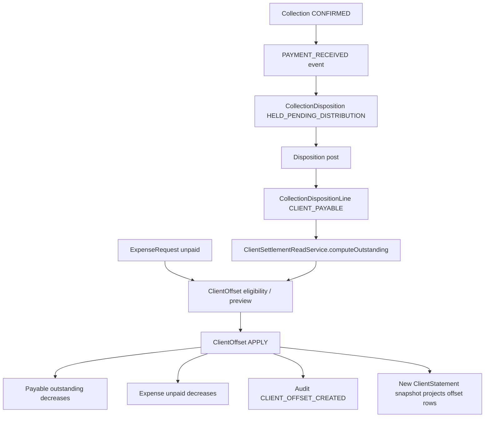

# TM47D-5B — Client Offset Happy Path QA Runbook

**Scope:** docs-only QA preparation.

**Implementation status:** NOT AUTHORIZED.

**Seed implementation status:** NOT INCLUDED.

This runbook documents the first end-to-end happy-path validation for Client Offset. It does not change runtime behavior, API contracts, schemas, migrations, frontend files, ledger logic, statement logic, or offset logic.

## Boundary

TM47D-5B is a QA and fixture-design note. It prepares a controlled validation path for a future dev/test seed, but it does not create that seed.

No production behavior should be changed by this phase.

No frontend or UX-v2a files are in scope.

## Domain Diagram



## Happy-Path Data Flow

The happy path validates the existing Collection to Client Offset bridge:

1. A confirmed collection is recorded.
2. The collection emits `PAYMENT_RECEIVED`.
3. The payment event opens a `CollectionDisposition` draft.
4. The disposition is posted with a `CLIENT_PAYABLE` line.
5. `computeOutstanding()` reads the posted payable line as the client-payable source.
6. An unpaid `ExpenseRequest` exists for the same tenant, client, and currency.
7. `ClientOffsetService.previewOffset()` confirms the maximum available offset amount.
8. `ClientOffsetService.createOffset()` creates an immutable `ClientOffset` row with `kind = APPLY`.
9. Outstanding payable and unpaid expense are both reduced at read time.
10. A new statement snapshot can project the offset lines.
11. Audit contains a `CLIENT_OFFSET_CREATED` record.

There is no separate `ClientPayable` table. In this flow, the payable source is:

```txt
CollectionDisposition.status = POSTED
CollectionDisposition.manualReversalRequiredAt = null
CollectionDispositionLine.type = CLIENT_PAYABLE
Collection.status = CONFIRMED
```

## Required Fixture Objects

The minimum fixture set is:

| Object | Requirement |
| --- | --- |
| Tenant | All rows must share the same `tenantId`. |
| Actor user | Must have `PARTNER` lawyer rank or `MANAGER` staff type. |
| Client | The shared client for payable and expense legs. |
| Payable case | Case that owns the collection and payable disposition. |
| Payable case client | `CaseClient` for the client with role `ALACAKLI` or `ORTAK_ALACAKLI`. |
| Collection | `CONFIRMED`, same tenant/case/currency. |
| CollectionDisposition | `POSTED`, same tenant/case/currency, `manualReversalRequiredAt = null`. |
| CollectionDispositionLine | `CLIENT_PAYABLE`, assigned to the payable `caseClientId`. |
| Expense case | Case that owns the expense request; may be same or different case. |
| ExpenseRequest | Same tenant/client/currency, status not `CANCELLED`, unpaid amount greater than zero. |
| ClientOffset request | Same tenant/client/currency, amount less than or equal to both available sides. |

Recommended numeric fixture:

```txt
Collection / CLIENT_PAYABLE: 1000 TRY
ExpenseRequest totalAmount: 600 TRY
ExpenseRequest paidTotal: 0 TRY
Offset APPLY amount: 400 TRY
```

## Object Creation Order

1. Create or select a tenant.
2. Create or select an actor user with `PARTNER` or `MANAGER` capacity.
3. Create a client.
4. Create the payable case.
5. Create the payable `CaseClient` with role `ALACAKLI` or `ORTAK_ALACAKLI`.
6. Create the expense case.
7. Create a confirmed collection for the payable case.
8. Create or process the `PAYMENT_RECEIVED` event to open a disposition draft.
9. Post the disposition with one `CLIENT_PAYABLE` line for `1000 TRY`.
10. Create an unpaid `ExpenseRequest` for `600 TRY`.
11. Run eligibility for the client.
12. Run preview for `400 TRY`.
13. Apply the offset for `400 TRY`.
14. Generate or refresh a new client-level statement snapshot.
15. Read audit history for the created `ClientOffset`.

## Manual QA Steps

### Preflight

Confirm the QA environment is not production and that the relevant migrations are already applied. This runbook does not authorize applying migrations.

Confirm the actor has one of these capacities:

```txt
Lawyer.lawyerRank = PARTNER
StaffMember.staffType = MANAGER
```

Confirm all fixture rows use the same:

```txt
tenantId
clientId
currency
```

### Payable Side

1. Confirm the collection is `CONFIRMED`.
2. Confirm the disposition is `POSTED`.
3. Confirm the disposition has a `CLIENT_PAYABLE` line.
4. Confirm `manualReversalRequiredAt` is `null`.
5. Confirm `computeOutstanding()` returns `1000 TRY` before any offset.

### Expense Side

1. Confirm the expense request belongs to the same tenant and client.
2. Confirm the currency is `TRY`.
3. Confirm the status is not `CANCELLED`.
4. Confirm unpaid amount is `600 TRY`.

### Eligibility

Run client offset eligibility for the client and `TRY`.

Expected:

```txt
payable available: 1000 TRY
expense unpaid: 600 TRY
max offset amount: 600 TRY
canApply: true for PARTNER/MANAGER
```

### Preview

Preview offset for `400 TRY`.

Expected:

```txt
payableBefore: 1000
payableAfter: 600
expenseBefore: 600
expenseAfter: 200
netBefore: 400
netAfter: 400
maxAmount: 600
netUnchanged: true
```

### Apply

Apply offset for `400 TRY` with a deterministic idempotency key.

Expected:

```txt
kind: APPLY
amount: 400
approvalRef: null
authorizationMode: DIRECT_CAPABILITY
```

### Post-Apply Reads

Read payable outstanding again.

Expected:

```txt
payable outstanding: 600 TRY
expense unpaid: 200 TRY
net position unchanged: 400 TRY
```

Generate a new statement snapshot for validation. Existing snapshots must remain immutable.

## Expected Ledger Effects

Client Offset does not write `BalanceLedger`.

Expected ledger effect for the offset apply:

```txt
BalanceLedger rows created by ClientOffset: 0
```

If the fixture uses only `CLIENT_PAYABLE` disposition posting, the disposition posting itself should not create `BalanceLedger` rows. `OFFSET_CLIENT_ADVANCE` is a different disposition line type and is not part of this happy path.

## Expected Statement Rows

Existing statements are not mutated. A new snapshot should project the current state.

Expected client-level rows:

| Line type | Debit | Credit | Effect |
| --- | ---: | ---: | --- |
| `CASE_COLLECTION_PAYABLE` | 0 | 1000 | Payable increases. |
| `EXPENSE_REQUESTED` | 600 | 0 | Expense debt increases. |
| `CLIENT_OFFSET_PAYABLE_APPLIED` | 400 | 0 | Payable decreases. |
| `CLIENT_OFFSET_EXPENSE_APPLIED` | 0 | 400 | Expense debt decreases. |

Expected client-level net:

```txt
1000 - 600 - 400 + 400 = 400
```

Expected case-level distinction:

```txt
Payable case:
  CLIENT_OFFSET_PAYABLE_APPLIED decreases running balance.

Expense case:
  CLIENT_OFFSET_EXPENSE_APPLIED is informational for case-level balance.
```

## Expected Outstanding Changes

Before offset:

```txt
payable outstanding: 1000
expense unpaid: 600
net position: 400
```

After `400 TRY` offset apply:

```txt
payable outstanding: 600
expense unpaid: 200
net position: 400
```

No payout record is expected in this happy path.

## Expected Audit Records

Expected audit action:

```txt
CLIENT_OFFSET_CREATED
```

Expected audit metadata:

```txt
authorizationMode: DIRECT_CAPABILITY
clientId
amount
currency
payableCaseId
payableCaseClientId
expenseCaseId
expenseRequestId
```

Preview and eligibility should not write audit records.

## Failure Checks

### Missing CLIENT_PAYABLE

Symptom:

```txt
payable outstanding = 0
OFFSET_EXCEEDS_AVAILABLE or no eligible payable bucket
```

Cause:

```txt
Disposition was not posted, line type is not CLIENT_PAYABLE, or collection is not CONFIRMED.
```

### Missing Unpaid ExpenseRequest

Symptom:

```txt
expense unpaid = 0
max offset amount = 0
```

Cause:

```txt
ExpenseRequest missing, CANCELLED, fully paid, wrong client, wrong tenant, or wrong currency.
```

### Wrong Actor Capability

Symptom:

```txt
403 CLIENT_OFFSET_FORBIDDEN
```

Cause:

```txt
Actor is not PARTNER or MANAGER.
```

### Wrong Tenant

Symptom:

```txt
leg validation fails, not found, or max offset amount = 0
```

Cause:

```txt
Payable and expense legs do not share tenantId.
```

### Wrong Client

Symptom:

```txt
cross-client validation failure
```

Cause:

```txt
ExpenseRequest clientId differs from offset clientId or payable CaseClient client differs.
```

### Wrong Currency

Symptom:

```txt
cross-currency validation failure
```

Cause:

```txt
CollectionDisposition currency and ExpenseRequest currency differ from offset currency.
```

### Amount Exceeds Available Payable Or Expense

Symptom:

```txt
OFFSET_EXCEEDS_AVAILABLE
```

Cause:

```txt
Requested offset amount is greater than min(payable outstanding, expense unpaid).
```

## Seed Implementation Prerequisites

A future seed implementation must be explicitly dev/test-only.

Required safeguards:

```txt
NODE_ENV must not be production.
ALLOW_TM47D_HAPPY_PATH_SEED=1 must be required.
Seed must not run during API boot.
Seed must not be added to default production behavior.
Seed must be idempotent.
Seed must use deterministic fixture keys.
Seed must not modify frontend files.
Seed must not change API contracts.
Seed must not change accounting logic.
Seed must not apply migrations automatically.
```

The seed should fail early if required schema objects are missing. It should report that migrations are required, but it should not run migration commands.

## TM47D-5C Seed Implementation Plan

Recommended next implementation:

```txt
TM47D-5C — Dev-Only Client Offset Happy Path Seed
```

Proposed scope:

1. Add one explicit dev/test seed script.
2. Add package script only if it is clearly named and not part of default boot.
3. Create deterministic tenant/client/case/payable/expense fixtures.
4. Keep all rows tenant-scoped.
5. Make the script idempotent.
6. Print the IDs needed for manual QA.
7. Do not call frontend code.
8. Do not alter runtime services.
9. Do not apply migrations.

Recommended validation for TM47D-5C:

```txt
git diff --check
seed script dry-run or focused local run in dev/test DB only
manual QA checklist execution
```

## No-Go List

```txt
Frontend changes: NO
API contract changes: NO
Schema/migration changes: NO
Runtime accounting logic changes: NO
Ledger mutation changes: NO
Statement mutation changes: NO
Offset logic changes: NO
Production behavior changes: NO
Seed implementation in TM47D-5B: NO
```
